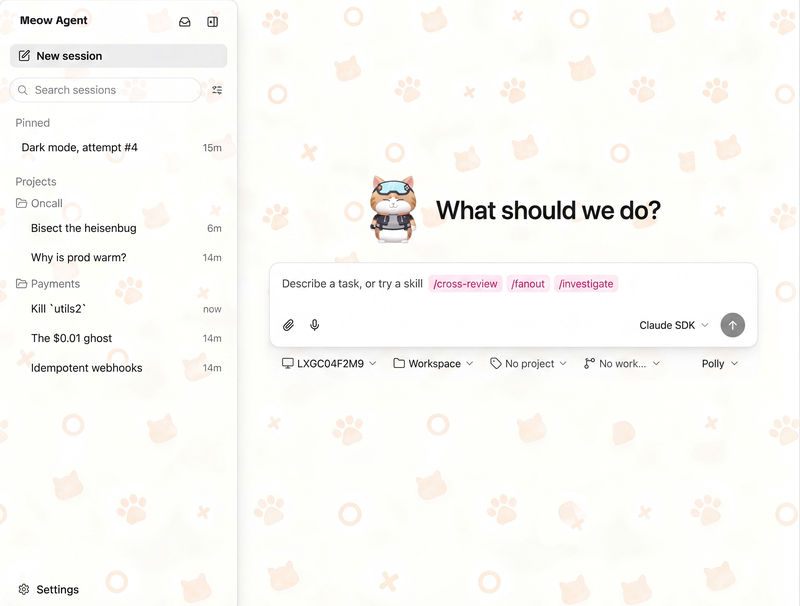

<div align="center">

#  agent-meow

### The AI agent workspace for ColorFire & Meow series AIPC.

agent-meow is an open-source **AI agent workspace** by 智方云 (Cubecloud), designed for
ColorFire and Meow series AIPC and laptops. It provides a local-first voice + text agent
experience powered by your own GPU — no cloud API keys required for the base experience.

Built on [Omnigent](https://github.com/omnigent-ai/omnigent) (Apache-2.0), agent-meow adds
a Windows desktop installer, a first-run setup wizard, a live voice pipeline (STT → LLM → TTS),
a service supervisor, and the 橘宝疾风 (Jubao) brand identity.

[](LICENSE)
[](https://github.com/JZKK720/agent-meow)


**[⬇️ Download the Windows installer](https://github.com/JZKK720/agent-meow/releases/tag/v0.9.2)**

</div>

<p align="center">
  
</p>

---

## What is agent-meow?

agent-meow gives you:

- **🎤 Live voice conversation.** Speak to your AI assistant in real time —
  speech-to-text (whisper.cpp, Vulkan GPU) → LLM (Hermes gateway or Ollama) →
  text-to-speech (Qwen3-TTS, Vulkan GPU). No cloud STT/TTS APIs needed.
- **🖥️ One-click Windows installer.** Download, run, and the first-run wizard
  detects your GPU, installs Ollama + a local LLM, Hermes CLI, and the voice
  stack — no terminal, Python, or Docker required.
- **🐱 橘宝疾风 (Jubao) brand.** A playful orange-tabby AI cat assistant with
  custom mascot assets, emoji pack, and branded UI.
- **🔧 Local-first by default.** Runs entirely on your machine. Your model
  (Ollama or Hermes), your GPU (AMD / NVIDIA / Intel), your data.
- **📊 Runtime status dashboard.** Monitor all voice services (whisper-server,
  Qwen3-TTS, Hermes gateway) from Settings → Runtime Status. First-boot
  checklist verifies the full stack is healthy.
- **🛡️ Service supervisor.** Voice services auto-restart on crash. No manual
  intervention needed — the supervisor watches and respawns.
- **🤖 Multi-harness support.** Use Claude Code, Codex, Cursor, OpenCode,
  Hermes, Pi, or custom YAML agents — all through the same interface.
- **🌐 Web + desktop + mobile.** The same session syncs across the Electron
  desktop app, browser, and phone on your network.

---

## Quick start

### Windows desktop app (recommended)

Download the self-contained installer from the
[releases page](https://github.com/JZKK720/agent-meow/releases/tag/v0.9.2):

1. **Download** `agent-meow Setup 0.9.2.exe` (~276 MB)
2. **Run** the installer — no Python, Docker, or terminal needed
3. **First-run wizard** guides you through:
   - **GPU detection** — AMD / NVIDIA / Intel / CPU auto-detected
   - **Ollama install** — silent install + model selection (Qwen 3.5, Nemotron, DeepSeek, etc.)
   - **Hermes CLI install** — curl install (no Docker)
   - **Voice stack** — whisper.cpp (Vulkan STT) + Qwen3-TTS (Vulkan TTS)
4. **Start chatting** — the app launches with everything pre-configured

The installer bundles:
- Embedded Python 3.12 (portable CPython)
- agent-meow core (pre-installed in the embedded venv)
- The full React web UI
- A first-run bootstrap wizard
- A service supervisor (event-driven crash-restart for voice services)
- A runtime status dashboard (Settings → Runtime Status)
- COOP/COEP headers for VAD WASM multi-threading
- 橘宝疾风 (Jubao) brand assets (mascot, icons, wallpaper pattern)

> [!NOTE]
> The PyPI package name is `omnigent` (the module directory is `agent_meow/`).
> CLI entry points `omnigent`, `omni`, and `agent-meow` are all interchangeable.

### Linux / macOS (CLI install)

agent-meow needs **Python 3.12+**. This fork is not on PyPI — install from GitHub:

```bash
uv tool install -q --python 3.12 git+https://github.com/JZKK720/agent-meow.git
```

Or with pip:

```bash
pip install git+https://github.com/JZKK720/agent-meow.git
```

> [!NOTE]
> The PyPI package name `omnigent` refers to the upstream project.
> This fork is installed from the `JZKK720/agent-meow` GitHub repo only.

---

## Voice pipeline architecture

agent-meow ships a complete local voice pipeline — no cloud API calls for STT or TTS:

```
🎤 Microphone
    ↓  Silero VAD (browser, WASM)
    ↓  PCM16 audio segments
    ↓
🔊 whisper.cpp (Vulkan iGPU, port 8001)
    ↓  /inference → text transcription
    ↓
🧠 Hermes gateway (port 8642) or Ollama (port 11434)
    ↓  /v1/chat/completions → streamed text response
    ↓
🗣️ Qwen3-TTS (Vulkan dGPU, port 8890)
    ↓  /tts → audio chunks
    ↓
🔊 Browser audio playback (queue + sentence-level ordering)
```

### Components

| Component | Role | Port | GPU |
|-----------|------|------|-----|
| **whisper.cpp** | Speech-to-text (Vulkan GPU) | 8001 | iGPU (8060S) |
| **Qwen3-TTS** | Text-to-speech (Vulkan GPU) | 8890 | dGPU (7900 XTX) |
| **Hermes gateway** | LLM inference (OpenAI-compatible) | 8642 | CPU (cloud or local) |
| **Ollama** | Alternative local LLM | 11434 | GPU or CPU |
| **Service supervisor** | Crash-restart for all voice services | — | — |

### Browser-side voice transport

The web UI uses `@ricky0123/vad-web` for Silero VAD (voice activity detection) in
the browser via WASM. Audio is captured as Float32 → PCM16 → WAV, uploaded as
FormData, and the response is played back through a sentence-ordered audio queue
with clause-level TTS chunking to eliminate mid-reply gaps.

### Hermes gateway agent

The [`examples/hermes-gateway/config.yaml`](examples/hermes-gateway/config.yaml)
ships a pre-configured Hermes agent with the 橘宝 (Jubao) persona — a bilingual
(Chinese + English) cat assistant personality with TTS-optimized constraints:
short sentences, colloquial Chinese, concise replies, no emoji or markdown in
voice responses.

---

## First-run wizard

The Windows installer includes a bootstrap wizard (`web/electron/src/wizard/`)
that runs on first launch:

| Step | What it does |
|------|-------------|
| **1. GPU Detection** | Detects GPU vendor (AMD / NVIDIA / Intel) via Windows WMI |
| **2. Core Runtime** | Verifies embedded Python, detects/installs Hermes CLI |
| **3. Ollama** | Downloads + silent-installs Ollama, pulls user-selected model |
| **4. Voice Stack** | Downloads whisper-server.exe + tts-server.exe (Vulkan), fetches models |
| **5. Port Check** | Verifies all services are reachable (ports 8001, 8890, 8642, 11434) |
| **6. Verify** | Final health check — all green = ready to chat |

---

## Runtime status dashboard

After setup, monitor all services from **Settings → Runtime Status** in the web UI:

- whisper-server health (port 8001)
- Qwen3-TTS health (port 8890)
- Hermes gateway health (port 8642)
- Ollama health (port 11434)

A **first-boot checklist** runs automatically on first server start, showing
a green/red status card for each service in the voice stack.

---

## Multi-harness support

agent-meow supports the same harnesses as upstream Omnigent:

```bash
agent-meow                    # pick a model, start a session
agent-meow claude             # Claude Code
agent-meow codex              # Codex
agent-meow cursor             # Cursor
agent-meow opencode           # OpenCode
agent-meow hermes             # Hermes Agent (Nous Research)
agent-meow pi                 # Pi
agent-meow run examples/hermes-gateway/   # Jubao voice agent
```

### Write your own agent

An agent is a short YAML file — your prompt, your tools, your sub-agents:

```yaml
name: my_agent
prompt: You are a helpful data analyst.

executor:
  harness: openai-agents     # or: claude-sdk, codex, cursor, hermes, pi, ...

tools:
  word_count:
    type: function
    callable: mypackage.mymodule.word_count

  docs:
    type: mcp
    url: https://example.com/mcp

  researcher:
    type: agent
    prompt: Search for relevant information and summarize it.
```

```bash
agent-meow run path/to/my_agent.yaml
```

See [`examples/hermes-gateway/config.yaml`](examples/hermes-gateway/config.yaml)
for a complete working example with the Jubao persona, and
[`examples/polly/`](examples/polly/) for a multi-agent coding orchestrator.

---

## Local server

Start a local server and web UI:

```bash
agent-meow server start      # starts on http://localhost:6767
agent-meow server status      # check health
agent-meow stop               # stop everything
```

The web UI is built for mobile — open `http://<your-laptop-ip>:6767` on your phone.

### Environment variables

Voice pipeline services are configured via environment variables:

| Variable | What it sets |
|----------|-------------|
| `WHISPER_STT_URL` | whisper-server URL (default `http://127.0.0.1:8001`) |
| `WHISPER_SERVER_EXE` | Path to whisper-server.exe |
| `WHISPER_SERVER_MODEL` | Path to GGML model file |
| `WHISPER_VAD_MODEL` | Path to Silero VAD model |
| `HERMES_VOICE_URL` | Hermes gateway voice endpoint |
| `HERMES_API_KEY` | Hermes gateway API key |
| `HERMES_BASE_URL` | Hermes gateway base URL |
| `QWEN_TTS_URL` | Qwen3-TTS wrapper URL (default `http://127.0.0.1:8890`) |
| `QWEN_TTS_SERVER_EXE` | Path to tts-server.exe |
| `QWEN_TTS_MODEL` | Path to Qwen3-TTS GGUF model |
| `QWEN_TTS_CODEC` | Path to Qwen3-TTS codec GGUF |

> [!NOTE]
> Some env vars use the `OMNIGENT_` prefix (inherited from upstream) —
> the code reads both `OMNIGENT_*` and the newer naming. This is intentional
> for backwards compatibility.

---

## Policies

Policies decide what an agent may do — run shell commands, edit files, spend
tokens. They check every action and either allow it, block it, or pause to
ask you first.

```yaml
policies:
  approve_shell:
    type: function
    handler: agent_meow.policies.builtins.safety.ask_on_os_tools
  budget:
    type: function
    handler: agent_meow.policies.builtins.cost.cost_budget
    factory_params:
      max_cost_usd: 5.00
      ask_thresholds_usd: [3.00]
```

Policies stack across three levels: **server-wide** (admin), **per-agent**
(developer), and **per-session** (you).

---

## Brand identity

agent-meow uses the 橘宝疾风 (Orange Treasure Storm) brand — a specific orange
tabby cat character with:

- **Pink goggle strap + light blue goggle lenses** (`#c8f8f8`)
- **Orange tabby body** (`#e88020`), cream belly (`#f8f0e0`), rose blush (`#f8c8a8`)
- **Monochromatic cream + orange pattern** for wallpapers
- Custom mascot assets, emoji pack, and Figma design files in `docs/assets/branding/`

---

## Relationship to Omnigent

agent-meow is derived from [Omnigent](https://github.com/omnigent-ai/omnigent)
(Apache-2.0), developed by 智方云 (Cubecloud) for ColorFire and Meow series AIPC.

The Python module directory is `agent_meow/` (renamed from `omnigent/`). The
PyPI package name remains `omnigent` for dependency compatibility with the
SDK sub-packages (`omnigent-client`, `omnigent-ui-sdk`). See `NOTICE` for
full attribution.

Key additions in this fork:
- Windows desktop installer (NSIS + embedded Python)
- First-run setup wizard (GPU detect, Ollama, Hermes, voice stack)
- Live voice pipeline (whisper.cpp STT → Hermes LLM → Qwen3-TTS)
- Service supervisor with crash-restart
- Runtime status dashboard + first-boot checklist
- 橘宝疾风 (Jubao) brand identity

### Developed and tested on

This fork was developed and tested on a **ColorFire 395** laptop AIPC:

| Component | Specification |
|-----------|---------------|
| **Device** | ColorFire 395 laptop AIPC (TianBei NEX) |
| **CPU** | AMD Ryzen AI MAX+ 395 (16 cores / 32 threads) |
| **iGPU** | AMD Radeon 8060S (integrated, used for whisper.cpp STT) |
| **dGPU** | AMD Radeon RX 7900 XTX (discrete, used for Qwen3-TTS) |
| **RAM** | 64 GB DDR5 |
| **OS** | Windows 11 Pro (build 26200) |
| **Vulkan** | Used for both STT (iGPU) and TTS (dGPU) GPU acceleration |

The voice pipeline splits work across both GPUs — whisper.cpp runs on the
integrated 8060S for low-latency STT, while Qwen3-TTS runs on the discrete
7900 XTX for high-throughput speech synthesis. The installer wizard auto-detects
AMD / NVIDIA / Intel GPUs and should work on any Vulkan-capable hardware.

---

## Contributing

Contributions are welcome. See [CONTRIBUTING.md](CONTRIBUTING.md) for how to
set up your environment, run the checks, and open a pull request.

### Contributors

Thanks to all of our amazing contributors!

<a href="https://github.com/JZKK720/agent-meow/graphs/contributors">
  
</a>

---

## License

Apache 2.0 — see [LICENSE](LICENSE) and [NOTICE](NOTICE) for details,
including attribution to Databricks, Inc. for the original Omnigent software.
