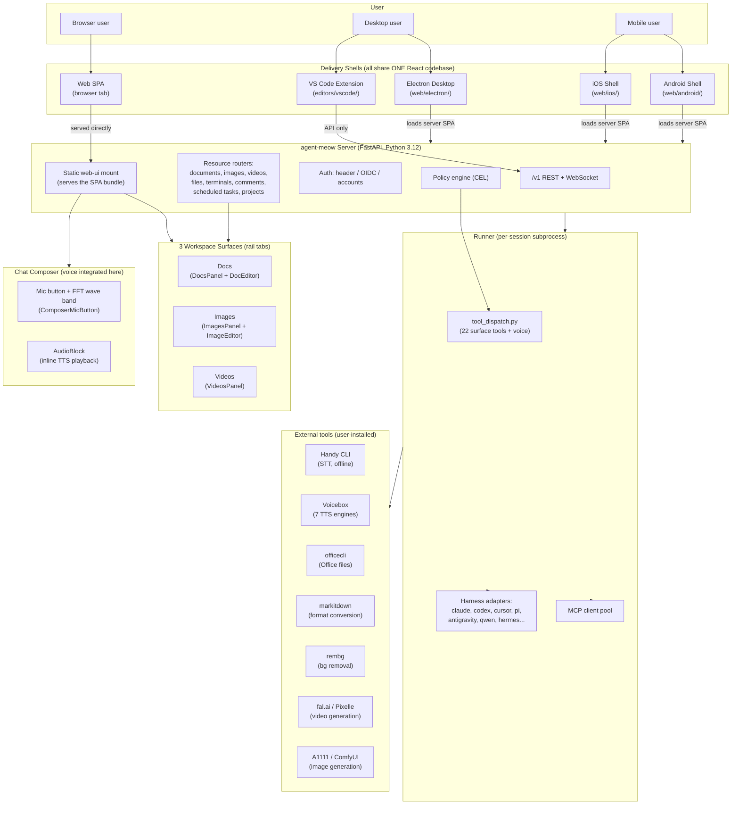
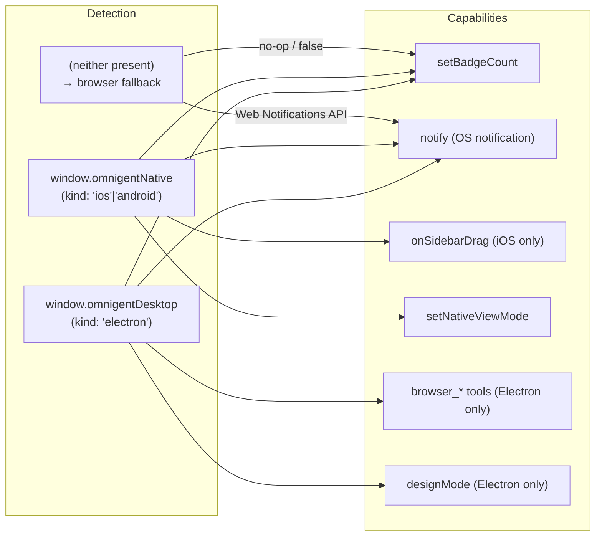
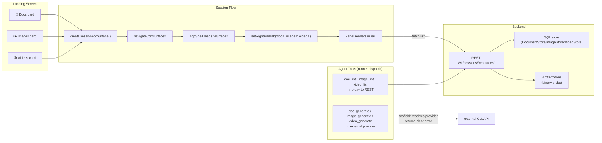

# agent-meow — Final Architecture, Delivery Surfaces, and Development Plan

**Date:** 2026-07-24 · **Status:** definitive · **Scope:** end-to-end architecture, all delivery surfaces, what's done, what's waiting on you

---

## 1. The One Diagram That Explains Everything

**Key insight:** All 4 UI shells (Web, Electron, iOS, Android) share the **same React SPA bundle**. The native shells are thin wrappers — they load the server-served SPA in a webview and add a native bridge for OS features (notifications, badge, sidebar drag, safe-area). **Change the web app once → all 4 platforms update on next launch.**

---

## 2. How Each Delivery Surface Works (End-to-End)

### 2.1 Web SPA (the canonical surface)

| Aspect | Detail |
|---|---|
| **Tech** | React 18 + Vite + Tailwind + Radix UI + TanStack Query |
| **Build** | `cd web && npm run build` → `agent_meow/server/static/web-ui/` |
| **Served by** | FastAPI `_SPAStaticFiles` with HTML5-history fallback (any unmatched path → `index.html`) |
| **PWA** | `manifest.webmanifest` + `sw.js` service worker (offline shell caching) |
| **i18n** | EN + ZH-CN, `react-i18next`, auto-detect from browser |
| **State** | Zustand (chat store) + TanStack Query (server data) + per-session localStorage (workspace state) |
| **Editor libs** | Tiptap (docs), Fabric.js (images), xterm.js (terminals), Mermaid (diagrams) |

### 2.2 Electron Desktop (`web/electron/`)

| Aspect | Detail |
|---|---|
| **Bundle ID** | `io.cubecloud.agentmeow.desktop` |
| **Architecture** | Thin wrapper: loads server-served SPA in a `BrowserWindow`; adds native bridge via `preload.js` |
| **Native bridge** | `window.omnigentDesktop` (contextBridge, contextIsolation): `setBadgeCount`, `notify`, `onNotificationClick`, browser pane (`WebContentsView`), design mode, sidebar drag |
| **Server management** | `server_manager.js` — can spawn/stop local `agent-meow server` + `agent-meow host` processes; owns lifecycle |
| **Auto-update** | `electron-updater` + custom `desktop_updater.js` + update overlay UI |
| **Browser pane** | `WebContentsView` embedded browser (for `browser_*` tools); design-mode element picker |
| **Deep links** | `agent-meow://` URL scheme → `deepLink.js` |
| **Setup page** | Bundled `setup/index.html` — "connect to server" form (persisted URL) |

### 2.3 iOS Shell (`web/ios/`)

| Aspect | Detail |
|---|---|
| **Bundle ID** | `io.cubecloud.agentmeow.ios` |
| **Architecture** | SwiftUI shell wrapping `WKWebView`; loads server-served SPA |
| **Native bridge** | `window.omnigentNative` (WKScriptMessage handler `omnigentNative`): sidebar drag, view mode, safe-area insets, keyboard inset |
| **Key Swift files** | `OmnigentWebView.swift` (WKWebView + bridge), `WebShellView.swift` (SwiftUI layout), `ChatTerminalBar.swift` (bottom bar), `ConnectView.swift` (server URL picker), `NativeNotificationManager.swift` |
| **Sidebar gesture** | Left-edge pan recognizer → drives web sidebar as interactive drawer (native back/forward gesture disabled to avoid conflict) |
| **Keyboard** | `AccessoryFreeWebView` — accessory bar-free keyboard; safe-area + soft-keyboard inset bridged to web |
| **Deep links** | Universal links via `DeepLink.swift` |
| **OIDC login** | `SafariView.swift` (ASWebAuthenticationSession) |
| **Prerequisite** | Cubecloud Apple Developer team ID (placeholder `<CUBECLOUD_TEAM_ID>` in signing) |

### 2.4 Android Shell (`web/android/`)

| Aspect | Detail |
|---|---|
| **Package** | `io.cubecloud.agentmeow` (Kotlin sources under `io/cubecloud/agentmeow/`) |
| **Architecture** | Single `WebView` host in `MainActivity`; loads server-served SPA |
| **Native bridge** | `NativeBridgeScript.kt` injects `window.omnigentNative`: notifications, badge (as tray notification — Android has no icon badge), view mode |
| **Key Kotlin files** | `MainActivity.kt` (WebView host), `ConnectActivity.kt` (server URL), `NativeNotificationManager.kt`, `OidcLoginManager.kt`, `OmnigentBridgeListener.kt` |
| **OIDC login** | `OidcLoginManager.kt` (custom tabs) |
| **Insets** | `WindowInsetsCompat` → safe-area + keyboard bridged to web |
| **No sidebar gesture** | Intentionally absent (README notes this) |

### 2.5 VS Code Extension (`editors/vscode/`)

| Aspect | Detail |
|---|---|
| **Architecture** | API-only — talks to server REST, no embedded webview |
| **Published as** | `.vsix` via secure-repo pipeline |
| **Release** | `editors/vscode/PUBLISHING.md` |

---

## 3. The Native Bridge Contract (all shells)

All 4 shells expose the same feature-detected API. The web app's `nativeBridge.ts` detects which shell it's running in and degrades gracefully in a plain browser:

---

## 4. What's Done vs What's Waiting

### ✅ Done (Phases 0-4 + docs)

| Area | What landed |
|---|---|
| **Phase 0** | Static bundle verified intact (build `0d204dbe`) |
| **Phase 1** | Tool cards create session + `?surface=` deep-link (3 tests) |
| **Phase 2** | Rail tabs `docs/images/videos` + panels + editors wired |
| **Phase 3** | Backend routers mounted + ORM models + stores (5 tests) |
| **Phase 4** | 22 tool names registered + 4 dispatch functions + CRUD wired + `transcribe_audio` fully wired (47 tests) |
| **Docs** | Roadmap accurate; VIDEOS_SURFACE.md synced; stale plan marked |

### ⏳ Scaffold (detects backend, returns clear error — not yet calling)

| Tool | Backend | What's needed |
|---|---|---|
| `doc_convert` | markitdown CLI | Invoke subprocess, parse stdout |
| `doc_create_office`/`edit_office`/`export` | officecli CLI | Build officecli command from args, invoke subprocess |
| `image_generate`/`edit_ai` | A1111/ComfyUI/hosted API | HTTP POST to provider, download result, upload as resource |
| `image_remove_bg` | rembg CLI | Invoke subprocess on image binary |
| `video_generate` | fal.ai/Pixelle/Happy Horse | HTTP POST + async poll loop, download mp4, upload |
| `text_to_speech`/`speak` | VibeVoice/Voicebox | HTTP POST, return audio URL |

### 🔴 Waiting on YOU (human-in-loop gates)

These are decisions or assets only you can provide:

| # | What | Why it's blocked on you |
|---|---|---|
| 1 | **Commit the static bundle** (493 deleted + 109 new files) | It's build output — needs your decision on whether to commit as one atomic artifact or regenerate clean |
| 2 | **Figma frontend design** | The web UI has a design system (CSS custom properties, Tailwind config, Radix variants) but no Figma source. If you have Figma designs, they should drive the hero sections, icon set, and landing screen layout. The current `NewChatLandingScreen` has a central mic + wave band + 3 surface cards — is this the final design? |
| 3 | **Hero/icons assets** | `mascot-hero.png` exists but may need updating for the Cubecloud/ColorFire rebrand. App icons for Electron/iOS/Android need Cubecloud branding (currently placeholder `<CUBECLOUD_TEAM_ID>` for Apple signing) |
| 4 | **Apple Developer Team ID** | iOS signing requires a real Cubecloud team ID (placeholder in `Info.plist` / Xcode project) |
| 5 | **`cubecloud.io` domain** | Electron/iOS install URLs, privacy pages, and deep-link domains reference `cubecloud.io` — needs to be live |
| 6 | **GHCR images** | `ghcr.io/JZKK720/agent-meow-*` need to be published before deploy templates pull successfully |
| 7 | **Functional keys / keyboard shortcuts** | Current shortcuts: ⌘K (command palette), ⌘⌥V (voice dictation), ⌘⌥[/] (sidebar toggle), ⌘Enter (approve). Do you want additional shortcuts for surface switching (e.g. ⌘1/2/3 for docs/images/videos)? |
| 8 | **End-to-end smoke test** | We've never run the full stack (server + web UI + click card → create session → open rail tab → upload resource → see it in the panel). This needs a running server on your machine — I can start it if you want |

---

## 5. Development Plan (next 2 weeks)

### Week 1: Validate + Wire shell-outs

| Day | Task | Owner |
|---|---|---|
| 1 | **Smoke test**: start server, click Videos card, upload a video, verify it appears. Repeat for Docs + Images. | You (or I can drive it) |
| 2 | Wire `doc_convert` (markitdown) — simplest shell-out, proves the pattern | Agent |
| 3 | Wire `text_to_speech` (VibeVoice/Voicebox HTTP) — high value, medium effort | Agent |
| 4 | Wire `image_remove_bg` (rembg subprocess) — simple, proves image shell-out | Agent |
| 5 | Wire `video_generate` (fal.ai async poll) — highest value, most complex | Agent |

### Week 2: Polish + ship

| Day | Task | Owner |
|---|---|---|
| 6 | Wire `image_generate` + `image_edit_ai` (A1111/ComfyUI HTTP) | Agent |
| 7 | Wire `doc_create_office`/`edit_office`/`export` (officecli subprocess) | Agent |
| 8 | Fix 2 pre-existing type errors (`MeowCatEyes`, `ComposerMicButton className`) | Agent |
| 9 | Sync `DOCS_SURFACE.md` + `IMAGES_SURFACE.md` (same as VIDEOS fix) | Agent |
| 10 | Full test suite: `pytest`, `ruff`, `mypy`, `npm run type-check`, `npm test` | Agent |
| 11 | Commit static bundle + all code changes (DCO sign-off) | You |
| 12 | Tag release | You |

---

## 6. The 3 Workspace Surfaces — Functional End-to-End

**Voice is NOT here** — it's in the chat composer (mic button + wave band for STT, AudioBlock for TTS). See §3.8 of the roadmap.

---

## 7. What I Need From You Right Now

1. **Can I start the server and run the smoke test?** (I'll start `meow server`, open the browser, click the cards, upload a file — proves the full stack works)
2. **Do you have Figma designs?** If yes, share them and I'll align the hero/icons/landing layout. If no, the current design (central mic + wave band + 3 cards) is what ships.
3. **Should I wire the shell-out tools next?** (doc_convert, text_to_speech, image_remove_bg, video_generate — in that priority order)
4. **Any additional keyboard shortcuts?** (e.g. ⌘1/2/3 for surface switching)
