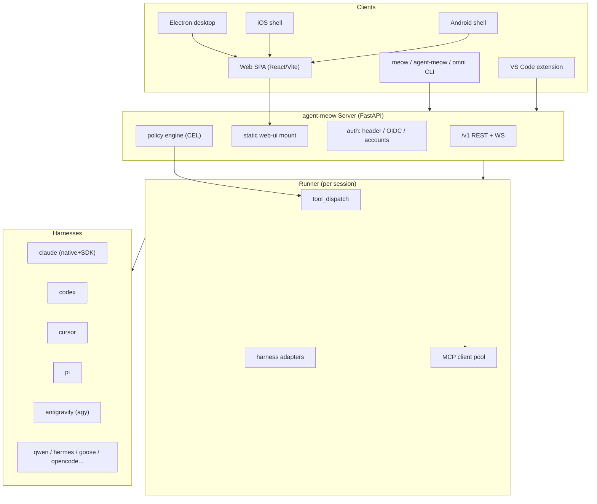
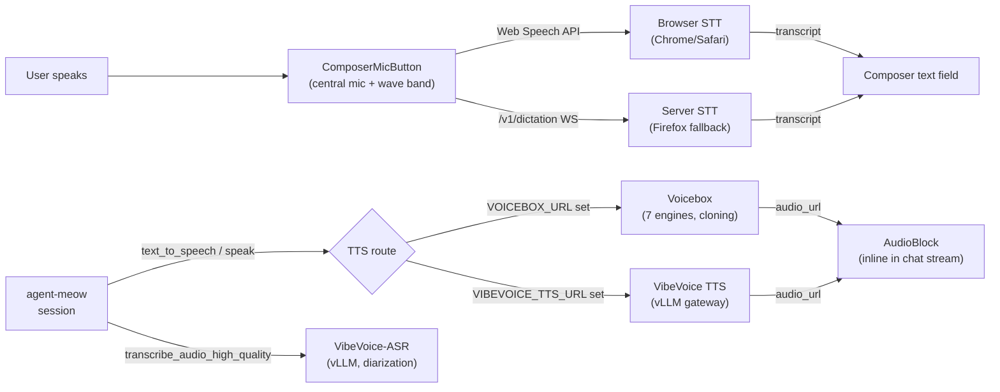

# agent-meow — Roadmap, Core Features, and Toolchain Report

**Date:** 2026-07-24 · **Status:** living document · **Scope:** product surfaces, built-in tool inventory, external tool dependencies, delivery platforms, and the parity-recovery roadmap.

---

## 1. Product Shape

agent-meow is a **multi-harness agent workspace**: one server + web UI that orchestrates many coding/agent CLIs ("harnesses") inside managed sessions, with per-session resources (files, terminals, docs, images, videos, comments, todos) and policy-guarded tool execution.

---

## 2. The Three Core Workspace Surfaces

These are the first-class content surfaces attached to every session. Each has: entity → SQL store → REST routes → runner-dispatched builtin tools → React panel + editor → rail tab in the workspace rail. **Voice is not a workspace surface** — it's integrated into the chat composer (mic button + wave band for STT, inline `AudioBlock` for TTS); see §3.8.

| Surface | Backend | Frontend | Status (2026-07-24) |
|---|---|---|---|
| **Docs** | `entities/document.py`, `stores/document_store/`, `routes/documents.py` | `DocsPanel`, `DocEditor` (Tiptap/ProseMirror) | ✅ UI wired (rail tab + card); ✅ backend router mounted; ⏳ runner dispatch pending (Phase 4) |
| **Images** | `entities/image.py`, `stores/image_store/`, `routes/images.py`, binary in `ArtifactStore` | `ImagesPanel`, `ImageEditor` (Fabric.js) | ✅ UI wired; ✅ backend router mounted; ⏳ runner dispatch pending |
| **Videos** | `entities/video.py`, `stores/video_store/`, `routes/videos.py`, binary in `ArtifactStore` | `VideosPanel` (browse/upload/inline play/delete) | ✅ UI wired; ✅ backend router mounted; ⏳ runner dispatch pending; no editor (by design) |

### 2.1 Docs surface — full toolchain

The Docs surface has **three distinct tool layers**, each with a different adoption strategy:

| Layer | Tools | Backend | How it's invoked |
|---|---|---|---|
| **Rich-text docs (markdown/prosemirror)** | `doc_create`, `doc_get`, `doc_list`, `doc_update` | Server REST → `DocumentStore` (SQL) | Runner proxies server REST endpoints |
| **Office files (.docx/.xlsx/.pptx)** | `doc_create_office`, `doc_edit_office`, `doc_export` | **`officecli`** (external CLI, [iOfficeAI/OfficeCLI](https://github.com/iOfficeAI/OfficeCLI)) | Runner shells out; `shutil.which("officecli")` or `OFFICECLI_BIN` env |
| **Format conversion (PDF/PPTX/audio/HTML/CSV → markdown)** | `doc_convert` | **`markitdown`** CLI (`pip install markitdown[all]`) | Runner shells out; `shutil.which("markitdown")` or `MARKITDOWN_BIN` env |
| **LLM-driven generation** | `doc_generate` | Agent's own LLM loop | Runner intercepts by name, routes to agent |

**MCP alternatives** (documented in `spec/AGENTSPEC.md` §Docs): declare `officecli mcp` or `markitdown-mcp` as stdio MCP servers under `tools.mcp_servers:` instead of shelling out.

**Editor:** Tiptap (ProseMirror kernel) with StarterKit, Link, Image, and Markdown extensions. Content round-trips as markdown; ⌘S/Ctrl+S saves via `PATCH`.

### 2.2 Images surface — full toolchain

| Layer | Tools | Backend | How it's invoked |
|---|---|---|---|
| **Browse/upload/delete** | `image_list`, `image_get`, `image_upload` | Server REST → `ImageStore` + `ArtifactStore` | Runner proxies server REST |
| **Canvas editing** | `image_edit` | Fabric.js in browser | `PATCH .../images/{id}/edit` stores canvas JSON; original binary never modified |
| **AI generation** | `image_generate` | Quality ladder: hosted API (Stability/OpenAI/Grok), A1111 (local SD WebUI), or ComfyUI MCP | Runner resolves provider from `IMAGE_GEN_PROVIDER`/`IMAGE_GEN_API_URL`/`A1111_API_URL` env vars |
| **Background removal** | `image_remove_bg` | **`rembg`** CLI (`pip install rembg[cpu,cli]`) | Runner shells out; `REMBG_BIN` env override |
| **AI editing (inpaint/outpaint/upscale)** | `image_edit_ai` | A1111 HTTP API or ComfyUI MCP | Runner resolves provider, performs edit, uploads result |

**Image generation quality ladder** (from `spec/AGENTSPEC.md`):
- `IMAGE_GEN_PROVIDER=hosted` → `IMAGE_GEN_API_URL` + `IMAGE_GEN_API_KEY` + `IMAGE_GEN_API_VENDOR` (openai/stability/grok)
- `IMAGE_GEN_PROVIDER=a1111` → `A1111_API_URL` (local Stable Diffusion WebUI)
- `IMAGE_GEN_PROVIDER=comfyui` → ComfyUI MCP server declared in `tools.mcp_servers:`

**One-ComfyUI-server quickstart:** A user with one ComfyUI server can serve both `image_generate` (via ComfyUI MCP) and `video_generate` (via Pixelle-Video pointing at the same ComfyUI).

### 2.3 Videos surface — full toolchain

| Layer | Tools | Backend | How it's invoked |
|---|---|---|---|
| **Browse/upload/delete** | `video_list`, `video_get` | Server REST → `VideoStore` + `ArtifactStore` | Runner proxies server REST |
| **Video generation** | `video_generate` | Quality ladder (see below) | Runner resolves provider, calls gateway, polls async task, downloads mp4, uploads as session resource |

**Video generation quality ladder** (from `spec/AGENTSPEC.md` — highest quality / zero-infra first):

| Provider | Quality | Cost | Infra | Env vars |
|---|---|---|---|---|
| **`fal`** (recommended default) | SOTA: Wan2.1/HunyuanVideo/LTX + Veo/Kling | Pay-per-gen | None | `FAL_KEY` or `VIDEO_GEN_API_URL` + `VIDEO_GEN_MODEL` |
| **`happy-horse`** | 15B unified Transformer, native audio-video, 7-language lip-sync, #1 Artificial Analysis Arena | Credits/subscription | None | `HAPPY_HORSE_API_URL` + `HAPPY_HORSE_API_KEY` |
| **`pixelle`** | Good (ComfyUI backend), topic→finished-video orchestration (script + images + TTS + BGM) | Free | Local/hosted server | `PIXELLE_VIDEO_URL` |
| **`openmontage`** | Advanced multi-pipeline | Free | External MCP server (AGPLv3 — keep external) | Declare in `tools.mcp_servers:` |

`video_generate` supports `mode='generate'` (AI writes script from topic) or `mode='fixed'` (text as-is, one line per scene), with `n_scenes`, `aspect_ratio`, and `frame_template` options.

**UI:** `VideosPanel` — gallery grid with first-frame thumbnails (`<video preload="metadata">`), duration badges, inline player, drag-and-drop upload. No server-side thumbnails (ffmpeg deferred), no editing (by design).

---

## 3. The CLI / Native / Python Tool Surfaces

### 3.1 CLI entry points (pyproject `[project.scripts]`)
`meow`, `agent-meow`, `omni`, plus legacy `agent-meow`. All resolve to the same Click root (`agent_meow/cli.py`).

### 3.2 Native harness wrappers (terminal-first CLI bridges)
Each launches a vendor CLI inside an agent-meow-managed terminal (tmux), mirrors the transcript to chat, and bridges permissions/elicitations:

| Command | Underlying CLI | Bridge style |
|---|---|---|
| `meow claude` | Claude Code | native TUI + hook |
| `meow codex` | Codex CLI | app-server + elicitation |
| `meow cursor` | Cursor CLI | native bridge + permissions/usage |
| `meow pi` | Pi | native bridge + extensions |
| `meow antigravity` | agy | native bridge + RPC mirror |
| plus SDK harnesses | qwen, hermes, goose, opencode, copilot, kiro | executor pattern |

### 3.3 Runner-dispatched builtin tool families (agent-callable)

Defined in `agent_meow/runner/tool_dispatch.py` as frozensets, executed runner-side (never round-tripped to the vendor LLM process):

| Family | Tools | Execution |
|---|---|---|
| OS env | `sys_os_*` | runner-local `OSEnvironment` |
| Files | `sys_upload/download/list_files` | server file APIs |
| Terminals | `sys_terminal_*` | `TerminalRegistry` |
| Async inbox | `sys_call_async`, `sys_cancel_async` | server REST |
| Sub-agents | `sys_session_send`, `sys_session_create` | session tree |
| Session query/self-write | peek/list/close, rename | server REST |
| Web | `web_fetch`, `web_search` | fetch → sub-agent; search backends |
| Memory | `hindsight_*` (optional extra) | hindsight-client |
| Models | `sys_list_models`, `sys_advise_models` | runtime routing client |
| Tasks | task lifecycle, `sys_timer_*` | server REST |
| Skills | `load_skill`, `read_skill_file` | skill loader |
| Comments | `list_comments`, `update_comment` | CommentStore REST |
| Agents | `sys_agent_get/list/download` | server REST |
| Policies | `sys_add_policy`, `sys_policy_registry` | policy engine |
| Scheduled tasks | RRULE scheduling tools | server REST |
| Browser | `browser_navigate/snapshot/click/type/screenshot` | desktop WebContentsView (Electron) |
| **Docs/Images/Videos** | `doc_*`, `image_*`, `video_*` | **schema classes exist; runner dispatch pending (Phase 4)** |

**Full surface tool inventory** (schema-only classes in `tools/builtins/`):

| Surface | Tools | External dependencies |
|---|---|---|
| **Docs** | `doc_create`, `doc_get`, `doc_list`, `doc_update`, `doc_generate` (LLM), `doc_create_office`, `doc_edit_office`, `doc_export`, `doc_convert` | `officecli` (OfficeCLI), `markitdown` (MarkItDown) |
| **Images** | `image_list`, `image_get`, `image_upload`, `image_edit` (Fabric.js), `image_generate`, `image_remove_bg`, `image_edit_ai` (inpaint/outpaint/upscale) | `rembg`, A1111 or ComfyUI or hosted API (Stability/OpenAI/Grok) |
| **Videos** | `video_list`, `video_get`, `video_generate` | fal.ai or Happy Horse or Pixelle-Video or OpenMontage |
| **Voice** (tool family, not a surface — see §3.8) | `transcribe_audio`, `transcribe_audio_high_quality`, `text_to_speech`, `speak` | Handy CLI (STT), VibeVoice-ASR (vLLM), VibeVoice-TTS (vLLM), Voicebox MCP (7 engines) |

User-enablable builtins registry (`tools/builtins/__init__.py`): `web_search`, `upload_file`, `list_files`, `download_file`, `search_conversations`, `export_agent`, plus framework-reserved names. **Gap:** `doc_*`/`image_*`/`video_*`/voice schema classes exist in `tools/builtins/{docs,images,videos,transcribe,tts}.py` but are not yet in `_BUILTIN_REGISTRY` or the runner's `_ALL_LOCAL_TOOLS` — that's Phase 4 of the recovery plan.

### 3.4 MCP integration
- Per-session MCP servers (`session_mcp_servers` routes), stdio/SSE transports, agent-spec-declared (`tools.mcp_servers`).
- Runner-side `MCP` client pool; policy engine can gate `mcp__*` tool names.
- Documented MCP alternatives for office work: `officecli mcp`, `markitdown-mcp`.

### 3.5 Skills
Skill loader with `load_skill` / `read_skill_file` tools; bundled skills per agent spec; `.claude/skills/` dev-side skill packs used for e2e harness verification.

### 3.6 The 7 Specialized Agents (examples/)

Each is a reference implementation of a distinct integration pattern. Together they cover the full "hidden features" surface — the prompt-key-in capabilities that differentiate agent-meow from a plain coding agent.

| # | Agent | Pattern | What it does | Integration |
|---|---|---|---|---|
| 1 | **reach-agent** | Skill + minimal MCP | Cross-platform internet research across 15 platforms (Twitter/X, Reddit, Facebook, Instagram, YouTube, GitHub, Bilibili, XiaoHongShu, LinkedIn, V2EX, Xueqiu, RSS, Xiaoyuzhou, BossZhipin, generic web). agent-reach is a **capability router** (not a fetcher) — routes to upstream CLIs (twitter-cli, yt-dlp, mcporter, gh, opencli, bili-cli). | Bundles `agent-reach` SKILL.md + `@agent-reach/mcp` (one tool: `get_status` for diagnostics) |
| 2 | **scrapling-agent** | Per-agent MCP | Anti-bot-aware web scraping. 9-tool Scrapling MCP surface: `get`, `bulk_get`, `fetch` (Playwright), `bulk_fetch`, `stealthy_fetch` (Cloudflare bypass), `bulk_stealthy_fetch`, `open_session`, `close_session`, `list_sessions`, `screenshot`. | Declares `scrapling mcp` stdio server in `tools.mcp_servers:` |
| 3 | **browser-agent** | Skill-only (no MCP) | Live, stateful control of the user's real Chrome via CDP. Fill forms, click buttons, navigate signed-in apps, take screenshots, record browser-action videos. Different from scrapling (stateless scrape) and reach (platform research). | Bundles `browser-harness` SKILL.md; uses agent-meow's shell tools to run `browser-harness` CLI with inline Python heredocs |
| 4 | **memory-agent** | Per-agent MCP | Persistent semantic memory across sessions. 53-tool memory surface: `memory_save`, `memory_recall`, `memory_smart_search` (BM25 + vector + graph, 95.2% R@5 on LongMemEval-S), `memory_sessions`, `memory_governance_delete`, + 48 more. | Declares `@agentmemory/mcp` stdio server; two-process setup (capture + recall) |
| 5 | **polly** | Orchestrator (sub-agents) | Coding orchestrator that breaks goals into pieces and delegates to a team of Claude Code, Codex, OpenCode, Cursor, Hermes, and Pi sub-agents. Polly writes no code — it plans, delegates, and has a separate independent different-model reviewer double-check the work. | `spawn: true` + `tools.agents:` list; brain runs on claude-sdk |
| 6 | **debby** | Two-headed debate | Sends every question to BOTH a Claude sub-agent and a GPT sub-agent, shows both perspectives side by side. With the `debate` skill, they critique each other for N rounds before converging. | Two sub-agents on claude-sdk + codex harnesses |
| 7 | **voicebox-agent** | Per-agent MCP | Voice-output agent with 7 TTS engines, voice cloning, multilingual. Full voice I/O loop: speak → Handy STT → agent → Voicebox TTS → hear response. | Declares Voicebox MCP server (FastMCP, HTTP at `:17493/mcp`) |

**Additional example agents** (not in the core 7 but part of the surface):
- `voice-agent`: VibeVoice TTS + Handy STT (builtin tools, no MCP) — low-latency live streaming
- `transcribe-agent`: Handy STT only
- `web-research-agent`: Scrapling (read) + Playwright (interact) — both MCP
- `doc-writer`, `image-editor`, `video-creator`: surface-specific agents for the 3 workspace surfaces
- `aws_analyst`, `hermes-gateway`, `ironclaw-gateway`, `markdown-ingest`, `remy`, `scribe`, `sentinel`: domain-specific agents

### 3.7 Hidden features (prompt-key-in capabilities)

These are the capabilities that aren't obvious from the card UI but are wired into the agent-meow runtime:

| Feature | How it's activated | What it does |
|---|---|---|
| **agent-reach** (15-platform research) | `reach-agent` example + `agent-reach` skill | Routes to upstream CLIs per platform; `agent-reach doctor --json` shows which backend serves each platform |
| **Loop engineering** (cron jobs) | `sys_timer_set` / `sys_timer_cancel` tools + `ScheduledTaskStore` | RRULE-based recurring task scheduler; tasks fire on schedule and spawn sessions |
| **Open browser** (live Chrome control) | `browser-agent` example + `browser-harness` skill | Stateful CDP control of real Chrome with logins/cookies; also supports Browser Use Cloud for isolated/headless |
| **Scrapling** (anti-bot scraping) | `scrapling-agent` example + `scrapling mcp` | 9-tool surface: static HTTP, JS-rendered (Playwright), Cloudflare-protected (stealth + Turnstile bypass) |
| **Persistent memory** | `memory-agent` example + `@agentmemory/mcp` | 53-tool semantic memory: BM25 + vector + graph retrieval, auto-capture hooks, cross-session recall |
| **Multi-agent orchestration** | `polly` example + `spawn: true` + `tools.agents:` | Fan-out delegation to sub-agents with independent review; blast-radius guardrails |
| **Dual-model debate** | `debby` example + `debate` skill | Side-by-side Claude vs GPT perspectives with N-round critique convergence |

### 3.8 Voice — chat-composer integration (not a workspace surface)

Voice is **not** a 4th workspace surface — it has no rail tab, no resource store, no REST router. It's integrated directly into the **chat composer**: a central mic button with a real-time FFT wave-band animation for STT input, and inline `AudioBlock` rendering for TTS output in the chat stream.

**STT input (composer mic button):**
- `ComposerMicButton` (`web/src/components/ComposerMicButton.tsx`) — central mic CTA in the composer, with an ember ring + FFT wave-band animation
- Primary path: Web Speech API (`SpeechRecognition`/`webkitSpeechRecognition`) — browser-native, Chrome/Safari
- Fallback path: server-side dictation via `/v1/dictation` WebSocket — Firefox, Electron
- Wave band: 4-bar FFT visualizer (`BAR_BINS`), voice-frequency-weighted (100Hz–3kHz), `requestAnimationFrame` loop, `AnalyserNode` with `fftSize=64`, `smoothingTimeConstant=0.75`
- Hotkey: ⌘⌥V / Ctrl+Alt+V toggles dictation
- States: listening (wave band animates), idle (bars at baseline), permission denied (error message)
- `onVoiceStart` snapshots composer text; `onVoiceDiscard` (Esc) reverts to snapshot

**TTS output (inline audio in chat):**
- `AudioBlock` (`web/src/components/blocks/AudioBlock.tsx`) — parses `audio_url` from JSON tool output, renders inline `<audio>` player in the chat stream
- `ToolCard` calls `parseAudioFromToolOutput` to detect audio in tool results

**Voice tool family** (runner-dispatched, not a workspace surface):

| Direction | Tools | Backend | How it's invoked |
|---|---|---|---|
| **STT (standard)** | `transcribe_audio` | **Handy** CLI (`handy --transcribe-file <path> --json`) | Runner shells out; `HANDY_CLI_PATH` env override. Offline, Whisper-based. |
| **STT (high-quality)** | `transcribe_audio_high_quality` | **VibeVoice-ASR** vLLM endpoint | Runner calls `VIBEVOICE_ASR_URL`; diarization + timestamps |
| **TTS (default)** | `text_to_speech`, `speak` | **VibeVoice TTS** vLLM endpoint | Runner calls `VIBEVOICE_TTS_URL`; returns inline audio data URL |
| **TTS (Voicebox)** | `voicebox.speak`, `voicebox.transcribe` (MCP) | **Voicebox** MCP server (FastMCP, Streamable HTTP at `:17493/mcp`) | Per-agent MCP declaration in `tools.mcp_servers:` |

**Handy** (`C:\Users\1\github-pr\Handy`):
- Free, open-source, offline STT desktop app (Tauri/Rust)
- CLI: `handy --transcribe-file <wav> --json` (headless batch transcription, no mic/VAD)
- Models: Whisper (Small/Medium/Turbo/Large) + Parakeet V3 (CPU-optimized)
- VAD: Silero voice activity detection
- Cross-platform: Windows, macOS, Linux

**Voicebox** (`C:\Users\1\github-pr\voicebox`):
- Open-source AI voice studio (Tauri/Rust + Python backend)
- 7 TTS engines: Qwen3-TTS, Qwen CustomVoice, LuxTTS, Chatterbox Multilingual, Chatterbox Turbo, HumeAI TADA, Kokoro
- Voice cloning (zero-shot from reference), 50+ preset voices, 23 languages
- Post-processing effects (pitch shift, reverb, delay, chorus, compressor, filters)
- MCP server: `voicebox.speak`, `voicebox.transcribe`, `voicebox.list_captures`, `voicebox.list_profiles`
- REST API: `POST /speak` on port 17493
- Per-client voice binding (each MCP client gets its own default voice)

**Voice stack packaging** (`Handy/voice-stack/`):
- All-in-one installer scaffold: Handy (STT) + Voicebox (TTS) + agent-meow (Agent)
- Two options: bootstrap PowerShell script (ship today) or Tauri wrapper (single installer with frozen sidecars)
- Sets `HANDY_CLI_PATH` and `VOICEBOX_URL` system env vars

**Example agents:**
- `voice-agent`: VibeVoice TTS + Handy STT (builtin tools, no MCP)
- `voicebox-agent`: Voicebox MCP server (7 engines, cloning, Whisper STT) — per-agent MCP pattern

---

## 4. Delivery Surfaces

| Surface | Tech | How it's delivered | Notes |
|---|---|---|---|
| **Web SPA** | React 18 + Vite + Tailwind, `web/` | `npm run build` → `agent_meow/server/static/web-ui/`; served by FastAPI with SPA fallback + immutable asset caching | PWA manifest + `sw.js` service worker |
| **Electron desktop** | `web/electron/` | Embeds the same SPA; adds WebContentsView browser pane, native bridge (`omnigentDesktop` IPC), design mode | Bundle id `io.cubecloud.agentmeow.desktop` |
| **iOS** | `web/ios/` native shell | Wraps the web app; native bridge for sidebar drag, safe-area, keyboard inset | Bundle id `io.cubecloud.agentmeow.ios`; needs Cubecloud Apple Developer team |
| **Android** | `web/android/` native shell (Kotlin) | Same embedded-web pattern; package `io.cubecloud.agentmeow` | Kotlin sources moved to `io/cubecloud/agentmeow/` |
| **VS Code extension** | `editors/vscode/` | Published `.vsix`; talks to server API | Release via secure-repo pipeline |
| **CLI** | Python 3.12+, `uv` | PyPI (`agent-meow` dist name, deferred rename to `meow`) | `meow`/`omni`/`agent-meow` scripts |
| **Server deploys** | Docker / Databricks Apps / Railway / Render | `deploy/` templates; GHCR `ghcr.io/JZKK720/agent-meow-*` | Databricks Apps via Asset Bundles + Lakebase |

All four UI shells share the single React codebase — the native shells are thin wrappers around the web build plus a native bridge. This is why the web-ui static bundle integrity matters so much (Phase 0 finding).

---

## 5. Demo / Databricks Assets — What They Map To

| Asset | Maps to core feature |
|---|---|
| `docs/demo/badge-notification.png`, `status-bar-fixed.png` | Electron/desktop notification badge + status bar (idle-attention system: `useIdleNotifications`, OS badge) |
| `docs/demo/notification-flow.gif` | The runner-status → notification pipeline (session liveness SSE → UI → OS notification) |
| `docs/demo/cursor-setup-guidance.png` | Harness onboarding flow (`meow setup`, per-harness install/login guidance, `HarnessSetupDialog`) |
| `docs/images/databricks/architecture.png` | Server-on-Databricks-Apps topology (`deploy/databricks/`, Lakebase PG + UC Volumes) |
| `docs/images/databricks/llm-call-flow.png` | AI Gateway model routing: `databricks-*`/`databricks/` model prefix → LiteLLM → serving endpoints |
| `docs/images/databricks/trace-flow.png`, `mlflow-trace-*.png` | MLflow tracing integration for agent runs |

These are the same subsystems we keep finding at the center of the codebase: **session liveness/notifications, harness onboarding, Databricks deployment + gateway routing** — they are inherited from upstream omnigent and remain the operational core of agent-meow.

## 6. Omnigent Lineage & Adoption Strategy

agent-meow is a fork/derivative of **omnigent** (see `NOTICE`). The rebrand is mostly done (Phases 1–19 in `docs/REBRAND_AUDIT.md`); deliberately retained omnigent surfaces:

| Retained | Why |
|---|---|
| `agent_meow/` module path, `omnigent_client`/`omnigent_ui_sdk` imports | Renaming breaks all imports/SDKs |
| `OMNIGENT_*` env prefix (~140 vars) | Needs dual-read compat shim (`MEOW_*`) |
| `OmnigentError`, `OmnigentClient` class names | Public API compatibility |
| Databricks integration codepaths | Functional, not branding |

**Adoption rule going forward:** keep the omnigent runtime core (server/runner/tool dispatch/policies) stable; differentiate at the surfaces — the three workspace surfaces (docs/images/videos), the specialized agents (Polly, Debby, Voicebox, Scrapling, Meow Reach, Browser sandbox), and Cubecloud/ColorFire product positioning. Don't rename functional internals until a scheduled co-release handles module + env + dist names together.

---

## 7. Recovery Roadmap (current sprint)

Per `docs/superpowers/plans/2026-07-24-workspace-tools-parity-recovery.md`:

- **Phase 0 ✅** Static bundle verified intact (fresh build `0d204dbe`; 493 stale chunks deleted + 109 new untracked — one atomic build artifact to commit).
- **Phase 1 ✅** Tool-card 404 fix: cards create a session and deep-link `?surface=docs|images|videos`; 3 passing tests.
- **Phase 2 ✅** Rail tabs `docs/images/videos` added (`railTabs.ts`, `WorkspacePanel.tsx`, `AppShell.tsx`); editors (Tiptap/Fabric) mount inline in the rail; `?surface=` param consumed.
- **Phase 3 ✅** Backend routers mounted: `create_documents_router`/`create_images_router`/`create_videos_router` in `server/app.py` (before sessions router to avoid catch-all); ORM models `SqlDocument`/`SqlImage`/`SqlVideo` added to `agent_meow/db/db_models.py`; stores constructed in `cli.py`; 5 passing API tests.
- **Phase 4** Runner dispatch for `doc_*`/`image_*`/`video_*` (+ register in `_BUILTIN_REGISTRY`); decide generate-tool contracts (officecli/markitdown/rembg/fal.ai/pixelle paths documented above).
- **Phase 5** Sync `docs/*_SURFACE.md` with reality; status matrix per surface.
- **Phase 6** Full gates: `uv run pytest`, `ruff`, `mypy`; `web` type-check/lint/tests; e2e happy paths for the three surfaces.

## 8. Risk Watchlist

1. Static bundle drift (493-file deletion) — commit as one build artifact; never hand-mix.
2. Surface docs claiming shipped wiring that doesn't exist (VIDEOS_SURFACE.md vs railTabs.ts) — fixed by Phase 5 doc sync.
3. ~~Unmounted backend routers → panels would 404 on fetch~~ ✅ Fixed (Phase 3).
4. `officecli`/`markitdown`/`rembg` are external binaries — Office/image features fail loud when absent; onboarding should detect and guide install (`OFFICECLI_BIN`/`MARKITDOWN_BIN`/`REMBG_BIN` overrides).
5. `fal.ai`/`Happy Horse`/`Pixelle-Video` are external video-gen gateways — `video_generate` fails loud when no provider is configured; `VIDEO_GEN_PROVIDER` auto-detection should guide setup.
6. Handy/Voicebox are external local apps — voice features require `HANDY_CLI_PATH` and/or `VOICEBOX_URL` to be set; the voice-stack installer scaffold (`Handy/voice-stack/`) automates this.
7. Rebrand scope creep — keep functional parity PRs separate from text-only rebrand edits.
8. Phase 4 (runner dispatch) is the last functional gap — without it, agents can't call `doc_*`/`image_*`/`video_*`/voice tools programmatically. The schema classes exist but aren't registered in `_BUILTIN_REGISTRY` or `_ALL_LOCAL_TOOLS`.
