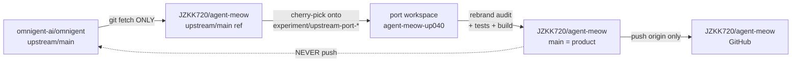

# Upstream adoption policy — omnigent-ai/omnigent → JZKK720/agent-meow

> Status: **binding**. Adopted 2026-09-01 after the fork completed its full
> rebrand and diverged structurally from upstream. This policy replaces the
> earlier "keep PRs flowing upstream" posture (PR #4 era).

## The rule

**agent-meow is a hard fork. Upstream never receives our code, and upstream
code never lands here wholesale.** We adopt upstream *features* selectively,
through a one-way port pipeline that ends in our rebranded core, never in a
merge.

## Non-negotiables

1. **No pushes to upstream.** Both workspaces carry
   `remote.upstream.pushurl = DISABLED_NO_PUSH_TO_UPSTREAM`. Any attempt to
   `git push upstream` fails loudly. If a future change genuinely must go
   upstream, it is *re-implemented* against upstream conventions in a clean
   checkout — the rebranded tree is never pushed.
2. **No merges or rebases from upstream into fork `main`.** Upstream commits
   arrive only via `git cherry-pick` onto a port branch in the
   `agent-meow-up040` worktree, one feature at a time.
3. **Every port passes the rebrand audit before touching fork `main`:**
   - grep the ported diff for `omnigent` / `OMNIGENT_` / `Omnigent` (brand,
     env vars, class names, i18n keys, localStorage prefixes) — every hit is
     rewritten to `agent-meow` / `AGENT_MEOW_` equivalents;
   - no upstream UI copy, mascot, pattern, or branding assets survive the
     port;
   - `tsc -b` + vitest affected suites + lint must match fork baselines.
4. **Fork `main` is the product.** Upstream's `main` is a *reference*, not a
   parent. `git log upstream/main` is reading material; it is never an
   ancestor of fork `main` except through the pre-divergence history we
   already share.
5. **Upstream-facing branches are deleted after use.** Port branches live in
   the `agent-meow-up040` worktree and on the fork under
   `experiment/*-upstream-port` names for reference only; they are not PR
   heads against omnigent-ai.

## How to adopt an upstream feature (the standard recipe)

1. `git -C agent-meow fetch upstream` (fetch is always allowed).
2. In `agent-meow-up040`: `git switch -c experiment/upstream-port-<topic>`
   from **upstream/main's tree** (this worktree already sits on the upstream
   base — see "workspace topology" below).
3. Cherry-pick the upstream feature commits; resolve conflicts *in favor of
   the rebranded architecture* (e.g. our `set()` convention, our rebrand
   names, our design tokens).
4. Rebrand audit (grep for `omnigent`, case-insensitive, in the ported
   files) + port the tests + run the gates.
5. `git format-patch upstream/main` → apply as commits on fork `main`
   (`git am` or manual re-application), never `git merge`.
6. Rebuild the SPA bundle, commit it, push to `origin main`.

## Workspace topology (as of 2026-09-01)

| Workspace | Base | Purpose |
|---|---|---|
| `agent-meow` | fork `main` (`ce212da18`) | **The product.** All feature work. |
| `agent-meow-up040` | upstream `3c5b90dfa` + ported phase-1 commits | Port/transplant lab. Reads upstream freely; its output enters the product only via step 5 above. |

The `agent-meow-up040` worktree holds the phase-1 port already adapted to
upstream's `setActive` root-write convention
(`experiment/upstream-port-040`, tip `57dccdc21`). It demonstrates the
convention-diff we must respect when porting upstream web code:
**upstream's store writes go through `setActive(...)`, ours go through
`set(...)`** — any ported store action must be re-adapted back to the fork's
convention on the way in.

## What we take / what we don't

- **Take**: upstream bug fixes in shared logic (stream handling, session
  lifecycle, e2e infra), non-branded features (e.g. upstream's newer
  queueing, scroll behavior, sidebar fixes), and infra improvements.
- **Don't take**: anything touching branding surfaces (`web/src/shell/`
  hero/landing visuals, mascot, patterns, i18n copy wholesale), the rebrand
  env-var scheme, or upstream's telemetry/identity defaults.
- **When in doubt**: port the *idea*, not the *diff*. Re-implement against
  our core with our conventions.