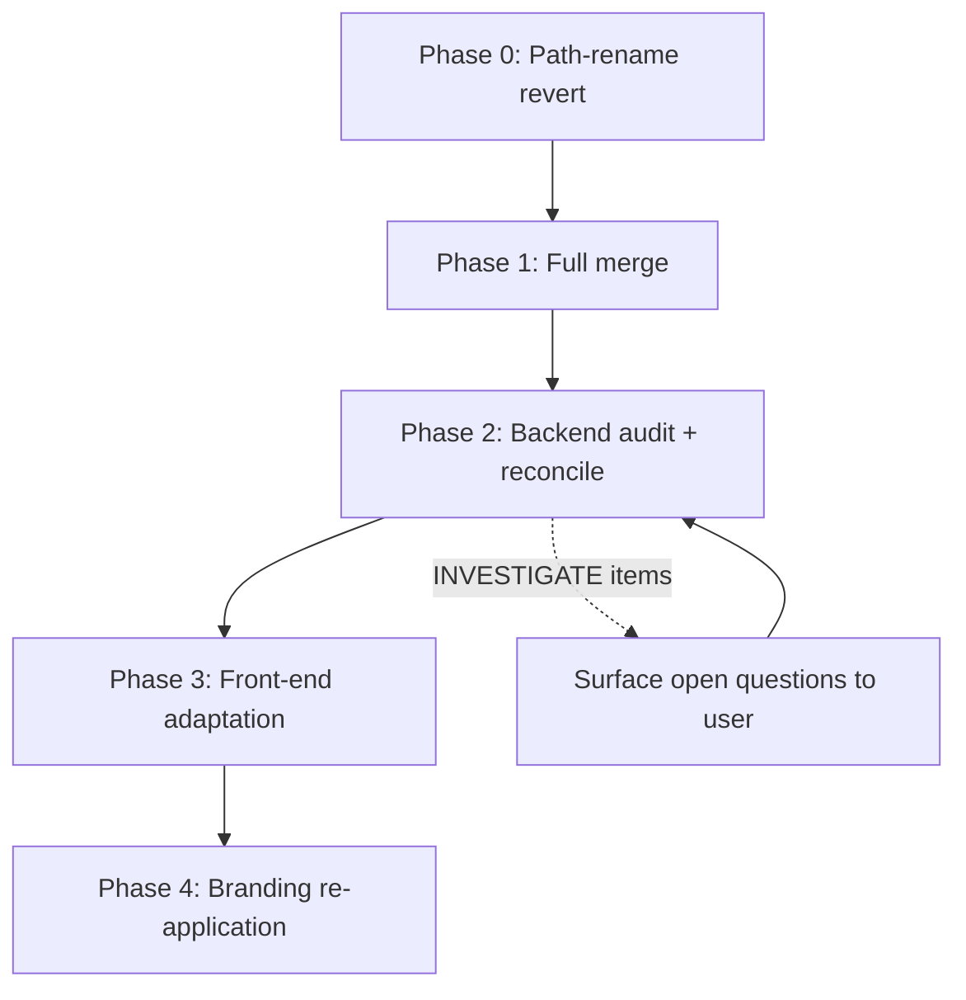

# Workspace reintegration — agent-meow × upstream omnigent

**Date:** 2026-07-22
**Status:** Draft — pending user review
**Supersedes:** `docs/designs/workspace-redesign-spec.md` (marked SUPERSEDED)
**Upstream remote:** `https://github.com/JZKK720/omnigent.git` (added as `upstream`, fetched `upstream/main`)

## Purpose

Reintegrate the upstream `JZKK720/omnigent` workspace UI (547 commits, 341 web files, +29,020/−7,235 lines) into agent-meow, **keeping agent-meow branding** (orange cat mascot, ember palette, "MEOW AI" wordmark, `agent_meow/` package, `agent-meow` distribution name, `meow`/`agent-meow` CLI) and **reconciling agent-meow's backend tools/CLI/MCP/key utilities** against upstream's versions. The client has shifted utilities and capabilities; some agent-meow backend hooks may be obsolete, some must be preserved.

**Architecture principle — agent-meow as orchestrator, local OSS + BYOK API as execution backends (no Claude):**

Agent-meow is the **orchestrator interface** — it provides the UI/UX, tools, CLI, MCP, and skills that users operate with. The surface tools (`doc_generate`, `image_generate`, `video_generate`, etc.) are **harness-agnostic** — any harness that can call agent-meow tools (via the MCP bridge) can drive them.

**ColorFire deployment constraint:** ColorFire machines will **not** have Claude API or Claude Code installed. The execution backends are:
- **Local OSS models** via `hermes-native` / `ironclaw-native` (primary — no API costs, offline, local LLMs)
- **BYOK API models** via `openai-agents` harness + OpenAI-compatible providers: Kimi (Moonshot), Z.ai (GLM), Qwen (Aliyun Bailian), DeepSeek — confirmed OpenAI-compatible. `PROVIDER_CONFIGS` in `agent_meow/llms/routing.py` already has `deepseek` (`https://api.deepseek.com/v1`) and `moonshot` (`https://api.moonshot.cn/v1`); Z.ai (`https://api.z.ai/api/paas/v4`) and Qwen (`https://dashscope.aliyuncs.com/compatible-mode/v1`) need adding as new entries. All are straight OpenAI-compatible — `OpenAICompatibleAdapter` handles them without adapter tweaks.

**`claude-sdk` is NOT a deployment target for ColorFire.** The `doc-writer`, `image-editor`, `video-creator` example agents currently use `executor: type: claude_sdk` — these must be **re-configured** to use `hermes-native` / `ironclaw-native` (local OSS) or `openai-agents` (BYOK API) for the ColorFire deployment. The `claude-sdk` harness stays in the codebase (it's shared with upstream and works for non-ColorFire deployments), but the surface example agents need ColorFire-specific configs.

The harness choice is **per-agent config** (`executor: type`), not per-surface routing logic. The `openai-agents` harness (shared with upstream — `inner/openai_agents_sdk_executor.py` + `inner/openai_agents_sdk_harness.py`) connects to any OpenAI-compatible endpoint via `base_url` + `api_key` in the agent's `auth:` block, exactly like the existing `hermes-gateway` / `ironclaw-gateway` examples.

## Measured divergence (facts)

| Metric | Value |
|---|---|
| Upstream commits ahead of agent-meow `HEAD` | 547 |
| Merge-base | `b9332cc` |
| `web/src/` files changed | 341 (+29,020 / −7,235) |
| `agent_meow/` vs upstream `omnigent/` | path rename mismatch (agent-meow renamed `omnigent/ → agent_meow/` in commit `7efd8ac1`; upstream never renamed) |
| `pyproject.toml` name | ours `agent-meow`, upstream `omnigent` |
| CLI entry points | ours `meow` / `agent-meow` / `omni`, upstream `omni` |
| Env var prefix | both `OMNIGENT_*` (agent-meow's rename to `MEOW_*` was deferred) |

### Upstream workspace UI features not in agent-meow

- `LandingProjectPicker` + `projectPrefill.ts` — project filing + `?project=` prefill
- `SubagentsGraphView` + `subagentGraphLayout.ts` — visual sub-agent graph
- `NotebookPreview` + `__fixtures__/*.ipynb` — Jupyter notebook rendering
- `PdfViewer` + `pdfCommentHelpers` + `pdfViewer.css` — PDF viewer with comments
- `PreviewSearchBar` + `previewSearch.ts` — in-preview search
- `TipTapSearchExtension` — in-document search for Tiptap
- `BrowserPane` — embedded browser pane
- `ModelValueCombobox` — new model picker
- `UpdateBanner` — desktop update overlay
- `goal/` — goal dialogs + API
- `ThemeColorPicker` + `customTheme.ts` — custom theme colors
- `QueueFlushProvider` — batched queue flush
- `useHostWorktrees`, `baseBranchPreferences`, `harnessPreferences`, `hostPreferences`, `harnessVisibilityPreferences` — preference hooks
- `useDictationInsert` + `dictation.ts` — server-side streaming dictation
- `useSharing` — sharing flow
- `designModePrompt` — design mode
- Sandbox repo chip (URL+branch), worktree combobox with existing-worktree picker, base-branch auto-fill
- `Sidebar.tsx` +768 lines (project headers, pinned-auto-expand, row-actions overhaul)

### Agent-meow branding/backend not in upstream (must preserve or audit)

- Mascot: `MeowCatEyes.tsx`, `MeowCatIcon.tsx`, `MeowCatMascot.tsx`
- i18n: `i18n.ts`, `locales/en.json`, `locales/zh-CN.json`
- Admin pages: `HarnessesPage.tsx`, `McpServersPage.tsx`, `SkillsPage.tsx`, `LanguageSection.tsx`
- Backend hooks: `useAdminCatalog.ts`, `useDocuments.ts`, `useImages.ts`, `documentsApi.ts`, `imagesApi.ts`, `handyApi.ts`
- Features: `AudioBlock.tsx`, `DocEditor.tsx`, `DocsPanel.tsx`, `codex/` goal utils
- Upstream uses `OttoEyes` mascot — must swap to `MeowCatMascot` during branding phase

## Design — 5 phases

### Phase 0 — Path-rename revert (pre-merge)

**Goal:** make the git tree match upstream's `omnigent/` layout so `git merge` doesn't 2x the codebase.

**Why this first:** agent-meow commit `7efd8ac1` renamed `omnigent/ → agent_meow/`. Upstream never renamed. A raw `git merge upstream/main` would re-add the entire `omnigent/` directory as a new tree alongside our `agent_meow/`, producing a 2x codebase. Reverting the rename first aligns paths.

**Steps:**

1. Create a throwaway integration branch from `main`: `git checkout -b reintegration/staging`.
2. `git revert 7efd8ac1` — undo the `omnigent/ → agent_meow/` rename. This restores the `omnigent/` directory name so the tree matches upstream.
3. Revert the pyproject + CLI-entry-point changes from the rebrand era. These span two commits (`b61e015a` and `14e664fc`), but only the **functional** parts need reverting — the **branding/docs** parts stay (they're harmless under the `omnigent/` path and get re-applied in phase 4). Specifically, revert only:
   - `pyproject.toml`: `name` back to `omnigent`, `[project.scripts]` back to `omni` only.
   - `sdks/python-client/pyproject.toml` + `sdks/ui/pyproject.toml`: package `name` back to `omnigent-client` / `omnigent-ui-sdk` and their version pins.
   - `uv.lock`: the corresponding package-name entries.
   - Do NOT revert: README/CHANGELOG/NOTICE/deploy docs/docstrings — those are branding prose and will be re-applied in phase 4 anyway. Reverting them now just creates merge conflicts with upstream.
4. Run `uv sync --extra all --extra dev` to confirm the reverted package still installs.
5. Run `uv run pytest tests/ -x --co` (collect-only, no run) to confirm imports resolve under the reverted `omnigent.` module path.

**Scope boundaries:**
- **In scope:** the directory rename, pyproject `name`, `[project.scripts]`, and `from agent_meow` → `from omnigent` import reverts.
- **Out of scope:** branding assets (mascot PNGs, palette, wordmark) — leave these in place; they're harmless under the `omnigent/` path and get re-applied in phase 4.
- **Escape hatch:** if `git revert 7efd8ac1` produces unresolvable conflicts (because later commits touched the renamed paths), STOP and report back — the fallback is `git mv agent_meow omnigent` + a find-replace of imports, done manually.

**Verification:**
- `git ls-tree --name-only HEAD | grep omnigent/` returns the package dir.
- `git ls-tree --name-only HEAD | grep agent_meow/` returns nothing.
- `uv run python -c "import omnigent; print(omnigent.__version__)"` succeeds.

### Phase 1 — Full merge + conflict resolution

**Goal:** bring all 547 upstream commits into the integration branch in one operation, with path-level conflicts eliminated by phase 0.

**Steps:**

1. On `reintegration/staging`, run `git merge upstream/main --no-commit --no-ff`. This stages the merge result without committing, so conflicts can be inspected.
2. Expected conflict categories and resolution rules:

   | Conflict type | Resolution rule |
   |---|---|
   | Upstream-only new files (e.g. `SubagentsGraphView.tsx`, `PdfViewer.tsx`) | Take upstream (no conflict expected). |
   | Agent-meow-only files under `omnigent/` (e.g. `MeowCatMascot.tsx`, `HarnessesPage.tsx`) | Keep ours. These are branding/custom files upstream doesn't have. |
   | Both-modified core files (`NewChatDialog.tsx`, `Sidebar.tsx`, `chatStore.ts`, `sessions.py`) | **Take upstream as the base**, then re-apply agent-meow's specific additions in phase 2/3. Do NOT resolve by taking ours — that discards 547 commits of upstream work. |
   | i18n files (`en.json`, `zh-CN.json`, `i18n.ts`) | Take upstream's structure, re-apply agent-meow's keys in phase 4. |
   | Branding files (`index.css` tokens, mascot imports) | Keep ours; re-apply in phase 4. |

3. After resolving, run `git commit` to complete the merge.
4. Smoke test: `uv run pytest tests/server/ tests/runner/ -x --co` (collect-only) to confirm the merged tree imports cleanly.

**Scope boundaries:**
- **In scope:** the merge commit, mechanical conflict resolution per the table above.
- **Out of scope:** functional reconciliation of agent-meow backend hooks (phase 2), front-end wiring (phase 3), branding (phase 4). Don't try to make everything perfect here — get the merge in, shape it later.
- **Escape hatch:** if a both-modified file has >500 lines of conflict markers after resolution, STOP and report the file — it needs a dedicated phase-2/3 sub-plan, not inline merge resolution.

**Verification:**
- `git log --oneline -1` shows the merge commit.
- `uv run python -c "import omnigent.server; import omnigent.runner"` succeeds.
- `cd web && npm install && npm run type-check` — expect type errors (phase 3 fixes these); confirm only type errors, no missing-module errors for upstream files.

### Phase 2 — Backend audit + reconcile (tools / CLI / MCP / key utilities)

**Goal:** decide which agent-meow backend customizations survive, and re-apply them onto the merged (upstream-dominant) backend. This is where the "audit against new designs and compare" requirement lives.

**Audit criteria — for each agent-meow backend hook / tool / utility, answer:**

1. **Server-side support:** does the current `agent_meow/tools/builtins/` (or upstream's `omnigent/tools/builtins/` after merge) still register the corresponding `sys_*` tool? If the server callable is gone, the web hook is dead.
2. **Design-template coverage:** does either `workspace-design-new-01.png` or `workspace-design-new-02.png` depict or imply the capability? (Image gen, video gen, doc gen are depicted; admin pages are not.)
3. **Client-shift relevance:** the user said the client shifted utilities. For each hook, flag: **KEEP** (still needed), **DROP** (obsolete), **INVESTIGATE** (unclear — surface to user).

**Audit target list (the agent-meow backend hooks to evaluate):**

| Hook / file | Upstream equivalent | Audit question |
|---|---|---|
| `useDocuments.ts` + `documentsApi.ts` | upstream has `docs/` surface? | Does the new design still need a Docs surface, or did upstream's `PdfViewer` + `NotebookPreview` replace it? |
| `useImages.ts` + `imagesApi.ts` | upstream has `images/` surface? | Does the new design's "图片生成" card map to this, or to upstream's `BrowserPane` / a new image-gen tool? |
| `useAdminCatalog.ts` | upstream admin pages | Do agent-meow's `HarnessesPage` / `McpServersPage` / `SkillsPage` still need separate hooks, or did upstream unify them? |
| `handyApi.ts` | unknown — grep upstream | What does this call, and is the endpoint still in the merged server? |
| `AudioBlock.tsx` | upstream has `useDictationInsert` + `dictation.ts` | Did upstream's server-side dictation replace agent-meow's audio block? |
| `DocEditor.tsx` + `DocsPanel.tsx` | upstream has `TipTapSearchExtension`, `PdfViewer`, `NotebookPreview` | Did upstream's preview stack replace agent-meow's doc editor? |
| `codex/codexGoalUtils.ts` | upstream has `goal/` (GoalDialog, goalUtils, goalApi) | Did upstream's unified goal system replace agent-meow's codex-specific one? |
| `examples/hermes-gateway/` + `examples/ironclaw-gateway/` + `hermes-native`/`ironclaw-native` harness stacks | Upstream has the **full `hermes-native` harness stack** (`hermes_native.py`, `hermes_native_bridge.py`, `hermes_native_forwarder.py`, `hermes_native_permissions.py`, `hermes_native_status.py`, `inner/hermes_native_executor.py`, `inner/hermes_native_harness.py`, `onboarding/hermes_auth.py` + tests) — **shared, merge brings it**. Upstream has **zero ironclaw files** — `ironclaw-native` is **agent-meow-only**. | **TWO variants, both KEEP:** (1) **Native TUI harness** (`hermes-native` / `ironclaw-native`) — wraps the local CLI in a tmux pane inside agent-meow, same integration model as Claude Code / Codex / Cursor / Pi. The framework owns tool dispatch, policies, sandbox; the CLI runs locally. This is the **primary** variant — Hermes and Ironclaw are local LLM-drive gateways operating *inside* agent-meow. (2) **HTTP gateway examples** (`hermes-gateway` / `ironclaw-gateway`) — `openai-agents` HTTP relay to standalone gateway servers, for users who run them. **Hermes-native: merge brings upstream's version (aligned). Ironclaw-native: agent-meow-only — MUST preserve the `IRONCLAW_NATIVE_CODING_AGENT` registration, wrapper label, and any bridge/forwarder/executor files through the merge.** The HTTP gateway examples co-exist with Polly/Debby (different layer — single-model delegate vs multi-agent orchestrator) and are kept. |

**Steps:**

1. For each row above, grep the merged `omnigent/` tree for the upstream equivalent and the server endpoint.
2. Produce a keep/drop/investigate table with evidence (file:line).
3. For KEEP items: re-apply agent-meow's version onto the merged backend, resolving any signature drift.
4. For DROP items: delete the agent-meow file; confirm no merged code imports it.
5. For INVESTIGATE items: list them in the spec's open questions and surface to the user before phase 3.
6. **Critical preserve-through-merge item:** `ironclaw-native` is agent-meow-only (upstream has zero ironclaw files). If phase 1 resolved `harness_plugins.py` by taking upstream, the `IRONCLAW_NATIVE_CODING_AGENT` registration, `IRONCLAW_NATIVE_WRAPPER_VALUE` import, and `ironclaw-native` entries in `native_harnesses` + aliases + `harness_modules` are gone. Re-apply them here. Also re-apply any `ironclaw_native_*.py` bridge/forwarder/executor files that agent-meow had and upstream didn't.
7. Run `uv run pytest tests/tools/ tests/inner/ -x` after each KEEP re-application.

**Scope boundaries:**
- **In scope:** `agent_meow/tools/` (now `omnigent/tools/`), CLI entry points, MCP server proxy, the web hooks listed above.
- **Out of scope:** front-end rendering of these hooks (phase 3), branding (phase 4).
- **Escape hatch:** if a KEEP item's upstream equivalent has a fundamentally different API contract (different method signature, different return shape), STOP — that's a rewrite, not a re-application. Surface it as an open question.

**Verification:**
- `uv run pytest tests/tools/ tests/inner/ tests/server/ -x` passes.
- `uv run ruff check omnigent/tools/ omnigent/server/routes/` clean.
- The keep/drop/investigate table is committed to this spec as an appendix.

### Phase 3 — Front-end adaptation

**Goal:** reconcile the 341-file `web/src/` diff. Re-introduce agent-meow's web-side hooks that survived phase 2, and wire upstream's new workspace features into agent-meow's surfaces.

**Steps:**

1. Run `cd web && npm run type-check` on the merged tree. Capture the full error list — these are the import gaps from agent-meow hooks that were removed/dropped and upstream files that expect upstream-only APIs.
2. For each KEEP hook from phase 2, restore its web-side import and re-wire it into the merged component (e.g. if `useDocuments` is KEEP, restore `DocsPanel.tsx` and wire it into the right-rail tabs in `AppShell.tsx`).
3. For upstream's new workspace features, confirm they render against the merged backend:
   - `LandingProjectPicker` — needs the project prefill endpoint; confirm it's in the merged server.
   - `SubagentsGraphView` — needs sub-agent data; confirm `chatStore` exposes it after merge.
   - `PdfViewer` / `NotebookPreview` — need file endpoints; confirm.
   - `BrowserPane` — needs the browser relay; confirm `useBrowserAgentRelay` wires up.
   - `goal/` — needs goal API; confirm `goalApi.ts` endpoints exist in merged server.
4. Fix type errors incrementally. Run `npm run type-check` after each batch.
5. Run `npm test` (vitest) — fix broken tests. Upstream's test suite should mostly pass; agent-meow's tests for dropped hooks should be deleted.

**Scope boundaries:**
- **In scope:** `web/src/` only. All of it.
- **Out of scope:** branding (mascot swap, palette, wordmark — phase 4), backend (phase 2).
- **Escape hatch:** if a upstream workspace feature (e.g. `BrowserPane`) requires a backend endpoint that neither agent-meow nor upstream has in the merged tree, STOP — that feature is blocked on backend work outside this spec's scope.

**Verification:**
- `cd web && npm run type-check` clean.
- `cd web && npm test` passes.
- `cd web && npm run lint` clean.
- Manual: `npm run dev` + open `localhost:5173` — landing renders, sidebar renders, a session can be created.

### Phase 4 — Branding re-application

**Goal:** re-apply agent-meow's visual identity onto the reconciled codebase. This is a thin, reviewable layer.

**Checklist:**

1. **Directory rename re-applied:** `git mv omnigent agent_meow` + find-replace `from omnigent` → `from agent_meow` across all `.py` files. Run `uv run pytest --co` to confirm imports.
2. **pyproject.toml:** `name = "agent-meow"`, `[project.scripts]` restores `meow` / `agent-meow` / `omni`.
3. **Mascot:** in `NewChatDialog.tsx` (and anywhere else), swap upstream's `OttoEyes` / `OttoIcon` imports for `MeowCatMascot` / `MeowCatIcon`. Confirm `MeowCatMascot.tsx` / `MeowCatIcon.tsx` / `MeowCatEyes.tsx` are present.
4. **Palette:** `web/src/index.css` — restore agent-meow's `@theme inline` tokens (ember `#E8651A`, sky `#5B8DEF`, warm white `#FFFBF5`, etc. per `WEB_REBRANDING_PLAN.md`). Override upstream's tokens if they diverged.
5. **Wordmark:** sidebar brand link — restore "MEOW AI" / agent-meow wordmark. i18n keys for the brand.
6. **i18n:** merge agent-meow's `en.json` / `zh-CN.json` keys into upstream's i18n structure (upstream may have restructured namespaces — adapt key paths, don't blindly paste).
7. **Admin pages:** if `HarnessesPage` / `McpServersPage` / `SkillsPage` survived phase 2, confirm they render with agent-meow styling.
8. **Favicon / PWA:** restore agent-meow cat mascot favicon + PWA icons.
9. **Electron / mobile:** restore agent-meow bundle IDs, app names per `WEB_REBRANDING_PLAN.md` phases 6–8.

**Scope boundaries:**
- **In scope:** visual identity only — mascot, palette, wordmark, i18n keys, favicon, bundle metadata.
- **Out of scope:** any functional change. If branding re-application reveals a functional gap, it goes back to phase 2 or 3.
- **Escape hatch:** if upstream restructured the i18n system so fundamentally that agent-meow's keys can't be mapped, STOP — surface the i18n architecture diff as an open question.

**Verification:**
- `uv run pytest` passes (full suite).
- `cd web && npm run build` succeeds.
- `cd web && npm run type-check && npm run lint && npm test` all clean.
- Manual visual: landing shows orange cat + "MEOW AI", sidebar shows agent-meow brand, palette is ember not lavender/pink.

## Execution order + dependencies



- Phase 0 → Phase 1 is strict (paths must align before merge).
- Phase 1 → Phase 2 is strict (backend reconcile needs the merged tree).
- Phase 2 → Phase 3 is strict (front-end can't wire hooks until keep/drop is decided).
- Phase 3 → Phase 4 is strict (branding on top of functional code, not alongside).
- Phase 2 INVESTIGATE items block phase 3 until resolved.

## Appendix A — Bidirectional component comparison

### Agent-meow-only backend tools (5 — the Docs/Images/Voice surfaces)

| Tool file | sys_* callables | Upstream equivalent | Verdict |
|---|---|---|---|
| `tools/builtins/docs.py` | `doc_create`, `doc_get`, `doc_list`, `doc_update`, **`doc_generate`** (v1 stub — persists topic+outline placeholder) | None — upstream has `PdfViewer` + `NotebookPreview` (richer preview) but no docs tool | **KEEP + rewire** — maps to PNG 文档生成 card. `doc_generate` stub should route through Hermes/Ironclaw (see Appendix B) |
| `tools/builtins/images.py` | `image_list`, `image_get`, `image_upload`, `image_edit`, **`image_generate`** (v1 stub — returns not-yet-wired), `image_remove_bg`, `image_edit_ai` | None | **KEEP + rewire** — maps to PNG 图片生成 card. `image_generate` stub should route through Hermes/Ironclaw (see Appendix B) |
| `tools/builtins/videos.py` | `video_list`, `video_get`, **`video_generate`** (calls external gateways: fal.ai / Happy Horse / Pixelle-Video via `VIDEO_GEN_PROVIDER`) | None | **KEEP + rewire** — maps to PNG 视频生成 card. `video_generate` currently calls external APIs directly; should optionally route through Hermes/Ironclaw as the orchestrating backend (see Appendix B) |
| `tools/builtins/transcribe.py` | `sys_transcribe` (shells out to `handy --transcribe-file`) | Upstream has `useDictationInsert` + `dictation.ts` (composer mic, server-side streaming) but no `sys_transcribe` tool | **KEEP** — co-exists with upstream's dictation (different use case: in-chat audio vs composer mic) |
| `tools/builtins/tts.py` | `sys_tts` (VibeVoice-Realtime via vLLM gateway) | None | **KEEP** — Voice surface |

### Upstream-only backend tools (5 — newer features the merge brings)

| Tool file | Purpose | Commit |
|---|---|---|
| `tools/builtins/browser.py` | Browser tool — drives `BrowserPane` web UI | new |
| `tools/builtins/scheduled_tasks.py` | Scheduled task execution + run-completion + run-history | `de7cc8df`, `5ff4c9d2`, `624216a7` |
| `tools/builtins/hindsight.py` | Hindsight tool | new |
| `tools/builtins/session_rename.py` | `sys_session_rename` — automatic session titles | `f8b333b6`, `2e20f72f` |
| `tools/builtins/_arguments.py` | Argument validation helper | refactor |

### Agent-meow-only example agents (8)

`doc-writer`, `image-editor`, `video-creator`, `voice-agent`, `transcribe-agent`, `markdown-ingest`, **`hermes-gateway`**, **`ironclaw-gateway`**

### Upstream-only example agents (2)

`aws_analyst`, `remy`

### Hermes/Ironclaw gateways vs Polly/Debby — co-existence analysis

**Verdict: CO-EXIST, NOT CONFLICT.** Hermes and Ironclaw each have **two integration variants** in agent-meow, and neither variant conflicts with Polly/Debby.

**Variant 1 — Native TUI harness (primary):** `hermes-native` and `ironclaw-native` are registered in `harness_plugins.py` as `NativeCodingAgent` entries, the same registry as Claude, Codex, Cursor, Pi, OpenCode, Goose, Antigravity, Qwen, Kimi, Kiro. They wrap the local CLI in a tmux pane inside agent-meow — the **framework owns tool dispatch, policies, sandbox**, and the CLI runs locally. This is the primary variant: **Hermes and Ironclaw are local LLM-drive gateways operating *inside* agent-meow**, connecting the same way Claude Code and other SDK/native harnesses connect.

- `hermes-native` has a complete stack: `hermes_native.py` (launch), `hermes_native_bridge.py` (tmux injection), `hermes_native_forwarder.py` (TUI→web), `hermes_native_permissions.py` (approval mirror), `hermes_native_status.py` (idle poster), `inner/hermes_native_executor.py`, `inner/hermes_native_harness.py`, `onboarding/hermes_auth.py`.
- `ironclaw-native` is registered (`IRONCLAW_NATIVE_CODING_AGENT`, wrapper label, in `native_harnesses` frozenset). Confirm full bridge/forwarder/executor stack during phase 2.

**Variant 2 — HTTP gateway examples (secondary):** `examples/hermes-gateway/` and `examples/ironclaw-gateway/` use the `openai-agents` harness to relay to standalone gateway servers (hermes on :8642, ironclaw WASM on :3000). The **gateway server** owns tools/memory/sandbox. For users who already run standalone gateway servers.

| | Polly / Debby | hermes-native / ironclaw-native (Variant 1) | hermes-gateway / ironclaw-gateway (Variant 2) |
|---|---|---|---|
| Layer | Orchestrator (in-process) | Native TUI harness (in-process, tmux-wrapped CLI) | HTTP delegate (external) |
| Harness | `claude-sdk` (brain) | `hermes-native` / `ironclaw-native` | `openai-agents` |
| Tool ownership | Framework | Framework (CLI runs locally) | External gateway server |
| User take-over? | Yes — sub-agent terminals | Yes — terminal in Subagents panel | No — headless HTTP |
| Multi-agent? | Yes (Polly: 6, Debby: 2) | No — single CLI | No — single forward |

**Merge impact:**
- **`hermes-native`: shared with upstream.** Upstream `omnigent/` has the same Hermes native harness stack. The merge brings upstream's version; agent-meow's is already aligned. No conflict.
- **`ironclaw-native`: agent-meow-only.** Upstream has zero ironclaw files. The `IRONCLAW_NATIVE_CODING_AGENT` registration, wrapper label, and any bridge/forwarder/executor files exist only in agent-meow. **MUST preserve through the merge** — if phase 1 conflict resolution takes upstream's `harness_plugins.py`, the Ironclaw registration disappears and must be re-applied in phase 2.

**Decision: KEEP all four.** Polly/Debby are orchestrators; the native TUI harnesses are first-class local integrations (same as Claude Code); the HTTP gateway examples are an alternative deployment model. None replace each other.

### Upstream-only top-level modules (11 — merge brings these)

`api/`, `config.py`, `crash_handler.py` + `crash_ui.py`, `harness_availability.py`, `harness_startup_config.py`, `install_ledger.py`, `integration_daemon.py`, `process_logging.py`, `session_import/`, `telemetry/`, `workspace_fs.py`

### Upstream-only inner harnesses (3 — new harness type)

`inner/acp_executor.py` + `inner/acp_harness.py` + `inner/_acp_omnigent_mcp.py` — ACP (Agent Client Protocol) harness.

### Key upstream feature commits (last 30 days)

- `24831901` Import Qwen, Kiro, Pi, Kimi chats
- `9b9d3319` Install missing harness onto connected host from UI
- `de7cc8df` Scheduled tasks: run-completion + run-history
- `336d1fb6` Server-side streaming dictation
- `a077eb68` HTTP headers for MCP servers in session UI
- `de79983d` Server-side smart routing via external gateway
- `c555ba9c` Per-harness startup command/args overrides
- `f70085da` Reuse delegated credentials in host runners
- `698f71f1` Slack integration with auth
- `f4662018` OIDC email from configurable id_token claim
- `6200a258` Hermes setup installer in CLI
- `a93c6246` CLI friendly crash handler with GitHub issue filing
- `f8b333b6` Automatic session titles
- `617e4b89` Config-file policies in admin policy page
- `829fdd51` Unify session-owner identity to user_id (DB refactor)
- `cc87a413` Migrate CEL from cel-expr-python to cel-python

## Appendix B — Surface-to-harness execution routing (deep-dive)

### The orchestration model

Agent-meow is the **orchestrator**: it owns the UI/UX, session management, resource storage (documents, images, videos in the DB), tool dispatch, policies, and the right-rail surfaces. The surface tools (`doc_generate`, `image_generate`, `video_generate`, etc.) are **harness-agnostic** — any harness that can call agent-meow tools (which is all of them, via the MCP bridge in `inner/openai_agents_sdk_executor.py` / `inner/claude_sdk_executor.py` / the native TUI forwarders) can drive the surfaces.

**ColorFire deployment — no Claude API or Claude Code.** The execution backends are:
- **Local OSS:** `hermes-native` / `ironclaw-native` (primary — local LLMs, no API costs, offline)
- **BYOK API:** `openai-agents` harness + OpenAI-compatible providers (Kimi/Moonshot `https://api.moonshot.cn/v1`, Z.ai `https://api.z.ai/api/paas/v4`, Qwen via Aliyun Bailian `https://dashscope.aliyuncs.com/compatible-mode/v1`, DeepSeek `https://api.deepseek.com/v1` — all confirmed OpenAI-compatible via API docs research. `PROVIDER_CONFIGS` already has `deepseek` + `moonshot`; Z.ai + Qwen need adding)

The `openai-agents` harness (shared with upstream) connects to any OpenAI-compatible endpoint via `base_url` + `api_key` in the agent's `auth:` block — same pattern as the existing `hermes-gateway` / `ironclaw-gateway` examples. The BYOK providers are just different `base_url` + `api_key` + `model` values.

**The `claude-sdk` harness stays in the codebase** (shared with upstream, works for non-ColorFire deployments) but the surface example agents (`doc-writer`, `image-editor`, `video-creator`) need **ColorFire-specific configs** that use `hermes-native` / `ironclaw-native` / `openai-agents` instead of `claude_sdk`.

```
User → agent-meow UI (orchestrator)
  ↓ picks an agent (doc-writer / image-editor / video-creator / custom)
  ↓ agent's executor: hermes-native | ironclaw-native | openai-agents (BYOK)
Chosen harness starts
  ↓ agent-meow bridges ALL surface tools as MCP tools into the session
  ↓ harness LLM (local OSS or BYOK API) reasons, calls tools
  ↓ calls doc_generate / image_generate / video_generate
  ↓ agent-meow runner dispatches the tool call
  ↓ generate tool calls its backend (stub → implement; or external API)
  ↓ result stored in surface (Docs/Images/Video resource tables)
agent-meow surfaces artifacts in right-rail panels + editor views
User reviews/edits in agent-meow UI
```

### Per-surface routing analysis

#### Docs surface → Hermes/Ironclaw execution

**Current state (`docs.py`):**
- `doc_create`, `doc_get`, `doc_list`, `doc_update` — CRUD, agent-meow owns these (REST endpoints + DocumentStore). No harness needed.
- `doc_generate` — **v1 stub**: persists a structured placeholder (topic + outline + instructions). The spec says "a future version can route it back into the agent's own LLM loop for full generation."
- `doc_create_office`, `doc_edit_office`, `doc_export`, `doc_convert` — Office file operations via officecli + MarkItDown. Agent-meow owns these.

**Routed-to-harness work:**
- `doc_generate` should dispatch to a generation backend with: the topic + outline as the prompt, the session's existing documents as context, and instructions to produce a full markdown document. The **harness LLM** (Hermes/Ironclaw via native harnesses, or Kimi/Z.ai/Qwen/DeepSeek via `openai-agents` BYOK) uses its reasoning + tools (web search, file access) to research and draft; agent-meow stores the result via `doc_create`.
- This is **not** a stub replacement with a direct LLM API call — it's implementing the generate tool so any harness driving the agent can produce a full document through multi-step reasoning + tool use.

**What agent-meow keeps:** the document storage, the Tiptap editor, the Docs panel, the REST API. The harness never touches the DB directly — it returns markdown, agent-meow stores it.

**Harness choice is per-agent config.** `doc-writer` uses `claude_sdk` today — for ColorFire, it needs a ColorFire-specific config using `hermes-native` / `ironclaw-native` (local OSS) or `openai-agents` (BYOK: Kimi/Z.ai/Qwen/DeepSeek). The `doc_generate` tool works the same regardless of harness.

**Rewire effort:** M. Implement `doc_generate`'s runner dispatch from "persist placeholder" to "call the agent's own LLM loop to generate markdown from topic+outline, then `doc_create` the result." The harness (whichever is configured) does the reasoning; the tool just needs to stop returning a placeholder.

#### Images surface → Hermes/Ironclaw execution

**Current state (`images.py`):**
- `image_list`, `image_get`, `image_upload` — CRUD + upload. Agent-meow owns these.
- `image_edit` — applies Fabric.js canvas JSON (store-and-forward). Agent-meow owns this (browser-side).
- `image_generate` — **v1 stub**: returns a not-yet-wired message. The spec says "configure a diffusion provider (Stability, OpenAI images, ComfyUI MCP) to enable it."
- `image_remove_bg` — rembg. Agent-meow owns this.
- `image_edit_ai` — AI-edit (inpaint/outpaint/upscale) via A1111 or hosted API.

**Routed-to-harness work:**
- `image_generate` should dispatch to a generation backend with: the text prompt, desired style/size. The **harness LLM** (Claude / Hermes / Ironclaw) calls an image-generation tool (ComfyUI MCP, A1111, hosted API — the harness chooses based on its config and available MCP servers). The harness executes the generation (which may involve prompt enhancement, multi-step refinement); agent-meow receives the binary and stores it via the Images surface.
- `image_edit_ai` (inpaint/outpaint/upscale) — same pattern: the harness LLM receives the image + edit instructions and executes via its tools, agent-meow stores the result.

**What agent-meow keeps:** image storage, Fabric.js editor, Images panel, upload/download. The harness produces binaries; agent-meow stores them.

**Harness choice is per-agent config.** `image-editor` uses `claude_sdk` today — for ColorFire, it needs a ColorFire-specific config using `hermes-native` / `ironclaw-native` or `openai-agents` (BYOK). The `image_generate` tool works the same regardless of harness.

**Rewire effort:** M. Implement `image_generate`'s runner dispatch from "return not-yet-wired" to "call a configured diffusion provider (ComfyUI MCP / A1111 / hosted API) and upload the result." The harness driving the agent selects which provider via its MCP config.

#### Video surface → Hermes/Ironclaw execution

**Current state (`videos.py`):**
- `video_list`, `video_get` — CRUD. Agent-meow owns these.
- `video_generate` — **already calls external gateways** (fal.ai / Happy Horse / Pixelle-Video via `VIDEO_GEN_PROVIDER`). Handles script writing, AI images, TTS narration, BGM, final composition. This is the most complete of the three generate tools.

**Routed-to-harness work:**
- `video_generate` currently calls external APIs directly (fal.ai / Happy Horse / Pixelle via `VIDEO_GEN_PROVIDER` — confirmed in `agent_meow/runner/tool_dispatch.py:4233` and `agent_meow/tools/builtins/videos.py:29`). This is the most complete of the three generate tools — it already does multi-step orchestration (script → images → TTS → compose) via the gateway.
- The harness (whichever is configured: `hermes-native`, `ironclaw-native`, or `openai-agents` with BYOK) calls `video_generate` as a tool. The tool dispatches to the configured `VIDEO_GEN_PROVIDER`. The harness's LLM can enhance the script, refine the topic, or chain multiple `video_generate` calls — but the actual video pipeline runs in the external gateway.
- A future `VIDEO_GEN_PROVIDER=harness` option could let the harness LLM orchestrate the pipeline itself (call ComfyUI for images, `text_to_speech` for narration, a compositor for the final mp4) instead of delegating to a single gateway. This is a superset of the current direct-API call.

**What agent-meow keeps:** video storage, Video panel, the mp4 upload/download. The harness produces the mp4; agent-meow stores it.

**Rewire effort:** M. Add a `VIDEO_GEN_PROVIDER=harness` option that dispatches to Hermes/Ironclaw instead of calling fal/Pixelle directly.

#### Voice surface → stays agent-meow-native

**Current state:** `transcribe.py` (Handy CLI) + `tts.py` (VibeVoice via vLLM). These are **direct CLI/gateway calls**, not generation tasks that benefit from harness orchestration. STT/TTS are single-step operations.

**Decision:** Voice surface stays agent-meow-native. No harness routing. The harness can *use* TTS/STT as tools within its own execution (e.g. Hermes narrating a video it's generating), but the Voice surface tools themselves don't route through the harness.

#### Coding tasks → already harness-routed

Polly already delegates coding to `hermes-native` and other native harness sub-agents. The surface generate tools follow the **same harness-agnostic model** — any harness that can call agent-meow tools (via the MCP bridge for SDK harnesses, or the TUI forwarder for native harnesses) can drive `doc_generate`, `image_generate`, `video_generate`. The difference is just result type (markdown / image binary / mp4 instead of code).

### What this means for the reintegration

1. **Phase 2 must preserve the surface tools** (`docs.py`, `images.py`, `videos.py`) AND the harness stacks (`hermes-native`, `ironclaw-native`, `claude-sdk`). All are agent-meow differentiators. The surfaces are harness-agnostic; the harnesses are the execution backends.
2. **The `*_generate` stubs need implementation, not harness-specific routing.** `doc_generate` and `image_generate` are stubs — implementing them (to actually generate content) benefits all harnesses equally, since any harness calls them via the MCP bridge. `video_generate` is already implemented (calls external gateways).
3. **ColorFire deployment uses local OSS (Hermes/Ironclaw) + BYOK API (Kimi/Z.ai/Qwen/DeepSeek via `openai-agents`), NOT Claude.** The `claude-sdk` harness stays in the codebase (shared with upstream) but the surface example agents (`doc-writer`, `image-editor`, `video-creator`) need ColorFire-specific configs. The `openai-agents` harness + `PROVIDER_CONFIGS` in `llms/routing.py` already supports DeepSeek and Moonshot (Kimi); Z.ai and Qwen need adding as new OpenAI-compatible provider entries.
4. **Upstream's `PdfViewer` + `NotebookPreview` + `BrowserPane` + `goal/`** complement the surfaces — they're preview/viewing capabilities that agent-meow's surfaces don't have. The merge brings them; they layer on top of the surface storage.
5. **The `*_generate` stub implementation + ColorFire agent configs + BYOK provider additions are post-merge efforts** — they depend on the merged tree having the surface tools and harness stacks. Not part of the 5-phase reintegration itself, but the *product vision* it serves. Flag as the first post-merge feature project: (a) implement `doc_generate`/`image_generate` stubs, (b) create ColorFire-specific agent configs using `hermes-native`/`ironclaw-native`/`openai-agents`, (c) add Z.ai (`https://api.z.ai/api/paas/v4`) + Qwen (`https://dashscope.aliyuncs.com/compatible-mode/v1`) to **both** `PROVIDER_CONFIGS` (routing.py) and `openai_compat_providers` (adapters/__init__.py).

### Runtime testing note

Hermes-agent and Ironclaw are **not installed on this machine** (insufficient RAM/hardware). Runtime tests for the harness routing must happen on a **capable machine** where both can be installed (via Docker, per the user). The reintegration phases 0–4 can proceed without live Hermes/Ironclaw — the harness stacks are code that compiles and unit-tests without a live CLI. The surface-routing rewire's integration tests need the capable machine.

## Open questions (to resolve before or during execution)

1. **i18n architecture** — did upstream restructure i18n namespaces, or just add keys? If restructured, phase 4's i18n merge needs a key-mapping sub-plan.
2. **The 7 audit items in phase 2** — each KEEP/DROP/INVESTIGATE decision needs evidence before phase 3 can wire the front-end.
3. **`handyApi.ts`** — what endpoint does it call, and is it in the merged server? Unknown until grep.
4. **Upstream's `OttoEyes`** — is it a straight swap for `MeowCatMascot`, or did upstream add eye-tracking animation that `MeowCatEyes` needs to replicate?
5. **Electron/mobile bundle IDs** — agent-meow's `WEB_REBRANDING_PLAN.md` phases 6–8 covered these; confirm upstream didn't change the Electron/mobile shell in ways that conflict.
6. **Ironclaw-native full stack** — the `IRONCLAW_NATIVE_CODING_AGENT` registration + wrapper label exist, but does the full bridge/forwarder/executor stack (`ironclaw_native_bridge.py`, `ironclaw_native_forwarder.py`, `inner/ironclaw_native_executor.py`, etc.) exist in agent-meow, or is it registered-but-not-yet-implemented? Grep during phase 2.
7. **Surface `*_generate` stub implementation + ColorFire agent configs** — the `doc_generate` / `image_generate` stubs need implementation (video_generate is already implemented). This is **harness-agnostic** — implementing the stubs benefits all harnesses equally since they all call the tools via the MCP bridge. Additionally, the surface example agents (`doc-writer`, `image-editor`, `video-creator`) need **ColorFire-specific configs** that use `hermes-native` / `ironclaw-native` / `openai-agents` instead of `claude_sdk` (no Claude API on ColorFire). Confirm this is a post-merge feature project, not part of the 5-phase reintegration.
8. **BYOK provider additions — RESOLVED via research + codebase review.** There are **two** places that list OpenAI-compatible providers, both need updating:
   - `PROVIDER_CONFIGS` in `agent_meow/llms/routing.py` (12 entries — the routing/validation layer)
   - `openai_compat_providers` in `agent_meow/llms/adapters/__init__.py` `_create_adapter()` (7 entries — the adapter instantiation layer; subset of PROVIDER_CONFIGS that maps to `OpenAICompatibleAdapter`)

   **Current state (identical in upstream — merge brings no new providers):**

   | Provider | `PROVIDER_CONFIGS` | `openai_compat_providers` | Base URL | Adapter |
   |---|---|---|---|---|
   | `openai` | ✅ | ✅ | `https://api.openai.com/v1` | `OpenAIAdapter` (Responses API) |
   | `anthropic` | ✅ | ❌ | `https://api.anthropic.com/v1` | `AnthropicAdapter` |
   | `gemini` | ✅ | ❌ | `https://generativelanguage.googleapis.com/v1beta` | `GeminiAdapter` |
   | `bedrock` | ✅ | ❌ | `None` (connection_params) | `BedrockAdapter` |
   | `vertex` | ✅ | ❌ | `None` (connection_params) | `VertexAdapter` |
   | `databricks` | ✅ | ❌ | `None` (connection_params) | `DatabricksAdapter` |
   | `groq` | ✅ | ✅ | `https://api.groq.com/openai/v1` | `OpenAICompatibleAdapter` |
   | `deepseek` | ✅ | ✅ | `https://api.deepseek.com/v1` | `OpenAICompatibleAdapter` |
   | `xai` | ✅ | ✅ | `https://api.x.ai/v1` | `OpenAICompatibleAdapter` |
   | `openrouter` | ✅ | ✅ | `https://openrouter.ai/api/v1` | `OpenAICompatibleAdapter` |
   | `ollama` | ✅ | ✅ | `http://localhost:11434/v1` | `OpenAICompatibleAdapter` |
   | `moonshot` (Kimi) | ✅ | ✅ | `https://api.moonshot.cn/v1` | `OpenAICompatibleAdapter` |

   **To add (post-merge, ColorFire BYOK):**

   | Provider | Base URL | Models | Adapter | Source |
   |---|---|---|---|---|
   | `zai` (GLM/Zhipu) | `https://api.z.ai/api/paas/v4` | `glm-5.2`, `glm-5.1`, `glm-5` | `OpenAICompatibleAdapter` | [docs.z.ai](https://docs.z.ai/api-reference) — confirmed OpenAI-compatible |
   | `qwen` (Aliyun Bailian) | `https://dashscope.aliyuncs.com/compatible-mode/v1` | `qwen-plus`, `qwen-max`, `qwen-flash`, `qwen-coder`, `qwen-vl`, `qwen-omni` | `OpenAICompatibleAdapter` | [help.aliyun.com](https://help.aliyun.com/zh/model-studio/qwen-api-via-openai-chat-completions) — confirmed OpenAI-compatible |

   Both additions go into **both** `PROVIDER_CONFIGS` (routing.py) and `openai_compat_providers` (adapters/__init__.py). No new adapter class needed — `OpenAICompatibleAdapter` handles them.

   **Multi-model gateway note:** Aliyun Bailian's `compatible-mode/v1` endpoint also serves DeepSeek, Kimi, GLM, and MiniMax models through the same endpoint — a single Bailian API key can access multiple providers. The `model` field selects which one (`qwen-plus`, `deepseek-v4-pro`, `kimi-k2.6`, `glm-5.2`, etc.).

   **DeepSeek model deprecation:** `deepseek-chat` and `deepseek-reasoner` deprecated 2026-07-24; use `deepseek-v4-pro` / `deepseek-v4-flash` instead.

   **Upstream alignment:** upstream's `PROVIDER_CONFIGS` and `openai_compat_providers` are identical to agent-meow's (verified via `git diff` — only path-rename changes, no new providers). The merge brings no new providers; the Z.ai + Qwen additions are purely agent-meow post-merge work.
9. **Runtime testing machine** — Hermes/Ironclaw can't run on this machine (RAM/hardware). Which capable machine will host the runtime tests for the harness routing? The reintegration phases 0–4 can proceed without it; the surface-routing integration tests cannot.
10. **`claude-sdk` harness disposition** — keep in codebase (shared with upstream, works for non-ColorFire deployments) but exclude from ColorFire agent configs? Or gate it behind a feature flag for ColorFire builds? Confirm.

## Appendix C — Hermes-agent and Ironclaw deep-dive

### NousResearch/hermes-agent

**Repo:** [github.com/NousResearch/hermes-agent](https://github.com/NousResearch/hermes-agent)
**Stats:** 218,537 stars, 41,348 forks, MIT license, primary language Python
**Homepage:** [hermes-agent.nousresearch.com](https://hermes-agent.nousresearch.com)
**Tagline:** "The agent that grows with you"

**Architecture (from `website/docs/developer-guide/architecture.md`):**

```
hermes-agent/
├── run_agent.py              # AIAgent — core conversation loop
├── cli.py                    # HermesCLI — interactive terminal UI
├── model_tools.py            # Tool discovery, schema collection, dispatch
├── toolsets.py               # Tool groupings and platform presets
├── hermes_state.py           # SQLite session/state database with FTS5
├── agent/                    # Agent internals (prompt builder, context engine, compressor)
├── hermes_cli/               # CLI subcommands (setup, auth, config, mcp, skills)
├── tools/                    # Tool implementations (one file per tool)
├── gateway/                  # Gateway server (API server, platforms)
├── acp_adapter/              # ACP (Agent Client Protocol) server
├── cron/                     # Scheduled jobs
├── skills/                   # Bundled skills (autonomous-ai-agents/)
├── optional-skills/          # Optional skills (mcp/mcporter, etc.)
├── web/                      # Web UI (React + TypeScript)
├── apps/desktop/             # Desktop app (Electron + React)
└── ui-tui/                   # TUI components
```

**Key capabilities for agent-meow integration:**

1. **OpenAI-compatible API server** — `gateway/platforms/api_server.py` exposes an OpenAI-compatible REST API at port 8642 (`HERMES_GATEWAY_KEY` auth). `GET /v1/capabilities` advertises the plugin-safe contract. `GET /v1/skills` and `GET /v1/toolsets` enumerate capabilities. This is what agent-meow's `hermes-gateway` example connects to.

2. **MCP client + server** — `hermes mcp add/remove/list/test/configure` manages MCP servers. Hermes can also run AS an MCP server (`hermes mcp serve`) exposing 10 channel-bridge tools. The `mcporter` CLI (optional skill) discovers/calls MCP servers from the terminal.

3. **Toolsets** — `toolsets.py` defines platform presets: `hermes-api-server` exposes web search, terminal, file I/O, vision, image generation, skills, browser automation. Tools include `web_search`, `web_extract`, `terminal`, `read_file`, `write_file`, `patch`, `search_files`, `vision_analyze`, `image_generate`, `skills_list`, `skill_view`, `skill_manage`, `browser_*`, `todo`, `memory`, `session_search`, `execute_code`, `delegate_task`.

4. **Skills system** — `hermes skills install/list/toggle`. Skills are SKILL.md files with frontmatter. Includes a skill hub with security scanning (`SkillHubScanResult` — "safe"/"caution"/"dangerous" verdicts). A background curator manages skill lifecycle.

5. **ACP (Agent Client Protocol)** — `acp_adapter/server.py` exposes Hermes as an ACP agent. Slash commands: `/model`, `/tools`, `/context`, `/compact`, `/steer`, `/queue`. Supports model switching mid-session, session fork/resume.

6. **Multi-provider** — supports 22 provider/tool API keys (OpenAI, Anthropic, OpenRouter, Nous, Firecrawl, etc.). `provider` + `model` + `base_url` in config. The `hermes dump` command shows the full provider/config state.

7. **Cron/scheduled jobs** — `cron/scheduler.py` runs recurring agent tasks with model, skills, toolsets, workdir, and delivery targets.

8. **Memory** — persistent memory across sessions with pluggable memory providers.

9. **Delegation** — `delegate_task` tool spawns sub-agents for parallel work.

10. **Browser automation** — `browser_navigate`, `browser_snapshot`, `browser_click`, `browser_type`, `browser_scroll`, `browser_vision`, `browser_cdp` — full Playwright-style browser control.

**Integration with agent-meow's `hermes-native` harness:**

agent-meow's `hermes-native` wraps the Hermes CLI in a tmux pane. The CLI's TUI is forwarded to the web UI via `hermes_native_forwarder.py`. Hermes' own tool execution (web search, file I/O, browser, vision, image generation) runs inside the Hermes process — agent-meow's framework provides the session management, policies, and UI, while Hermes provides the LLM + tool execution.

**For the ColorFire deployment:** Hermes runs locally (open-source, no API costs) as the execution backend. agent-meow's surface tools (`doc_generate`, `image_generate`, `video_generate`) can be called by Hermes' LLM through the MCP bridge — or Hermes can use its own built-in tools (`image_generate`, `web_search`, `browser_*`) and return results to agent-meow for surface storage.

### nearai/ironclaw

**Repo:** [github.com/nearai/ironclaw](https://github.com/nearai/ironclaw)
**Stats:** 12,547 stars, 1,483 forks, Apache-2.0 license, primary language Rust
**Homepage:** [ironclaw.com](https://www.ironclaw.com)
**Tagline:** "IronClaw is an Agent OS focused on privacy, security and extensibility"

**Architecture (from `crates/Architecture.md`):**

Rust workspace with a capability-based agent OS:

```
ironclaw/
├── crates/
│   ├── ironclaw_agent_loop      # Canonical executor, loop families, strategy composition
│   ├── ironclaw_loop_host       # Loop host ports (capability, input, cancellation, skills)
│   ├── ironclaw_host_runtime    # Capability host, dispatcher, approvals, resources, secrets
│   ├── ironclaw_mcp            # MCP runtime lane (fail-closed, host-mediated egress)
│   ├── ironclaw_skills          # Skill metadata, validation, gating, registry, catalog
│   ├── ironclaw_first_party_extensions  # Built-in tools (web_access, skill_management)
│   ├── ironclaw_extension_host  # Extension lifecycle, MCP discovery
│   ├── ironclaw_reborn_cli      # CLI (run, serve, mcp, skills, tool, config, doctor)
│   ├── ironclaw_reborn_composition  # WebUI services, OpenAI-compatible route
│   ├── ironclaw_webui           # Web UI (React + TypeScript frontend)
│   ├── ironclaw_turns           # Turn/thread/loop state, run profiles
│   └── ironclaw_runner          # Subagent spawn, flavors
├── tests/                       # E2E + integration (MCP auth, mock servers)
└── docs/                        # Capabilities docs (MCP, configuration)
```

**Key capabilities for agent-meow integration:**

1. **Capability-based security** — tool execution goes through `CapabilityHost` → authorization → approvals → resources → `RuntimeDispatcher` → WASM/script/MCP/first-party adapter. The loop never calls the dispatcher directly. This is the "WASM sandbox" referenced in agent-meow's `ironclaw-gateway` example.

2. **MCP client** — `ironclaw mcp add/remove/list/auth/test/toggle`. HTTP transport (JSON-RPC 2.0), stdio, Unix socket. Built-in MCP server registry (Asana, Cloudflare, Intercom, Linear, NEAR AI, Notion). OAuth 2.1 discovery + DCR + token exchange.

3. **OpenAI-compatible API server** — `ironclaw_reborn_composition` builds `build_openai_compat_route_mount`. `ironclaw serve` starts the WebUI + API server. This is what agent-meow's `ironclaw-gateway` example connects to (port 3000).

4. **Skills system** — `ironclaw skills list`. Skills are SKILL.md files with trust levels. `SKILL_INSTALL_CAPABILITY_ID` installs from filesystem, HTTPS URL, ZIP bundle, or GitHub repo. Skill gating/scoring/selection is deterministic. V2 engine skills with `SkillMetrics`, `SkillRevision`, `SkillRepairRecord`.

5. **Subagent spawning** — `ironclaw_runner/subagent/` with flavors. `SubagentSpawnCapabilityPort` implements `LoopCapabilityPort` for spawning child agents.

6. **WASM tools** — `ironclaw tool` manages WASM tools. `ALLOW_LOCAL_TOOLS` (default false) controls filesystem/shell access. Tools run sandboxed.

7. **Memory** — `ironclaw memory search` — hybrid full-text + semantic workspace memory.

8. **Agent configuration** — `AGENT_NAME`, `AGENT_MAX_PARALLEL_JOBS` (default 5), `AGENT_JOB_TIMEOUT_SECS` (default 3600), `AGENT_USE_PLANNING` (default true), `SESSION_IDLE_TIMEOUT_SECS` (default 7 days).

9. **CLI** — `ironclaw run` (agent REPL), `ironclaw serve` (WebUI + API), `ironclaw mcp`, `ironclaw skills`, `ironclaw tool`, `ironclaw registry` (extensions), `ironclaw memory`, `ironclaw config`, `ironclaw doctor`, `ironclaw status`, `ironclaw claude-bridge` (Claude Code bridge in Docker).

**Integration with agent-meow's `ironclaw-native` harness:**

agent-meow has `IRONCLAW_NATIVE_CODING_AGENT` registered in `harness_plugins.py` but **no bridge/forwarder/executor files exist** (confirmed — no `ironclaw_native*` files in the repo). The harness is registered-only. To complete the integration, agent-meow needs:
- `ironclaw_native_bridge.py` — tmux injection + filesystem bridge (like `hermes_native_bridge.py`)
- `ironclaw_native_forwarder.py` — TUI→web forwarder
- `ironclaw_native_permissions.py` — approval mirror (IronClaw has its own approval system)
- `ironclaw_native_status.py` — idle poster
- `inner/ironclaw_native_executor.py` — runner executor
- `inner/ironclaw_native_harness.py` — harness module
- `onboarding/ironclaw_auth.py` — auth flow

Alternatively, the `openai-agents` harness can connect to IronClaw's OpenAI-compatible API server (`ironclaw serve` at port 3000) via the `ironclaw-gateway` example — this path works today without a native TUI wrapper, but loses the take-over-terminal UX.

**For the ColorFire deployment:** IronClaw runs locally (Rust binary, WASM sandbox) as the execution backend. Its capability-based security model makes it ideal for tasks that need sandboxed execution. agent-meow's surface tools can be called by IronClaw's LLM through the MCP bridge, or IronClaw can use its own WASM tools and return results.

### Comparison: Hermes vs Ironclaw for agent-meow surfaces

| Dimension | Hermes-agent | Ironclaw |
|---|---|---|
| Language | Python | Rust |
| Security model | Process-level | WASM sandbox + capability-based |
| Built-in tools | web_search, terminal, file I/O, vision, image_generate, browser, delegate_task, memory | WASM tools, MCP, skill management, web_access |
| MCP | Client + server (10 channel-bridge tools) | Client (HTTP/stdio/unix) + OAuth |
| Skills | SKILL.md + hub + curator + security scan | SKILL.md + trust levels + gating/scoring |
| API server | OpenAI-compatible (port 8642) | OpenAI-compatible (port 3000) |
| Sub-agents | delegate_task | SubagentSpawnCapabilityPort |
| Memory | Persistent, pluggable providers | Hybrid full-text + semantic |
| Browser | Full Playwright-style automation | Via MCP/extension |
| Native harness in agent-meow | ✅ Full stack (bridge/forwarder/executor/auth) | ❌ Registered-only (no bridge/forwarder/executor) |
| Best for | General-purpose tasks, browser automation, vision, image generation | Sandboxed execution, security-sensitive tasks, capability-based tool access |

**Recommendation:** Use Hermes as the **primary** local execution backend (full native harness stack already exists) and Ironclaw as the **security-hardened** alternative for tasks needing WASM sandboxing. Complete the `ironclaw-native` harness stack post-merge, or use the `ironclaw-gateway` HTTP path as an interim.

## Risks

- **Conflict resolution size** — even with paths aligned, `NewChatDialog.tsx` (upstream ~3,900 lines vs agent-meow ~3,200), `Sidebar.tsx` (+768), `chatStore.ts` (+743) are large both-modified files. Phase 1 resolution of these may need dedicated sub-plans.
- **Silent backend hook loss** — if phase 1 resolves a both-modified file by taking upstream, agent-meow hooks imported by that file disappear. Phase 2 must audit for this, not just the explicit hook list.
- **i18n key drift** — upstream may have renamed agent-meow's i18n keys; phase 4 must map, not paste.
- **Test suite divergence** — upstream's tests expect upstream APIs; agent-meow's tests expect agent-meow APIs. After merge, both suites are in the tree and will conflict. Phase 2/3 must delete obsolete tests, not fix them.

## Success criteria

1. `git log --oneline upstream/main..HEAD` shows agent-meow's post-merge commits (branding + backend re-applies), not 547 upstream commits (those are in the merge commit).
2. `uv run pytest` passes (full backend suite).
3. `cd web && npm run type-check && npm run lint && npm test` all clean.
4. `cd web && npm run build` succeeds.
5. `npm run dev` renders: orange cat mascot + "MEOW AI" wordmark + ember palette + upstream's workspace features (project picker, subagent graph, PDF viewer, notebook preview, browser pane, goals).
6. No `omnigent/` directory remains (renamed back to `agent_meow/`).
7. `pyproject.toml` `name = "agent-meow"`, CLI `meow` works.
8. The phase-2 audit table is committed as an appendix to this spec.