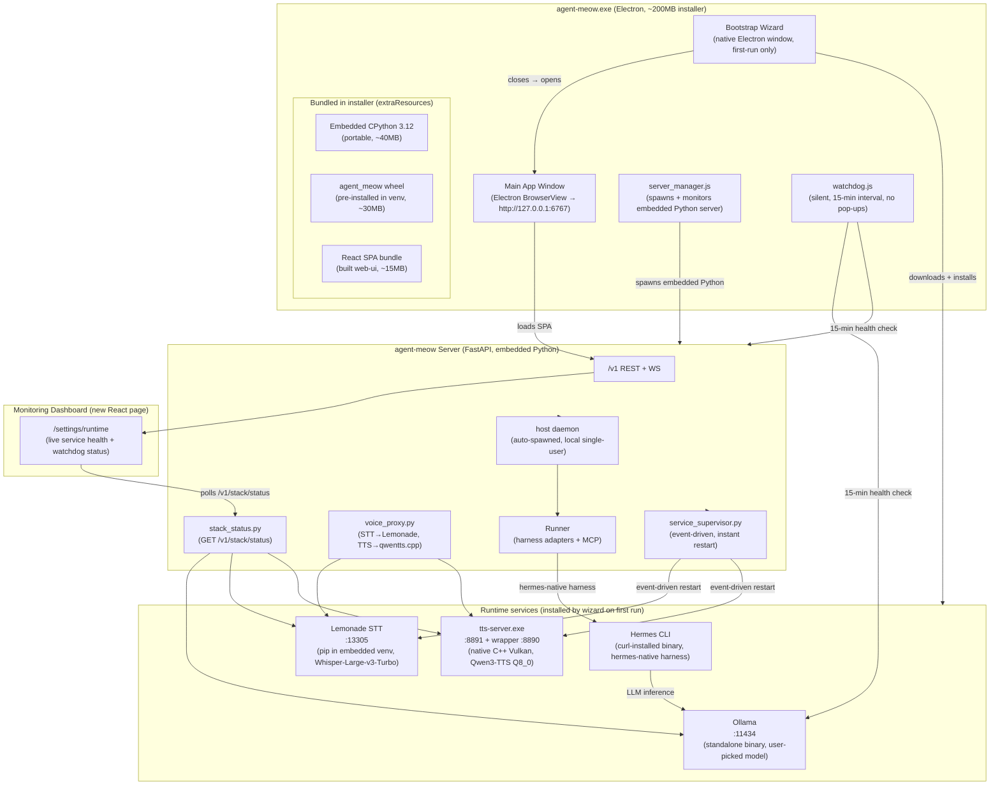

# agent-meow Desktop `.exe` — Self-Contained Packaging Design

**Date:** 2026-08-24
**Status:** Design (pending user approval)
**Scope:** Package agent-meow as a self-contained Windows `.exe` for non-technical end users — zero prerequisites, first-run bootstrap wizard, embedded Python runtime, silent watchdog, and monitoring dashboard.

---

## 1. Decisions

| Decision | Choice | Rationale |
|----------|--------|-----------|
| Target user | Non-technical end user | Double-click → works. No terminal, no repo clone, no manual setup. |
| Hermes mode | Lite (curl CLI, no Docker) | Eliminates Docker Desktop dependency. Hermes CLI is the agent harness; voice is handled by independent services. |
| Python packaging | Portable CPython 3.12 bundle | Allows `pip install` at runtime (Lemonade, agent_meow upgrades). Frozen binary (PyInstaller/Nuitka) cannot pip install GPU wheels. |
| GPU services | Thin installer + first-run bootstrap | Small `.exe` (~200MB); wizard downloads hardware-matching deps on first run (~13-28GB). |
| Default harness | Hermes only | Zero-config out of the box. Other harnesses via in-app catalog (`GET /v1/harnesses`). |
| TTS backend | Native `qwentts.cpp` (Vulkan Q8_0) | No GPU Python needed. Cross-vendor Vulkan (AMD/NVIDIA/Intel). ~800MB. |
| STT backend | Lemonade SDK (Embeddable binary) | Whisper-Large-v3-Turbo on NPU/GPU. Bundle `lemond.exe` from the [Embeddable Lemonade](https://github.com/lemonade-sdk/lemonade/releases) release and launch it as a subprocess. NOT `pip install` — Lemonade is a C++ project, not a Python package. |
| LLM model picker | Curated list in wizard | User picks Ollama model (3-4 options with sizes). Voice models are fixed. |
| Architecture | Approach C (Hybrid) | Electron owns bootstrap + server lifecycle; server owns voice service supervision. |
| Watchdog | Two-layer, silent, 15-min polling | Layer 2 (server, event-driven, instant) for voice services; Layer 1 (Electron, 15-min polling) for server fallback. No terminal pop-ups. |

---

## 2. Architecture



### Process tree

```
agent-meow.exe (Electron)
├── [first run only] Bootstrap Wizard (native Electron window)
│   ├── Download Lemonade SDK + Whisper model → %LOCALAPPDATA%\agent-meow\
│   ├── Download tts-server.exe + Qwen3-TTS Q8_0 model → %LOCALAPPDATA%\agent-meow\tts\
│   ├── curl-install Hermes CLI → %LOCALAPPDATA%\agent-meow\hermes\
│   ├── Download + silent install OllamaSetup.exe
│   ├── User picks LLM model → ollama pull <model>
│   └── Show progress bar → "Setup complete!" → close wizard
│
├── Embedded CPython 3.12 (portable, in app resources)
│   └── agent_meow server :6767 (spawns host daemon + voice services)
│       ├── Host daemon (WebSocket tunnel, auto-spawned)
│       ├── service_supervisor.py:
│       │   ├── Lemonade :13305 (supervised child, event-driven restart)
│       │   └── tts-server.exe :8891 + wrapper :8890 (supervised child)
│       └── Hermes CLI (launched per-session by runner as hermes-native harness)
│           └── Hermes config → Ollama :11434 (LLM inference)
│
├── watchdog.js (silent, 15-min interval)
│   ├── GET /health (server)
│   ├── GET /v1/hosts (host daemon)
│   └── GET /api/tags (Ollama)
│
└── Main app window (loads http://127.0.0.1:6767/ — the React SPA)
    └── /settings/runtime → Monitoring Dashboard
```

### Key architectural principles

- **Electron owns:** bootstrap wizard + server process lifecycle + fallback watchdog
- **Server owns:** voice service supervision (extends `SERVER_LOCAL_HOST.md` pattern)
- **All services communicate over localhost HTTP** — no IPC, no shared memory
- **Embedded Python venv is the only Python runtime** — Lemonade installs into it too
- **No Docker dependency** — Hermes is curl CLI, Ollama is standalone, voice services are native binaries or pip packages

---

## 3. Service roles and model routing

| Service | Role | Models | Port | Python? | Supervised by |
|---------|------|--------|------|:-------:|----------------|
| **Ollama** | LLM inference backend | User-selected (wizard picker) | :11434 | ❌ | Not supervised (user-installed) |
| **Hermes CLI** | Agent harness + tool loop + persona | Forwards to Ollama | subprocess | ❌ | Runner (per-session) |
| **Lemonade** | STT only | Whisper-Large-v3-Turbo (fixed) | :13305 | ✅ (embedded venv) | service_supervisor (Layer 2) |
| **tts-server.exe** | TTS only | Qwen3-TTS Q8_0 (fixed) | :8891 | ❌ (native C++) | service_supervisor (Layer 2) |
| **qwentts_wrapper** | TTS wrapper (PCM→WAV) | — | :8890 | ✅ (embedded venv) | service_supervisor (Layer 2) |
| **agent-meow server** | API + SPA + host + runner | — | :6767 | ✅ (embedded venv) | server_manager.js (Layer 1) |

### Model routing

```
User picks LLM model in wizard
    ↓
Ollama pulls model (e.g. qwen3.5:9b-q8_0)
    ↓
Hermes CLI config points to Ollama as LLM backend
(hermes-config.yaml: base_url → http://127.0.0.1:11434)
    ↓
Hermes CLI = agent harness + tool loop
(forwards chat completions to Ollama for inference)
    ↓
agent-meow server connects to Hermes via hermes-native harness
```

Lemonade is STT-only — loads one model (Whisper-Large-v3-Turbo), serves only `/v1/audio/transcriptions`. Never does LLM inference.

---

## 4. Components

### New components

**1. Bootstrap Wizard (`web/electron/src/wizard/`)**

```
web/electron/src/wizard/
├── wizard.html          ← native Electron window (loadFile)
├── wizard.css           ← styles (agent-meow brand tokens)
├── wizard.js            ← renderer logic (IPC to main process)
├── wizard_preload.js    ← preload script (exposes IPC API)
└── steps/
    ├── gpu_detect.js    ← Step 1: detect GPU vendor
    ├── install_core.js  ← Step 2: embedded Python + Hermes CLI
    ├── install_ollama.js← Step 3: Ollama + model picker
    ├── install_voice.js ← Step 4: Lemonade + tts-server.exe
    └── verify.js        ← Step 5: health check all services
```

**2. Service Supervisor (`agent_meow/server/service_supervisor.py`)**

Extends the `SERVER_LOCAL_HOST.md` pattern. The server's lifespan spawns and supervises:
- Lemonade STT (:13305) — restart on crash (event-driven, instant)
- tts-server.exe (:8891) + qwentts_wrapper (:8890) — restart on crash
- Hermes CLI is NOT supervised here (per-session, launched by runner)

**3. Silent Watchdog (`web/electron/src/watchdog.js`)**

Layer 1 fallback health monitor. Runs inside Electron main process as `setInterval` every 15 minutes. No terminal pop-ups, no visible windows. Desktop notification only on state change (ok→down).

**4. Monitoring Dashboard (`web/src/pages/RuntimeStatusPage.tsx`)**

```
web/src/pages/RuntimeStatusPage.tsx     ← new route /settings/runtime
web/src/pages/RuntimeStatusPage.test.tsx← colocated Vitest test
```

Extends existing `FirstBootChecklist.tsx` pattern + `stack_status.py` endpoint.

**5. Embedded Python bundling (`web/electron/build/embed_python.js`)**

Build script that downloads CPython 3.12 embeddable zip, creates a venv, pip-installs `agent_meow`, and places it in `extraResources` for electron-builder.

### Modified existing components

| File | Change |
|------|--------|
| `web/electron/src/main.js` | Add wizard window logic on first launch; start watchdog; point `server_manager` at embedded Python |
| `web/electron/src/server_manager.js` | Resolve embedded Python path instead of system Python; `windowsHide: true` on all spawns |
| `web/electron/src/omnigent_cli.js` | Resolve embedded Python for CLI commands |
| `web/electron/package.json` | Add `extraResources` for embedded Python + wizard files |
| `agent_meow/server/app.py` | Call `service_supervisor.start()` in lifespan (after host daemon spawn) |
| `agent_meow/server/stack_status.py` | Add TTS health check + process metrics (PID, uptime, restart count) |
| `web/src/components/FirstBootChecklist.tsx` | Add TTS row; link to new Runtime Status page |
| `web/src/pages/SettingsPage.tsx` | Add "Runtime Status" nav entry |

---

## 5. First-run bootstrap flow

```
User double-clicks agent-meow.exe
    ↓
Electron main.js boots
    ↓
Check: %LOCALAPPDATA%\agent-meow\setup_complete flag exists?
    ├── NO → Open Bootstrap Wizard window (loadFile wizard.html)
    │
    │   Step 1: GPU Detection
    │   ├── wmic path win32_VideoController get name
    │   └── Show: { vendor: 'AMD'|'NVIDIA'|'Intel'|'CPU', name: '...' }
    │
    │   Step 2: Install Core Runtime (always required)
    │   ├── [bundled] Verify embedded CPython 3.12 in extraResources
    │   ├── [bundled] Verify agent_meow wheel pre-installed in venv
    │   ├── [download] Hermes CLI → curl install → %LOCALAPPDATA%\agent-meow\hermes\
    │   └── Progress: ████████░░ "Installing Hermes agent..."
    │
    │   Step 3: Install Model Runtime (always required)
    │   ├── [download] OllamaSetup.exe → silent install (/S)
    │   ├── [user picks] LLM model from curated list:
    │   │   ├── qwen3.5:9b-q8_0          (~10GB) — fast, good quality
    │   │   ├── nemotron-3.5-lightning:30b-a3b  (~25GB) — best quality
    │   │   ├── deepseek-v4-flash:0731-cloud     (~15GB) — balanced
    │   │   └── qwen3.6:35b-a3b-mtp-q4_K_M       (~20GB) — large context
    │   ├── ollama pull <selected model>
    │   │   Progress: ██████░░░░ "Downloading model..."
    │   └── Configure Hermes CLI → point to Ollama backend
    │
    │   Step 4: Install Voice Stack (optional, recommended)
    │   ├── [download] Lemonade → download lemond.exe (Embeddable release) to %LOCALAPPDATA%\lemonade_server\bin\
    │   ├── [download] Whisper-Large-v3-Turbo → lemonade pull Whisper-Large-v3-Turbo
    │   │   Progress: ████░░░░░░ "Downloading STT model (1.5GB)..."
    │   ├── [download] tts-server.exe (qwentts.cpp Vulkan) → %LOCALAPPDATA%\agent-meow\tts\
    │   ├── [download] Qwen3-TTS Q8_0 model → %LOCALAPPDATA%\agent-meow\tts\models\
    │   │   Progress: ███░░░░░░░ "Downloading TTS model (800MB)..."
    │   └── Set LEMONADE_STT_URL + QWEN_TTS_URL env vars
    │
    │   Step 5: Configure + Verify
    │   ├── Write env file to %LOCALAPPDATA%\agent-meow\runtime.env:
    │   │   OLLAMA_BASE_URL=http://127.0.0.1:11434
    │   │   LEMONADE_STT_URL=http://127.0.0.1:13305
    │   │   QWEN_TTS_URL=http://127.0.0.1:8890
    │   │   HERMES_BASE_URL=http://127.0.0.1:8642/v1
    │   │   OMNIGENT_LOCAL_SINGLE_USER=1
    │   ├── Write setup_complete flag
    │   ├── Spawn embedded-python -m agent_meow server :6767
    │   ├── Poll GET /v1/stack/status until all green (or timeout 60s)
    │   └── Show checklist: ✅ Server  ✅ Hermes  ✅ Ollama  ✅ STT  ✅ TTS
    │
    │   Step 6: Done → close wizard → open main app window
    │
    └── YES → Open main app window directly
                → server_manager.js spawns embedded Python server
                → watchdog.js starts (15-min interval)
                → loadURL http://127.0.0.1:6767/
```

### Total first-run download estimate

| Component | Size |
|-----------|------|
| Ollama installer | ~150MB |
| Ollama model (qwen3.5:9b-q8_0 default) | ~10GB |
| Lemonade + Whisper-Large-v3-Turbo | ~1.5GB |
| tts-server.exe + Qwen3-TTS Q8_0 | ~800MB |
| Hermes CLI | ~50MB |
| **Total** | **~12.5GB** (with default model) |

---

## 6. Runtime data flow

```
Main App Window (Electron BrowserView)
    ↓ HTTP/WS
agent-meow Server (:6767, embedded Python)
    ├── lifespan startup:
    │   ├── Spawn host daemon (existing SERVER_LOCAL_HOST.md pattern)
    │   └── service_supervisor.start():
    │       ├── Spawn Lemonade → :13305 (supervised child)
    │       └── Spawn tts-server.exe → :8891 + wrapper → :8890 (supervised child)
    │
    ├── voice_proxy.py routes:
    │   ├── POST /v1/audio/transcriptions → Lemonade :13305
    │   └── POST /v1/audio/speech → qwentts_wrapper :8890 → tts-server :8891
    │
    ├── stack_status.py: GET /v1/stack/status
    │   ├── Check server (self)
    │   ├── Check Hermes (hermes-native harness readiness)
    │   ├── Check Ollama (GET :11434/api/tags)
    │   ├── Check Lemonade (GET :13305/v1/models)
    │   └── Check TTS (GET :8890/health)  ← NEW
    │
    ├── Host daemon → Runner → hermes-native harness
    │   └── Hermes CLI subprocess (curl-installed binary)
    │       └── Hermes config → Ollama :11434 (LLM inference)
    │
    └── lifespan shutdown:
        ├── service_supervisor.stop() → terminate Lemonade + TTS children
        └── Terminate host daemon (existing pattern)

Monitoring Dashboard (/settings/runtime)
    ↓ polls every 5s
    GET /v1/stack/status
    ↓ renders
    Status cards: ✅ Server  ✅ Hermes  ✅ Ollama  ✅ STT  ✅ TTS
    + Process metrics: PID, uptime, restart count, memory
    + Watchdog status: Active (last check: Xs ago)
```

---

## 7. Silent watchdog (two-layer)

### Layer 2: Server Service Supervisor (instant, event-driven)

Runs inside the server lifespan. Watches voice service child processes via `process.on('exit')` / `subprocess.Popen` exit callbacks.

| Service | Crash detection | Recovery | Notification? |
|---------|----------------|----------|:---:|
| Lemonade STT | child exit event | Restart with backoff: 3 attempts (5s/10s/30s) | ❌ Silent (dashboard shows it) |
| tts-server.exe | child exit event | Same backoff | ❌ Silent |
| qwentts_wrapper | child exit event | Same backoff | ❌ Silent |

After 3 failed restart attempts: mark degraded in `/v1/stack/status`, stop retrying, desktop notification.

### Layer 1: Electron Watchdog (15-min polling, fallback)

Runs inside Electron main process as `setInterval(15 * 60 * 1000)`. Uses Node.js `http.get()` — no `child_process.spawn`, no terminal window, no pop-ups.

| Check | How | Recovery | Notification? |
|-------|-----|----------|:---:|
| Server (:6767) | `GET /health` | `server_manager.restart()` once | ❌ Silent on success; ✅ on failure |
| Host daemon | `GET /v1/hosts` → online check | Restart server (fresh host daemon) | ❌ Silent on success |
| Ollama (:11434) | `GET /api/tags` | Cannot auto-restart (user-installed) | ✅ "Ollama stopped" |

### Notification policy

| Event | Desktop notification? |
|-------|:---:|
| Voice service crashes + auto-restarts (Layer 2) | ❌ Silent |
| Voice service fails 3 restart attempts (Layer 2) | ✅ "STT/TTS is down — tap to view" |
| Server crashes + auto-restarts (Layer 1) | ❌ Silent |
| Server fails to restart (Layer 1) | ✅ "agent-meow server failed — [Open logs]" |
| Ollama stops (Layer 1) | ✅ "Ollama stopped — click to restart" |
| All services healthy | ❌ Silent |

### Logging

All watchdog activity logs to `%LOCALAPPDATA%\agent-meow\logs\watchdog.log` (rotating, max 1MB per file, 3 files kept).

---

## 8. Error handling

### Bootstrap wizard errors

| Failure | Detection | Recovery | User sees |
|---------|-----------|----------|-----------|
| Download failed (network) | `https.get` error/timeout | Retry button | Red error card + Retry |
| Ollama install failed | exit code ≠ 0 | Show log + manual install link | Yellow warning + link |
| Model pull failed (disk full) | stderr ENOSPC | Retry + "Free up disk space" hint | Progress → red, disk space shown |
| Hermes CLI curl failed | curl exit ≠ 0 | Retry + copyable command | Error card with command |
| Lemonade pip install failed | pip exit ≠ 0 | Retry + manual pip command | Error card with command |
| tts-server download failed | download error | Retry button | Red error card + Retry |
| Verify timeout (60s) | `/v1/stack/status` not green | Show partial status | Checklist with red rows + "Open logs" |
| GPU not detected | `wmic` empty | CPU fallback | Yellow info banner, continue |

### Runtime crash recovery

| Service | Crash detection | Recovery | User sees |
|---------|----------------|----------|-----------|
| agent-meow server | Electron `child.on('exit')` | Auto-restart once; if 2nd crash in 30s, error window | "Server crashed — restarting..." → "Server failed — [Open logs]" |
| Lemonade STT | service_supervisor child exit | Backoff restart (3 attempts) | Dashboard: yellow → red after 3 fails |
| tts-server | service_supervisor child exit | Same backoff | Dashboard: yellow → red |
| Hermes CLI (per-session) | Runner detects exit | Existing harness retry logic | Chat: "Agent disconnected" (existing) |
| Ollama | stack_status health check | No auto-restart | Dashboard: red + "Restart Ollama" button |

### Graceful shutdown

```
User closes agent-meow.exe
    ↓
Electron 'before-quit' event
    ↓
server_manager.shutdown():
    ├── SIGTERM to agent-meow server
    │   └── server lifespan teardown:
    │       ├── service_supervisor.stop() → SIGTERM Lemonade + TTS
    │       └── Terminate host daemon
    ├── Wait up to 10s for clean exit
    └── SIGKILL if still alive after grace period
    ↓
Electron exits
```

### Partial failure (graceful degradation)

| What's down | Chat? | Voice? | STT? | TTS? |
|-------------|:-----:|:------:|:----:|:----:|
| Lemonade down | ✅ | ❌ | ❌ | ✅ |
| tts-server down | ✅ | ❌ | ✅ | ❌ |
| Ollama down | ❌ | ❌ | ✅ | ✅ |
| Hermes CLI down | ❌ | ❌ | ✅ | ✅ |
| Server down | ❌ | ❌ | ❌ | ❌ |

Voice composer button disables when STT or TTS unavailable (existing `VoicePanel.tsx` pattern).

---

## 9. Monitoring dashboard

New React page at `/settings/runtime`, accessible from Settings sidebar.

```
┌─────────────────────────────────────────────────┐
│ Runtime Status                      [Refresh]   │
├─────────────────────────────────────────────────┤
│ ✅ agent-meow Server    :6767  PID 12345        │
│    Uptime: 2h 14m    Restarts: 0                │
│                                                 │
│ ✅ Host Daemon          online                  │
│    1 host connected                             │
│                                                 │
│ ✅ Hermes CLI           ready                   │
│    hermes-native harness                        │
│                                                 │
│ ✅ Ollama              :11434                   │
│    Model: qwen3.5:9b-q8_0                       │
│                                                 │
│ ✅ Lemonade STT        :13305                   │
│    Model: Whisper-Large-v3-Turbo                │
│    Uptime: 2h 14m    Restarts: 0                │
│                                                 │
│ ⚠️ Qwen3-TTS           :8890                    │
│    Status: restarting (attempt 2/3)             │
│    Last crash: 3 min ago                        │
│    [Restart now] [View logs]                    │
│                                                 │
│ Watchdog: Active (last check: 12s ago)          │
└─────────────────────────────────────────────────┘
```

- Polls `GET /v1/stack/status` every 5s (existing pattern from `FirstBootChecklist.tsx`)
- Status cards use color + text (not color alone) for accessibility
- "Restart now" button calls `POST /v1/services/restart/{name}` (new endpoint)
- "View logs" opens `%LOCALAPPDATA%\agent-meow\logs\` in file explorer

---

## 10. Auto-update flow (existing, extended)

```
electron-updater checks publish URL (existing)
    ↓ new version found
Download new .exe (NSIS differential update, existing)
    ↓
Install on quit → next launch uses new version (existing)
    ↓
NEW: Embedded Python + agent_meow wheel version check
    → main.js compares bundled agent_meow version vs installed
    → if mismatch: pip install --upgrade agent_meow into embedded venv
    → silent, no user interaction
```

---

## 11. UI/UX skills for implementation

### Bootstrap Wizard (native Electron window)

| Skill | Purpose |
|-------|---------|
| `design-taste-frontend` | Three-dial system (VARIANCE/MOTION/DENSITY), anti-pattern blacklist |
| `frontend-design-direction` | Ground in agent-meow brand (橘宝疾风, cream+orange palette) |
| `hallmark` | Anti-AI-slop for greenfield wizard surface |
| `frontend-ui-engineering` | Production-quality accessible UI |
| `impeccable-onboard` | First-run flow design, activation paths |
| `impeccable-clarify` | Clear UX copy for non-technical users |
| `make-interfaces-feel-better` | Polish: spacing, typography, borders, shadows |
| `motion-foundations` | Spring presets, progress bar animation |
| `motion-patterns` | Step-to-step transitions |
| `fixing-accessibility` | ARIA, keyboard nav, focus management |
| `design-system` | Consistent with existing agent-meow tokens |

### Monitoring Dashboard (React page in SPA)

| Skill | Purpose |
|-------|---------|
| `dashboard-builder` | Monitoring dashboard design |
| `design-system` | Reuse existing tokens, Radix UI |
| `frontend-ui-engineering` | Production-quality status cards |
| `motion-patterns` | Smooth state transitions (ok→down→restarting) |
| `motion-foundations` | Spring presets for card animations |
| `make-interfaces-feel-better` | Status indicator sizing, color coding |
| `accessibility` | WCAG 2.2 AA — color + text indicators |

### Electron shell modifications

| Skill | Purpose |
|-------|---------|
| `frontend-patterns` | Electron main-process patterns, IPC |
| `browser-qa` | Visual testing of window behavior |

### Testing

| Skill | Purpose |
|-------|---------|
| `react-testing` | Colocated Vitest tests for dashboard |
| `webapp-testing` | Playwright E2E for wizard + dashboard |
| `e2e-testing` | Playwright E2E patterns |

---

## 12. Testing strategy

### Unit tests

| Component | Test file | What |
|-----------|-----------|------|
| `service_supervisor.py` | `tests/server/test_service_supervisor.py` | Spawn, crash, restart, backoff, degraded state |
| `stack_status.py` (TTS addition) | `tests/server/test_stack_status.py` | TTS health check, process metrics |
| `watchdog.js` | `web/electron/test/watchdog.test.js` | Health check logic, notification policy |
| `RuntimeStatusPage.tsx` | `web/src/pages/RuntimeStatusPage.test.tsx` | Rendering, polling, restart button |
| `wizard.js` | `web/electron/test/wizard.test.js` | Step progression, IPC, error states |

### Integration tests

| Flow | Test | What |
|------|------|------|
| Server spawns voice services | `tests/server/test_lifespan_voice_services.py` | Server lifespan starts Lemonade + TTS |
| Service supervisor restart | `tests/server/test_service_restart.py` | Kill child → verify restart → verify backoff |
| Stack status aggregation | `tests/server/test_stack_status_full.py` | All 5 services reporting correctly |

### E2E tests

| Flow | Test | What |
|------|------|------|
| First-run bootstrap | `tests/e2e/test_bootstrap_wizard.py` | Wizard completes, services up, main window opens |
| Monitoring dashboard | `tests/e2e_ui/test_runtime_status.py` | Dashboard renders, polls, shows correct states |
| Service crash recovery | `tests/e2e/test_crash_recovery.py` | Kill Lemonade → dashboard shows restart → recovers |
| Graceful shutdown | `tests/e2e/test_shutdown.py` | Close app → all services terminate cleanly |

---

## 13. File layout (new files)

```
web/electron/src/
├── wizard/
│   ├── wizard.html
│   ├── wizard.css
│   ├── wizard.js
│   ├── wizard_preload.js
│   └── steps/
│       ├── gpu_detect.js
│       ├── install_core.js
│       ├── install_ollama.js
│       ├── install_voice.js
│       └── verify.js
├── watchdog.js
└── build/
    └── embed_python.js

web/electron/test/
├── wizard.test.js
└── watchdog.test.js

agent_meow/server/
└── service_supervisor.py

web/src/pages/
├── RuntimeStatusPage.tsx
└── RuntimeStatusPage.test.tsx

tests/server/
├── test_service_supervisor.py
├── test_service_restart.py
└── test_stack_status_full.py

tests/e2e/
├── test_bootstrap_wizard.py
├── test_crash_recovery.py
└── test_shutdown.py

tests/e2e_ui/
└── test_runtime_status.py
```

---

## 14. VAD (Voice Activity Detection) in Electron

The voice pipeline uses **Silero VAD** via `@ricky0123/vad-web`, which runs on **onnxruntime-web (WASM)** inside an **AudioWorklet**. Critical files served from `/public`:

```
public/
├── vad.worklet.*           ← AudioWorklet processor
├── silero_vad_*             ← Silero ONNX model
└── ort-wasm-*               ← onnxruntime WASM runtime
```

### Why VAD works in the packaged `.exe`

The SPA loads from `http://127.0.0.1:6767/` (the embedded server), **not** from `file://`. This means:

| Concern | Status | Why |
|---------|:------:|-----|
| WASM file loading | ✅ Works | Served over HTTP by the embedded FastAPI server, same as browser mode |
| AudioWorklet initialization | ✅ Works | Same origin, same protocol as browser mode |
| AudioContext resume (user gesture) | ✅ Works | Existing Electron shell wires `setPermissionRequestHandler` + `askForMediaAccess` — mic click is the gesture |
| Mic permission | ✅ Works | Existing Electron shell handles this (documented in `web/electron/README.md`) |
| COOP/COEP headers (multi-threaded WASM) | ⚠️ Verify | onnxruntime-web can use `SharedArrayBuffer` for multi-threaded WASM, which requires `COOP: same-origin` + `COEP: credentialless` headers. If missing, falls back to single-threaded (works, slightly slower) |

### Action item: COOP/COEP headers

Add these headers to the FastAPI server's SPA mount to guarantee multi-threaded WASM:

```python
# agent_meow/server/app.py — on the SPA static files mount
response.headers["Cross-Origin-Opener-Policy"] = "same-origin"
response.headers["Cross-Origin-Embedder-Policy"] = "credentialless"
```

If the headers are already present (verify during implementation), no change needed. Single-threaded fallback works regardless — the Silero VAD model is tiny.

### VAD verification tests (add to testing plan)

| Test | How |
|------|-----|
| VAD initializes in Electron | E2E: open app in Electron, click mic, verify `console.log("[hermes-voice] VAD: speech start")` appears |
| WASM files load from server | Check Network tab: `ort-wasm-*.wasm`, `silero_vad_*.onnx`, `vad.worklet*.js` all return 200 |
| AudioContext resumes on click | E2E: verify `audioContext.state === "running"` after mic click |
| COOP/COEP headers present | Check response headers on HTML document: `cross-origin-opener-policy: same-origin`, `cross-origin-embedder-policy: credentialless` |

---

## 15. Out of scope (future work)

- macOS `.dmg` packaging with embedded Python (this design is Windows `.exe` only)
- Linux AppImage packaging
- Enterprise/MSI deployment with MDM config push
- Multi-user mode (this is local single-user only, per `SERVER_LOCAL_HOST.md`)
- Docker hermes-gateway mode (lite mode only; Docker upgrade path documented but not implemented)
- PyInstaller/Nuitka frozen binary (portable CPython chosen instead)
- GPU PyTorch TTS (native qwentts.cpp chosen instead)
- Host daemon auto-respawn after mid-run crash (1.x/2.0 follow-up, per `SERVER_LOCAL_HOST.md` §6)
