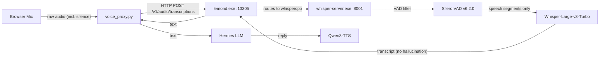

# Silero VAD for Whisper STT Anti-Hallucination

**Date:** 2026-08-24
**Status:** Design (pending user approval)
**Scope:** Fix Whisper STT hallucination on silent audio by enabling Silero VAD on the lemonade whisper-server.

---

## 1. Problem

whisper.cpp with the Whisper-Large-v3-Turbo model hallucinates text on silent audio — even on Vulkan dGPU (7900 XTX) with full-precision weights. Confirmed with evidence: 2 seconds of pure silence → `'Thank you.'`.

The hallucinated text cascades through the voice pipeline:
1. **STT hallucinates** ("Thank you." on silence, garbled text on real speech)
2. **LLM receives unreadable prompt** → generates nonsense
3. **TTS speaks the nonsense** → "gabbled" replies

The old Hermes faster-whisper path was stable because faster-whisper has built-in VAD (Voice Activity Detection) that filters silence before the model sees it. The lemonade whisper.cpp path had no VAD — `voice_proxy.py` forwarded raw browser audio (including silence) to lemonade, and the `_HermesStream` in `dictation.py` sent accumulated audio on endpoint detection (which includes the silence that triggered the endpoint).

### What was ruled out

- **NPU int8 encoder cache** — the earlier theory (from repo memory) was wrong. The `whispercpp.backend=vulkan` config correctly uses the Vulkan whisper-server with the ggml model file, not the NPU int8 cache. The hallucination persists even on pure Vulkan.
- **whisper.cpp anti-hallucination flags** — `--no-speech-thold 0.8`, `--entropy-thold 1.5`, `--max-context 0` were tested and did **not** suppress the "Thank you." hallucination. The turbo model's language-model prior is too strong for these thresholds alone.

## 2. Fix

Enable **Silero VAD v6.2.0** on the whisper-server via lemonade's `whispercpp.args` config. The VAD model filters silence/noise before the Whisper encoder sees it, preventing the hallucination.

**Verified working:** After enabling VAD, 2 seconds of silence → `''` (empty text). The whisper-server runs with `--vad --vad-model <path> --vad-threshold 0.6`.

## 3. Components

### 3.1 VAD model file

- **File:** `ggml-silero-v6.2.0.bin` (885 KB)
- **Source:** `https://huggingface.co/ggml-org/whisper-vad/resolve/main/ggml-silero-v6.2.0.bin`
- **Location:** `~/.cache/lemonade/models/ggml-silero-v6.2.0.bin` (lemonade's standard models directory — portable across machines and lemonade installs)
- **Format:** ggml (whisper.cpp's native format, converted from Silero VAD v6.2.0 via `convert-silero-vad-to-ggml.py`)

### 3.2 Lemonade config

`whispercpp.args` set to:
```
--vad --vad-model <models_dir>/ggml-silero-v6.2.0.bin --vad-threshold 0.6
```

Where `<models_dir>` is lemonade's standard models directory:
- **Windows:** `%USERPROFILE%\.cache\lemonade\models\`
- **Linux:** `~/.cache/lemonade/models/`

This persists in lemonade's `config.json` and applies to all whispercpp model loads. The config is set via:
```
lemonade config set whispercpp.args=--vad --vad-model <path> --vad-threshold 0.6
```

### 3.3 agent-meow `service_supervisor.py`

**No changes needed.** The `_spawn_lemonade()` method (already fixed to launch `lemond.exe`) just starts `lemond.exe --port 13305`. Lemonade reads its own `config.json` (including the `whispercpp.args` with VAD flags) on startup. The supervisor doesn't need to know about VAD.

### 3.4 Bootstrap wizard (desktop `.exe` packaging)

The first-run wizard's "Install Voice Stack" step adds one download:
- `ggml-silero-v6.2.0.bin` (885 KB — negligible) → `%LOCALAPPDATA%\lemonade_server\models\`

The wizard then sets `whispercpp.args` in lemonade's config before the first model load.

### 3.5 What does NOT change

- `voice_proxy.py` — no changes. It already routes to lemonade over HTTP. VAD filtering happens inside the whisper-server.
- `dictation.py` — no changes. The `_HermesStream` endpoint detector still works the same; it just gets cleaner transcripts back.
- `stack_status.py` — no changes. The health check already probes lemonade's model list.
- `voice_proxy.py` model injection — no changes. The `_inject_model_into_multipart` still adds the `model` field for lemonade.

## 4. Data Flow



The VAD filter sits between the raw audio input and the Whisper encoder. Silence and noise are filtered out before Whisper sees them, so the encoder never produces the spurious activations that trigger the "Thank you." hallucination.

## 5. Testing

### 5.1 Regression test

A unit test that sends 2 seconds of silence to the STT endpoint and asserts the response text is empty. This catches any future regression where VAD is disabled or misconfigured.

### 5.2 Manual verification

1. Send silence → confirm empty text (no "Thank you.")
2. Speak a real phrase → confirm accurate transcription
3. Speak Chinese → confirm tonal accuracy is preserved

## 6. VAD Threshold Tuning

The `--vad-threshold 0.6` (default 0.5, raised to 0.6 for slightly more aggressive silence filtering) controls how aggressive the VAD is at distinguishing speech from silence:

- **0.5** (default) — balanced; may let some quiet speech through
- **0.6** (chosen) — slightly more aggressive; better at filtering background noise
- **0.8** — very aggressive; may clip quiet speech

The threshold is configurable via `whispercpp.args` and can be tuned without code changes.

## 7. Risks

- **VAD model file missing** — if the VAD model file is deleted or not downloaded, the whisper-server will fail to start with `--vad`. The supervisor's crash-restart will kick in, but the service will be degraded. The wizard must ensure the file exists before setting the config.
- **VAD too aggressive** — if `--vad-threshold` is too high, quiet speech may be clipped. The default 0.6 is conservative; can be lowered to 0.5 if speech is being cut.
- **Lemonade config reset** — if lemonade is reinstalled or `config.json` is reset, the VAD args will be lost. The wizard and/or supervisor should verify the config on startup.
