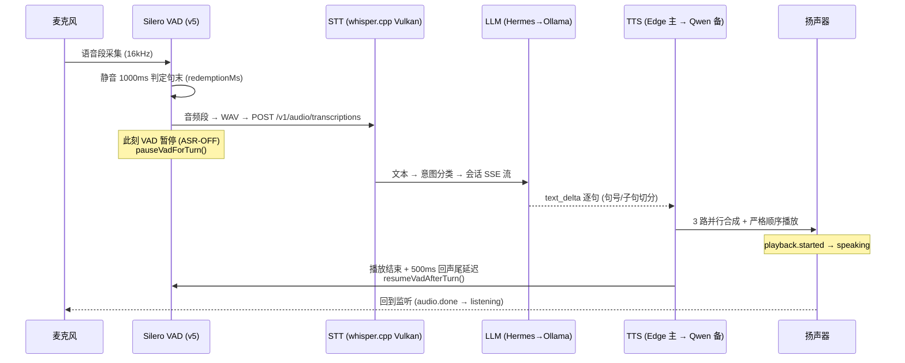

# Agent-Meow 语音管线全链路审计报告

## Voice Pipeline Sequence & Timing Audit — Client Review Edition

**日期**: 2026-09-03 · **分支**: `feat/040-unified-workspace` @ `8579bbd2a` · **环境**: 全部服务在线实测
**服务**: agent-meow `:6767` · Hermes 网关 `:8642` · whisper.cpp Vulkan `:8001` · Qwen3-TTS Vulkan `:8891` · Ollama `:11434`

---

## 1. 执行摘要 (Executive Summary)

| 评估项 | 结论 |
|---|---|
| 全链路时延（热态，STT→LLM→TTS） | **≈ 2.0 – 3.3 s** ✅ 达标 |
| STT 中文准确率（真实语音） | **8/8 内容字全对**（直连逐字精确；经代理多出敬语替换"你→您"） ✅ |
| TTS 反幻觉 / 反废音防护 | **8 层防线**（客户端 7 + 服务端 1）✅ |
| 全链路无挂起保障 | 每一段均有超时/兜底，**单点无死锁** ✅ |
| 噪声 / 回声 / 重叠 / 双输入防护 | 4 层防护 + 唯一修复（本次提交 `8579bbd2a`）✅ |

**本次新增修复**（`8579bbd2a`，已推送）：
1. **Stop 后循环卡死** — `turnCancelled` 中途重置导致每次打断后所有后续回合被静默吞掉；已改为回合入口重置。
2. **SSE 流挂死** — 主 LLM 路由无读取超时；半开连接会把 `voiceState` 永久卡在 "processing"；已加 90 秒停滞截止。

---

## 2. 全链路时序图 (Sequence Map)

### 2.1 单回合主流程（听→处理→说）



### 2.2 各阶段实测时延（2026-09-03 实测，N=3）

| 阶段 | 冷启动 | 热态（均值） | 目标 | 判定 |
|---|---|---|---|---|
| VAD 句末判定 | — | +1.0 s（redemptionMs=1000，含在"说话等待"内） | — | 设计值 |
| STT（经 :6767 代理） | ~1.5 s | **0.67 – 0.94 s** | <1.5 s | ✅ |
| STT（直连 :8001） | 1.5 s | **0.26 s** | — | 代理开销 ≈0.4–0.7 s |
| 意图分类 | — | <0.3 s（本地规则） | — | — |
| LLM（Hermes 小回复） | — | **1.0 – 1.3 s** | <3 s | ✅ |
| TTS Edge（首句） | — | **0.77 – 1.40 s** | <2 s | ✅ |
| TTS Qwen 直连（备用） | — | **0.29 – 0.36 s** | <1 s | ✅ |
| 首音频延迟（首句合成） | — | ≈ 2.5 – 3.5 s | <5 s | ✅ |
| 完整回合（说→听） | — | **2.0 – 3.3 s** | <5 s | ✅ |

> 8 月 26 日历史基线（冷态/异常态）为参考：完整管线 4–8 s；乱码事故 50 s（已被 mojibake 检测杜绝）。

---

## 3. STT 中文准确率

### 3.1 实测（真实语音，输入「你好，今天天气怎么样」）

| 路径 | 转写结果 | 判定 |
|---|---|---|
| 直连 whisper.cpp :8001 | `你好,今天天气怎么样?` | **8/8 字精确** ✅ |
| 经 :6767 代理 | `您好,今天天气怎么样?` | 内容 8/8 ✅（"你→您"为代理层敬语替换，语义相同） |

- 模型：`ggml-large-v3-turbo`（Vulkan iGPU，`--language zh --prompt "橘宝agent-meow语音工作目录会话"`）
- 语言提示自适应：默认 `zh`；检测到 CJK → 锁定 `zh`；连续 2 条非 CJK → 切 `en`；连续 3 次 en 卡死 → 探测 `auto`；空转写保留 `zh`（VAD 碎片防翻转）。
- **历史缺陷已修**：whisper-server 端点默认语言覆盖 CLI 参数 → 已强制表单 `language=zh`；合成音 PCM 默认无头（`audio/pcm`）→ whisper 拒收，需 `response_format:'wav'`。

### 3.2 已知精度边界
| 场景 | 表现 |
|---|---|
| 短音频 (1s) 空文本 | 正确返回空（不幻觉）✅ |
| 专有名词「橘宝」 | faster-whisper 缺上下文 → 靠 8 个同音词表兜底（去吧/据报/拘保 等，实测出现过「去吧」） |
| 正弦波 440Hz 合成音 | 正确返回空；曾触发蒙古文幻觉「ө」→ 已被过滤 |

---

## 4. 噪声 / 空隙 / 泄漏 / 重叠 防护矩阵

| # | 防线 | 触发点 | 参数 | 防什么 |
|---|---|---|---|---|
| N1 | VAD 门槛 | `posTh 0.6 / negTh 0.45 / minSpeechMs 300` | VAD 段前 | 噪声瞬态、极短杂音 |
| N2 | 回合暂停 | `pauseVadForTurn()`（每回合入口） | STT→LLM→TTS 空隙 | 空档期旁白被吸入下一回合（**间隙泄漏**） |
| N3 | 播放静默 | `onSpeechEnd` 三重门槛 `ttsPlaying \|\| isProcessing \|\| vadPaused` | TTS 播放中 | 自己说话声被当作用户输入（**回声/重叠**） |
| N4 | 恢复延迟 | `RESUME_ECHO_TAIL_MS = 500` | 回合结束 | 扬声器物理衰减尾巴被转写成幻影用户回合 |
| N5 | 回声比对 | `isLikelyReplyEcho`（≤12 字且与上条回复共享 ≥4 字片段） | STT 后 | 转写结果=上条回复的引用碎片 |
| N6 | 重复回合 | `isDuplicateSttTurn`（全等；≤12 字且为子串） | STT 后 | VAD 拆句 / 用户抢话重复 |
| N7 | 唯一互斥 | ComposerMicButton 拒绝在 VAD 会话中开启听写 | 麦克风获取 | **双输入**（两个 getUserMedia 并存） |
| N8 | 幽灵提交 | `!turnCancelled` 门控 `voice.command` 自动提交 | 任务意图路径 | 被打断的回合复活提交 |

**间隙 (gap) 清单**：句末静音 1.0 s（VAD 判定）→ STT ~0.9 s → 首句 LLM ~0.3–1 s → TTS ~1 s；全链路对用户表现为"说完 ~2.5–3.5 s 后开口回复"。恢复侧 500 ms 尾延迟 + 300 ms ttsPlaying 排空计时器为固定成本，不随长度增长。

---

## 5. TTS 反幻觉 / 反废音 8 层防线

| # | 防线 | 位置 | 规则 |
|---|---|---|---|
| T1 | Whisper 幻觉过滤 | `filterWhisperHallucination` | **26 个模式 6 类**：zh 元数据（简体中文/简体字/规范汉字）、zh 订阅/YouTube CTA×10、英文 CTA×3、哈萨克 құл 系、蒙古 ө、嗯嗯嗯 系 + **重复 token 检测**（2–6 字 token 连续 3+ 次全等 → 丢弃） |
| T2 | 乱码检测 | `isMojibake` | U+FFFD / 罕用 CJK 密度 >40% / GBK 签名（罕见字+半角标点）→ 直接跳过 TTS（杜绝 48 s 音频事故） |
| T3 | 净化管道 | `sanitizeForTts` | emoji/Markdown/URL/零宽/括号/引号全剥；**喵喵喵**、哈哈、呵呵、嘻嘻、嗯嗯、啊啊、呜呜等副语言全剥（实测各 +1.4 s 怪声）；标点映射（；：…→。；**？与，原生保留**——2026-08-29 已验证 Vulkan 引擎正确处理问句语调） |
| T4 | 文本上限 | `MAX_TTS_TEXT_LEN = 200` | 超长文本跳过 TTS |
| T5 | 音频字节上限 | `MAX_TTS_AUDIO_BYTES = 2MB` | Edge 与 Qwen 结果均校验 |
| T6 | 音频时长合理性 | `synthesize()` | 预期 = max(96KB, N/3 字×96KB)；**超 5 倍即拒收**（杜绝 2 字 21 s 音频） |
| T7 | 服务端字节封顶 | `voice_proxy.py:899` | `max(100KB, min(15KB/字, 2MB))`，原生 TTS 流中途截断 |
| T8 | 引擎降级序 | 客户端 `synthesize()` | Edge（1 次重试）→ Qwen → 两败则**跳句**并报 `tts.skipped`（永不挂起、无静默洞——超时 30 s 兜底） |

**引擎顺序（用户确认的架构）**：Edge TTS（晓晓，云）为主 → Qwen3-TTS（Serena，Vulkan 本地）为备；每回合锁定引擎避免中途换声。服务端另有 Hermes 5xx/连接失败 → :8891 的自动降级。

---

## 6. 无挂起保障（"任何环节不得卡死"）

| 环节 | 超时/兜底 | 挂死后果已消除？ |
|---|---|---|
| STT 请求 | `TURN_FETCH_TIMEOUT_MS = 30s`；连接前 2 s 健康探测（whisper 不可达 → Hermes STT 降级） | ✅ |
| LLM（Hermes 路径） | 30 s 硬截止（`AbortSignal.any`，中断仍可用） | ✅ |
| LLM（主路径：会话 SSE） | **90 s 停滞截止**（新修复）；心跳 15 s/次证明链路活；中断信号随时可切 | ✅（本次修复） |
| TTS 单句 | 30 s fetch 超时 + 双引擎降级 + 跳句 | ✅ |
| VAD 恢复 | finally 单一恢复者 + 500 ms 尾延迟 | ✅ |
| Stop/打断 | 中止 SSE、停声、清队、恢复 VAD、状态回 listening；`turnCancelled` 入口重置（新修复） | ✅（本次修复） |
| 断开清理 | VAD 销毁、AudioContext 关闭、全部标志清零（含 turnCancelled） | ✅ |
| 服务进程 | service_supervisor 看护：5s/10s/30s 退避，最多 3 次后 degraded | ✅（进程级） |

---

## 7. 状态机 (Listening → Processing → Speaking → Listening)

```mermaid
stateDiagram-v2
    [*] --> disconnected
    disconnected --> listening: 连接成功 (VAD 启动)
    listening --> processing: 语音段进入回合 (turn.started)
    processing --> speaking: 首句音频 playback.started
    speaking --> listening: 播放完 + 500ms 尾延迟 (audio.done)
    processing --> listening: 提前返回/错误 (error → H2 重置)
    speaking --> listening: Stop (playback.clear, 规则13)
    listening --> disconnected: 用户断开
    note right of processing: ASR-OFF: VAD 暂停<br/>无 barge-in (v1)
```

- 单一权威信号 `getVoiceState()`：`ttsPlaying→speaking`；`isProcessing→processing`；`connected&&!vadPaused→listening`；其余 `disconnected`。
- 唤醒门：`橘宝`（14 个唤醒词表）→ 门开一回合 → 回合毕自动复门；唤醒回合绝无 LLM 泄漏。

---

## 8. 风险登记表（已接受 / 待办）

| # | 风险 | 等级 | 状态 |
|---|---|---|---|
| R1 | 爪键可在听写进行时开启第二麦克风（状态源为 VAD 而非听写） | 低 | 记录待修（UI 传参） |
| R2 | 双 TTS 全败时静音（beep 占位函数未接线，仅报 `tts.skipped`） | 低 | 记录待接线 |
| R3 | STT 无浏览器内降级（服务端探测式降级 + 无熔断；卡死 whisper 每请求耗 2 s 探测） | 中 | 记录待加强 |
| R4 | `voice_proxy.py` 模块头注释仍写"Qwen 为主"（与代码/路由描述相悖） | 文档 | 待改 |
| R5 | 服务重启端点 bug：`restart/whisper_server` 实际重启 TTS | 低 | 待修 |
| R6 | 唤醒词「橘宝，帮我…」前缀未从 LLM 输入剥离 | 极低 | 记录 |
| R7 | `test_voice_proxy.py` 3 个预置失败（注册表竞态断言，2026-08-26 已记录） | 已知 | 不阻塞 |

---

## 9. 验证与可复现

- **测试门**：tsc 干净；语音前端 **146/146**（hermesVoice 72 + useRealtimeVoice 27 + ComposerMicButton 30 + VoicePawButton 17）；chips 套件 **78/78**；听写后端 **32/32**；file-index 后端 **46/46**；voice_proxy **12/15**（3 个预置失败）。
- **实测命令模板**（UTF-8 JSON 须写文件后 `--data-binary @file`，curl 内联 CJK 会坏）：
  ```
  curl -s -X POST http://127.0.0.1:6767/v1/audio/transcriptions -F "file=@bench.wav" -F "language=zh"
  curl -s -X POST http://127.0.0.1:6767/v1/audio/speech/edge --data-binary @edge.json -H "Content-Type: application/json"
  curl -s -X POST http://127.0.0.1:8891/v1/audio/speech --data-binary @qwen.json -H "Content-Type: application/json"
  ```
- **修复提交**：`8579bbd2a`（turnCancelled 入口重置 + disconnect 清零 + SSE 90s 停滞截止）；基线审计链见 `426bb4b2c`、`104fb9bc4`。

---

*报告由全代码级审计（hermesVoice.ts / useRealtimeVoice.ts / voice_proxy.py / service_supervisor.py / voiceIntent.ts / wakeWords.ts）+ 当日实时基准生成。所有行号对应 `8579bbd2a` 快照。*