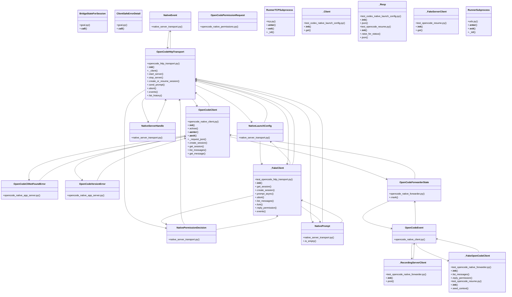

# App Server Goals

> 581 nodes · cohesion 0.01

## Key Concepts

- [.aclose()](file:///C:/Users/1/github-pr/agent-meow/tests/runner/test_runner_entry.py#L84) (155 connections)
- [OpenCodeClient](file:///C:/Users/1/github-pr/agent-meow/agent_meow/opencode_native_client.py#L123) (119 connections)
- [OpenCodeEvent](file:///C:/Users/1/github-pr/agent-meow/agent_meow/opencode_native_client.py#L81) (78 connections)
- [NativePrompt](file:///C:/Users/1/github-pr/agent-meow/agent_meow/native_server_transport.py#L62) (57 connections)
- [test_opencode_native_forwarder.py](file:///C:/Users/1/github-pr/agent-meow/tests/test_opencode_native_forwarder.py#L1) (41 connections)
- [_FakeOpenCodeClient](file:///C:/Users/1/github-pr/agent-meow/tests/test_opencode_native_forwarder.py#L26) (41 connections)
- [_RecordingServerClient](file:///C:/Users/1/github-pr/agent-meow/tests/test_opencode_native_forwarder.py#L15) (41 connections)
- [.handle_event()](file:///C:/Users/1/github-pr/agent-meow/agent_meow/runner/codex/goal.py#L275) (40 connections)
- [test_sessions_namespace.py](file:///C:/Users/1/github-pr/agent-meow/tests/frontends/sdk/test_sessions_namespace.py#L1) (37 connections)
- [OpenCodeHttpTransport](file:///C:/Users/1/github-pr/agent-meow/agent_meow/opencode_http_transport.py#L126) (37 connections)
- [RunnerTCPSubprocess](file:///C:/Users/1/github-pr/agent-meow/agent_meow/runner/transports/tcp.py#L54) (37 connections)
- [_forwarder()](file:///C:/Users/1/github-pr/agent-meow/tests/test_opencode_native_forwarder.py#L41) (37 connections)
- [_event()](file:///C:/Users/1/github-pr/agent-meow/tests/test_opencode_native_forwarder.py#L55) (33 connections)
- [_make_namespace()](file:///C:/Users/1/github-pr/agent-meow/tests/frontends/sdk/test_sessions_namespace.py#L56) (33 connections)
- [RunnerSubprocess](file:///C:/Users/1/github-pr/agent-meow/agent_meow/runner/transports/uds.py#L62) (32 connections)
- [test_opencode_native_client.py](file:///C:/Users/1/github-pr/agent-meow/tests/test_opencode_native_client.py#L1) (30 connections)
- [_client()](file:///C:/Users/1/github-pr/agent-meow/tests/test_opencode_native_client.py#L21) (30 connections)
- [_FakeClient](file:///C:/Users/1/github-pr/agent-meow/tests/test_opencode_http_transport.py#L70) (26 connections)
- [NativeLaunchConfig](file:///C:/Users/1/github-pr/agent-meow/agent_meow/native_server_transport.py#L21) (24 connections)
- [NativePermissionDecision](file:///C:/Users/1/github-pr/agent-meow/agent_meow/native_server_transport.py#L102) (24 connections)
- [test_opencode_native_app_server.py](file:///C:/Users/1/github-pr/agent-meow/tests/test_opencode_native_app_server.py#L1) (23 connections)
- [jsonResponse()](file:///C:/Users/1/github-pr/agent-meow/web/src/pages/ApprovePage.test.tsx#L21) (21 connections)
- [NativeEvent](file:///C:/Users/1/github-pr/agent-meow/agent_meow/native_server_transport.py#L85) (21 connections)
- [NativeServerHandle](file:///C:/Users/1/github-pr/agent-meow/agent_meow/native_server_transport.py#L45) (21 connections)
- [htmlCommentBridge.test.ts](file:///C:/Users/1/github-pr/agent-meow/web/src/shell/htmlCommentBridge.test.ts#L1) (20 connections)
- *... and 556 more nodes in this community*

## Class Diagram

## Relationships

- [[Community 1]] (40 shared connections)
- [[Auth Config]] (29 shared connections)
- [[Community 6]] (20 shared connections)
- [[Community 8]] (17 shared connections)
- [[Community 3]] (10 shared connections)
- [[Community 2]] (6 shared connections)

## Source Files

- [C:\Users\1\github-pr\agent-meow\agent_meow\inner\opencode_native_executor.py](file:///C:/Users/1/github-pr/agent-meow/agent_meow/inner/opencode_native_executor.py)
- [C:\Users\1\github-pr\agent-meow\agent_meow\native_server_transport.py](file:///C:/Users/1/github-pr/agent-meow/agent_meow/native_server_transport.py)
- [C:\Users\1\github-pr\agent-meow\agent_meow\opencode_http_transport.py](file:///C:/Users/1/github-pr/agent-meow/agent_meow/opencode_http_transport.py)
- [C:\Users\1\github-pr\agent-meow\agent_meow\opencode_native_app_server.py](file:///C:/Users/1/github-pr/agent-meow/agent_meow/opencode_native_app_server.py)
- [C:\Users\1\github-pr\agent-meow\agent_meow\opencode_native_client.py](file:///C:/Users/1/github-pr/agent-meow/agent_meow/opencode_native_client.py)
- [C:\Users\1\github-pr\agent-meow\agent_meow\opencode_native_forwarder.py](file:///C:/Users/1/github-pr/agent-meow/agent_meow/opencode_native_forwarder.py)
- [C:\Users\1\github-pr\agent-meow\agent_meow\opencode_native_permissions.py](file:///C:/Users/1/github-pr/agent-meow/agent_meow/opencode_native_permissions.py)
- [C:\Users\1\github-pr\agent-meow\agent_meow\runner\app.py](file:///C:/Users/1/github-pr/agent-meow/agent_meow/runner/app.py)
- [C:\Users\1\github-pr\agent-meow\agent_meow\runner\codex\goal.py](file:///C:/Users/1/github-pr/agent-meow/agent_meow/runner/codex/goal.py)
- [C:\Users\1\github-pr\agent-meow\agent_meow\runner\transports\tcp.py](file:///C:/Users/1/github-pr/agent-meow/agent_meow/runner/transports/tcp.py)
- [C:\Users\1\github-pr\agent-meow\agent_meow\runner\transports\uds.py](file:///C:/Users/1/github-pr/agent-meow/agent_meow/runner/transports/uds.py)
- [C:\Users\1\github-pr\agent-meow\tests\e2e\test_opencode_native_wire_contract_e2e.py](file:///C:/Users/1/github-pr/agent-meow/tests/e2e/test_opencode_native_wire_contract_e2e.py)
- [C:\Users\1\github-pr\agent-meow\tests\frontends\sdk\test_sessions_chat.py](file:///C:/Users/1/github-pr/agent-meow/tests/frontends/sdk/test_sessions_chat.py)
- [C:\Users\1\github-pr\agent-meow\tests\frontends\sdk\test_sessions_namespace.py](file:///C:/Users/1/github-pr/agent-meow/tests/frontends/sdk/test_sessions_namespace.py)
- [C:\Users\1\github-pr\agent-meow\tests\inner\test_seccomp.py](file:///C:/Users/1/github-pr/agent-meow/tests/inner/test_seccomp.py)
- [C:\Users\1\github-pr\agent-meow\tests\repl\test_repl_fork_command.py](file:///C:/Users/1/github-pr/agent-meow/tests/repl/test_repl_fork_command.py)
- [C:\Users\1\github-pr\agent-meow\tests\repl\test_subagent_chat.py](file:///C:/Users/1/github-pr/agent-meow/tests/repl/test_subagent_chat.py)
- [C:\Users\1\github-pr\agent-meow\tests\repl\test_subagent_registry.py](file:///C:/Users/1/github-pr/agent-meow/tests/repl/test_subagent_registry.py)
- [C:\Users\1\github-pr\agent-meow\tests\runner\test_app_sessions_native.py](file:///C:/Users/1/github-pr/agent-meow/tests/runner/test_app_sessions_native.py)
- [C:\Users\1\github-pr\agent-meow\tests\runner\test_codex_native_launch_config.py](file:///C:/Users/1/github-pr/agent-meow/tests/runner/test_codex_native_launch_config.py)

## Audit Trail

- EXTRACTED: 1801 (54%)
- INFERRED: 1536 (46%)
- AMBIGUOUS: 0 (0%)

---

*Part of the graphify knowledge wiki. See [[index]] to navigate.*