# Community 10

> 2010 nodes · cohesion 0.00

## Key Concepts

- [.invoke()](file:///C:/Users/1/github-pr/agent-meow/agent_meow/tools/client_specified/__init__.py#L95) (366 connections)
- [cli.py](file:///C:/Users/1/github-pr/agent-meow/agent_meow/cli.py#L1) (265 connections)
- [test_cli.py](file:///C:/Users/1/github-pr/agent-meow/tests/cli/test_cli.py#L1) (177 connections)
- [LocalServerStartup](file:///C:/Users/1/github-pr/agent-meow/agent_meow/host/local_server.py#L411) (132 connections)
- [HermesConfigSummary](file:///C:/Users/1/github-pr/agent-meow/agent_meow/onboarding/hermes_auth.py#L49) (115 connections)
- [GooseConfigSummary](file:///C:/Users/1/github-pr/agent-meow/agent_meow/onboarding/goose_auth.py#L99) (106 connections)
- [OpenCodeAuthSummary](file:///C:/Users/1/github-pr/agent-meow/agent_meow/onboarding/opencode_auth.py#L97) (106 connections)
- [select()](file:///C:/Users/1/github-pr/agent-meow/web/src/shell/WorkspacePathField.tsx#L205) (104 connections)
- [test_configure_models.py](file:///C:/Users/1/github-pr/agent-meow/tests/cli/test_configure_models.py#L1) (100 connections)
- [test_backend.py](file:///C:/Users/1/github-pr/agent-meow/tests/cli/test_backend.py#L1) (84 connections)
- [fail()](file:///C:/Users/1/github-pr/agent-meow/agent_meow/server/static/web-ui/assets/index-D0w-K1tO.js#L92) (62 connections)
- [load_providers()](file:///C:/Users/1/github-pr/agent-meow/agent_meow/onboarding/provider_config.py#L934) (62 connections)
- [LocalServerInfo](file:///C:/Users/1/github-pr/agent-meow/agent_meow/host/local_server.py#L367) (55 connections)
- [_configure_harness_add()](file:///C:/Users/1/github-pr/agent-meow/agent_meow/cli.py#L8458) (53 connections)
- [_save_global_config()](file:///C:/Users/1/github-pr/agent-meow/agent_meow/cli.py#L649) (48 connections)
- [_config_yaml()](file:///C:/Users/1/github-pr/agent-meow/tests/cli/test_configure_models.py#L134) (46 connections)
- [test_harness_install.py](file:///C:/Users/1/github-pr/agent-meow/tests/onboarding/test_harness_install.py#L1) (38 connections)
- [test_login_databricks.py](file:///C:/Users/1/github-pr/agent-meow/tests/cli/test_login_databricks.py#L1) (36 connections)
- [_load_global_config()](file:///C:/Users/1/github-pr/agent-meow/agent_meow/cli.py#L342) (36 connections)
- [WorkspacePicker.tsx](file:///C:/Users/1/github-pr/agent-meow/web/src/shell/WorkspacePicker.tsx#L1) (35 connections)
- [test_local_server.py](file:///C:/Users/1/github-pr/agent-meow/tests/host/test_local_server.py#L1) (34 connections)
- [SubagentsPanel.tsx](file:///C:/Users/1/github-pr/agent-meow/web/src/shell/SubagentsPanel.tsx#L1) (33 connections)
- [effective_config_with_detected()](file:///C:/Users/1/github-pr/agent-meow/agent_meow/onboarding/detected.py#L280) (32 connections)
- [default_provider_for_harness()](file:///C:/Users/1/github-pr/agent-meow/agent_meow/onboarding/provider_config.py#L1134) (32 connections)
- [test_provider_config.py](file:///C:/Users/1/github-pr/agent-meow/tests/onboarding/test_provider_config.py#L1) (31 connections)
- *... and 1985 more nodes in this community*

## Class Diagram

```mermaid
classDiagram
    class NativeCodexLaunch {
        +codex_native_app_server.py()
    }
    class GooseConfigSummary {
        +goose_auth.py()
    }
    class HermesConfigSummary {
        +hermes_auth.py()
        +.describe()
    }
    class LocalServerInfo {
        +local_server.py()
    }
    class LocalServerStartup {
        +local_server.py()
    }
    class _SpawnedLocalServer {
        +local_server.py()
    }
    class OpenCodeAuthSummary {
        +opencode_auth.py()
        +.describe()
    }
    class _Actions {
        +setup.py()
    }
    class ProfileSpec {
        +setup.py()
    }
    class _Proc {
        +test_backend.py()
        +.__init__()
    }
    class _SpawnedDaemon {
        +test_cli_host.py()
    }
    class _FakeHealthResp {
        +test_local_server.py()
        +.__init__()
        +.json()
    }
    class _FakeHttpx {
        +test_login_databricks.py()
        +.get()
    }
    class _LoginRecorder {
        +test_setup.py()
        +.__init__()
        +.__call__()
    }
    class _RecordedRun {
        +test_setup.py()
        +.__init__()
        +.__call__()
    }
    LocalServerStartup --> _Proc
    LocalServerStartup --> _SpawnedDaemon
    ProfileSpec --> _RecordedRun
    ProfileSpec --> _LoginRecorder
    _Proc --> LocalServerStartup
    _SpawnedDaemon --> LocalServerStartup
    _LoginRecorder --> ProfileSpec
    _RecordedRun --> ProfileSpec
```

## Relationships

- [[Community 4]] (221 shared connections)
- [[Community 3]] (43 shared connections)
- [[Auth Config]] (12 shared connections)
- [[Community 9]] (3 shared connections)
- [[Community 1]] (1 shared connections)

## Source Files

- [C:\Users\1\github-pr\agent-meow\agent_meow\cli.py](file:///C:/Users/1/github-pr/agent-meow/agent_meow/cli.py)
- [C:\Users\1\github-pr\agent-meow\agent_meow\codex_native_app_server.py](file:///C:/Users/1/github-pr/agent-meow/agent_meow/codex_native_app_server.py)
- [C:\Users\1\github-pr\agent-meow\agent_meow\conversation_browser.py](file:///C:/Users/1/github-pr/agent-meow/agent_meow/conversation_browser.py)
- [C:\Users\1\github-pr\agent-meow\agent_meow\host\_daemon_entry.py](file:///C:/Users/1/github-pr/agent-meow/agent_meow/host/_daemon_entry.py)
- [C:\Users\1\github-pr\agent-meow\agent_meow\host\local_server.py](file:///C:/Users/1/github-pr/agent-meow/agent_meow/host/local_server.py)
- [C:\Users\1\github-pr\agent-meow\agent_meow\onboarding\antigravity_auth.py](file:///C:/Users/1/github-pr/agent-meow/agent_meow/onboarding/antigravity_auth.py)
- [C:\Users\1\github-pr\agent-meow\agent_meow\onboarding\configure_models.py](file:///C:/Users/1/github-pr/agent-meow/agent_meow/onboarding/configure_models.py)
- [C:\Users\1\github-pr\agent-meow\agent_meow\onboarding\copilot_auth.py](file:///C:/Users/1/github-pr/agent-meow/agent_meow/onboarding/copilot_auth.py)
- [C:\Users\1\github-pr\agent-meow\agent_meow\onboarding\cursor_auth.py](file:///C:/Users/1/github-pr/agent-meow/agent_meow/onboarding/cursor_auth.py)
- [C:\Users\1\github-pr\agent-meow\agent_meow\onboarding\databricks_config.py](file:///C:/Users/1/github-pr/agent-meow/agent_meow/onboarding/databricks_config.py)
- [C:\Users\1\github-pr\agent-meow\agent_meow\onboarding\detected.py](file:///C:/Users/1/github-pr/agent-meow/agent_meow/onboarding/detected.py)
- [C:\Users\1\github-pr\agent-meow\agent_meow\onboarding\goose_auth.py](file:///C:/Users/1/github-pr/agent-meow/agent_meow/onboarding/goose_auth.py)
- [C:\Users\1\github-pr\agent-meow\agent_meow\onboarding\harness_install.py](file:///C:/Users/1/github-pr/agent-meow/agent_meow/onboarding/harness_install.py)
- [C:\Users\1\github-pr\agent-meow\agent_meow\onboarding\hermes_auth.py](file:///C:/Users/1/github-pr/agent-meow/agent_meow/onboarding/hermes_auth.py)
- [C:\Users\1\github-pr\agent-meow\agent_meow\onboarding\opencode_auth.py](file:///C:/Users/1/github-pr/agent-meow/agent_meow/onboarding/opencode_auth.py)
- [C:\Users\1\github-pr\agent-meow\agent_meow\onboarding\provider_config.py](file:///C:/Users/1/github-pr/agent-meow/agent_meow/onboarding/provider_config.py)
- [C:\Users\1\github-pr\agent-meow\agent_meow\onboarding\setup.py](file:///C:/Users/1/github-pr/agent-meow/agent_meow/onboarding/setup.py)
- [C:\Users\1\github-pr\agent-meow\agent_meow\onboarding\ucode_setup.py](file:///C:/Users/1/github-pr/agent-meow/agent_meow/onboarding/ucode_setup.py)
- [C:\Users\1\github-pr\agent-meow\agent_meow\pi_native_bridge.py](file:///C:/Users/1/github-pr/agent-meow/agent_meow/pi_native_bridge.py)
- [C:\Users\1\github-pr\agent-meow\agent_meow\server\static\web-ui\assets\index-D0w-K1tO.js](file:///C:/Users/1/github-pr/agent-meow/agent_meow/server/static/web-ui/assets/index-D0w-K1tO.js)

## Audit Trail

- EXTRACTED: 6033 (56%)
- INFERRED: 4739 (44%)
- AMBIGUOUS: 0 (0%)

---

*Part of the graphify knowledge wiki. See [[index]] to navigate.*