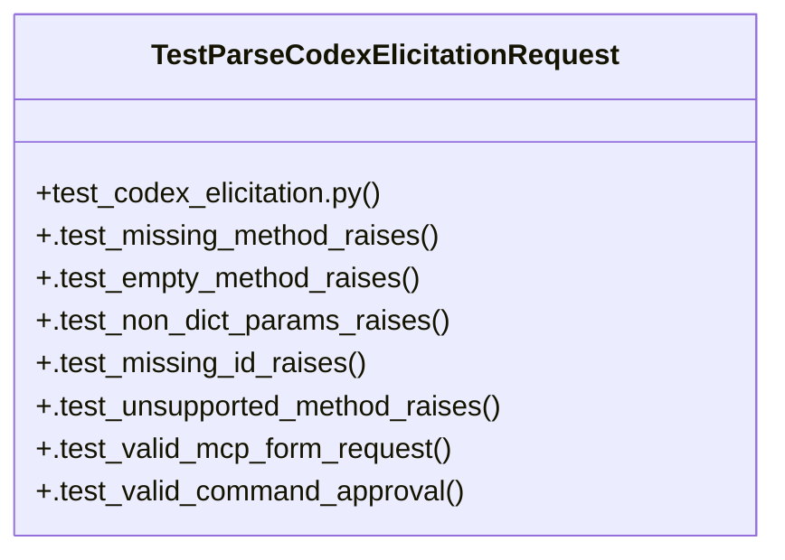

# Community 102

> 14 nodes · cohesion 0.21

## Key Concepts

- [parse_codex_elicitation_request()](file:///C:/Users/1/github-pr/agent-meow/agent_meow/server/routes/_codex_elicitation.py#L71) (14 connections)
- [TestParseCodexElicitationRequest](file:///C:/Users/1/github-pr/agent-meow/tests/server/routes/test_codex_elicitation.py#L22) (10 connections)
- [is_codex_request_id()](file:///C:/Users/1/github-pr/agent-meow/agent_meow/codex_native_elicitation.py#L12) (4 connections)
- [codex_native_elicitation.py](file:///C:/Users/1/github-pr/agent-meow/agent_meow/codex_native_elicitation.py#L1) (3 connections)
- [Tests for the top-level request parser.](file:///C:/Users/1/github-pr/agent-meow/tests/server/routes/test_codex_elicitation.py#L23) (2 connections)
- [.test_empty_method_raises()](file:///C:/Users/1/github-pr/agent-meow/tests/server/routes/test_codex_elicitation.py#L29) (2 connections)
- [.test_missing_id_raises()](file:///C:/Users/1/github-pr/agent-meow/tests/server/routes/test_codex_elicitation.py#L39) (2 connections)
- [.test_missing_method_raises()](file:///C:/Users/1/github-pr/agent-meow/tests/server/routes/test_codex_elicitation.py#L25) (2 connections)
- [.test_non_dict_params_raises()](file:///C:/Users/1/github-pr/agent-meow/tests/server/routes/test_codex_elicitation.py#L33) (2 connections)
- [.test_unsupported_method_raises()](file:///C:/Users/1/github-pr/agent-meow/tests/server/routes/test_codex_elicitation.py#L45) (2 connections)
- [.test_valid_command_approval()](file:///C:/Users/1/github-pr/agent-meow/tests/server/routes/test_codex_elicitation.py#L64) (2 connections)
- [.test_valid_mcp_form_request()](file:///C:/Users/1/github-pr/agent-meow/tests/server/routes/test_codex_elicitation.py#L49) (2 connections)
- [Shared helpers for Codex-native elicitation correlation.](file:///C:/Users/1/github-pr/agent-meow/agent_meow/codex_native_elicitation.py#L1) (1 connections)
- [Return whether *value* is a supported Codex JSON-RPC request id.      :param v](file:///C:/Users/1/github-pr/agent-meow/agent_meow/codex_native_elicitation.py#L13) (1 connections)

## Class Diagram

## Relationships

- [[Community 3]] (1 shared connections)

## Source Files

- [C:\Users\1\github-pr\agent-meow\agent_meow\codex_native_elicitation.py](file:///C:/Users/1/github-pr/agent-meow/agent_meow/codex_native_elicitation.py)
- [C:\Users\1\github-pr\agent-meow\agent_meow\server\routes\_codex_elicitation.py](file:///C:/Users/1/github-pr/agent-meow/agent_meow/server/routes/_codex_elicitation.py)
- [C:\Users\1\github-pr\agent-meow\tests\server\routes\test_codex_elicitation.py](file:///C:/Users/1/github-pr/agent-meow/tests/server/routes/test_codex_elicitation.py)

## Audit Trail

- EXTRACTED: 27 (55%)
- INFERRED: 22 (45%)
- AMBIGUOUS: 0 (0%)

---

*Part of the graphify knowledge wiki. See [[index]] to navigate.*