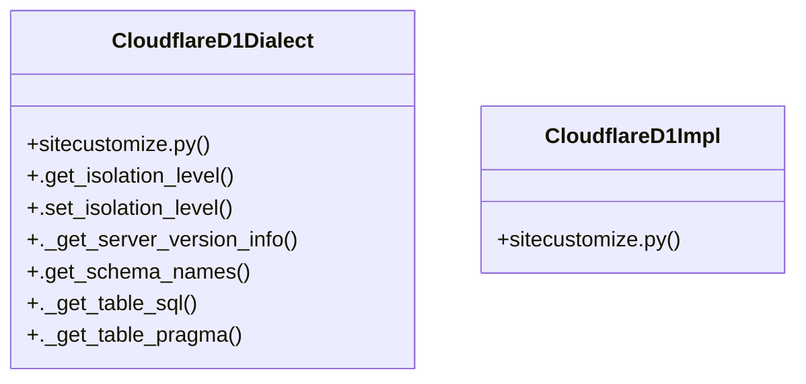

# Community 105

> 13 nodes · cohesion 0.15

## Key Concepts

- [CloudflareD1Dialect](file:///C:/Users/1/github-pr/agent-meow/deploy/cloudflare/sitecustomize.py#L61) (9 connections)
- [sitecustomize.py](file:///C:/Users/1/github-pr/agent-meow/deploy/cloudflare/sitecustomize.py#L1) (4 connections)
- [._get_table_pragma()](file:///C:/Users/1/github-pr/agent-meow/deploy/cloudflare/sitecustomize.py#L110) (2 connections)
- [CloudflareD1Impl](file:///C:/Users/1/github-pr/agent-meow/deploy/cloudflare/sitecustomize.py#L40) (2 connections)
- [.get_isolation_level()](file:///C:/Users/1/github-pr/agent-meow/deploy/cloudflare/sitecustomize.py#L82) (1 connections)
- [.get_schema_names()](file:///C:/Users/1/github-pr/agent-meow/deploy/cloudflare/sitecustomize.py#L96) (1 connections)
- [._get_table_sql()](file:///C:/Users/1/github-pr/agent-meow/deploy/cloudflare/sitecustomize.py#L99) (1 connections)
- [.set_isolation_level()](file:///C:/Users/1/github-pr/agent-meow/deploy/cloudflare/sitecustomize.py#L85) (1 connections)
- [import_dbapi()](file:///C:/Users/1/github-pr/agent-meow/deploy/cloudflare/sitecustomize.py#L75) (1 connections)
- [Auto-loaded shim that makes agent-meow work against Cloudflare D1.  D1 is SQLi](file:///C:/Users/1/github-pr/agent-meow/deploy/cloudflare/sitecustomize.py#L1) (1 connections)
- [The cloudflare_d1 dialect: SQLite behavior over D1's HTTP transport.](file:///C:/Users/1/github-pr/agent-meow/deploy/cloudflare/sitecustomize.py#L62) (1 connections)
- **SQLiteDialect** (1 connections)
- **SQLiteImpl** (1 connections)

## Class Diagram

## Relationships

- No strong cross-community connections detected

## Source Files

- [C:\Users\1\github-pr\agent-meow\deploy\cloudflare\sitecustomize.py](file:///C:/Users/1/github-pr/agent-meow/deploy/cloudflare/sitecustomize.py)

## Audit Trail

- EXTRACTED: 25 (96%)
- INFERRED: 1 (4%)
- AMBIGUOUS: 0 (0%)

---

*Part of the graphify knowledge wiki. See [[index]] to navigate.*