# Community 11

> 1880 nodes · cohesion 0.00

## Key Concepts

- [path](file:///C:/Users/1/github-pr/agent-meow/web/src/store/chatStore.test.ts#L5242) (641 connections)
- [resolve()](file:///C:/Users/1/github-pr/agent-meow/web/src/shell/NewChatDialog.tsx#L2079) (309 connections)
- [ChatOverrides](file:///C:/Users/1/github-pr/agent-meow/agent_meow/chat.py#L159) (179 connections)
- [test_claude_native_bridge.py](file:///C:/Users/1/github-pr/agent-meow/tests/test_claude_native_bridge.py#L1) (137 connections)
- [test_chat.py](file:///C:/Users/1/github-pr/agent-meow/tests/cli/test_chat.py#L1) (126 connections)
- [skip()](file:///C:/Users/1/github-pr/agent-meow/agent_meow/server/static/web-ui/assets/monacoCodeEditor-BzxvY4cV.js#L245) (106 connections)
- [insert()](file:///C:/Users/1/github-pr/agent-meow/agent_meow/server/static/web-ui/assets/index-D0w-K1tO.js#L171) (97 connections)
- [claude_native.py](file:///C:/Users/1/github-pr/agent-meow/agent_meow/claude_native.py#L1) (94 connections)
- [chunk-3OPIFGDE-WkeVFPZJ.js](file:///C:/Users/1/github-pr/agent-meow/agent_meow/server/static/web-ui/assets/chunk-3OPIFGDE-WkeVFPZJ.js#L1) (82 connections)
- [chat.py](file:///C:/Users/1/github-pr/agent-meow/agent_meow/chat.py#L1) (78 connections)
- [SeatbeltSandboxBackend](file:///C:/Users/1/github-pr/agent-meow/agent_meow/inner/seatbelt_sandbox.py#L329) (70 connections)
- [write_tmux_target()](file:///C:/Users/1/github-pr/agent-meow/agent_meow/qwen_native_bridge.py#L690) (67 connections)
- [t](file:///C:/Users/1/github-pr/agent-meow/agent_meow/server/static/web-ui/assets/chunk-3OPIFGDE-WkeVFPZJ.js#L1) (59 connections)
- [test_seatbelt_sandbox.py](file:///C:/Users/1/github-pr/agent-meow/tests/inner/test_seatbelt_sandbox.py#L1) (58 connections)
- [cwd()](file:///C:/Users/1/github-pr/agent-meow/agent_meow/server/static/web-ui/assets/monacoCodeEditor-BzxvY4cV.js#L20) (58 connections)
- [_](file:///C:/Users/1/github-pr/agent-meow/agent_meow/server/static/web-ui/assets/chunk-3OPIFGDE-WkeVFPZJ.js#L1) (54 connections)
- [e](file:///C:/Users/1/github-pr/agent-meow/agent_meow/server/static/web-ui/assets/chunk-3OPIFGDE-WkeVFPZJ.js#L1) (52 connections)
- [_resume_picker.py](file:///C:/Users/1/github-pr/agent-meow/agent_meow/repl/_resume_picker.py#L1) (49 connections)
- [g](file:///C:/Users/1/github-pr/agent-meow/agent_meow/server/static/web-ui/assets/chunk-3OPIFGDE-WkeVFPZJ.js#L1) (49 connections)
- [test_resume_picker.py](file:///C:/Users/1/github-pr/agent-meow/tests/repl/test_resume_picker.py#L1) (48 connections)
- [svg](file:///C:/Users/1/github-pr/agent-meow/web/src/components/icons/OttoIcon.test.tsx#L41) (47 connections)
- [_build_profile()](file:///C:/Users/1/github-pr/agent-meow/agent_meow/inner/seatbelt_sandbox.py#L595) (46 connections)
- [._drive()](file:///C:/Users/1/github-pr/agent-meow/tests/harness_bench/driver.py#L361) (45 connections)
- [write_launch_state()](file:///C:/Users/1/github-pr/agent-meow/agent_meow/opencode_native_state.py#L70) (45 connections)
- [c](file:///C:/Users/1/github-pr/agent-meow/agent_meow/server/static/web-ui/assets/chunk-3OPIFGDE-WkeVFPZJ.js#L1) (44 connections)
- *... and 1855 more nodes in this community*

## Class Diagram

```mermaid
classDiagram
    class ChatOverrides {
        +chat.py()
    }
    class LaunchedOpenCodeTerminal {
        +opencode_native.py()
    }
    class PreparedOpenCodeTerminal {
        +opencode_native.py()
    }
    class OpenCodeNativeLaunchState {
        +opencode_native_state.py()
    }
    class _ConversationRow {
        +_resume_picker.py()
    }
    class _PageRowRender {
        +_resume_picker.py()
    }
    class _Preview {
        +_resume_picker.py()
    }
    class SeatbeltSandboxBackend {
        +seatbelt_sandbox.py()
        +.resolve()
        +.wrap_launcher_argv()
        +.activate()
    }
    class _GenerateBuildInfo {
        +setup.py()
        +.run()
        +._bundle_examples()
        +._build_web_ui()
        +._write_build_info()
    }
    class _FakeAPClient {
        +test_chat.py()
        +.__init__()
        +._fetch_agent_tools()
    }
    class _FakeClientCtx {
        +test_chat.py()
        +.__init__()
        +.__aenter__()
        +.__aexit__()
    }
    class _FakeResumeClient {
        +test_chat.py()
        +.__init__()
    }
    class _FakeSdkClient {
        +test_chat.py()
        +.__init__()
        +.__aenter__()
        +.__aexit__()
    }
    class _FakeSessionsApi {
        +test_chat.py()
        +.__init__()
        +.create()
        +.fork()
    }
    class _FakeSessionsForResume {
        +test_chat.py()
        +.__init__()
        +.list()
    }
    class _FakeSessionsNamespace {
        +test_chat.py()
        +.__init__()
        +.create()
        +.bind_runner()
        +.list_items()
    }
    class TestBridge {
        +test_kimi_native_executor.py()
        +.test_bridge_dir_is_deterministic_and_session_scoped()
        +.test_spawn_env_carries_bridge_dir()
        +.test_tmux_target_round_trip()
        +.test_read_tmux_info_missing()
    }
    class _FakeClient {
        +test_opencode_native.py()
        +.__init__()
        +.post()
        +.get()
    }
    class _BadgeRow {
        +test_resume_picker.py()
    }
    class _FakeConversation {
        +test_resume_picker.py()
    }
    class _TtyPickResult {
        +test_resume_picker.py()
    }
    ChatOverrides --> _FakeSessionsApi
    ChatOverrides --> _FakeSdkClient
    ChatOverrides --> _FakeSessionsForResume
    ChatOverrides --> _FakeResumeClient
    ChatOverrides --> _FakeClientCtx
    ChatOverrides --> _FakeSessionsNamespace
    ChatOverrides --> _FakeAPClient
    LaunchedOpenCodeTerminal --> _FakeClient
    PreparedOpenCodeTerminal --> _FakeClient
    _FakeAPClient --> ChatOverrides
    _FakeClientCtx --> ChatOverrides
    _FakeResumeClient --> ChatOverrides
    _FakeSdkClient --> ChatOverrides
    _FakeSessionsApi --> ChatOverrides
    _FakeSessionsForResume --> ChatOverrides
    _FakeSessionsNamespace --> ChatOverrides
    _FakeClient --> LaunchedOpenCodeTerminal
    _FakeClient --> PreparedOpenCodeTerminal
```

## Relationships

- [[Community 4]] (92 shared connections)
- [[Community 3]] (89 shared connections)
- [[Community 8]] (65 shared connections)
- [[Community 1]] (6 shared connections)
- [[Community 14]] (2 shared connections)
- [[Community 10]] (1 shared connections)
- [[Community 6]] (1 shared connections)

## Source Files

- [C:\Users\1\github-pr\agent-meow\agent_meow\_native_resume_hint.py](file:///C:/Users/1/github-pr/agent-meow/agent_meow/_native_resume_hint.py)
- [C:\Users\1\github-pr\agent-meow\agent_meow\_runner_startup.py](file:///C:/Users/1/github-pr/agent-meow/agent_meow/_runner_startup.py)
- [C:\Users\1\github-pr\agent-meow\agent_meow\antigravity_native.py](file:///C:/Users/1/github-pr/agent-meow/agent_meow/antigravity_native.py)
- [C:\Users\1\github-pr\agent-meow\agent_meow\chat.py](file:///C:/Users/1/github-pr/agent-meow/agent_meow/chat.py)
- [C:\Users\1\github-pr\agent-meow\agent_meow\claude_native.py](file:///C:/Users/1/github-pr/agent-meow/agent_meow/claude_native.py)
- [C:\Users\1\github-pr\agent-meow\agent_meow\claude_native_bridge.py](file:///C:/Users/1/github-pr/agent-meow/agent_meow/claude_native_bridge.py)
- [C:\Users\1\github-pr\agent-meow\agent_meow\cli.py](file:///C:/Users/1/github-pr/agent-meow/agent_meow/cli.py)
- [C:\Users\1\github-pr\agent-meow\agent_meow\cli_auth.py](file:///C:/Users/1/github-pr/agent-meow/agent_meow/cli_auth.py)
- [C:\Users\1\github-pr\agent-meow\agent_meow\cli_sandbox.py](file:///C:/Users/1/github-pr/agent-meow/agent_meow/cli_sandbox.py)
- [C:\Users\1\github-pr\agent-meow\agent_meow\client_tools\__init__.py](file:///C:/Users/1/github-pr/agent-meow/agent_meow/client_tools/__init__.py)
- [C:\Users\1\github-pr\agent-meow\agent_meow\codex_native.py](file:///C:/Users/1/github-pr/agent-meow/agent_meow/codex_native.py)
- [C:\Users\1\github-pr\agent-meow\agent_meow\conversation_browser.py](file:///C:/Users/1/github-pr/agent-meow/agent_meow/conversation_browser.py)
- [C:\Users\1\github-pr\agent-meow\agent_meow\cursor_native.py](file:///C:/Users/1/github-pr/agent-meow/agent_meow/cursor_native.py)
- [C:\Users\1\github-pr\agent-meow\agent_meow\goose_native.py](file:///C:/Users/1/github-pr/agent-meow/agent_meow/goose_native.py)
- [C:\Users\1\github-pr\agent-meow\agent_meow\hermes_native.py](file:///C:/Users/1/github-pr/agent-meow/agent_meow/hermes_native.py)
- [C:\Users\1\github-pr\agent-meow\agent_meow\host\identity.py](file:///C:/Users/1/github-pr/agent-meow/agent_meow/host/identity.py)
- [C:\Users\1\github-pr\agent-meow\agent_meow\inner\_cwd_scan.py](file:///C:/Users/1/github-pr/agent-meow/agent_meow/inner/_cwd_scan.py)
- [C:\Users\1\github-pr\agent-meow\agent_meow\inner\egress\ca.py](file:///C:/Users/1/github-pr/agent-meow/agent_meow/inner/egress/ca.py)
- [C:\Users\1\github-pr\agent-meow\agent_meow\inner\os_env.py](file:///C:/Users/1/github-pr/agent-meow/agent_meow/inner/os_env.py)
- [C:\Users\1\github-pr\agent-meow\agent_meow\inner\sandbox.py](file:///C:/Users/1/github-pr/agent-meow/agent_meow/inner/sandbox.py)

## Audit Trail

- EXTRACTED: 6098 (52%)
- INFERRED: 5633 (48%)
- AMBIGUOUS: 0 (0%)

---

*Part of the graphify knowledge wiki. See [[index]] to navigate.*