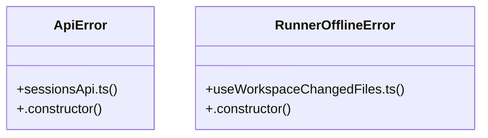

# Community 12

> 1476 nodes · cohesion 0.00

## Key Concepts

- [NewChatDialog.tsx](file:///C:/Users/1/github-pr/agent-meow/web/src/shell/NewChatDialog.tsx#L1) (180 connections)
- [ChatPage.tsx](file:///C:/Users/1/github-pr/agent-meow/web/src/pages/ChatPage.tsx#L1) (158 connections)
- [AppShell.tsx](file:///C:/Users/1/github-pr/agent-meow/web/src/shell/AppShell.tsx#L1) (116 connections)
- [FileViewer.tsx](file:///C:/Users/1/github-pr/agent-meow/web/src/shell/FileViewer.tsx#L1) (84 connections)
- [authenticatedFetch()](file:///C:/Users/1/github-pr/agent-meow/web/src/lib/identity.ts#L144) (78 connections)
- [NewChatDialog.test.tsx](file:///C:/Users/1/github-pr/agent-meow/web/src/shell/NewChatDialog.test.tsx#L1) (69 connections)
- [chatStore.ts](file:///C:/Users/1/github-pr/agent-meow/web/src/store/chatStore.ts#L1) (66 connections)
- [AgentInfo.tsx](file:///C:/Users/1/github-pr/agent-meow/web/src/components/AgentInfo.tsx#L1) (59 connections)
- [ForkSessionDialog.tsx](file:///C:/Users/1/github-pr/agent-meow/web/src/shell/ForkSessionDialog.tsx#L1) (54 connections)
- [ResumeWithDirectoryDialog.tsx](file:///C:/Users/1/github-pr/agent-meow/web/src/shell/ResumeWithDirectoryDialog.tsx#L1) (32 connections)
- [sessionsApi.ts](file:///C:/Users/1/github-pr/agent-meow/web/src/lib/sessionsApi.ts#L1) (29 connections)
- [useWorkspaceChangedFiles.test.tsx](file:///C:/Users/1/github-pr/agent-meow/web/src/hooks/useWorkspaceChangedFiles.test.tsx#L1) (27 connections)
- [ToolCard.tsx](file:///C:/Users/1/github-pr/agent-meow/web/src/components/blocks/ToolCard.tsx#L1) (26 connections)
- [useConversations.ts](file:///C:/Users/1/github-pr/agent-meow/web/src/hooks/useConversations.ts#L1) (25 connections)
- [useWorkspaceChangedFiles.ts](file:///C:/Users/1/github-pr/agent-meow/web/src/hooks/useWorkspaceChangedFiles.ts#L1) (24 connections)
- [itemToBlock()](file:///C:/Users/1/github-pr/agent-meow/web/src/lib/itemsToBlocks.ts#L77) (22 connections)
- [nativeBridge.test.ts](file:///C:/Users/1/github-pr/agent-meow/web/src/lib/nativeBridge.test.ts#L1) (21 connections)
- [ExecutionLogsPanel.tsx](file:///C:/Users/1/github-pr/agent-meow/web/src/shell/ExecutionLogsPanel.tsx#L1) (21 connections)
- [pumpStreamEvents()](file:///C:/Users/1/github-pr/agent-meow/web/src/store/chatStore.ts#L2922) (21 connections)
- [CodexGoalDialog.tsx](file:///C:/Users/1/github-pr/agent-meow/web/src/components/codex/CodexGoalDialog.tsx#L1) (20 connections)
- [useUnseenConversations.ts](file:///C:/Users/1/github-pr/agent-meow/web/src/hooks/useUnseenConversations.ts#L1) (20 connections)
- [TipTapWorkspaceImage.test.ts](file:///C:/Users/1/github-pr/agent-meow/web/src/shell/TipTapWorkspaceImage.test.ts#L1) (20 connections)
- [MonacoCodeEditor.teardown.test.tsx](file:///C:/Users/1/github-pr/agent-meow/web/src/shell/MonacoCodeEditor.teardown.test.tsx#L1) (19 connections)
- [sidebarNav.ts](file:///C:/Users/1/github-pr/agent-meow/web/src/shell/sidebarNav.ts#L1) (19 connections)
- [ChatPage()](file:///C:/Users/1/github-pr/agent-meow/web/src/pages/ChatPage.tsx#L533) (19 connections)
- *... and 1451 more nodes in this community*

## Class Diagram

## Relationships

- No strong cross-community connections detected

## Source Files

- [C:\Users\1\github-pr\agent-meow\agent_meow\server\static\web-ui\assets\index-D0w-K1tO.js](file:///C:/Users/1/github-pr/agent-meow/agent_meow/server/static/web-ui/assets/index-D0w-K1tO.js)
- [C:\Users\1\github-pr\agent-meow\sdks\python-client\omnigent_client\tools\_decorator.py](file:///C:/Users/1/github-pr/agent-meow/sdks/python-client/omnigent_client/tools/_decorator.py)
- [C:\Users\1\github-pr\agent-meow\web\src\components\AgentCard.tsx](file:///C:/Users/1/github-pr/agent-meow/web/src/components/AgentCard.tsx)
- [C:\Users\1\github-pr\agent-meow\web\src\components\AgentInfo.tsx](file:///C:/Users/1/github-pr/agent-meow/web/src/components/AgentInfo.tsx)
- [C:\Users\1\github-pr\agent-meow\web\src\components\CostRoutingControl.tsx](file:///C:/Users/1/github-pr/agent-meow/web/src/components/CostRoutingControl.tsx)
- [C:\Users\1\github-pr\agent-meow\web\src\components\HostBadge.tsx](file:///C:/Users/1/github-pr/agent-meow/web/src/components/HostBadge.tsx)
- [C:\Users\1\github-pr\agent-meow\web\src\components\SessionImage.tsx](file:///C:/Users/1/github-pr/agent-meow/web/src/components/SessionImage.tsx)
- [C:\Users\1\github-pr\agent-meow\web\src\components\blocks\BlockRenderer.tsx](file:///C:/Users/1/github-pr/agent-meow/web/src/components/blocks/BlockRenderer.tsx)
- [C:\Users\1\github-pr\agent-meow\web\src\components\blocks\StatusBlocks.tsx](file:///C:/Users/1/github-pr/agent-meow/web/src/components/blocks/StatusBlocks.tsx)
- [C:\Users\1\github-pr\agent-meow\web\src\components\blocks\TerminalView.test.tsx](file:///C:/Users/1/github-pr/agent-meow/web/src/components/blocks/TerminalView.test.tsx)
- [C:\Users\1\github-pr\agent-meow\web\src\components\blocks\ToolCard.tsx](file:///C:/Users/1/github-pr/agent-meow/web/src/components/blocks/ToolCard.tsx)
- [C:\Users\1\github-pr\agent-meow\web\src\components\codex\CodexGoalDialog.tsx](file:///C:/Users/1/github-pr/agent-meow/web/src/components/codex/CodexGoalDialog.tsx)
- [C:\Users\1\github-pr\agent-meow\web\src\components\codex\codexGoalUtils.ts](file:///C:/Users/1/github-pr/agent-meow/web/src/components/codex/codexGoalUtils.ts)
- [C:\Users\1\github-pr\agent-meow\web\src\hooks\RunnerHealthProvider.test.tsx](file:///C:/Users/1/github-pr/agent-meow/web/src/hooks/RunnerHealthProvider.test.tsx)
- [C:\Users\1\github-pr\agent-meow\web\src\hooks\RunnerHealthProvider.tsx](file:///C:/Users/1/github-pr/agent-meow/web/src/hooks/RunnerHealthProvider.tsx)
- [C:\Users\1\github-pr\agent-meow\web\src\hooks\useActiveConversationId.ts](file:///C:/Users/1/github-pr/agent-meow/web/src/hooks/useActiveConversationId.ts)
- [C:\Users\1\github-pr\agent-meow\web\src\hooks\useAgents.ts](file:///C:/Users/1/github-pr/agent-meow/web/src/hooks/useAgents.ts)
- [C:\Users\1\github-pr\agent-meow\web\src\hooks\useChildSessions.ts](file:///C:/Users/1/github-pr/agent-meow/web/src/hooks/useChildSessions.ts)
- [C:\Users\1\github-pr\agent-meow\web\src\hooks\useComments.ts](file:///C:/Users/1/github-pr/agent-meow/web/src/hooks/useComments.ts)
- [C:\Users\1\github-pr\agent-meow\web\src\hooks\useConversations.ts](file:///C:/Users/1/github-pr/agent-meow/web/src/hooks/useConversations.ts)

## Audit Trail

- EXTRACTED: 3217 (81%)
- INFERRED: 740 (19%)
- AMBIGUOUS: 0 (0%)

---

*Part of the graphify knowledge wiki. See [[index]] to navigate.*