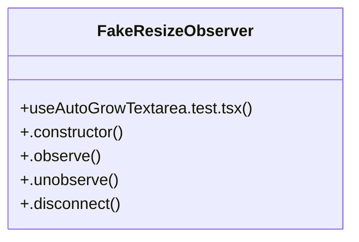

# Community 127

> 11 nodes · cohesion 0.18

## Key Concepts

- [useAutoGrowTextarea.test.tsx](file:///C:/Users/1/github-pr/agent-meow/web/src/hooks/useAutoGrowTextarea.test.tsx#L1) (6 connections)
- [FakeResizeObserver](file:///C:/Users/1/github-pr/agent-meow/web/src/hooks/useAutoGrowTextarea.test.tsx#L10) (5 connections)
- [.constructor()](file:///C:/Users/1/github-pr/agent-meow/web/src/hooks/useAutoGrowTextarea.test.tsx#L11) (1 connections)
- [.disconnect()](file:///C:/Users/1/github-pr/agent-meow/web/src/hooks/useAutoGrowTextarea.test.tsx#L16) (1 connections)
- [.observe()](file:///C:/Users/1/github-pr/agent-meow/web/src/hooks/useAutoGrowTextarea.test.tsx#L14) (1 connections)
- [.unobserve()](file:///C:/Users/1/github-pr/agent-meow/web/src/hooks/useAutoGrowTextarea.test.tsx#L15) (1 connections)
- [{ getByTestId }](file:///C:/Users/1/github-pr/agent-meow/web/src/hooks/useAutoGrowTextarea.test.tsx#L60) (1 connections)
- [ref](file:///C:/Users/1/github-pr/agent-meow/web/src/hooks/useAutoGrowTextarea.test.tsx#L31) (1 connections)
- [roCallback](file:///C:/Users/1/github-pr/agent-meow/web/src/hooks/useAutoGrowTextarea.test.tsx#L9) (1 connections)
- [stubScrollHeight()](file:///C:/Users/1/github-pr/agent-meow/web/src/hooks/useAutoGrowTextarea.test.tsx#L23) (1 connections)
- [ta](file:///C:/Users/1/github-pr/agent-meow/web/src/hooks/useAutoGrowTextarea.test.tsx#L61) (1 connections)

## Class Diagram

## Relationships

- No strong cross-community connections detected

## Source Files

- [C:\Users\1\github-pr\agent-meow\web\src\hooks\useAutoGrowTextarea.test.tsx](file:///C:/Users/1/github-pr/agent-meow/web/src/hooks/useAutoGrowTextarea.test.tsx)

## Audit Trail

- EXTRACTED: 20 (100%)
- INFERRED: 0 (0%)
- AMBIGUOUS: 0 (0%)

---

*Part of the graphify knowledge wiki. See [[index]] to navigate.*