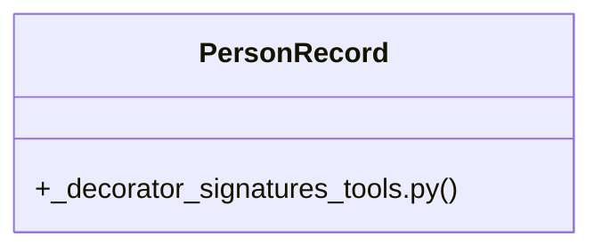

# Community 132

> 10 nodes · cohesion 0.20

## Key Concepts

- [_decorator_signatures_tools.py](file:///C:/Users/1/github-pr/agent-meow/tests/_fixtures/agents/_decorator_signatures_tools.py#L1) (5 connections)
- [format_record()](file:///C:/Users/1/github-pr/agent-meow/tests/_fixtures/agents/_decorator_signatures_tools.py#L32) (4 connections)
- [PersonRecord](file:///C:/Users/1/github-pr/agent-meow/tests/_fixtures/agents/_decorator_signatures_tools.py#L14) (3 connections)
- [compute()](file:///C:/Users/1/github-pr/agent-meow/tests/_fixtures/agents/_decorator_signatures_tools.py#L45) (2 connections)
- [greet()](file:///C:/Users/1/github-pr/agent-meow/tests/_fixtures/agents/_decorator_signatures_tools.py#L22) (2 connections)
- [Test tools exercising the breadth of agent-meow tool signature handling.  Cove](file:///C:/Users/1/github-pr/agent-meow/tests/_fixtures/agents/_decorator_signatures_tools.py#L1) (1 connections)
- [A person record (test fixture).](file:///C:/Users/1/github-pr/agent-meow/tests/_fixtures/agents/_decorator_signatures_tools.py#L15) (1 connections)
- [Return a greeting for the given name.      :param name: The name to greet.](file:///C:/Users/1/github-pr/agent-meow/tests/_fixtures/agents/_decorator_signatures_tools.py#L23) (1 connections)
- [Format a person record as a one-line string.      :param record: The person re](file:///C:/Users/1/github-pr/agent-meow/tests/_fixtures/agents/_decorator_signatures_tools.py#L33) (1 connections)
- [Multiply ``value`` by ``multiplier`` and echo the optional note.      :param v](file:///C:/Users/1/github-pr/agent-meow/tests/_fixtures/agents/_decorator_signatures_tools.py#L46) (1 connections)

## Class Diagram

## Relationships

- No strong cross-community connections detected

## Source Files

- [C:\Users\1\github-pr\agent-meow\tests\_fixtures\agents\_decorator_signatures_tools.py](file:///C:/Users/1/github-pr/agent-meow/tests/_fixtures/agents/_decorator_signatures_tools.py)

## Audit Trail

- EXTRACTED: 19 (90%)
- INFERRED: 2 (10%)
- AMBIGUOUS: 0 (0%)

---

*Part of the graphify knowledge wiki. See [[index]] to navigate.*