# Community 14

> 1361 nodes · cohesion 0.01

## Key Concepts

- [RichBlockFormatter](file:///C:/Users/1/github-pr/agent-meow/sdks/ui/omnigent_ui_sdk/terminal/_formatter.py#L304) (294 connections)
- [Shared test helpers across `tests/inner/`, `tests/e2e/`, etc.](file:///C:/Users/1/github-pr/agent-meow/tests/_helpers/__init__.py#L1) (292 connections)
- [StreamLive](file:///C:/Users/1/github-pr/agent-meow/sdks/ui/omnigent_ui_sdk/terminal/_formatter.py#L86) (258 connections)
- [StreamingText](file:///C:/Users/1/github-pr/agent-meow/sdks/ui/omnigent_ui_sdk/terminal/_formatter.py#L55) (253 connections)
- [StreamReplace](file:///C:/Users/1/github-pr/agent-meow/sdks/ui/omnigent_ui_sdk/terminal/_formatter.py#L62) (244 connections)
- [type()](file:///C:/Users/1/github-pr/agent-meow/web/src/pages/ChatPage.mention.test.tsx#L111) (228 connections)
- [TerminalHost](file:///C:/Users/1/github-pr/agent-meow/sdks/ui/omnigent_ui_sdk/terminal/_host.py#L817) (224 connections)
- [ToolGroup](file:///C:/Users/1/github-pr/agent-meow/sdks/python-client/omnigent_client/_blocks.py#L82) (204 connections)
- [TextChunk](file:///C:/Users/1/github-pr/agent-meow/sdks/python-client/omnigent_client/_blocks.py#L133) (195 connections)
- [TextDone](file:///C:/Users/1/github-pr/agent-meow/sdks/python-client/omnigent_client/_blocks.py#L143) (156 connections)
- [ReasoningBlock](file:///C:/Users/1/github-pr/agent-meow/sdks/python-client/omnigent_client/_blocks.py#L180) (136 connections)
- [TerminalTheme](file:///C:/Users/1/github-pr/agent-meow/sdks/ui/omnigent_ui_sdk/terminal/_theme.py#L21) (133 connections)
- [ResponseStartBlock](file:///C:/Users/1/github-pr/agent-meow/sdks/python-client/omnigent_client/_blocks.py#L45) (130 connections)
- [ResponseEndBlock](file:///C:/Users/1/github-pr/agent-meow/sdks/python-client/omnigent_client/_blocks.py#L255) (125 connections)
- [BlockContext](file:///C:/Users/1/github-pr/agent-meow/sdks/python-client/omnigent_client/_blocks.py#L17) (116 connections)
- [ToolExecution](file:///C:/Users/1/github-pr/agent-meow/sdks/python-client/omnigent_client/_blocks.py#L60) (114 connections)
- **TerminalHost** (114 connections)
- [TerminalToolRendererRegistry](file:///C:/Users/1/github-pr/agent-meow/sdks/ui/omnigent_ui_sdk/terminal/_tool_renderers.py#L84) (114 connections)
- [FileBlock](file:///C:/Users/1/github-pr/agent-meow/sdks/python-client/omnigent_client/_blocks.py#L243) (106 connections)
- [ToolResultBlock](file:///C:/Users/1/github-pr/agent-meow/sdks/python-client/omnigent_client/_blocks.py#L94) (106 connections)
- [ReasoningStartBlock](file:///C:/Users/1/github-pr/agent-meow/sdks/python-client/omnigent_client/_blocks.py#L158) (104 connections)
- [TerminalToolRenderTheme](file:///C:/Users/1/github-pr/agent-meow/sdks/ui/omnigent_ui_sdk/terminal/_tool_renderers.py#L36) (104 connections)
- [RetryBlock](file:///C:/Users/1/github-pr/agent-meow/sdks/python-client/omnigent_client/_blocks.py#L222) (101 connections)
- [ErrorBlock](file:///C:/Users/1/github-pr/agent-meow/sdks/python-client/omnigent_client/_blocks.py#L200) (97 connections)
- [NativeToolBlock](file:///C:/Users/1/github-pr/agent-meow/sdks/python-client/omnigent_client/_blocks.py#L116) (93 connections)
- *... and 1336 more nodes in this community*

## Class Diagram

```mermaid
classDiagram
    class BlockContext {
        +_blocks.py()
    }
    class CompactionBlock {
        +_blocks.py()
    }
    class ErrorBlock {
        +_blocks.py()
    }
    class FileBlock {
        +_blocks.py()
    }
    class NativeToolBlock {
        +_blocks.py()
    }
    class ReasoningBlock {
        +_blocks.py()
    }
    class ReasoningStartBlock {
        +_blocks.py()
    }
    class ResponseEndBlock {
        +_blocks.py()
    }
    class ResponseStartBlock {
        +_blocks.py()
    }
    class RetryBlock {
        +_blocks.py()
    }
    class StreamBlock {
        +_blocks.py()
    }
    class TextChunk {
        +_blocks.py()
    }
    class TextDone {
        +_blocks.py()
    }
    class ToolExecution {
        +_blocks.py()
    }
    class ToolGroup {
        +_blocks.py()
    }
    class ToolResultBlock {
        +_blocks.py()
    }
    class GlassCapsule {
        +ChatTerminalBar.swift()
        +.body()
    }
    class UserConfig {
        +_config.py()
    }
    class UserConfigError {
        +_config.py()
    }
    class SessionState {
        +datamodel.py()
    }
    class _AsciiListItem {
        +_formatter.py()
        +.render_bullet()
    }
    class _DiamondMarkdown {
        +_formatter.py()
        +.__init__()
        +.__rich_console__()
    }
    class _LeftHeading {
        +_formatter.py()
        +.__rich_console__()
    }
    class RichBlockFormatter {
        +_formatter.py()
        +.__init__()
        +.set_theme()
        +._apply_theme_styles()
        +.format()
        +._dispatch()
        +.format_response_start()
        +.format_text_chunk()
        +.format_text_done()
        +.format_message_done()
    }
    class StreamingText {
        +_formatter.py()
    }
    class StreamLive {
        +_formatter.py()
    }
    class StreamReplace {
        +_formatter.py()
    }
    class _HasToolbarText {
        +_host.py()
        +.toolbar_text()
    }
    class Overlay {
        +_host.py()
    }
    class OverlayAction {
        +_host.py()
    }
    class OverlayTarget {
        +_host.py()
    }
    class _PastedBlock {
        +_host.py()
    }
    class _SubagentNode {
        +_host.py()
    }
    class TerminalHost {
        +_host.py()
        +.__init__()
        +._make_style()
        +.update_context_usage()
        +.set_theme()
        +.set_model_name()
        +.add_overlay()
        +._try_set_window_title()
        +._try_clear_window_title()
        +.__aenter__()
    }
    class AgentStore {
        +__init__.py()
        +.__init__()
    }
    class ArtifactStore {
        +__init__.py()
        +.__init__()
    }
    class CommentStore {
        +__init__.py()
        +.__init__()
    }
    class ConversationStore {
        +__init__.py()
        +.__init__()
    }
    class DocumentStore {
        +__init__.py()
        +.__init__()
    }
    class FileStore {
        +__init__.py()
        +.__init__()
    }
    class ImageStore {
        +__init__.py()
        +.__init__()
    }
    class PermissionStore {
        +__init__.py()
        +.__init__()
    }
    class PolicyStore {
        +__init__.py()
        +.__init__()
    }
    class VideoStore {
        +__init__.py()
        +.__init__()
    }
    class Policy {
        +policy.py()
    }
    class _RecordingBuffer {
        +test_paste_abstraction.py()
        +.__init__()
        +.insert_text()
    }
    class _TitleRecordingOutput {
        +test_terminal_host.py()
        +.__init__()
        +.set_title()
        +.clear_title()
        +.flush()
    }
    class DummyHost {
        +test_theme_command.py()
        +.__init__()
        +.output()
    }
    class DummySession {
        +test_theme_command.py()
    }
    class TestPydanticModels {
        +test_tool_renderers.py()
        +.test_file_read_requires_content()
        +.test_file_read_coerces_offset()
        +.test_shell_result_coerces_exit_code()
        +.test_shell_result_defaults()
        +.test_terminal_read_requires_screen()
        +.test_terminal_list_entry_coerces()
        +.test_task_entry_target_from_tool_name()
        +.test_task_entry_target_from_sub_agent()
        +.test_task_list_result_requires_tasks_list()
    }
    class TerminalTheme {
        +_theme.py()
    }
    class FileReadResult {
        +_tool_renderers.py()
    }
    class McpCallData {
        +_tool_renderers.py()
    }
    class ParsedToolOutput {
        +_tool_renderers.py()
    }
    class ShellResult {
        +_tool_renderers.py()
    }
    class StatusToolFields {
        +_tool_renderers.py()
    }
    class TaskEntry {
        +_tool_renderers.py()
    }
    class TaskListResult {
        +_tool_renderers.py()
    }
    class TerminalListEntry {
        +_tool_renderers.py()
    }
    class TerminalReadResult {
        +_tool_renderers.py()
    }
    class TerminalToolRendererRegistry {
        +_tool_renderers.py()
        +.__init__()
        +.register()
        +.register_native()
        +.render_tool()
        +.render_native()
    }
    class TerminalToolRenderTheme {
        +_tool_renderers.py()
    }
    class _TruncatedText {
        +_tool_renderers.py()
    }
    class WebSearchAction {
        +_tool_renderers.py()
    }
    StreamBlock <|-- CompactionBlock
    StreamBlock <|-- ErrorBlock
    StreamBlock <|-- FileBlock
    StreamBlock <|-- NativeToolBlock
    NativeToolBlock --> TestPydanticModels
    StreamBlock <|-- ReasoningBlock
    StreamBlock <|-- ReasoningStartBlock
    StreamBlock <|-- ResponseEndBlock
    StreamBlock <|-- ResponseStartBlock
    StreamBlock <|-- RetryBlock
    ResponseStartBlock <|-- StreamBlock
    ToolGroup <|-- StreamBlock
    ToolResultBlock <|-- StreamBlock
    NativeToolBlock <|-- StreamBlock
    TextChunk <|-- StreamBlock
    TextDone <|-- StreamBlock
    ReasoningStartBlock <|-- StreamBlock
    ReasoningBlock <|-- StreamBlock
    ErrorBlock <|-- StreamBlock
    RetryBlock <|-- StreamBlock
    CompactionBlock <|-- StreamBlock
    FileBlock <|-- StreamBlock
    ResponseEndBlock <|-- StreamBlock
    StreamBlock <|-- TextChunk
    StreamBlock <|-- TextDone
    StreamBlock <|-- ToolGroup
    ToolGroup --> TestPydanticModels
    StreamBlock <|-- ToolResultBlock
    ToolResultBlock --> TestPydanticModels
    _AsciiListItem --> TerminalTheme
    _AsciiListItem --> TerminalToolRendererRegistry
    _AsciiListItem --> TerminalToolRenderTheme
    _DiamondMarkdown --> TerminalTheme
    _DiamondMarkdown --> TerminalToolRendererRegistry
    _DiamondMarkdown --> TerminalToolRenderTheme
    _LeftHeading --> TerminalTheme
    _LeftHeading --> TerminalToolRendererRegistry
    _LeftHeading --> TerminalToolRenderTheme
    RichBlockFormatter --> TerminalTheme
    RichBlockFormatter --> TerminalToolRendererRegistry
    RichBlockFormatter --> TerminalToolRenderTheme
    RichBlockFormatter --> TestPydanticModels
    StreamingText --> TerminalTheme
    StreamingText --> TerminalToolRendererRegistry
    StreamingText --> TerminalToolRenderTheme
    StreamingText --> _HasToolbarText
    StreamingText --> _PastedBlock
    StreamingText --> _SubagentNode
    StreamingText --> OverlayAction
    StreamingText --> OverlayTarget
    StreamingText --> Overlay
    StreamingText --> TerminalHost
    StreamingText --> _TitleRecordingOutput
    StreamLive --> TerminalTheme
    StreamLive --> TerminalToolRendererRegistry
    StreamLive --> TerminalToolRenderTheme
    StreamLive --> _HasToolbarText
    StreamLive --> _PastedBlock
    StreamLive --> _SubagentNode
    StreamLive --> OverlayAction
    StreamLive --> OverlayTarget
    StreamLive --> Overlay
    StreamLive --> TerminalHost
    StreamLive --> _TitleRecordingOutput
    StreamReplace --> TerminalTheme
    StreamReplace --> TerminalToolRendererRegistry
    StreamReplace --> TerminalToolRenderTheme
    StreamReplace --> _HasToolbarText
    StreamReplace --> _PastedBlock
    StreamReplace --> _SubagentNode
    StreamReplace --> OverlayAction
    StreamReplace --> OverlayTarget
    StreamReplace --> Overlay
    StreamReplace --> TerminalHost
    StreamReplace --> _TitleRecordingOutput
    _HasToolbarText --> StreamingText
    _HasToolbarText --> StreamLive
    _HasToolbarText --> StreamReplace
    _HasToolbarText --> TerminalTheme
    Overlay --> StreamingText
    Overlay --> StreamLive
    Overlay --> StreamReplace
    Overlay --> TerminalTheme
    OverlayAction --> StreamingText
    OverlayAction --> StreamLive
    OverlayAction --> StreamReplace
    OverlayAction --> TerminalTheme
    OverlayTarget --> StreamingText
    OverlayTarget --> StreamLive
    OverlayTarget --> StreamReplace
    OverlayTarget --> TerminalTheme
    _PastedBlock --> StreamingText
    _PastedBlock --> StreamLive
    _PastedBlock --> StreamReplace
    _PastedBlock --> TerminalTheme
    _SubagentNode --> StreamingText
    _SubagentNode --> StreamLive
    _SubagentNode --> StreamReplace
    _SubagentNode --> TerminalTheme
    TerminalHost --> StreamingText
    TerminalHost --> StreamLive
    TerminalHost --> StreamReplace
    TerminalHost --> TerminalTheme
    TerminalHost --> _RecordingBuffer
    TerminalHost --> _TitleRecordingOutput
    _RecordingBuffer --> TerminalHost
    _TitleRecordingOutput --> StreamingText
    _TitleRecordingOutput --> TerminalHost
    _TitleRecordingOutput --> StreamReplace
    _TitleRecordingOutput --> StreamLive
    TestPydanticModels --> FileReadResult
    TestPydanticModels --> McpCallData
    TestPydanticModels --> ShellResult
    TestPydanticModels --> StatusToolFields
    TestPydanticModels --> TaskEntry
    TestPydanticModels --> TaskListResult
    TestPydanticModels --> TerminalListEntry
    TestPydanticModels --> TerminalReadResult
    TestPydanticModels --> TerminalToolRendererRegistry
    TestPydanticModels --> TerminalToolRenderTheme
    TestPydanticModels --> WebSearchAction
    TestPydanticModels --> ToolGroup
    TestPydanticModels --> RichBlockFormatter
    TestPydanticModels --> ToolResultBlock
    TestPydanticModels --> NativeToolBlock
    TerminalTheme --> StreamingText
    TerminalTheme --> StreamReplace
    TerminalTheme --> StreamLive
    TerminalTheme --> _LeftHeading
    TerminalTheme --> _AsciiListItem
    TerminalTheme --> _DiamondMarkdown
    TerminalTheme --> RichBlockFormatter
    TerminalTheme --> _HasToolbarText
    TerminalTheme --> _PastedBlock
    TerminalTheme --> _SubagentNode
    TerminalTheme --> OverlayAction
    TerminalTheme --> OverlayTarget
    TerminalTheme --> Overlay
    TerminalTheme --> TerminalHost
    FileReadResult --> TestPydanticModels
    McpCallData --> TestPydanticModels
    ShellResult --> TestPydanticModels
    StatusToolFields --> TestPydanticModels
    TaskEntry --> TestPydanticModels
    TaskListResult --> TestPydanticModels
    TerminalListEntry --> TestPydanticModels
    TerminalReadResult --> TestPydanticModels
    TerminalToolRendererRegistry --> StreamingText
    TerminalToolRendererRegistry --> StreamReplace
    TerminalToolRendererRegistry --> StreamLive
    TerminalToolRendererRegistry --> _LeftHeading
    TerminalToolRendererRegistry --> _AsciiListItem
    TerminalToolRendererRegistry --> _DiamondMarkdown
    TerminalToolRendererRegistry --> RichBlockFormatter
    TerminalToolRendererRegistry --> TestPydanticModels
    TerminalToolRenderTheme --> StreamingText
    TerminalToolRenderTheme --> StreamReplace
    TerminalToolRenderTheme --> StreamLive
    TerminalToolRenderTheme --> _LeftHeading
    TerminalToolRenderTheme --> _AsciiListItem
    TerminalToolRenderTheme --> _DiamondMarkdown
    TerminalToolRenderTheme --> RichBlockFormatter
    TerminalToolRenderTheme --> TestPydanticModels
    WebSearchAction --> TestPydanticModels
```

## Relationships

- [[Community 8]] (311 shared connections)
- [[Auth Config]] (17 shared connections)
- [[Community 3]] (3 shared connections)
- [[Community 4]] (2 shared connections)
- [[Community 16]] (1 shared connections)

## Source Files

- [C:\Users\1\github-pr\agent-meow\agent_meow\__init__.py](file:///C:/Users/1/github-pr/agent-meow/agent_meow/__init__.py)
- [C:\Users\1\github-pr\agent-meow\agent_meow\claude_native_bridge.py](file:///C:/Users/1/github-pr/agent-meow/agent_meow/claude_native_bridge.py)
- [C:\Users\1\github-pr\agent-meow\agent_meow\community\__init__.py](file:///C:/Users/1/github-pr/agent-meow/agent_meow/community/__init__.py)
- [C:\Users\1\github-pr\agent-meow\agent_meow\community\harness\__init__.py](file:///C:/Users/1/github-pr/agent-meow/agent_meow/community/harness/__init__.py)
- [C:\Users\1\github-pr\agent-meow\agent_meow\db\__init__.py](file:///C:/Users/1/github-pr/agent-meow/agent_meow/db/__init__.py)
- [C:\Users\1\github-pr\agent-meow\agent_meow\entities\__init__.py](file:///C:/Users/1/github-pr/agent-meow/agent_meow/entities/__init__.py)
- [C:\Users\1\github-pr\agent-meow\agent_meow\entities\policy.py](file:///C:/Users/1/github-pr/agent-meow/agent_meow/entities/policy.py)
- [C:\Users\1\github-pr\agent-meow\agent_meow\environments\__init__.py](file:///C:/Users/1/github-pr/agent-meow/agent_meow/environments/__init__.py)
- [C:\Users\1\github-pr\agent-meow\agent_meow\host\__init__.py](file:///C:/Users/1/github-pr/agent-meow/agent_meow/host/__init__.py)
- [C:\Users\1\github-pr\agent-meow\agent_meow\inner\datamodel.py](file:///C:/Users/1/github-pr/agent-meow/agent_meow/inner/datamodel.py)
- [C:\Users\1\github-pr\agent-meow\agent_meow\inner\egress\__init__.py](file:///C:/Users/1/github-pr/agent-meow/agent_meow/inner/egress/__init__.py)
- [C:\Users\1\github-pr\agent-meow\agent_meow\inner\nessie\__init__.py](file:///C:/Users/1/github-pr/agent-meow/agent_meow/inner/nessie/__init__.py)
- [C:\Users\1\github-pr\agent-meow\agent_meow\llms\__init__.py](file:///C:/Users/1/github-pr/agent-meow/agent_meow/llms/__init__.py)
- [C:\Users\1\github-pr\agent-meow\agent_meow\policies\__init__.py](file:///C:/Users/1/github-pr/agent-meow/agent_meow/policies/__init__.py)
- [C:\Users\1\github-pr\agent-meow\agent_meow\policies\builtins\__init__.py](file:///C:/Users/1/github-pr/agent-meow/agent_meow/policies/builtins/__init__.py)
- [C:\Users\1\github-pr\agent-meow\agent_meow\policies\builtins\prompt.py](file:///C:/Users/1/github-pr/agent-meow/agent_meow/policies/builtins/prompt.py)
- [C:\Users\1\github-pr\agent-meow\agent_meow\repl\__init__.py](file:///C:/Users/1/github-pr/agent-meow/agent_meow/repl/__init__.py)
- [C:\Users\1\github-pr\agent-meow\agent_meow\repl\_repl.py](file:///C:/Users/1/github-pr/agent-meow/agent_meow/repl/_repl.py)
- [C:\Users\1\github-pr\agent-meow\agent_meow\resources\pi_native\__init__.py](file:///C:/Users/1/github-pr/agent-meow/agent_meow/resources/pi_native/__init__.py)
- [C:\Users\1\github-pr\agent-meow\agent_meow\runner\__init__.py](file:///C:/Users/1/github-pr/agent-meow/agent_meow/runner/__init__.py)

## Audit Trail

- EXTRACTED: 3769 (28%)
- INFERRED: 9810 (72%)
- AMBIGUOUS: 0 (0%)

---

*Part of the graphify knowledge wiki. See [[index]] to navigate.*