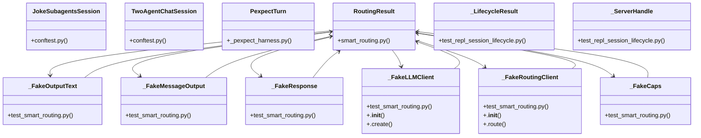

# Community 15

> 1025 nodes · cohesion 0.00

## Key Concepts

- [expect()](file:///C:/Users/1/github-pr/agent-meow/agent_meow/server/static/web-ui/assets/index-D0w-K1tO.js#L579) (318 connections)
- [fill()](file:///C:/Users/1/github-pr/agent-meow/agent_meow/server/static/web-ui/assets/index-D0w-K1tO.js#L814) (106 connections)
- [compile()](file:///C:/Users/1/github-pr/agent-meow/agent_meow/server/static/web-ui/assets/index-D0w-K1tO.js#L171) (91 connections)
- [escape()](file:///C:/Users/1/github-pr/agent-meow/agent_meow/server/static/web-ui/assets/index-D0w-K1tO.js#L117) (58 connections)
- [.launch()](file:///C:/Users/1/github-pr/agent-meow/tests/runner/test_session_resources.py#L1553) (52 connections)
- [.route()](file:///C:/Users/1/github-pr/agent-meow/tests/server/test_smart_routing.py#L66) (49 connections)
- [test_start_session.py](file:///C:/Users/1/github-pr/agent-meow/tests/e2e_ui/start_session/test_start_session.py#L1) (47 connections)
- [press()](file:///C:/Users/1/github-pr/agent-meow/web/src/hooks/useSidebarToggleHotkeys.test.tsx#L12) (32 connections)
- [test_smart_routing.py](file:///C:/Users/1/github-pr/agent-meow/tests/server/test_smart_routing.py#L1) (29 connections)
- [clean_exit()](file:///C:/Users/1/github-pr/agent-meow/tests/e2e/omnigent/_pexpect_harness.py#L360) (29 connections)
- [spawn_omnigent_run()](file:///C:/Users/1/github-pr/agent-meow/tests/e2e/omnigent/_pexpect_harness.py#L163) (27 connections)
- [test_repl_session_lifecycle.py](file:///C:/Users/1/github-pr/agent-meow/tests/e2e/omnigent/test_repl_session_lifecycle.py#L1) (24 connections)
- [submit_prompt()](file:///C:/Users/1/github-pr/agent-meow/tests/e2e/omnigent/_pexpect_harness.py#L294) (24 connections)
- [open_right_rail()](file:///C:/Users/1/github-pr/agent-meow/tests/e2e_ui/conftest.py#L72) (23 connections)
- [RoutingResult](file:///C:/Users/1/github-pr/agent-meow/agent_meow/server/smart_routing.py#L79) (22 connections)
- [_run_in_fresh_loop()](file:///C:/Users/1/github-pr/agent-meow/tests/e2e_ui/start_session/test_start_session.py#L71) (19 connections)
- [focus](file:///C:/Users/1/github-pr/agent-meow/web/src/lib/browserNotifications.test.ts#L122) (18 connections)
- [cel_policy()](file:///C:/Users/1/github-pr/agent-meow/agent_meow/policies/builtins/cel.py#L44) (18 connections)
- [test_repl_recover_after_runner_death()](file:///C:/Users/1/github-pr/agent-meow/tests/e2e/omnigent/test_repl_session_lifecycle.py#L791) (18 connections)
- [_register_common_routes()](file:///C:/Users/1/github-pr/agent-meow/tests/e2e_ui/start_session/test_start_session.py#L410) (18 connections)
- [strip_ansi()](file:///C:/Users/1/github-pr/agent-meow/tests/e2e/omnigent/_pexpect_harness.py#L90) (17 connections)
- [infer_models()](file:///C:/Users/1/github-pr/agent-meow/agent_meow/server/smart_routing.py#L65) (17 connections)
- [_wait_until()](file:///C:/Users/1/github-pr/agent-meow/tests/e2e_ui/start_session/test_start_session.py#L98) (17 connections)
- [await_turn_complete()](file:///C:/Users/1/github-pr/agent-meow/tests/e2e/omnigent/_pexpect_harness.py#L310) (16 connections)
- [.reload()](file:///C:/Users/1/github-pr/agent-meow/web/ios/Omnigent/WebViewModel.swift#L36) (16 connections)
- *... and 1000 more nodes in this community*

## Class Diagram

## Relationships

- [[Community 3]] (13 shared connections)
- [[Community 4]] (3 shared connections)
- [[Community 19]] (1 shared connections)

## Source Files

- [C:\Users\1\github-pr\agent-meow\agent_meow\inner\egress\rules.py](file:///C:/Users/1/github-pr/agent-meow/agent_meow/inner/egress/rules.py)
- [C:\Users\1\github-pr\agent-meow\agent_meow\policies\builtins\cel.py](file:///C:/Users/1/github-pr/agent-meow/agent_meow/policies/builtins/cel.py)
- [C:\Users\1\github-pr\agent-meow\agent_meow\server\smart_routing.py](file:///C:/Users/1/github-pr/agent-meow/agent_meow/server/smart_routing.py)
- [C:\Users\1\github-pr\agent-meow\agent_meow\server\static\web-ui\assets\index-D0w-K1tO.js](file:///C:/Users/1/github-pr/agent-meow/agent_meow/server/static/web-ui/assets/index-D0w-K1tO.js)
- [C:\Users\1\github-pr\agent-meow\agent_meow\server\static\web-ui\assets\monacoCodeEditor-BzxvY4cV.js](file:///C:/Users/1/github-pr/agent-meow/agent_meow/server/static/web-ui/assets/monacoCodeEditor-BzxvY4cV.js)
- [C:\Users\1\github-pr\agent-meow\scripts\update_versions.py](file:///C:/Users/1/github-pr/agent-meow/scripts/update_versions.py)
- [C:\Users\1\github-pr\agent-meow\tests\e2e\omnigent\_pexpect_harness.py](file:///C:/Users/1/github-pr/agent-meow/tests/e2e/omnigent/_pexpect_harness.py)
- [C:\Users\1\github-pr\agent-meow\tests\e2e\omnigent\_repl_test_helpers.py](file:///C:/Users/1/github-pr/agent-meow/tests/e2e/omnigent/_repl_test_helpers.py)
- [C:\Users\1\github-pr\agent-meow\tests\e2e\omnigent\test_host_ctrl_c_stop_server.py](file:///C:/Users/1/github-pr/agent-meow/tests/e2e/omnigent/test_host_ctrl_c_stop_server.py)
- [C:\Users\1\github-pr\agent-meow\tests\e2e\omnigent\test_repl_bang_e2e.py](file:///C:/Users/1/github-pr/agent-meow/tests/e2e/omnigent/test_repl_bang_e2e.py)
- [C:\Users\1\github-pr\agent-meow\tests\e2e\omnigent\test_repl_ctrl_c_interrupt.py](file:///C:/Users/1/github-pr/agent-meow/tests/e2e/omnigent/test_repl_ctrl_c_interrupt.py)
- [C:\Users\1\github-pr\agent-meow\tests\e2e\omnigent\test_repl_ctrl_l_clear.py](file:///C:/Users/1/github-pr/agent-meow/tests/e2e/omnigent/test_repl_ctrl_l_clear.py)
- [C:\Users\1\github-pr\agent-meow\tests\e2e\omnigent\test_repl_ctrl_o_overview.py](file:///C:/Users/1/github-pr/agent-meow/tests/e2e/omnigent/test_repl_ctrl_o_overview.py)
- [C:\Users\1\github-pr\agent-meow\tests\e2e\omnigent\test_repl_ctrl_r_search.py](file:///C:/Users/1/github-pr/agent-meow/tests/e2e/omnigent/test_repl_ctrl_r_search.py)
- [C:\Users\1\github-pr\agent-meow\tests\e2e\omnigent\test_repl_effort_e2e.py](file:///C:/Users/1/github-pr/agent-meow/tests/e2e/omnigent/test_repl_effort_e2e.py)
- [C:\Users\1\github-pr\agent-meow\tests\e2e\omnigent\test_repl_history_recall.py](file:///C:/Users/1/github-pr/agent-meow/tests/e2e/omnigent/test_repl_history_recall.py)
- [C:\Users\1\github-pr\agent-meow\tests\e2e\omnigent\test_repl_inline_tool_streaming.py](file:///C:/Users/1/github-pr/agent-meow/tests/e2e/omnigent/test_repl_inline_tool_streaming.py)
- [C:\Users\1\github-pr\agent-meow\tests\e2e\omnigent\test_repl_model_e2e.py](file:///C:/Users/1/github-pr/agent-meow/tests/e2e/omnigent/test_repl_model_e2e.py)
- [C:\Users\1\github-pr\agent-meow\tests\e2e\omnigent\test_repl_multiline.py](file:///C:/Users/1/github-pr/agent-meow/tests/e2e/omnigent/test_repl_multiline.py)
- [C:\Users\1\github-pr\agent-meow\tests\e2e\omnigent\test_repl_overview_subagent_visibility.py](file:///C:/Users/1/github-pr/agent-meow/tests/e2e/omnigent/test_repl_overview_subagent_visibility.py)

## Audit Trail

- EXTRACTED: 2630 (55%)
- INFERRED: 2151 (45%)
- AMBIGUOUS: 0 (0%)

---

*Part of the graphify knowledge wiki. See [[index]] to navigate.*