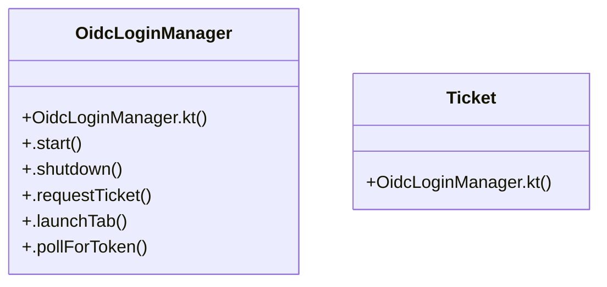

# Community 152

> 8 nodes · cohesion 0.25

## Key Concepts

- [OidcLoginManager](file:///C:/Users/1/github-pr/agent-meow/web/android/app/src/main/java/io/cubecloud/agentmeow/OidcLoginManager.kt#L32) (6 connections)
- [OidcLoginManager.kt](file:///C:/Users/1/github-pr/agent-meow/web/android/app/src/main/java/io/cubecloud/agentmeow/OidcLoginManager.kt#L1) (2 connections)
- [.launchTab()](file:///C:/Users/1/github-pr/agent-meow/web/android/app/src/main/java/io/cubecloud/agentmeow/OidcLoginManager.kt#L111) (1 connections)
- [.pollForToken()](file:///C:/Users/1/github-pr/agent-meow/web/android/app/src/main/java/io/cubecloud/agentmeow/OidcLoginManager.kt#L120) (1 connections)
- [.requestTicket()](file:///C:/Users/1/github-pr/agent-meow/web/android/app/src/main/java/io/cubecloud/agentmeow/OidcLoginManager.kt#L87) (1 connections)
- [.shutdown()](file:///C:/Users/1/github-pr/agent-meow/web/android/app/src/main/java/io/cubecloud/agentmeow/OidcLoginManager.kt#L80) (1 connections)
- [.start()](file:///C:/Users/1/github-pr/agent-meow/web/android/app/src/main/java/io/cubecloud/agentmeow/OidcLoginManager.kt#L51) (1 connections)
- [Ticket](file:///C:/Users/1/github-pr/agent-meow/web/android/app/src/main/java/io/cubecloud/agentmeow/OidcLoginManager.kt#L85) (1 connections)

## Class Diagram

## Relationships

- No strong cross-community connections detected

## Source Files

- [C:\Users\1\github-pr\agent-meow\web\android\app\src\main\java\io\cubecloud\agentmeow\OidcLoginManager.kt](file:///C:/Users/1/github-pr/agent-meow/web/android/app/src/main/java/io/cubecloud/agentmeow/OidcLoginManager.kt)

## Audit Trail

- EXTRACTED: 14 (100%)
- INFERRED: 0 (0%)
- AMBIGUOUS: 0 (0%)

---

*Part of the graphify knowledge wiki. See [[index]] to navigate.*