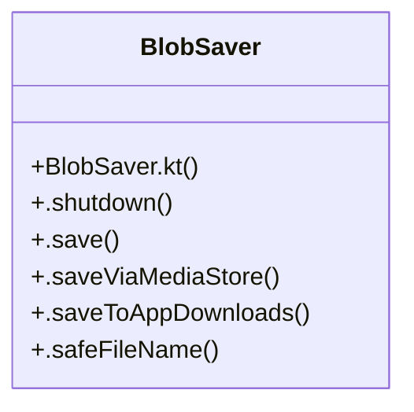

# Community 162

> 7 nodes · cohesion 0.29

## Key Concepts

- [BlobSaver](file:///C:/Users/1/github-pr/agent-meow/web/android/app/src/main/java/io/cubecloud/agentmeow/BlobSaver.kt#L25) (6 connections)
- [.safeFileName()](file:///C:/Users/1/github-pr/agent-meow/web/android/app/src/main/java/io/cubecloud/agentmeow/BlobSaver.kt#L85) (1 connections)
- [.save()](file:///C:/Users/1/github-pr/agent-meow/web/android/app/src/main/java/io/cubecloud/agentmeow/BlobSaver.kt#L34) (1 connections)
- [.saveToAppDownloads()](file:///C:/Users/1/github-pr/agent-meow/web/android/app/src/main/java/io/cubecloud/agentmeow/BlobSaver.kt#L76) (1 connections)
- [.saveViaMediaStore()](file:///C:/Users/1/github-pr/agent-meow/web/android/app/src/main/java/io/cubecloud/agentmeow/BlobSaver.kt#L56) (1 connections)
- [.shutdown()](file:///C:/Users/1/github-pr/agent-meow/web/android/app/src/main/java/io/cubecloud/agentmeow/BlobSaver.kt#L30) (1 connections)
- [BlobSaver.kt](file:///C:/Users/1/github-pr/agent-meow/web/android/app/src/main/java/io/cubecloud/agentmeow/BlobSaver.kt#L1) (1 connections)

## Class Diagram

## Relationships

- No strong cross-community connections detected

## Source Files

- [C:\Users\1\github-pr\agent-meow\web\android\app\src\main\java\io\cubecloud\agentmeow\BlobSaver.kt](file:///C:/Users/1/github-pr/agent-meow/web/android/app/src/main/java/io/cubecloud/agentmeow/BlobSaver.kt)

## Audit Trail

- EXTRACTED: 12 (100%)
- INFERRED: 0 (0%)
- AMBIGUOUS: 0 (0%)

---

*Part of the graphify knowledge wiki. See [[index]] to navigate.*