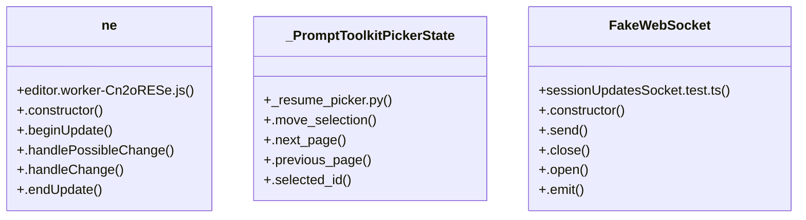

# Community 17

> 806 nodes · cohesion 0.01

## Key Concepts

- [editor.worker-Cn2oRESe.js](file:///C:/Users/1/github-pr/agent-meow/agent_meow/server/static/web-ui/assets/editor.worker-Cn2oRESe.js#L1) (544 connections)
- [MIN](file:///C:/Users/1/github-pr/agent-meow/web/src/lib/relativeTime.test.ts#L5) (148 connections)
- [push()](file:///C:/Users/1/github-pr/agent-meow/agent_meow/server/static/web-ui/assets/editor.worker-Cn2oRESe.js#L5) (51 connections)
- [warn](file:///C:/Users/1/github-pr/agent-meow/web/src/hooks/useUserMessageNav.test.tsx#L151) (43 connections)
- [error()](file:///C:/Users/1/github-pr/agent-meow/agent_meow/server/static/web-ui/assets/editor.worker-Cn2oRESe.js#L26) (33 connections)
- [constructor()](file:///C:/Users/1/github-pr/agent-meow/agent_meow/server/static/web-ui/assets/editor.worker-Cn2oRESe.js#L5) (32 connections)
- [get()](file:///C:/Users/1/github-pr/agent-meow/agent_meow/server/static/web-ui/assets/editor.worker-Cn2oRESe.js#L7) (31 connections)
- [ComputeDiff()](file:///C:/Users/1/github-pr/agent-meow/agent_meow/server/static/web-ui/assets/editor.worker-Cn2oRESe.js#L7) (26 connections)
- [nativeBridge.ts](file:///C:/Users/1/github-pr/agent-meow/web/src/lib/nativeBridge.ts#L1) (25 connections)
- [linear-B9JNmnuk.js](file:///C:/Users/1/github-pr/agent-meow/agent_meow/server/static/web-ui/assets/linear-B9JNmnuk.js#L1) (24 connections)
- [ImageLightbox.tsx](file:///C:/Users/1/github-pr/agent-meow/web/src/components/ImageLightbox.tsx#L1) (24 connections)
- [set()](file:///C:/Users/1/github-pr/agent-meow/agent_meow/server/static/web-ui/assets/editor.worker-Cn2oRESe.js#L7) (24 connections)
- [useResizableInlinePanel.ts](file:///C:/Users/1/github-pr/agent-meow/web/src/hooks/useResizableInlinePanel.ts#L1) (22 connections)
- [t()](file:///C:/Users/1/github-pr/agent-meow/agent_meow/server/static/web-ui/assets/editor.worker-Cn2oRESe.js#L5) (22 connections)
- [fa()](file:///C:/Users/1/github-pr/agent-meow/agent_meow/server/static/web-ui/assets/editor.worker-Cn2oRESe.js#L22) (21 connections)
- [join()](file:///C:/Users/1/github-pr/agent-meow/agent_meow/server/static/web-ui/assets/editor.worker-Cn2oRESe.js#L8) (18 connections)
- [useResizableCommentsPanel.ts](file:///C:/Users/1/github-pr/agent-meow/web/src/hooks/useResizableCommentsPanel.ts#L1) (17 connections)
- [r()](file:///C:/Users/1/github-pr/agent-meow/agent_meow/server/static/web-ui/assets/editor.worker-Cn2oRESe.js#L5) (17 connections)
- [substring()](file:///C:/Users/1/github-pr/agent-meow/agent_meow/server/static/web-ui/assets/editor.worker-Cn2oRESe.js#L8) (17 connections)
- [wa()](file:///C:/Users/1/github-pr/agent-meow/agent_meow/server/static/web-ui/assets/editor.worker-Cn2oRESe.js#L22) (17 connections)
- [useResizablePanel.ts](file:///C:/Users/1/github-pr/agent-meow/web/src/hooks/useResizablePanel.ts#L1) (16 connections)
- [useResizableSidebar.ts](file:///C:/Users/1/github-pr/agent-meow/web/src/hooks/useResizableSidebar.ts#L1) (16 connections)
- [add()](file:///C:/Users/1/github-pr/agent-meow/agent_meow/server/static/web-ui/assets/editor.worker-Cn2oRESe.js#L5) (16 connections)
- [compute()](file:///C:/Users/1/github-pr/agent-meow/agent_meow/server/static/web-ui/assets/editor.worker-Cn2oRESe.js#L21) (16 connections)
- [$computeMoreMinimalEdits()](file:///C:/Users/1/github-pr/agent-meow/agent_meow/server/static/web-ui/assets/editor.worker-Cn2oRESe.js#L26) (16 connections)
- *... and 781 more nodes in this community*

## Class Diagram

## Relationships

- [[Community 4]] (1 shared connections)
- [[Community 6]] (1 shared connections)
- [[Community 3]] (1 shared connections)

## Source Files

- [C:\Users\1\github-pr\agent-meow\agent_meow\claude_native.py](file:///C:/Users/1/github-pr/agent-meow/agent_meow/claude_native.py)
- [C:\Users\1\github-pr\agent-meow\agent_meow\repl\_resume_picker.py](file:///C:/Users/1/github-pr/agent-meow/agent_meow/repl/_resume_picker.py)
- [C:\Users\1\github-pr\agent-meow\agent_meow\server\static\web-ui\assets\chunk-NNHCCRGN-DlpIbxXb.js](file:///C:/Users/1/github-pr/agent-meow/agent_meow/server/static/web-ui/assets/chunk-NNHCCRGN-DlpIbxXb.js)
- [C:\Users\1\github-pr\agent-meow\agent_meow\server\static\web-ui\assets\diagram-2AECGRRQ-C4kRrWF7.js](file:///C:/Users/1/github-pr/agent-meow/agent_meow/server/static/web-ui/assets/diagram-2AECGRRQ-C4kRrWF7.js)
- [C:\Users\1\github-pr\agent-meow\agent_meow\server\static\web-ui\assets\editor.worker-Cn2oRESe.js](file:///C:/Users/1/github-pr/agent-meow/agent_meow/server/static/web-ui/assets/editor.worker-Cn2oRESe.js)
- [C:\Users\1\github-pr\agent-meow\agent_meow\server\static\web-ui\assets\linear-B9JNmnuk.js](file:///C:/Users/1/github-pr/agent-meow/agent_meow/server/static/web-ui/assets/linear-B9JNmnuk.js)
- [C:\Users\1\github-pr\agent-meow\agent_meow\server\static\web-ui\assets\src-r2kqB7XI.js](file:///C:/Users/1/github-pr/agent-meow/agent_meow/server/static/web-ui/assets/src-r2kqB7XI.js)
- [C:\Users\1\github-pr\agent-meow\agent_meow\spec\types.py](file:///C:/Users/1/github-pr/agent-meow/agent_meow/spec/types.py)
- [C:\Users\1\github-pr\agent-meow\tests\runtime\test_llm_retry.py](file:///C:/Users/1/github-pr/agent-meow/tests/runtime/test_llm_retry.py)
- [C:\Users\1\github-pr\agent-meow\web\src\components\ImageLightbox.tsx](file:///C:/Users/1/github-pr/agent-meow/web/src/components/ImageLightbox.tsx)
- [C:\Users\1\github-pr\agent-meow\web\src\hooks\useAutoGrowTextarea.ts](file:///C:/Users/1/github-pr/agent-meow/web/src/hooks/useAutoGrowTextarea.ts)
- [C:\Users\1\github-pr\agent-meow\web\src\hooks\useNativeServerSwitcher.ts](file:///C:/Users/1/github-pr/agent-meow/web/src/hooks/useNativeServerSwitcher.ts)
- [C:\Users\1\github-pr\agent-meow\web\src\hooks\useResizableCommentsPanel.ts](file:///C:/Users/1/github-pr/agent-meow/web/src/hooks/useResizableCommentsPanel.ts)
- [C:\Users\1\github-pr\agent-meow\web\src\hooks\useResizableInlinePanel.ts](file:///C:/Users/1/github-pr/agent-meow/web/src/hooks/useResizableInlinePanel.ts)
- [C:\Users\1\github-pr\agent-meow\web\src\hooks\useResizablePanel.ts](file:///C:/Users/1/github-pr/agent-meow/web/src/hooks/useResizablePanel.ts)
- [C:\Users\1\github-pr\agent-meow\web\src\hooks\useResizableSidebar.ts](file:///C:/Users/1/github-pr/agent-meow/web/src/hooks/useResizableSidebar.ts)
- [C:\Users\1\github-pr\agent-meow\web\src\hooks\useUserMessageNav.test.tsx](file:///C:/Users/1/github-pr/agent-meow/web/src/hooks/useUserMessageNav.test.tsx)
- [C:\Users\1\github-pr\agent-meow\web\src\lib\browserNotifications.ts](file:///C:/Users/1/github-pr/agent-meow/web/src/lib/browserNotifications.ts)
- [C:\Users\1\github-pr\agent-meow\web\src\lib\identity.ts](file:///C:/Users/1/github-pr/agent-meow/web/src/lib/identity.ts)
- [C:\Users\1\github-pr\agent-meow\web\src\lib\nativeBridge.ts](file:///C:/Users/1/github-pr/agent-meow/web/src/lib/nativeBridge.ts)

## Audit Trail

- EXTRACTED: 3279 (87%)
- INFERRED: 502 (13%)
- AMBIGUOUS: 0 (0%)

---

*Part of the graphify knowledge wiki. See [[index]] to navigate.*