# Community 18

> 738 nodes · cohesion 0.01

## Key Concepts

- [HelloFrame](file:///C:/Users/1/github-pr/agent-meow/agent_meow/runner/transports/ws_tunnel/frames.py#L52) (371 connections)
- [RequestFrame](file:///C:/Users/1/github-pr/agent-meow/agent_meow/runner/transports/ws_tunnel/frames.py#L69) (186 connections)
- [ResponseHeadFrame](file:///C:/Users/1/github-pr/agent-meow/agent_meow/runner/transports/ws_tunnel/frames.py#L83) (182 connections)
- [ResponseBodyFrame](file:///C:/Users/1/github-pr/agent-meow/agent_meow/runner/transports/ws_tunnel/frames.py#L92) (155 connections)
- [WSFrame](file:///C:/Users/1/github-pr/agent-meow/agent_meow/runner/transports/ws_tunnel/frames.py#L150) (152 connections)
- [register()](file:///C:/Users/1/github-pr/agent-meow/web/src/lib/accountsApi.ts#L154) (151 connections)
- [ResponseEndFrame](file:///C:/Users/1/github-pr/agent-meow/agent_meow/runner/transports/ws_tunnel/frames.py#L101) (150 connections)
- [WSCloseFrame](file:///C:/Users/1/github-pr/agent-meow/agent_meow/runner/transports/ws_tunnel/frames.py#L164) (147 connections)
- [WSTunnelTransport](file:///C:/Users/1/github-pr/agent-meow/agent_meow/runner/transports/ws_tunnel/transport.py#L102) (133 connections)
- [PingFrame](file:///C:/Users/1/github-pr/agent-meow/agent_meow/runner/transports/ws_tunnel/frames.py#L116) (126 connections)
- [RequestCancelFrame](file:///C:/Users/1/github-pr/agent-meow/agent_meow/runner/transports/ws_tunnel/frames.py#L108) (68 connections)
- [WSOpenFrame](file:///C:/Users/1/github-pr/agent-meow/agent_meow/runner/transports/ws_tunnel/frames.py#L130) (68 connections)
- [.send_input()](file:///C:/Users/1/github-pr/agent-meow/tests/onboarding/sandboxes/test_daytona.py#L115) (60 connections)
- [RunnerSession](file:///C:/Users/1/github-pr/agent-meow/agent_meow/runner/transports/ws_tunnel/registry.py#L70) (57 connections)
- [WSChannelState](file:///C:/Users/1/github-pr/agent-meow/agent_meow/runner/transports/ws_tunnel/registry.py#L155) (42 connections)
- [token_bound_runner_id()](file:///C:/Users/1/github-pr/agent-meow/agent_meow/runner/identity.py#L98) (40 connections)
- [test_runner_tunnel_route.py](file:///C:/Users/1/github-pr/agent-meow/tests/server/integration/test_runner_tunnel_route.py#L1) (39 connections)
- [frames.py](file:///C:/Users/1/github-pr/agent-meow/agent_meow/runner/transports/ws_tunnel/frames.py#L1) (38 connections)
- [_NoopWS](file:///C:/Users/1/github-pr/agent-meow/tests/runner/transports/ws_tunnel/test_registry_extended.py#L25) (37 connections)
- [test_registry_extended.py](file:///C:/Users/1/github-pr/agent-meow/tests/runner/transports/ws_tunnel/test_registry_extended.py#L1) (35 connections)
- [encode_frame()](file:///C:/Users/1/github-pr/agent-meow/agent_meow/runner/transports/ws_tunnel/frames.py#L190) (35 connections)
- [decode_frame()](file:///C:/Users/1/github-pr/agent-meow/agent_meow/runner/transports/ws_tunnel/frames.py#L281) (34 connections)
- [test_registry.py](file:///C:/Users/1/github-pr/agent-meow/tests/runner/transports/ws_tunnel/test_registry.py#L1) (30 connections)
- [_hello()](file:///C:/Users/1/github-pr/agent-meow/tests/runner/transports/ws_tunnel/test_registry_extended.py#L48) (29 connections)
- [test_serve.py](file:///C:/Users/1/github-pr/agent-meow/tests/runner/transports/ws_tunnel/test_serve.py#L1) (28 connections)
- *... and 713 more nodes in this community*

## Class Diagram

```mermaid
classDiagram
    class FrameKind {
        +frames.py()
    }
    class HelloFrame {
        +frames.py()
    }
    class PingFrame {
        +frames.py()
    }
    class RequestCancelFrame {
        +frames.py()
    }
    class RequestFrame {
        +frames.py()
    }
    class ResponseBodyFrame {
        +frames.py()
    }
    class ResponseEndFrame {
        +frames.py()
    }
    class ResponseHeadFrame {
        +frames.py()
    }
    class WSCloseFrame {
        +frames.py()
    }
    class WSFrame {
        +frames.py()
    }
    class WSOpenFrame {
        +frames.py()
    }
    class FakeRunnerWebSocket {
        +helpers.py()
        +.send_text()
        +.receive_text()
    }
    class RequestState {
        +registry.py()
    }
    class RunnerConnectWaitState {
        +registry.py()
    }
    class RunnerSession {
        +registry.py()
    }
    class WebSocketLike {
        +registry.py()
        +.send_text()
        +.receive_text()
    }
    class WSChannelState {
        +registry.py()
    }
    class _TunneledWSConn {
        +_runner_ws_tunnel.py()
        +.__init__()
        +.__aenter__()
        +.__aexit__()
        +.send()
        +.recv()
    }
    class _RunnerWSChannel {
        +serve.py()
        +.__init__()
    }
    class _NoopWS {
        +test_registry_extended.py()
        +.send_text()
        +.receive_text()
    }
    class _RecordingWS {
        +test_registry_extended.py()
        +.__init__()
        +.send_text()
        +.receive_text()
    }
    class _NoopWS {
        +test_registry.py()
        +.send_text()
        +.receive_text()
    }
    class _CredentialHeaderAuthProvider {
        +test_runner_tunnel_route.py()
        +.__init__()
        +.get_user_id()
    }
    class _MintingAuthProvider {
        +test_runner_tunnel_route.py()
        +.mint_runner_token()
    }
    class RoutedTunnelClient {
        +test_runner_tunnel_route.py()
    }
    class TunnelRouteApp {
        +test_runner_tunnel_route.py()
    }
    class _Close {
        +test_serve.py()
    }
    class _Closed {
        +test_serve.py()
        +.__init__()
    }
    class _NoopWS {
        +test_transport.py()
        +.send_text()
        +.receive_text()
    }
    class _FakeWS {
        +test_tunnel_e2e.py()
        +.__init__()
        +.link()
        +.send_text()
        +.receive_text()
    }
    class _ThreadHandoffWS {
        +test_tunnel_e2e.py()
        +.__init__()
        +.send_text()
        +.receive_text()
    }
    class _FakeWS {
        +test_ws_attach_e2e.py()
        +.__init__()
        +.link()
        +.send_text()
        +.receive_text()
    }
    class _TunneledByteStream {
        +transport.py()
        +.__init__()
        +.__aiter__()
        +.aclose()
    }
    class WSTunnelTransport {
        +transport.py()
        +.__init__()
        +.handle_async_request()
        +.aclose()
    }
    HelloFrame --> WebSocketLike
    HelloFrame --> RunnerSession
    HelloFrame --> RequestState
    HelloFrame --> WSChannelState
    HelloFrame --> RunnerConnectWaitState
    HelloFrame --> _RunnerWSChannel
    HelloFrame --> _NoopWS
    HelloFrame --> _NoopWS
    HelloFrame --> _RecordingWS
    HelloFrame --> _NoopWS
    HelloFrame --> _FakeWS
    HelloFrame --> _ThreadHandoffWS
    HelloFrame --> _FakeWS
    HelloFrame --> FakeRunnerWebSocket
    HelloFrame --> RoutedTunnelClient
    HelloFrame --> TunnelRouteApp
    HelloFrame --> _CredentialHeaderAuthProvider
    HelloFrame --> _MintingAuthProvider
    PingFrame --> _RunnerWSChannel
    PingFrame --> _Close
    PingFrame --> _Closed
    RequestCancelFrame --> _RunnerWSChannel
    RequestCancelFrame --> _TunneledByteStream
    RequestCancelFrame --> WSTunnelTransport
    RequestCancelFrame --> _Close
    RequestCancelFrame --> _Closed
    RequestFrame --> _RunnerWSChannel
    RequestFrame --> _TunneledByteStream
    RequestFrame --> WSTunnelTransport
    RequestFrame --> _Close
    RequestFrame --> _Closed
    RequestFrame --> _FakeWS
    RequestFrame --> _ThreadHandoffWS
    RequestFrame --> RoutedTunnelClient
    RequestFrame --> TunnelRouteApp
    RequestFrame --> _CredentialHeaderAuthProvider
    RequestFrame --> _MintingAuthProvider
    ResponseBodyFrame --> WebSocketLike
    ResponseBodyFrame --> RunnerSession
    ResponseBodyFrame --> RequestState
    ResponseBodyFrame --> WSChannelState
    ResponseBodyFrame --> RunnerConnectWaitState
    ResponseBodyFrame --> _RunnerWSChannel
    ResponseBodyFrame --> _TunneledByteStream
    ResponseBodyFrame --> WSTunnelTransport
    ResponseBodyFrame --> _NoopWS
    ResponseBodyFrame --> _NoopWS
    ResponseBodyFrame --> _FakeWS
    ResponseBodyFrame --> _ThreadHandoffWS
    ResponseEndFrame --> WebSocketLike
    ResponseEndFrame --> RunnerSession
    ResponseEndFrame --> RequestState
    ResponseEndFrame --> WSChannelState
    ResponseEndFrame --> RunnerConnectWaitState
    ResponseEndFrame --> _RunnerWSChannel
    ResponseEndFrame --> _NoopWS
    ResponseEndFrame --> _NoopWS
    ResponseEndFrame --> _FakeWS
    ResponseEndFrame --> _ThreadHandoffWS
    ResponseHeadFrame --> WebSocketLike
    ResponseHeadFrame --> RunnerSession
    ResponseHeadFrame --> RequestState
    ResponseHeadFrame --> WSChannelState
    ResponseHeadFrame --> RunnerConnectWaitState
    ResponseHeadFrame --> _RunnerWSChannel
    ResponseHeadFrame --> _NoopWS
    ResponseHeadFrame --> _NoopWS
    ResponseHeadFrame --> _RecordingWS
    ResponseHeadFrame --> _NoopWS
    ResponseHeadFrame --> _FakeWS
    ResponseHeadFrame --> _ThreadHandoffWS
    WSCloseFrame --> WebSocketLike
    WSCloseFrame --> RunnerSession
    WSCloseFrame --> RequestState
    WSCloseFrame --> WSChannelState
    WSCloseFrame --> RunnerConnectWaitState
    WSCloseFrame --> _RunnerWSChannel
    WSCloseFrame --> _TunneledWSConn
    WSCloseFrame --> _NoopWS
    WSCloseFrame --> _RecordingWS
    WSCloseFrame --> _Close
    WSCloseFrame --> _Closed
    WSCloseFrame --> _FakeWS
    WSFrame --> WebSocketLike
    WSFrame --> RunnerSession
    WSFrame --> RequestState
    WSFrame --> WSChannelState
    WSFrame --> RunnerConnectWaitState
    WSFrame --> _RunnerWSChannel
    WSFrame --> _TunneledWSConn
    WSFrame --> _NoopWS
    WSFrame --> _RecordingWS
    WSFrame --> _Close
    WSFrame --> _Closed
    WSFrame --> _FakeWS
    WSOpenFrame --> _RunnerWSChannel
    WSOpenFrame --> _TunneledWSConn
    WSOpenFrame --> _Close
    WSOpenFrame --> _Closed
    WSOpenFrame --> _FakeWS
    FakeRunnerWebSocket --> HelloFrame
    RequestState --> HelloFrame
    RequestState --> ResponseBodyFrame
    RequestState --> ResponseEndFrame
    RequestState --> ResponseHeadFrame
    RequestState --> WSCloseFrame
    RequestState --> WSFrame
    RequestState --> _TunneledByteStream
    RequestState --> WSTunnelTransport
    RunnerConnectWaitState --> HelloFrame
    RunnerConnectWaitState --> ResponseBodyFrame
    RunnerConnectWaitState --> ResponseEndFrame
    RunnerConnectWaitState --> ResponseHeadFrame
    RunnerConnectWaitState --> WSCloseFrame
    RunnerConnectWaitState --> WSFrame
    RunnerSession --> HelloFrame
    RunnerSession --> ResponseBodyFrame
    RunnerSession --> ResponseEndFrame
    RunnerSession --> ResponseHeadFrame
    RunnerSession --> WSCloseFrame
    RunnerSession --> WSFrame
    RunnerSession --> _TunneledWSConn
    RunnerSession --> _FakeWS
    RunnerSession --> _ThreadHandoffWS
    WebSocketLike --> HelloFrame
    WebSocketLike --> ResponseBodyFrame
    WebSocketLike --> ResponseEndFrame
    WebSocketLike --> ResponseHeadFrame
    WebSocketLike --> WSCloseFrame
    WebSocketLike --> WSFrame
    WSChannelState --> HelloFrame
    WSChannelState --> ResponseBodyFrame
    WSChannelState --> ResponseEndFrame
    WSChannelState --> ResponseHeadFrame
    WSChannelState --> WSCloseFrame
    WSChannelState --> WSFrame
    WSChannelState --> _TunneledWSConn
    WSChannelState --> _NoopWS
    WSChannelState --> _RecordingWS
    _TunneledWSConn --> WSCloseFrame
    _TunneledWSConn --> WSFrame
    _TunneledWSConn --> WSOpenFrame
    _TunneledWSConn --> RunnerSession
    _TunneledWSConn --> WSChannelState
    _RunnerWSChannel --> HelloFrame
    _RunnerWSChannel --> PingFrame
    _RunnerWSChannel --> RequestCancelFrame
    _RunnerWSChannel --> RequestFrame
    _RunnerWSChannel --> ResponseBodyFrame
    _RunnerWSChannel --> ResponseEndFrame
    _RunnerWSChannel --> ResponseHeadFrame
    _RunnerWSChannel --> WSCloseFrame
    _RunnerWSChannel --> WSFrame
    _RunnerWSChannel --> WSOpenFrame
    _NoopWS --> HelloFrame
    _NoopWS --> ResponseHeadFrame
    _NoopWS --> WSCloseFrame
    _NoopWS --> WSFrame
    _NoopWS --> WSChannelState
    _RecordingWS --> HelloFrame
    _RecordingWS --> ResponseHeadFrame
    _RecordingWS --> WSCloseFrame
    _RecordingWS --> WSFrame
    _RecordingWS --> WSChannelState
    _NoopWS --> HelloFrame
    _NoopWS --> ResponseBodyFrame
    _NoopWS --> ResponseEndFrame
    _NoopWS --> ResponseHeadFrame
    _MintingAuthProvider <|-- _CredentialHeaderAuthProvider
    _CredentialHeaderAuthProvider --> HelloFrame
    _CredentialHeaderAuthProvider --> RequestFrame
    _CredentialHeaderAuthProvider --> WSTunnelTransport
    _CredentialHeaderAuthProvider <|-- _MintingAuthProvider
    _MintingAuthProvider --> HelloFrame
    _MintingAuthProvider --> RequestFrame
    _MintingAuthProvider --> WSTunnelTransport
    RoutedTunnelClient --> HelloFrame
    RoutedTunnelClient --> RequestFrame
    RoutedTunnelClient --> WSTunnelTransport
    TunnelRouteApp --> HelloFrame
    TunnelRouteApp --> RequestFrame
    TunnelRouteApp --> WSTunnelTransport
    _Close --> PingFrame
    _Close --> RequestCancelFrame
    _Close --> RequestFrame
    _Close --> WSCloseFrame
    _Close --> WSFrame
    _Close --> WSOpenFrame
    _Closed --> PingFrame
    _Closed --> RequestCancelFrame
    _Closed --> RequestFrame
    _Closed --> WSCloseFrame
    _Closed --> WSFrame
    _Closed --> WSOpenFrame
    _NoopWS --> HelloFrame
    _NoopWS --> ResponseBodyFrame
    _NoopWS --> ResponseEndFrame
    _NoopWS --> ResponseHeadFrame
    _NoopWS --> WSTunnelTransport
    _FakeWS --> HelloFrame
    _FakeWS --> RequestFrame
    _FakeWS --> ResponseBodyFrame
    _FakeWS --> ResponseEndFrame
    _FakeWS --> ResponseHeadFrame
    _FakeWS --> RunnerSession
    _FakeWS --> WSTunnelTransport
    _ThreadHandoffWS --> HelloFrame
    _ThreadHandoffWS --> RequestFrame
    _ThreadHandoffWS --> ResponseBodyFrame
    _ThreadHandoffWS --> ResponseEndFrame
    _ThreadHandoffWS --> ResponseHeadFrame
    _ThreadHandoffWS --> RunnerSession
    _ThreadHandoffWS --> WSTunnelTransport
    _FakeWS --> HelloFrame
    _FakeWS --> WSCloseFrame
    _FakeWS --> WSFrame
    _FakeWS --> WSOpenFrame
    _TunneledByteStream --> RequestCancelFrame
    _TunneledByteStream --> RequestFrame
    _TunneledByteStream --> ResponseBodyFrame
    _TunneledByteStream --> RequestState
    WSTunnelTransport --> RequestCancelFrame
    WSTunnelTransport --> RequestFrame
    WSTunnelTransport --> ResponseBodyFrame
    WSTunnelTransport --> RequestState
    WSTunnelTransport --> _NoopWS
    WSTunnelTransport --> _FakeWS
    WSTunnelTransport --> _ThreadHandoffWS
    WSTunnelTransport --> RoutedTunnelClient
    WSTunnelTransport --> TunnelRouteApp
    WSTunnelTransport --> _CredentialHeaderAuthProvider
    WSTunnelTransport --> _MintingAuthProvider
```

## Relationships

- [[Community 4]] (214 shared connections)
- [[Community 3]] (14 shared connections)
- [[Community 1]] (11 shared connections)
- [[Community 13]] (6 shared connections)
- [[Auth Config]] (2 shared connections)
- [[Community 6]] (1 shared connections)

## Source Files

- [C:\Users\1\github-pr\agent-meow\agent_meow\host\frames.py](file:///C:/Users/1/github-pr/agent-meow/agent_meow/host/frames.py)
- [C:\Users\1\github-pr\agent-meow\agent_meow\runner\identity.py](file:///C:/Users/1/github-pr/agent-meow/agent_meow/runner/identity.py)
- [C:\Users\1\github-pr\agent-meow\agent_meow\runner\routing.py](file:///C:/Users/1/github-pr/agent-meow/agent_meow/runner/routing.py)
- [C:\Users\1\github-pr\agent-meow\agent_meow\runner\transports\ws_tunnel\frames.py](file:///C:/Users/1/github-pr/agent-meow/agent_meow/runner/transports/ws_tunnel/frames.py)
- [C:\Users\1\github-pr\agent-meow\agent_meow\runner\transports\ws_tunnel\registry.py](file:///C:/Users/1/github-pr/agent-meow/agent_meow/runner/transports/ws_tunnel/registry.py)
- [C:\Users\1\github-pr\agent-meow\agent_meow\runner\transports\ws_tunnel\serve.py](file:///C:/Users/1/github-pr/agent-meow/agent_meow/runner/transports/ws_tunnel/serve.py)
- [C:\Users\1\github-pr\agent-meow\agent_meow\runner\transports\ws_tunnel\transport.py](file:///C:/Users/1/github-pr/agent-meow/agent_meow/runner/transports/ws_tunnel/transport.py)
- [C:\Users\1\github-pr\agent-meow\agent_meow\server\_runner_ws_tunnel.py](file:///C:/Users/1/github-pr/agent-meow/agent_meow/server/_runner_ws_tunnel.py)
- [C:\Users\1\github-pr\agent-meow\agent_meow\server\routes\host_tunnel.py](file:///C:/Users/1/github-pr/agent-meow/agent_meow/server/routes/host_tunnel.py)
- [C:\Users\1\github-pr\agent-meow\agent_meow\server\routes\runner_tunnel.py](file:///C:/Users/1/github-pr/agent-meow/agent_meow/server/routes/runner_tunnel.py)
- [C:\Users\1\github-pr\agent-meow\agent_meow\server\routes\sessions.py](file:///C:/Users/1/github-pr/agent-meow/agent_meow/server/routes/sessions.py)
- [C:\Users\1\github-pr\agent-meow\agent_meow\server\static\web-ui\assets\index-D0w-K1tO.js](file:///C:/Users/1/github-pr/agent-meow/agent_meow/server/static/web-ui/assets/index-D0w-K1tO.js)
- [C:\Users\1\github-pr\agent-meow\agent_meow\server\static\web-ui\assets\mermaid-parser.core-DM6yBoBA.js](file:///C:/Users/1/github-pr/agent-meow/agent_meow/server/static/web-ui/assets/mermaid-parser.core-DM6yBoBA.js)
- [C:\Users\1\github-pr\agent-meow\agent_meow\server\static\web-ui\assets\xychartDiagram-2RQKCTM6-BdxgoKjt.js](file:///C:/Users/1/github-pr/agent-meow/agent_meow/server/static/web-ui/assets/xychartDiagram-2RQKCTM6-BdxgoKjt.js)
- [C:\Users\1\github-pr\agent-meow\agent_meow\terminals\registry.py](file:///C:/Users/1/github-pr/agent-meow/agent_meow/terminals/registry.py)
- [C:\Users\1\github-pr\agent-meow\tests\e2e\conftest.py](file:///C:/Users/1/github-pr/agent-meow/tests/e2e/conftest.py)
- [C:\Users\1\github-pr\agent-meow\tests\e2e\test_filesystem_changed_files_e2e.py](file:///C:/Users/1/github-pr/agent-meow/tests/e2e/test_filesystem_changed_files_e2e.py)
- [C:\Users\1\github-pr\agent-meow\tests\e2e\test_non_git_changed_files_e2e.py](file:///C:/Users/1/github-pr/agent-meow/tests/e2e/test_non_git_changed_files_e2e.py)
- [C:\Users\1\github-pr\agent-meow\tests\harness_bench\transport.py](file:///C:/Users/1/github-pr/agent-meow/tests/harness_bench/transport.py)
- [C:\Users\1\github-pr\agent-meow\tests\onboarding\sandboxes\test_daytona.py](file:///C:/Users/1/github-pr/agent-meow/tests/onboarding/sandboxes/test_daytona.py)

## Audit Trail

- EXTRACTED: 2047 (29%)
- INFERRED: 5027 (71%)
- AMBIGUOUS: 0 (0%)

---

*Part of the graphify knowledge wiki. See [[index]] to navigate.*