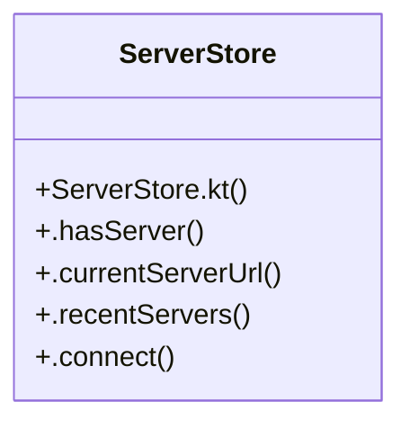

# Community 187

> 6 nodes · cohesion 0.33

## Key Concepts

- [ServerStore](file:///C:/Users/1/github-pr/agent-meow/web/android/app/src/main/java/io/cubecloud/agentmeow/ServerStore.kt#L10) (5 connections)
- [ServerStore.kt](file:///C:/Users/1/github-pr/agent-meow/web/android/app/src/main/java/io/cubecloud/agentmeow/ServerStore.kt#L1) (1 connections)
- [.connect()](file:///C:/Users/1/github-pr/agent-meow/web/android/app/src/main/java/io/cubecloud/agentmeow/ServerStore.kt#L26) (1 connections)
- [.currentServerUrl()](file:///C:/Users/1/github-pr/agent-meow/web/android/app/src/main/java/io/cubecloud/agentmeow/ServerStore.kt#L16) (1 connections)
- [.hasServer()](file:///C:/Users/1/github-pr/agent-meow/web/android/app/src/main/java/io/cubecloud/agentmeow/ServerStore.kt#L13) (1 connections)
- [.recentServers()](file:///C:/Users/1/github-pr/agent-meow/web/android/app/src/main/java/io/cubecloud/agentmeow/ServerStore.kt#L19) (1 connections)

## Class Diagram

## Relationships

- No strong cross-community connections detected

## Source Files

- [C:\Users\1\github-pr\agent-meow\web\android\app\src\main\java\io\cubecloud\agentmeow\ServerStore.kt](file:///C:/Users/1/github-pr/agent-meow/web/android/app/src/main/java/io/cubecloud/agentmeow/ServerStore.kt)

## Audit Trail

- EXTRACTED: 10 (100%)
- INFERRED: 0 (0%)
- AMBIGUOUS: 0 (0%)

---

*Part of the graphify knowledge wiki. See [[index]] to navigate.*