# Community 19

> 686 nodes · cohesion 0.01

## Key Concepts

- [MessageOutput](file:///C:/Users/1/github-pr/agent-meow/agent_meow/llms/types.py#L35) (246 connections)
- [OutputText](file:///C:/Users/1/github-pr/agent-meow/agent_meow/llms/types.py#L18) (187 connections)
- [Client](file:///C:/Users/1/github-pr/agent-meow/agent_meow/llms/client.py#L340) (115 connections)
- [FunctionCallOutput](file:///C:/Users/1/github-pr/agent-meow/agent_meow/llms/types.py#L49) (108 connections)
- [ResponseCompletedEvent](file:///C:/Users/1/github-pr/agent-meow/agent_meow/llms/types.py#L214) (102 connections)
- [.request()](file:///C:/Users/1/github-pr/agent-meow/tests/runner/test_app_sessions_native.py#L9059) (99 connections)
- [Usage](file:///C:/Users/1/github-pr/agent-meow/sdks/python-client/omnigent_client/_types.py#L16) (96 connections)
- [ResponseTextDeltaEvent](file:///C:/Users/1/github-pr/agent-meow/agent_meow/llms/types.py#L139) (91 connections)
- [ResponseReasoningStartedEvent](file:///C:/Users/1/github-pr/agent-meow/agent_meow/llms/types.py#L180) (66 connections)
- [ResponseReasoningTextDeltaEvent](file:///C:/Users/1/github-pr/agent-meow/agent_meow/llms/types.py#L152) (66 connections)
- [OpenAICompatibleAdapter](file:///C:/Users/1/github-pr/agent-meow/agent_meow/llms/adapters/openai.py#L46) (54 connections)
- [ContextWindowExceededError](file:///C:/Users/1/github-pr/agent-meow/agent_meow/llms/errors.py#L130) (48 connections)
- [OpenAIAdapter](file:///C:/Users/1/github-pr/agent-meow/agent_meow/llms/adapters/openai.py#L421) (43 connections)
- [test_responses_to_chat.py](file:///C:/Users/1/github-pr/agent-meow/tests/llms/test_responses_to_chat.py#L1) (42 connections)
- [RoutedModel](file:///C:/Users/1/github-pr/agent-meow/agent_meow/llms/routing.py#L38) (41 connections)
- [LLMJudge](file:///C:/Users/1/github-pr/agent-meow/agent_meow/runner/cost_judge.py#L147) (40 connections)
- [test_compaction.py](file:///C:/Users/1/github-pr/agent-meow/tests/runtime/test_compaction.py#L1) (39 connections)
- [NativeToolOutput](file:///C:/Users/1/github-pr/agent-meow/agent_meow/llms/types.py#L83) (38 connections)
- [test_openai_adapter.py](file:///C:/Users/1/github-pr/agent-meow/tests/llms/test_openai_adapter.py#L1) (37 connections)
- [_MockAdapter](file:///C:/Users/1/github-pr/agent-meow/tests/llms/test_client.py#L60) (29 connections)
- [NativeToolOutputAddedEvent](file:///C:/Users/1/github-pr/agent-meow/agent_meow/llms/types.py#L196) (29 connections)
- [ResponseReasoningSummaryTextDeltaEvent](file:///C:/Users/1/github-pr/agent-meow/agent_meow/llms/types.py#L166) (29 connections)
- [VertexAdapter](file:///C:/Users/1/github-pr/agent-meow/agent_meow/llms/adapters/vertex.py#L29) (29 connections)
- [test_client.py](file:///C:/Users/1/github-pr/agent-meow/tests/llms/test_client.py#L1) (25 connections)
- [chat_stream_to_response_events()](file:///C:/Users/1/github-pr/agent-meow/agent_meow/llms/_responses_to_chat.py#L314) (25 connections)
- *... and 661 more nodes in this community*

## Class Diagram

```mermaid
classDiagram
    class AnthropicAdapter {
        +anthropic.py()
        +.chat_completions()
    }
    class BedrockAdapter {
        +bedrock.py()
        +._make_client()
        +.chat_completions()
    }
    class Client {
        +client.py()
        +.__init__()
    }
    class MockCall {
        +conftest.py()
        +.wait_called()
        +.release()
    }
    class _MockResponsesNamespace {
        +conftest.py()
        +.__init__()
        +.create()
        +._stream()
    }
    class _JudgeConfig {
        +cost_judge.py()
    }
    class LLMClientLike {
        +cost_judge.py()
    }
    class LLMJudge {
        +cost_judge.py()
        +.__init__()
        +.judge()
        +._invoke_judge()
        +._verdict_from_parsed()
        +._clamp_model()
        +._build_prompt()
    }
    class _ResponsesLike {
        +cost_judge.py()
        +.create()
    }
    class _RoutedJudgeCall {
        +cost_judge.py()
    }
    class DatabricksAdapter {
        +databricks.py()
        +.__init__()
        +._build_payload()
        +.chat_completions()
    }
    class ContextWindowExceededError {
        +errors.py()
        +.__init__()
    }
    class OpenAIAdapter {
        +openai.py()
        +.responses_create()
        +._stream_responses()
    }
    class OpenAICompatibleAdapter {
        +openai.py()
        +.__init__()
        +._build_headers()
        +._build_payload()
        +.chat_completions()
        +._send_request()
        +._stream_request()
    }
    class RoutedModel {
        +routing.py()
    }
    class _CapturingAdapter {
        +test_client.py()
        +.__init__()
        +.chat_completions()
    }
    class _MockAdapter {
        +test_client.py()
        +.__init__()
        +.chat_completions()
    }
    class _SleepTracker {
        +test_client.py()
    }
    class _RaisingPostClient {
        +test_codex_native_forwarder.py()
        +.__init__()
        +.post()
    }
    class _RaisesIfCalled {
        +test_compaction.py()
    }
    class responses {
        +test_compaction.py()
        +.__init__()
        +.create()
    }
    class _ReturnsTextClient {
        +test_compaction.py()
        +.__init__()
    }
    class _Responses {
        +test_cost_judge.py()
        +.__init__()
        +.create()
    }
    class _ScriptedClient {
        +test_cost_judge.py()
        +.__init__()
    }
    class _FakeServerClient {
        +test_opencode_policy_evaluator.py()
        +.__init__()
        +.post()
    }
    class FunctionCallOutput {
        +types.py()
    }
    class MessageOutput {
        +types.py()
    }
    class NativeToolOutput {
        +types.py()
    }
    class NativeToolOutputAddedEvent {
        +types.py()
    }
    class OutputText {
        +types.py()
    }
    class ResponseCompletedEvent {
        +types.py()
    }
    class ResponseReasoningStartedEvent {
        +types.py()
    }
    class ResponseReasoningSummaryTextDeltaEvent {
        +types.py()
    }
    class ResponseReasoningTextDeltaEvent {
        +types.py()
    }
    class ResponseTextDeltaEvent {
        +types.py()
    }
    class Usage {
        +types.py()
        +_types.py()
    }
    class VertexAdapter {
        +vertex.py()
        +.__init__()
        +._get_credentials()
        +._get_headers()
        +._get_base_url()
        +.chat_completions()
    }
    Client --> OpenAIAdapter
    Client --> ResponseCompletedEvent
    Client --> LLMClientLike
    Client --> _ResponsesLike
    Client --> _JudgeConfig
    Client --> LLMJudge
    Client --> _RoutedJudgeCall
    Client --> _SleepTracker
    Client --> _MockAdapter
    Client --> _CapturingAdapter
    MockCall --> FunctionCallOutput
    MockCall --> MessageOutput
    MockCall --> OutputText
    MockCall --> ResponseCompletedEvent
    MockCall --> ResponseTextDeltaEvent
    _MockResponsesNamespace --> FunctionCallOutput
    _MockResponsesNamespace --> MessageOutput
    _MockResponsesNamespace --> OutputText
    _MockResponsesNamespace --> ResponseCompletedEvent
    _MockResponsesNamespace --> ResponseTextDeltaEvent
    _JudgeConfig --> MessageOutput
    _JudgeConfig --> Client
    LLMClientLike --> MessageOutput
    LLMClientLike --> Client
    LLMJudge --> MessageOutput
    LLMJudge --> Client
    LLMJudge --> _ScriptedClient
    LLMJudge --> _Responses
    _ResponsesLike --> MessageOutput
    _ResponsesLike --> Client
    _RoutedJudgeCall --> MessageOutput
    _RoutedJudgeCall --> Client
    DatabricksAdapter --> OpenAICompatibleAdapter
    ContextWindowExceededError --> _SleepTracker
    ContextWindowExceededError --> _MockAdapter
    ContextWindowExceededError --> _CapturingAdapter
    OpenAICompatibleAdapter <|-- OpenAIAdapter
    OpenAIAdapter --> Client
    OpenAIAdapter --> FunctionCallOutput
    OpenAIAdapter --> MessageOutput
    OpenAIAdapter --> NativeToolOutput
    OpenAIAdapter --> NativeToolOutputAddedEvent
    OpenAIAdapter --> OutputText
    OpenAIAdapter --> ResponseCompletedEvent
    OpenAIAdapter --> ResponseReasoningStartedEvent
    OpenAIAdapter --> ResponseReasoningSummaryTextDeltaEvent
    OpenAIAdapter --> ResponseReasoningTextDeltaEvent
    OpenAIAdapter --> ResponseTextDeltaEvent
    OpenAIAdapter --> Usage
    OpenAIAdapter <|-- OpenAICompatibleAdapter
    OpenAICompatibleAdapter --> DatabricksAdapter
    OpenAICompatibleAdapter --> FunctionCallOutput
    OpenAICompatibleAdapter --> MessageOutput
    OpenAICompatibleAdapter --> NativeToolOutput
    OpenAICompatibleAdapter --> NativeToolOutputAddedEvent
    OpenAICompatibleAdapter --> OutputText
    OpenAICompatibleAdapter --> ResponseCompletedEvent
    OpenAICompatibleAdapter --> ResponseReasoningStartedEvent
    OpenAICompatibleAdapter --> ResponseReasoningSummaryTextDeltaEvent
    OpenAICompatibleAdapter --> ResponseReasoningTextDeltaEvent
    OpenAICompatibleAdapter --> ResponseTextDeltaEvent
    OpenAICompatibleAdapter --> Usage
    RoutedModel --> _SleepTracker
    RoutedModel --> _MockAdapter
    RoutedModel --> _CapturingAdapter
    _CapturingAdapter --> Client
    _CapturingAdapter --> ContextWindowExceededError
    _CapturingAdapter --> MessageOutput
    _CapturingAdapter --> OutputText
    _CapturingAdapter --> RoutedModel
    _MockAdapter --> Client
    _MockAdapter --> ContextWindowExceededError
    _MockAdapter --> MessageOutput
    _MockAdapter --> OutputText
    _MockAdapter --> RoutedModel
    _SleepTracker --> Client
    _SleepTracker --> ContextWindowExceededError
    _SleepTracker --> MessageOutput
    _SleepTracker --> OutputText
    _SleepTracker --> RoutedModel
    _RaisesIfCalled --> MessageOutput
    _RaisesIfCalled --> OutputText
    responses --> MessageOutput
    responses --> OutputText
    _ReturnsTextClient --> MessageOutput
    _ReturnsTextClient --> OutputText
    _Responses --> MessageOutput
    _Responses --> OutputText
    _Responses --> LLMJudge
    _ScriptedClient --> MessageOutput
    _ScriptedClient --> OutputText
    _ScriptedClient --> LLMJudge
    FunctionCallOutput --> OpenAICompatibleAdapter
    FunctionCallOutput --> OpenAIAdapter
    FunctionCallOutput --> MockCall
    FunctionCallOutput --> _MockResponsesNamespace
    MessageOutput --> OpenAICompatibleAdapter
    MessageOutput --> OpenAIAdapter
    MessageOutput --> LLMClientLike
    MessageOutput --> _ResponsesLike
    MessageOutput --> _JudgeConfig
    MessageOutput --> LLMJudge
    MessageOutput --> _RoutedJudgeCall
    MessageOutput --> _SleepTracker
    MessageOutput --> _MockAdapter
    MessageOutput --> _CapturingAdapter
    MessageOutput --> _ScriptedClient
    MessageOutput --> _Responses
    MessageOutput --> _RaisesIfCalled
    MessageOutput --> responses
    MessageOutput --> _ReturnsTextClient
    MessageOutput --> MockCall
    MessageOutput --> _MockResponsesNamespace
    NativeToolOutput --> OpenAICompatibleAdapter
    NativeToolOutput --> OpenAIAdapter
    NativeToolOutputAddedEvent --> OpenAICompatibleAdapter
    NativeToolOutputAddedEvent --> OpenAIAdapter
    OutputText --> OpenAICompatibleAdapter
    OutputText --> OpenAIAdapter
    OutputText --> _SleepTracker
    OutputText --> _MockAdapter
    OutputText --> _CapturingAdapter
    OutputText --> _ScriptedClient
    OutputText --> _Responses
    OutputText --> _RaisesIfCalled
    OutputText --> responses
    OutputText --> _ReturnsTextClient
    OutputText --> MockCall
    OutputText --> _MockResponsesNamespace
    ResponseCompletedEvent --> Client
    ResponseCompletedEvent --> OpenAICompatibleAdapter
    ResponseCompletedEvent --> OpenAIAdapter
    ResponseCompletedEvent --> MockCall
    ResponseCompletedEvent --> _MockResponsesNamespace
    ResponseReasoningStartedEvent --> OpenAICompatibleAdapter
    ResponseReasoningStartedEvent --> OpenAIAdapter
    ResponseReasoningSummaryTextDeltaEvent --> OpenAICompatibleAdapter
    ResponseReasoningSummaryTextDeltaEvent --> OpenAIAdapter
    ResponseReasoningTextDeltaEvent --> OpenAICompatibleAdapter
    ResponseReasoningTextDeltaEvent --> OpenAIAdapter
    ResponseTextDeltaEvent --> OpenAICompatibleAdapter
    ResponseTextDeltaEvent --> OpenAIAdapter
    ResponseTextDeltaEvent --> MockCall
    ResponseTextDeltaEvent --> _MockResponsesNamespace
    Usage --> OpenAICompatibleAdapter
    Usage --> OpenAIAdapter
```

## Relationships

- [[Community 3]] (45 shared connections)
- [[Community 4]] (34 shared connections)
- [[Community 6]] (26 shared connections)
- [[Community 14]] (9 shared connections)
- [[Community 8]] (3 shared connections)

## Source Files

- [C:\Users\1\github-pr\agent-meow\agent_meow\codex_native.py](file:///C:/Users/1/github-pr/agent-meow/agent_meow/codex_native.py)
- [C:\Users\1\github-pr\agent-meow\agent_meow\llms\_responses_to_chat.py](file:///C:/Users/1/github-pr/agent-meow/agent_meow/llms/_responses_to_chat.py)
- [C:\Users\1\github-pr\agent-meow\agent_meow\llms\adapters\__init__.py](file:///C:/Users/1/github-pr/agent-meow/agent_meow/llms/adapters/__init__.py)
- [C:\Users\1\github-pr\agent-meow\agent_meow\llms\adapters\anthropic.py](file:///C:/Users/1/github-pr/agent-meow/agent_meow/llms/adapters/anthropic.py)
- [C:\Users\1\github-pr\agent-meow\agent_meow\llms\adapters\bedrock.py](file:///C:/Users/1/github-pr/agent-meow/agent_meow/llms/adapters/bedrock.py)
- [C:\Users\1\github-pr\agent-meow\agent_meow\llms\adapters\databricks.py](file:///C:/Users/1/github-pr/agent-meow/agent_meow/llms/adapters/databricks.py)
- [C:\Users\1\github-pr\agent-meow\agent_meow\llms\adapters\gemini.py](file:///C:/Users/1/github-pr/agent-meow/agent_meow/llms/adapters/gemini.py)
- [C:\Users\1\github-pr\agent-meow\agent_meow\llms\adapters\openai.py](file:///C:/Users/1/github-pr/agent-meow/agent_meow/llms/adapters/openai.py)
- [C:\Users\1\github-pr\agent-meow\agent_meow\llms\adapters\vertex.py](file:///C:/Users/1/github-pr/agent-meow/agent_meow/llms/adapters/vertex.py)
- [C:\Users\1\github-pr\agent-meow\agent_meow\llms\client.py](file:///C:/Users/1/github-pr/agent-meow/agent_meow/llms/client.py)
- [C:\Users\1\github-pr\agent-meow\agent_meow\llms\errors.py](file:///C:/Users/1/github-pr/agent-meow/agent_meow/llms/errors.py)
- [C:\Users\1\github-pr\agent-meow\agent_meow\llms\routing.py](file:///C:/Users/1/github-pr/agent-meow/agent_meow/llms/routing.py)
- [C:\Users\1\github-pr\agent-meow\agent_meow\llms\summarize.py](file:///C:/Users/1/github-pr/agent-meow/agent_meow/llms/summarize.py)
- [C:\Users\1\github-pr\agent-meow\agent_meow\llms\types.py](file:///C:/Users/1/github-pr/agent-meow/agent_meow/llms/types.py)
- [C:\Users\1\github-pr\agent-meow\agent_meow\onboarding\providers\__init__.py](file:///C:/Users/1/github-pr/agent-meow/agent_meow/onboarding/providers/__init__.py)
- [C:\Users\1\github-pr\agent-meow\agent_meow\runner\cost_judge.py](file:///C:/Users/1/github-pr/agent-meow/agent_meow/runner/cost_judge.py)
- [C:\Users\1\github-pr\agent-meow\agent_meow\runtime\compaction.py](file:///C:/Users/1/github-pr/agent-meow/agent_meow/runtime/compaction.py)
- [C:\Users\1\github-pr\agent-meow\agent_meow\server\routes\_content_type.py](file:///C:/Users/1/github-pr/agent-meow/agent_meow/server/routes/_content_type.py)
- [C:\Users\1\github-pr\agent-meow\agent_meow\stores\video_store\__init__.py](file:///C:/Users/1/github-pr/agent-meow/agent_meow/stores/video_store/__init__.py)
- [C:\Users\1\github-pr\agent-meow\sdks\python-client\omnigent_client\_types.py](file:///C:/Users/1/github-pr/agent-meow/sdks/python-client/omnigent_client/_types.py)

## Audit Trail

- EXTRACTED: 1834 (31%)
- INFERRED: 4157 (69%)
- AMBIGUOUS: 0 (0%)

---

*Part of the graphify knowledge wiki. See [[index]] to navigate.*