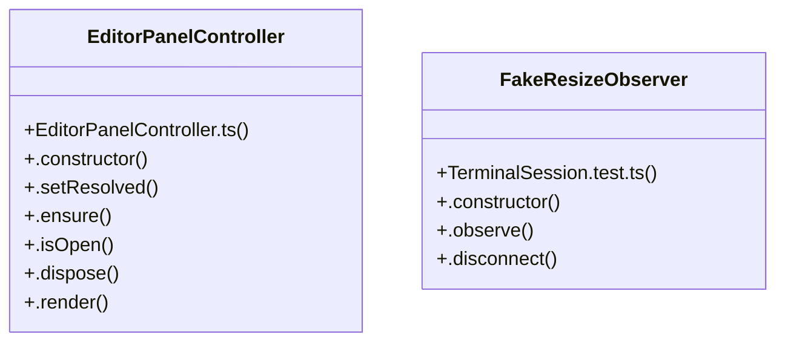

# Community 2

> 7324 nodes · cohesion 0.00

## Key Concepts

- [monacoCodeEditor-BzxvY4cV.js](file:///C:/Users/1/github-pr/agent-meow/agent_meow/server/static/web-ui/assets/monacoCodeEditor-BzxvY4cV.js#L1) (5836 connections)
- [join()](file:///C:/Users/1/github-pr/agent-meow/agent_meow/server/static/web-ui/assets/monacoCodeEditor-BzxvY4cV.js#L20) (957 connections)
- [push()](file:///C:/Users/1/github-pr/agent-meow/agent_meow/server/static/web-ui/assets/monacoCodeEditor-BzxvY4cV.js#L15) (794 connections)
- [constructor()](file:///C:/Users/1/github-pr/agent-meow/agent_meow/server/static/web-ui/assets/monacoCodeEditor-BzxvY4cV.js#L11) (708 connections)
- [get()](file:///C:/Users/1/github-pr/agent-meow/agent_meow/server/static/web-ui/assets/monacoCodeEditor-BzxvY4cV.js#L15) (573 connections)
- [MAX](file:///C:/Users/1/github-pr/agent-meow/web/src/shell/MarkdownEditorToolbar.tsx#L88) (397 connections)
- [set()](file:///C:/Users/1/github-pr/agent-meow/agent_meow/server/static/web-ui/assets/monacoCodeEditor-BzxvY4cV.js#L15) (316 connections)
- [.map()](file:///C:/Users/1/github-pr/agent-meow/agent_meow/server/static/web-ui/assets/monacoCodeEditor-BzxvY4cV.js#L15) (304 connections)
- [add()](file:///C:/Users/1/github-pr/agent-meow/agent_meow/server/static/web-ui/assets/monacoCodeEditor-BzxvY4cV.js#L15) (281 connections)
- [slice()](file:///C:/Users/1/github-pr/agent-meow/agent_meow/server/static/web-ui/assets/monacoCodeEditor-BzxvY4cV.js#L32) (276 connections)
- [all()](file:///C:/Users/1/github-pr/agent-meow/agent_meow/server/static/web-ui/assets/monacoCodeEditor-BzxvY4cV.js#L24) (242 connections)
- [update()](file:///C:/Users/1/github-pr/agent-meow/agent_meow/server/static/web-ui/assets/monacoCodeEditor-BzxvY4cV.js#L20) (238 connections)
- [.filter()](file:///C:/Users/1/github-pr/agent-meow/agent_meow/server/static/web-ui/assets/monacoCodeEditor-BzxvY4cV.js#L15) (235 connections)
- [_run()](file:///C:/Users/1/github-pr/agent-meow/agent_meow/server/static/web-ui/assets/monacoCodeEditor-BzxvY4cV.js#L21) (231 connections)
- [values()](file:///C:/Users/1/github-pr/agent-meow/agent_meow/server/static/web-ui/assets/monacoCodeEditor-BzxvY4cV.js#L15) (219 connections)
- [_render()](file:///C:/Users/1/github-pr/agent-meow/agent_meow/server/static/web-ui/assets/monacoCodeEditor-BzxvY4cV.js#L21) (217 connections)
- [error()](file:///C:/Users/1/github-pr/agent-meow/agent_meow/server/static/web-ui/assets/monacoCodeEditor-BzxvY4cV.js#L20) (213 connections)
- [substring()](file:///C:/Users/1/github-pr/agent-meow/agent_meow/server/static/web-ui/assets/monacoCodeEditor-BzxvY4cV.js#L32) (201 connections)
- [fire()](file:///C:/Users/1/github-pr/agent-meow/agent_meow/server/static/web-ui/assets/monacoCodeEditor-BzxvY4cV.js#L17) (197 connections)
- [forEach()](file:///C:/Users/1/github-pr/agent-meow/agent_meow/server/static/web-ui/assets/monacoCodeEditor-BzxvY4cV.js#L24) (192 connections)
- [dispose()](file:///C:/Users/1/github-pr/agent-meow/agent_meow/server/static/web-ui/assets/monacoCodeEditor-BzxvY4cV.js#L15) (179 connections)
- [getModel()](file:///C:/Users/1/github-pr/agent-meow/agent_meow/server/static/web-ui/assets/monacoCodeEditor-BzxvY4cV.js#L52) (172 connections)
- [sort()](file:///C:/Users/1/github-pr/agent-meow/agent_meow/server/static/web-ui/assets/monacoCodeEditor-BzxvY4cV.js#L21) (159 connections)
- [concat()](file:///C:/Users/1/github-pr/agent-meow/agent_meow/server/static/web-ui/assets/chunk-NNHCCRGN-DlpIbxXb.js#L35) (157 connections)
- [min()](file:///C:/Users/1/github-pr/agent-meow/agent_meow/server/static/web-ui/assets/monacoCodeEditor-BzxvY4cV.js#L264) (155 connections)
- *... and 7299 more nodes in this community*

## Class Diagram

## Relationships

- [[Community 9]] (5 shared connections)
- [[Community 3]] (1 shared connections)
- [[Community 4]] (1 shared connections)

## Source Files

- [C:\Users\1\github-pr\agent-meow\agent_meow\inner\_cwd_scan.py](file:///C:/Users/1/github-pr/agent-meow/agent_meow/inner/_cwd_scan.py)
- [C:\Users\1\github-pr\agent-meow\agent_meow\runner\environment_filesystem.py](file:///C:/Users/1/github-pr/agent-meow/agent_meow/runner/environment_filesystem.py)
- [C:\Users\1\github-pr\agent-meow\agent_meow\runner\transports\uds.py](file:///C:/Users/1/github-pr/agent-meow/agent_meow/runner/transports/uds.py)
- [C:\Users\1\github-pr\agent-meow\agent_meow\server\presence.py](file:///C:/Users/1/github-pr/agent-meow/agent_meow/server/presence.py)
- [C:\Users\1\github-pr\agent-meow\agent_meow\server\static\web-ui\assets\InboxPage-D1JIy1PN.js](file:///C:/Users/1/github-pr/agent-meow/agent_meow/server/static/web-ui/assets/InboxPage-D1JIy1PN.js)
- [C:\Users\1\github-pr\agent-meow\agent_meow\server\static\web-ui\assets\MembersPage-C_gDld_v.js](file:///C:/Users/1/github-pr/agent-meow/agent_meow/server/static/web-ui/assets/MembersPage-C_gDld_v.js)
- [C:\Users\1\github-pr\agent-meow\agent_meow\server\static\web-ui\assets\architectureDiagram-3BPJPVTR-DkXGu5hw.js](file:///C:/Users/1/github-pr/agent-meow/agent_meow/server/static/web-ui/assets/architectureDiagram-3BPJPVTR-DkXGu5hw.js)
- [C:\Users\1\github-pr\agent-meow\agent_meow\server\static\web-ui\assets\array-BifhSqXX.js](file:///C:/Users/1/github-pr/agent-meow/agent_meow/server/static/web-ui/assets/array-BifhSqXX.js)
- [C:\Users\1\github-pr\agent-meow\agent_meow\server\static\web-ui\assets\blockDiagram-GPEHLZMM-4HTW_4eh.js](file:///C:/Users/1/github-pr/agent-meow/agent_meow/server/static/web-ui/assets/blockDiagram-GPEHLZMM-4HTW_4eh.js)
- [C:\Users\1\github-pr\agent-meow\agent_meow\server\static\web-ui\assets\chunk-3OPIFGDE-WkeVFPZJ.js](file:///C:/Users/1/github-pr/agent-meow/agent_meow/server/static/web-ui/assets/chunk-3OPIFGDE-WkeVFPZJ.js)
- [C:\Users\1\github-pr\agent-meow\agent_meow\server\static\web-ui\assets\chunk-AQP2D5EJ-CKk_eBVd.js](file:///C:/Users/1/github-pr/agent-meow/agent_meow/server/static/web-ui/assets/chunk-AQP2D5EJ-CKk_eBVd.js)
- [C:\Users\1\github-pr\agent-meow\agent_meow\server\static\web-ui\assets\chunk-CSCIHK7Q-BU0Ibg9u.js](file:///C:/Users/1/github-pr/agent-meow/agent_meow/server/static/web-ui/assets/chunk-CSCIHK7Q-BU0Ibg9u.js)
- [C:\Users\1\github-pr\agent-meow\agent_meow\server\static\web-ui\assets\chunk-L5ZTLDWV-GXCfVf-t.js](file:///C:/Users/1/github-pr/agent-meow/agent_meow/server/static/web-ui/assets/chunk-L5ZTLDWV-GXCfVf-t.js)
- [C:\Users\1\github-pr\agent-meow\agent_meow\server\static\web-ui\assets\chunk-NNHCCRGN-DlpIbxXb.js](file:///C:/Users/1/github-pr/agent-meow/agent_meow/server/static/web-ui/assets/chunk-NNHCCRGN-DlpIbxXb.js)
- [C:\Users\1\github-pr\agent-meow\agent_meow\server\static\web-ui\assets\chunk-O5CBEL6O-CFTurLxn.js](file:///C:/Users/1/github-pr/agent-meow/agent_meow/server/static/web-ui/assets/chunk-O5CBEL6O-CFTurLxn.js)
- [C:\Users\1\github-pr\agent-meow\agent_meow\server\static\web-ui\assets\cytoscape.esm-Djp6vQyU.js](file:///C:/Users/1/github-pr/agent-meow/agent_meow/server/static/web-ui/assets/cytoscape.esm-Djp6vQyU.js)
- [C:\Users\1\github-pr\agent-meow\agent_meow\server\static\web-ui\assets\dagre-Bx709z4p.js](file:///C:/Users/1/github-pr/agent-meow/agent_meow/server/static/web-ui/assets/dagre-Bx709z4p.js)
- [C:\Users\1\github-pr\agent-meow\agent_meow\server\static\web-ui\assets\defaultLocale-C8Fc0cco.js](file:///C:/Users/1/github-pr/agent-meow/agent_meow/server/static/web-ui/assets/defaultLocale-C8Fc0cco.js)
- [C:\Users\1\github-pr\agent-meow\agent_meow\server\static\web-ui\assets\diagram-KO2AKTUF-B7RKHnuX.js](file:///C:/Users/1/github-pr/agent-meow/agent_meow/server/static/web-ui/assets/diagram-KO2AKTUF-B7RKHnuX.js)
- [C:\Users\1\github-pr\agent-meow\agent_meow\server\static\web-ui\assets\diagram-OG6HWLK6-nSFFl6eo.js](file:///C:/Users/1/github-pr/agent-meow/agent_meow/server/static/web-ui/assets/diagram-OG6HWLK6-nSFFl6eo.js)

## Audit Trail

- EXTRACTED: 53457 (87%)
- INFERRED: 7899 (13%)
- AMBIGUOUS: 0 (0%)

---

*Part of the graphify knowledge wiki. See [[index]] to navigate.*