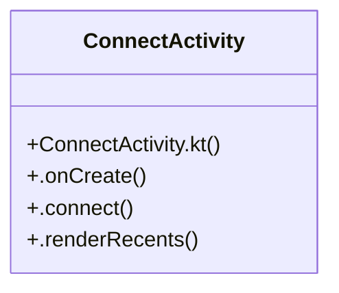

# Community 202

> 5 nodes · cohesion 0.40

## Key Concepts

- [ConnectActivity](file:///C:/Users/1/github-pr/agent-meow/web/android/app/src/main/java/io/cubecloud/agentmeow/ConnectActivity.kt#L21) (4 connections)
- [ConnectActivity.kt](file:///C:/Users/1/github-pr/agent-meow/web/android/app/src/main/java/io/cubecloud/agentmeow/ConnectActivity.kt#L1) (1 connections)
- [.connect()](file:///C:/Users/1/github-pr/agent-meow/web/android/app/src/main/java/io/cubecloud/agentmeow/ConnectActivity.kt#L42) (1 connections)
- [.onCreate()](file:///C:/Users/1/github-pr/agent-meow/web/android/app/src/main/java/io/cubecloud/agentmeow/ConnectActivity.kt#L24) (1 connections)
- [.renderRecents()](file:///C:/Users/1/github-pr/agent-meow/web/android/app/src/main/java/io/cubecloud/agentmeow/ConnectActivity.kt#L60) (1 connections)

## Class Diagram

## Relationships

- No strong cross-community connections detected

## Source Files

- [C:\Users\1\github-pr\agent-meow\web\android\app\src\main\java\io\cubecloud\agentmeow\ConnectActivity.kt](file:///C:/Users/1/github-pr/agent-meow/web/android/app/src/main/java/io/cubecloud/agentmeow/ConnectActivity.kt)

## Audit Trail

- EXTRACTED: 8 (100%)
- INFERRED: 0 (0%)
- AMBIGUOUS: 0 (0%)

---

*Part of the graphify knowledge wiki. See [[index]] to navigate.*