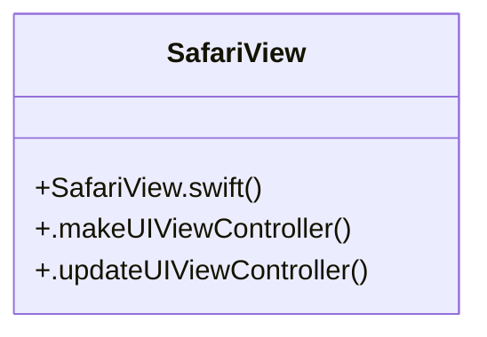

# Community 204

> 5 nodes · cohesion 0.40

## Key Concepts

- [SafariView](file:///C:/Users/1/github-pr/agent-meow/web/ios/Omnigent/SafariView.swift#L6) (4 connections)
- [SafariView.swift](file:///C:/Users/1/github-pr/agent-meow/web/ios/Omnigent/SafariView.swift#L1) (1 connections)
- [.makeUIViewController()](file:///C:/Users/1/github-pr/agent-meow/web/ios/Omnigent/SafariView.swift#L9) (1 connections)
- [.updateUIViewController()](file:///C:/Users/1/github-pr/agent-meow/web/ios/Omnigent/SafariView.swift#L13) (1 connections)
- **UIViewControllerRepresentable** (1 connections)

## Class Diagram

## Relationships

- No strong cross-community connections detected

## Source Files

- [C:\Users\1\github-pr\agent-meow\web\ios\Omnigent\SafariView.swift](file:///C:/Users/1/github-pr/agent-meow/web/ios/Omnigent/SafariView.swift)

## Audit Trail

- EXTRACTED: 8 (100%)
- INFERRED: 0 (0%)
- AMBIGUOUS: 0 (0%)

---

*Part of the graphify knowledge wiki. See [[index]] to navigate.*