# Community 22

> 552 nodes · cohesion 0.00

## Key Concepts

- [chatStore.test.ts](file:///C:/Users/1/github-pr/agent-meow/web/src/store/chatStore.test.ts#L1) (208 connections)
- [blockStream.test.ts](file:///C:/Users/1/github-pr/agent-meow/web/src/lib/blockStream.test.ts#L1) (47 connections)
- [AppShell.test.tsx](file:///C:/Users/1/github-pr/agent-meow/web/src/shell/AppShell.test.tsx#L1) (45 connections)
- [Sidebar.test.tsx](file:///C:/Users/1/github-pr/agent-meow/web/src/shell/Sidebar.test.tsx#L1) (40 connections)
- [Coordinator](file:///C:/Users/1/github-pr/agent-meow/web/ios/Omnigent/OmnigentWebView.swift#L245) (24 connections)
- [codeViewerHelpers.test.ts](file:///C:/Users/1/github-pr/agent-meow/web/src/shell/codeViewerHelpers.test.ts#L1) (18 connections)
- [MarkdownCommentPlugin.test.tsx](file:///C:/Users/1/github-pr/agent-meow/web/src/shell/MarkdownCommentPlugin.test.tsx#L1) (14 connections)
- [NativeNotificationManager](file:///C:/Users/1/github-pr/agent-meow/web/ios/Omnigent/NativeNotificationManager.swift#L4) (13 connections)
- [.normalize()](file:///C:/Users/1/github-pr/agent-meow/web/ios/Omnigent/ServerURL.swift#L24) (13 connections)
- [url](file:///C:/Users/1/github-pr/agent-meow/web/sw-src/sw.js#L48) (13 connections)
- [.expandIfNeeded()](file:///C:/Users/1/github-pr/agent-meow/web/ios/Omnigent/WorkspaceURLExpander.swift#L12) (12 connections)
- [TipTapEditorHelpers.test.ts](file:///C:/Users/1/github-pr/agent-meow/web/src/shell/TipTapEditorHelpers.test.ts#L1) (11 connections)
- [WebViewModel](file:///C:/Users/1/github-pr/agent-meow/web/ios/Omnigent/WebViewModel.swift#L9) (11 connections)
- [snapshot()](file:///C:/Users/1/github-pr/agent-meow/web/ios/OmnigentUITests/SnapshotHelper.swift#L23) (10 connections)
- [TipTapCommentExtension.test.ts](file:///C:/Users/1/github-pr/agent-meow/web/src/shell/TipTapCommentExtension.test.ts#L1) (9 connections)
- [sse()](file:///C:/Users/1/github-pr/agent-meow/web/src/store/chatStore.test.ts#L162) (9 connections)
- [.segment()](file:///C:/Users/1/github-pr/agent-meow/web/ios/Omnigent/ChatTerminalBar.swift#L28) (9 connections)
- [SettingsStore](file:///C:/Users/1/github-pr/agent-meow/web/ios/Omnigent/SettingsStore.swift#L3) (9 connections)
- [data](file:///C:/Users/1/github-pr/agent-meow/web/src/pages/ApprovePage.tsx#L64) (8 connections)
- [NewTerminalButton.test.tsx](file:///C:/Users/1/github-pr/agent-meow/web/src/shell/NewTerminalButton.test.tsx#L1) (8 connections)
- [WorkspaceURLExpanderTests](file:///C:/Users/1/github-pr/agent-meow/web/ios/OmnigentTests/WorkspaceURLExpanderTests.swift#L6) (8 connections)
- [.userContentController()](file:///C:/Users/1/github-pr/agent-meow/web/ios/Omnigent/OmnigentWebView.swift#L314) (7 connections)
- [ServerURLError](file:///C:/Users/1/github-pr/agent-meow/web/ios/Omnigent/ServerURL.swift#L3) (7 connections)
- [.allowProtocol()](file:///C:/Users/1/github-pr/agent-meow/web/ios/Omnigent/SettingsStore.swift#L39) (7 connections)
- [.setupSnapshot()](file:///C:/Users/1/github-pr/agent-meow/web/ios/OmnigentUITests/SnapshotHelper.swift#L67) (7 connections)
- *... and 527 more nodes in this community*

## Class Diagram

```mermaid
classDiagram
    class AppRootView {
        +AppRootView.swift()
        +.init()
    }
    class Mode {
        +AppRootView.swift()
    }
    class ChatTerminalBar {
        +ChatTerminalBar.swift()
        +.segment()
    }
    class ConnectView {
        +ConnectView.swift()
        +.init()
        +.connect()
    }
    class InfoLink {
        +ConnectView.swift()
    }
    class PrimaryButtonStyle {
        +ConnectView.swift()
        +.makeBody()
    }
    class NativeNotificationManager {
        +NativeNotificationManager.kt()
        +.notify()
        +.setBadgeCount()
        +.post()
        +.activationIntent()
        +NativeNotificationManager.swift()
        +.init()
        +.start()
        +.setActivationHandler()
        +.userNotificationCenter()
    }
    class ProcessInfo {
        +NativeNotificationManager.swift()
    }
    class AppRouter {
        +OmnigentApp.swift()
        +.routeNotification()
        +.consumeNotificationPath()
    }
    class OmnigentApp {
        +OmnigentApp.swift()
        +.init()
    }
    class OmnigentUITests {
        +OmnigentUITests.swift()
        +.setUpWithError()
        +.testLocalServerSnapshot()
        +.connectFromSetupIfNeeded()
    }
    class ScreenshotConfiguration {
        +OmnigentUITests.swift()
        +.serverURL()
        +.fastlaneLaunchArguments()
    }
    class String {
        +OmnigentUITests.swift()
        +.omnigentArgumentValue()
    }
    class AccessoryFreeWebView {
        +OmnigentWebView.swift()
    }
    class Coordinator {
        +OmnigentWebView.swift()
        +.init()
        +.attach()
        +.detach()
        +.handleLeftEdgePan()
        +.gestureRecognizer()
        +.load()
        +.userContentController()
        +.webView()
        +.webViewWebContentProcessDidTerminate()
    }
    class OmnigentWebView {
        +OmnigentWebView.swift()
        +.makeCoordinator()
        +.makeUIView()
        +.updateUIView()
        +.dismantleUIView()
    }
    class UIViewController {
        +OmnigentWebView.swift()
    }
    class ServerURL {
        +ServerURL.swift()
        +.normalize()
    }
    class ServerURLError {
        +ServerURL.swift()
    }
    class ServerURLTests {
        +ServerURLTests.swift()
        +.testReleasePolicyDefaultsBareHostToHTTPS()
        +.testDebugPolicyDefaultsBareHostToHTTP()
        +.testReleasePolicyRejectsHTTP()
        +.testRejectsNonWebSchemes()
    }
    class ProcessInfo {
        +SettingsStore.swift()
        +.omnigentArgumentValue()
    }
    class SettingsStore {
        +SettingsStore.swift()
        +.init()
        +.rememberRecentServer()
        +.isProtocolAllowed()
        +.allowProtocol()
        +.allowedProtocols()
    }
    class SettingsStoreTests {
        +SettingsStoreTests.swift()
        +.setUp()
        +.tearDown()
        +.testRecentServersAreDedupedAndCapped()
        +.testProtocolGrantsAreScopedByOrigin()
    }
    class TestObserver {
        +Sidebar.test.tsx()
        +.constructor()
    }
    class CGFloat {
        +SnapshotHelper.swift()
        +.isBetween()
    }
    class SnapshotError {
        +SnapshotHelper.swift()
    }
    class XCUIElementAttributes {
        +SnapshotHelper.swift()
        +.isStatusBar()
    }
    class XCUIElementQuery {
        +SnapshotHelper.swift()
    }
    class InsetMetrics {
        +WebShellView.swift()
    }
    class ServerSwitcher {
        +WebShellView.swift()
    }
    class ServerSwitcherMetrics {
        +WebShellView.swift()
        +.maxWidth()
    }
    class WebShellView {
        +WebShellView.swift()
        +.switchServer()
    }
    class WebViewMode {
        +WebViewModel.swift()
    }
    class WebViewModel {
        +WebViewModel.swift()
        +.reload()
        +.armServerSwitcherWatchdog()
        +.cancelServerSwitcherWatchdog()
        +.emitNotificationActivation()
        +.emitInsets()
        +.emitViewModeChanged()
        +.emitSidebarDrag()
        +.jsNumber()
        +.javascriptString()
    }
    class WorkspaceURLExpander {
        +WorkspaceURLExpander.swift()
        +.expandIfNeeded()
        +.isBareRoot()
        +.isDatabricksAppsHost()
        +.originURL()
    }
    class URLProtocolStub {
        +WorkspaceURLExpanderTests.swift()
        +.canInit()
        +.canonicalRequest()
        +.startLoading()
        +.stopLoading()
    }
    class WorkspaceURLExpanderTests {
        +WorkspaceURLExpanderTests.swift()
        +.setUp()
        +.testExpandsBareDatabricksWorkspaceRoot()
        +.testLeavesNonWorkspaceRootUnchanged()
        +.testLeavesURLsWithPathsUnchangedWithoutProbe()
        +.testLeavesDatabricksAppsHostUnchangedWithoutProbe()
        +.stubbedSession()
    }
```

## Relationships

- No strong cross-community connections detected

## Source Files

- [C:\Users\1\github-pr\agent-meow\agent_meow\server\static\web-ui\assets\monacoCodeEditor-BzxvY4cV.js](file:///C:/Users/1/github-pr/agent-meow/agent_meow/server/static/web-ui/assets/monacoCodeEditor-BzxvY4cV.js)
- [C:\Users\1\github-pr\agent-meow\agent_meow\server\static\web-ui\sw.js](file:///C:/Users/1/github-pr/agent-meow/agent_meow/server/static/web-ui/sw.js)
- [C:\Users\1\github-pr\agent-meow\web\android\app\src\main\java\io\cubecloud\agentmeow\NativeNotificationManager.kt](file:///C:/Users/1/github-pr/agent-meow/web/android/app/src/main/java/io/cubecloud/agentmeow/NativeNotificationManager.kt)
- [C:\Users\1\github-pr\agent-meow\web\ios\OmnigentTests\ServerURLTests.swift](file:///C:/Users/1/github-pr/agent-meow/web/ios/OmnigentTests/ServerURLTests.swift)
- [C:\Users\1\github-pr\agent-meow\web\ios\OmnigentTests\SettingsStoreTests.swift](file:///C:/Users/1/github-pr/agent-meow/web/ios/OmnigentTests/SettingsStoreTests.swift)
- [C:\Users\1\github-pr\agent-meow\web\ios\OmnigentTests\WorkspaceURLExpanderTests.swift](file:///C:/Users/1/github-pr/agent-meow/web/ios/OmnigentTests/WorkspaceURLExpanderTests.swift)
- [C:\Users\1\github-pr\agent-meow\web\ios\OmnigentUITests\OmnigentUITests.swift](file:///C:/Users/1/github-pr/agent-meow/web/ios/OmnigentUITests/OmnigentUITests.swift)
- [C:\Users\1\github-pr\agent-meow\web\ios\OmnigentUITests\SnapshotHelper.swift](file:///C:/Users/1/github-pr/agent-meow/web/ios/OmnigentUITests/SnapshotHelper.swift)
- [C:\Users\1\github-pr\agent-meow\web\ios\Omnigent\AppRootView.swift](file:///C:/Users/1/github-pr/agent-meow/web/ios/Omnigent/AppRootView.swift)
- [C:\Users\1\github-pr\agent-meow\web\ios\Omnigent\ChatTerminalBar.swift](file:///C:/Users/1/github-pr/agent-meow/web/ios/Omnigent/ChatTerminalBar.swift)
- [C:\Users\1\github-pr\agent-meow\web\ios\Omnigent\ConnectView.swift](file:///C:/Users/1/github-pr/agent-meow/web/ios/Omnigent/ConnectView.swift)
- [C:\Users\1\github-pr\agent-meow\web\ios\Omnigent\NativeNotificationManager.swift](file:///C:/Users/1/github-pr/agent-meow/web/ios/Omnigent/NativeNotificationManager.swift)
- [C:\Users\1\github-pr\agent-meow\web\ios\Omnigent\OmnigentApp.swift](file:///C:/Users/1/github-pr/agent-meow/web/ios/Omnigent/OmnigentApp.swift)
- [C:\Users\1\github-pr\agent-meow\web\ios\Omnigent\OmnigentWebView.swift](file:///C:/Users/1/github-pr/agent-meow/web/ios/Omnigent/OmnigentWebView.swift)
- [C:\Users\1\github-pr\agent-meow\web\ios\Omnigent\ServerURL.swift](file:///C:/Users/1/github-pr/agent-meow/web/ios/Omnigent/ServerURL.swift)
- [C:\Users\1\github-pr\agent-meow\web\ios\Omnigent\SettingsStore.swift](file:///C:/Users/1/github-pr/agent-meow/web/ios/Omnigent/SettingsStore.swift)
- [C:\Users\1\github-pr\agent-meow\web\ios\Omnigent\WebShellView.swift](file:///C:/Users/1/github-pr/agent-meow/web/ios/Omnigent/WebShellView.swift)
- [C:\Users\1\github-pr\agent-meow\web\ios\Omnigent\WebViewModel.swift](file:///C:/Users/1/github-pr/agent-meow/web/ios/Omnigent/WebViewModel.swift)
- [C:\Users\1\github-pr\agent-meow\web\ios\Omnigent\WorkspaceURLExpander.swift](file:///C:/Users/1/github-pr/agent-meow/web/ios/Omnigent/WorkspaceURLExpander.swift)
- [C:\Users\1\github-pr\agent-meow\web\src\lib\blockStream.test.ts](file:///C:/Users/1/github-pr/agent-meow/web/src/lib/blockStream.test.ts)

## Audit Trail

- EXTRACTED: 1246 (86%)
- INFERRED: 211 (14%)
- AMBIGUOUS: 0 (0%)

---

*Part of the graphify knowledge wiki. See [[index]] to navigate.*