# Community 23

> 526 nodes · cohesion 0.01

## Key Concepts

- [BenchProfile](file:///C:/Users/1/github-pr/agent-meow/tests/harness_bench/profile.py#L24) (102 connections)
- [TurnResult](file:///C:/Users/1/github-pr/agent-meow/tests/harness_bench/driver.py#L134) (59 connections)
- [Verdict](file:///C:/Users/1/github-pr/agent-meow/tests/harness_bench/verdict.py#L16) (49 connections)
- [FullServerDriver](file:///C:/Users/1/github-pr/agent-meow/tests/harness_bench/full_server_driver.py#L145) (45 connections)
- [SdkInprocDriver](file:///C:/Users/1/github-pr/agent-meow/tests/harness_bench/driver.py#L186) (43 connections)
- [HarnessInstallSpec](file:///C:/Users/1/github-pr/agent-meow/agent_meow/harness_install_spec.py#L9) (42 connections)
- [NativeTuiDriver](file:///C:/Users/1/github-pr/agent-meow/tests/harness_bench/native_tui_driver.py#L146) (40 connections)
- [AuthModel](file:///C:/Users/1/github-pr/agent-meow/agent_meow/harness_capabilities.py#L70) (38 connections)
- [HarnessCapabilities](file:///C:/Users/1/github-pr/agent-meow/agent_meow/harness_capabilities.py#L79) (38 connections)
- [IntegrationMode](file:///C:/Users/1/github-pr/agent-meow/agent_meow/harness_capabilities.py#L24) (38 connections)
- [sankeyDiagram-5OEKKPKP-CbStIGSg.js](file:///C:/Users/1/github-pr/agent-meow/agent_meow/server/static/web-ui/assets/sankeyDiagram-5OEKKPKP-CbStIGSg.js#L1) (36 connections)
- [Priority](file:///C:/Users/1/github-pr/agent-meow/tests/harness_bench/verdict.py#L69) (34 connections)
- [EffortFamily](file:///C:/Users/1/github-pr/agent-meow/agent_meow/harness_capabilities.py#L51) (32 connections)
- [Elicitation](file:///C:/Users/1/github-pr/agent-meow/agent_meow/harness_capabilities.py#L34) (32 connections)
- [ModelFamily](file:///C:/Users/1/github-pr/agent-meow/agent_meow/harness_capabilities.py#L61) (32 connections)
- [Resume](file:///C:/Users/1/github-pr/agent-meow/agent_meow/harness_capabilities.py#L44) (32 connections)
- [Driver](file:///C:/Users/1/github-pr/agent-meow/tests/harness_bench/transport.py#L36) (31 connections)
- [Applicability](file:///C:/Users/1/github-pr/agent-meow/tests/harness_bench/verdict.py#L81) (31 connections)
- [ProbeResult](file:///C:/Users/1/github-pr/agent-meow/tests/harness_bench/verdict.py#L94) (31 connections)
- [harness_plugins.py](file:///C:/Users/1/github-pr/agent-meow/agent_meow/harness_plugins.py#L1) (30 connections)
- **Enum** (30 connections)
- [main()](file:///C:/Users/1/github-pr/agent-meow/agent_meow/tools/_runner.py#L58) (24 connections)
- [CapabilityProbe](file:///C:/Users/1/github-pr/agent-meow/tests/harness_bench/probes/base.py#L19) (21 connections)
- [plugin_state()](file:///C:/Users/1/github-pr/agent-meow/agent_meow/harness_plugins.py#L747) (21 connections)
- [harness_is_configured()](file:///C:/Users/1/github-pr/agent-meow/agent_meow/onboarding/harness_readiness.py#L175) (20 connections)
- *... and 501 more nodes in this community*

## Class Diagram

```mermaid
classDiagram
    class CapabilityProbe {
        +base.py()
    }
    class BasicTurnProbe {
        +basic_turn.py()
        +.run()
    }
    class BenchMatrix {
        +bench.py()
    }
    class CellResult {
        +bench.py()
    }
    class HarnessReport {
        +bench.py()
    }
    class SdkInprocDriver {
        +driver.py()
        +.__init__()
        +.__aenter__()
        +.__aexit__()
        +.run_turn()
        +.run_basic_turn()
        +.run_streaming_turn()
        +.run_tool_turn()
        +.run_interrupt_turn()
        +._drive()
    }
    class TurnResult {
        +driver.py()
    }
    class HostFrameKind {
        +frames.py()
    }
    class FullServerDriver {
        +full_server_driver.py()
        +.__init__()
        +.__enter__()
        +.__exit__()
        +.__aenter__()
        +.__aexit__()
        +.run_basic_turn()
        +.run_streaming_turn()
        +.run_tool_turn()
        +.run_interrupt_turn()
    }
    class AuthModel {
        +harness_capabilities.py()
    }
    class EffortFamily {
        +harness_capabilities.py()
    }
    class Elicitation {
        +harness_capabilities.py()
    }
    class HarnessCapabilities {
        +harness_capabilities.py()
        +.as_dict()
    }
    class IntegrationMode {
        +harness_capabilities.py()
    }
    class ModelFamily {
        +harness_capabilities.py()
    }
    class Resume {
        +harness_capabilities.py()
    }
    class HarnessInstallSpec {
        +harness_install_spec.py()
    }
    class HarnessContribution {
        +harness_plugins.py()
    }
    class HarnessPluginState {
        +harness_plugins.py()
    }
    class HarnessProbe {
        +_harness_probes.py()
    }
    class InterruptProbe {
        +interrupt.py()
        +.run()
    }
    class ModelOverrideProbe {
        +model_override.py()
        +.run()
    }
    class NativeTuiDriver {
        +native_tui_driver.py()
        +.__init__()
        +.__aenter__()
        +.__aexit__()
        +.run_basic_turn()
        +.run_streaming_turn()
        +.run_tool_turn()
        +.run_interrupt_turn()
        +._provision()
        +._write_provider_config()
    }
    class NativeVendor {
        +native_tui_driver.py()
    }
    class PolicyDenyProbe {
        +policy_deny.py()
        +.run()
    }
    class BenchProfile {
        +profile.py()
        +.declared_for()
    }
    class _HardExitServer {
        +_runner.py()
        +.handle_exit()
    }
    class StreamingProbe {
        +streaming.py()
        +.run()
        +._measure()
    }
    class _EntryPoint {
        +test_harness_plugins.py()
        +.__init__()
        +.load()
    }
    class TestModelFamilyMismatch {
        +test_model_override.py()
        +.test_rejection_names_both_multi_model_fallbacks()
    }
    class ToolCallingProbe {
        +tool_calling.py()
        +.run()
    }
    class Driver {
        +transport.py()
        +.__aenter__()
        +.__aexit__()
        +.run_basic_turn()
        +.run_streaming_turn()
        +.run_tool_turn()
        +.run_interrupt_turn()
    }
    class Applicability {
        +verdict.py()
    }
    class Priority {
        +verdict.py()
    }
    class ProbeResult {
        +verdict.py()
    }
    class Verdict {
        +verdict.py()
    }
    CapabilityProbe --> BenchProfile
    CapabilityProbe --> Driver
    CapabilityProbe --> Applicability
    CapabilityProbe --> Priority
    CapabilityProbe --> ProbeResult
    CapabilityProbe --> BasicTurnProbe
    CapabilityProbe --> InterruptProbe
    CapabilityProbe --> ModelOverrideProbe
    CapabilityProbe --> PolicyDenyProbe
    CapabilityProbe --> StreamingProbe
    CapabilityProbe --> ToolCallingProbe
    BasicTurnProbe --> CapabilityProbe
    BasicTurnProbe --> BenchProfile
    BasicTurnProbe --> Driver
    BasicTurnProbe --> Applicability
    BasicTurnProbe --> Priority
    BasicTurnProbe --> ProbeResult
    BasicTurnProbe --> Verdict
    BenchMatrix --> BenchProfile
    BenchMatrix --> Applicability
    BenchMatrix --> Priority
    BenchMatrix --> ProbeResult
    BenchMatrix --> Verdict
    CellResult --> BenchProfile
    CellResult --> Applicability
    CellResult --> Priority
    CellResult --> ProbeResult
    CellResult --> Verdict
    HarnessReport --> BenchProfile
    HarnessReport --> Applicability
    HarnessReport --> Priority
    HarnessReport --> ProbeResult
    HarnessReport --> Verdict
    SdkInprocDriver --> BenchProfile
    SdkInprocDriver --> FullServerDriver
    SdkInprocDriver --> Driver
    TurnResult --> BenchProfile
    TurnResult --> FullServerDriver
    TurnResult --> NativeVendor
    TurnResult --> NativeTuiDriver
    TurnResult --> Driver
    TurnResult --> StreamingProbe
    FullServerDriver --> TurnResult
    FullServerDriver --> BenchProfile
    FullServerDriver --> SdkInprocDriver
    FullServerDriver --> Driver
    AuthModel --> HarnessContribution
    AuthModel --> HarnessPluginState
    EffortFamily --> HarnessContribution
    EffortFamily --> HarnessPluginState
    Elicitation --> HarnessContribution
    Elicitation --> HarnessPluginState
    HarnessCapabilities --> HarnessContribution
    HarnessCapabilities --> HarnessPluginState
    IntegrationMode --> HarnessContribution
    IntegrationMode --> HarnessPluginState
    ModelFamily --> HarnessContribution
    ModelFamily --> HarnessPluginState
    Resume --> HarnessContribution
    Resume --> HarnessPluginState
    HarnessInstallSpec --> HarnessContribution
    HarnessInstallSpec --> HarnessPluginState
    HarnessInstallSpec --> _EntryPoint
    HarnessContribution --> AuthModel
    HarnessContribution --> EffortFamily
    HarnessContribution --> Elicitation
    HarnessContribution --> HarnessCapabilities
    HarnessContribution --> IntegrationMode
    HarnessContribution --> ModelFamily
    HarnessContribution --> Resume
    HarnessContribution --> HarnessInstallSpec
    HarnessPluginState --> AuthModel
    HarnessPluginState --> EffortFamily
    HarnessPluginState --> Elicitation
    HarnessPluginState --> HarnessCapabilities
    HarnessPluginState --> IntegrationMode
    HarnessPluginState --> ModelFamily
    HarnessPluginState --> Resume
    HarnessPluginState --> HarnessInstallSpec
    InterruptProbe --> CapabilityProbe
    InterruptProbe --> BenchProfile
    InterruptProbe --> Driver
    InterruptProbe --> Applicability
    InterruptProbe --> Priority
    InterruptProbe --> ProbeResult
    InterruptProbe --> Verdict
    ModelOverrideProbe --> CapabilityProbe
    ModelOverrideProbe --> BenchProfile
    ModelOverrideProbe --> Driver
    ModelOverrideProbe --> Applicability
    ModelOverrideProbe --> Priority
    ModelOverrideProbe --> ProbeResult
    ModelOverrideProbe --> Verdict
    NativeTuiDriver --> TurnResult
    NativeTuiDriver --> BenchProfile
    NativeTuiDriver --> Driver
    NativeVendor --> TurnResult
    NativeVendor --> BenchProfile
    PolicyDenyProbe --> CapabilityProbe
    PolicyDenyProbe --> BenchProfile
    PolicyDenyProbe --> Driver
    PolicyDenyProbe --> Applicability
    PolicyDenyProbe --> Priority
    PolicyDenyProbe --> ProbeResult
    PolicyDenyProbe --> Verdict
    BenchProfile --> CellResult
    BenchProfile --> HarnessReport
    BenchProfile --> BenchMatrix
    BenchProfile --> TurnResult
    BenchProfile --> SdkInprocDriver
    BenchProfile --> FullServerDriver
    BenchProfile --> NativeVendor
    BenchProfile --> NativeTuiDriver
    BenchProfile --> Verdict
    BenchProfile --> Driver
    BenchProfile --> CapabilityProbe
    BenchProfile --> BasicTurnProbe
    BenchProfile --> InterruptProbe
    BenchProfile --> ModelOverrideProbe
    BenchProfile --> PolicyDenyProbe
    BenchProfile --> StreamingProbe
    BenchProfile --> ToolCallingProbe
    StreamingProbe --> TurnResult
    StreamingProbe --> CapabilityProbe
    StreamingProbe --> BenchProfile
    StreamingProbe --> Driver
    StreamingProbe --> Applicability
    StreamingProbe --> Priority
    StreamingProbe --> ProbeResult
    StreamingProbe --> Verdict
    _EntryPoint --> HarnessInstallSpec
    ToolCallingProbe --> CapabilityProbe
    ToolCallingProbe --> BenchProfile
    ToolCallingProbe --> Driver
    ToolCallingProbe --> Applicability
    ToolCallingProbe --> Priority
    ToolCallingProbe --> ProbeResult
    ToolCallingProbe --> Verdict
    Driver --> TurnResult
    Driver --> BenchProfile
    Driver --> SdkInprocDriver
    Driver --> FullServerDriver
    Driver --> NativeTuiDriver
    Driver --> CapabilityProbe
    Driver --> BasicTurnProbe
    Driver --> InterruptProbe
    Driver --> ModelOverrideProbe
    Driver --> PolicyDenyProbe
    Driver --> StreamingProbe
    Driver --> ToolCallingProbe
    Applicability --> CellResult
    Applicability --> HarnessReport
    Applicability --> BenchMatrix
    Applicability --> CapabilityProbe
    Applicability --> BasicTurnProbe
    Applicability --> InterruptProbe
    Applicability --> ModelOverrideProbe
    Applicability --> PolicyDenyProbe
    Applicability --> StreamingProbe
    Applicability --> ToolCallingProbe
    Priority --> CellResult
    Priority --> HarnessReport
    Priority --> BenchMatrix
    Priority --> CapabilityProbe
    Priority --> BasicTurnProbe
    Priority --> InterruptProbe
    Priority --> ModelOverrideProbe
    Priority --> PolicyDenyProbe
    Priority --> StreamingProbe
    Priority --> ToolCallingProbe
    ProbeResult --> CellResult
    ProbeResult --> HarnessReport
    ProbeResult --> BenchMatrix
    ProbeResult --> CapabilityProbe
    ProbeResult --> BasicTurnProbe
    ProbeResult --> InterruptProbe
    ProbeResult --> ModelOverrideProbe
    ProbeResult --> PolicyDenyProbe
    ProbeResult --> StreamingProbe
    ProbeResult --> ToolCallingProbe
    Verdict --> CellResult
    Verdict --> HarnessReport
    Verdict --> BenchMatrix
    Verdict --> BenchProfile
    Verdict --> BasicTurnProbe
    Verdict --> InterruptProbe
    Verdict --> ModelOverrideProbe
    Verdict --> PolicyDenyProbe
    Verdict --> StreamingProbe
    Verdict --> ToolCallingProbe
```

## Relationships

- [[Community 14]] (12 shared connections)
- [[Community 10]] (11 shared connections)
- [[Community 18]] (6 shared connections)
- [[Community 1]] (3 shared connections)
- [[Community 3]] (1 shared connections)
- [[Auth Config]] (1 shared connections)
- [[Community 15]] (1 shared connections)
- [[Community 11]] (1 shared connections)

## Source Files

- [C:\Users\1\github-pr\agent-meow\agent_meow\__main__.py](file:///C:/Users/1/github-pr/agent-meow/agent_meow/__main__.py)
- [C:\Users\1\github-pr\agent-meow\agent_meow\harness_capabilities.py](file:///C:/Users/1/github-pr/agent-meow/agent_meow/harness_capabilities.py)
- [C:\Users\1\github-pr\agent-meow\agent_meow\harness_install_spec.py](file:///C:/Users/1/github-pr/agent-meow/agent_meow/harness_install_spec.py)
- [C:\Users\1\github-pr\agent-meow\agent_meow\harness_plugins.py](file:///C:/Users/1/github-pr/agent-meow/agent_meow/harness_plugins.py)
- [C:\Users\1\github-pr\agent-meow\agent_meow\host\frames.py](file:///C:/Users/1/github-pr/agent-meow/agent_meow/host/frames.py)
- [C:\Users\1\github-pr\agent-meow\agent_meow\llms\adapters\base.py](file:///C:/Users/1/github-pr/agent-meow/agent_meow/llms/adapters/base.py)
- [C:\Users\1\github-pr\agent-meow\agent_meow\model_override.py](file:///C:/Users/1/github-pr/agent-meow/agent_meow/model_override.py)
- [C:\Users\1\github-pr\agent-meow\agent_meow\onboarding\harness_readiness.py](file:///C:/Users/1/github-pr/agent-meow/agent_meow/onboarding/harness_readiness.py)
- [C:\Users\1\github-pr\agent-meow\agent_meow\policies\base.py](file:///C:/Users/1/github-pr/agent-meow/agent_meow/policies/base.py)
- [C:\Users\1\github-pr\agent-meow\agent_meow\runtime\harnesses\_runner.py](file:///C:/Users/1/github-pr/agent-meow/agent_meow/runtime/harnesses/_runner.py)
- [C:\Users\1\github-pr\agent-meow\agent_meow\runtime\harnesses\process_manager.py](file:///C:/Users/1/github-pr/agent-meow/agent_meow/runtime/harnesses/process_manager.py)
- [C:\Users\1\github-pr\agent-meow\agent_meow\server\static\web-ui\assets\sankeyDiagram-5OEKKPKP-CbStIGSg.js](file:///C:/Users/1/github-pr/agent-meow/agent_meow/server/static/web-ui/assets/sankeyDiagram-5OEKKPKP-CbStIGSg.js)
- [C:\Users\1\github-pr\agent-meow\agent_meow\tools\_runner.py](file:///C:/Users/1/github-pr/agent-meow/agent_meow/tools/_runner.py)
- [C:\Users\1\github-pr\agent-meow\sdks\python-client\omnigent_client\_files.py](file:///C:/Users/1/github-pr/agent-meow/sdks/python-client/omnigent_client/_files.py)
- [C:\Users\1\github-pr\agent-meow\tests\e2e\_harness_probes.py](file:///C:/Users/1/github-pr/agent-meow/tests/e2e/_harness_probes.py)
- [C:\Users\1\github-pr\agent-meow\tests\e2e\omnigent\test_run_harness_without_agent_e2e.py](file:///C:/Users/1/github-pr/agent-meow/tests/e2e/omnigent/test_run_harness_without_agent_e2e.py)
- [C:\Users\1\github-pr\agent-meow\tests\e2e\test_harness_wrap_e2e.py](file:///C:/Users/1/github-pr/agent-meow/tests/e2e/test_harness_wrap_e2e.py)
- [C:\Users\1\github-pr\agent-meow\tests\harness_bench\__main__.py](file:///C:/Users/1/github-pr/agent-meow/tests/harness_bench/__main__.py)
- [C:\Users\1\github-pr\agent-meow\tests\harness_bench\bench.py](file:///C:/Users/1/github-pr/agent-meow/tests/harness_bench/bench.py)
- [C:\Users\1\github-pr\agent-meow\tests\harness_bench\driver.py](file:///C:/Users/1/github-pr/agent-meow/tests/harness_bench/driver.py)

## Audit Trail

- EXTRACTED: 1323 (42%)
- INFERRED: 1795 (58%)
- AMBIGUOUS: 0 (0%)

---

*Part of the graphify knowledge wiki. See [[index]] to navigate.*