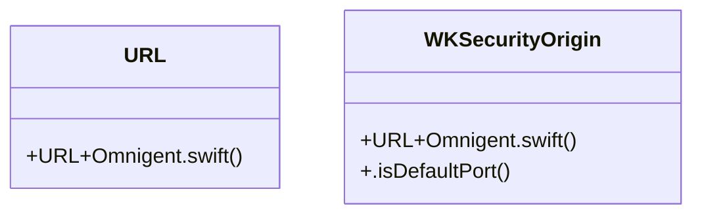

# Community 232

> 4 nodes · cohesion 0.50

## Key Concepts

- [URL+Omnigent.swift](file:///C:/Users/1/github-pr/agent-meow/web/ios/Omnigent/URL%2BOmnigent.swift#L1) (2 connections)
- [WKSecurityOrigin](file:///C:/Users/1/github-pr/agent-meow/web/ios/Omnigent/URL%2BOmnigent.swift#L23) (2 connections)
- [URL](file:///C:/Users/1/github-pr/agent-meow/web/ios/Omnigent/URL%2BOmnigent.swift#L4) (1 connections)
- [.isDefaultPort()](file:///C:/Users/1/github-pr/agent-meow/web/ios/Omnigent/URL%2BOmnigent.swift#L35) (1 connections)

## Class Diagram

## Relationships

- No strong cross-community connections detected

## Source Files

- [C:\Users\1\github-pr\agent-meow\web\ios\Omnigent\URL+Omnigent.swift](file:///C:/Users/1/github-pr/agent-meow/web/ios/Omnigent/URL%2BOmnigent.swift)

## Audit Trail

- EXTRACTED: 6 (100%)
- INFERRED: 0 (0%)
- AMBIGUOUS: 0 (0%)

---

*Part of the graphify knowledge wiki. See [[index]] to navigate.*