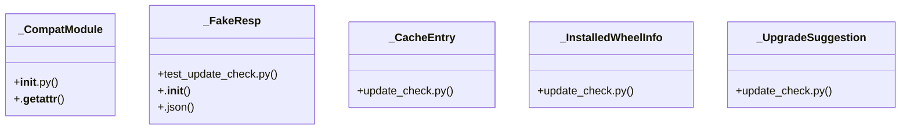

# Community 25

> 289 nodes · cohesion 0.01

## Key Concepts

- [test_update_check.py](file:///C:/Users/1/github-pr/agent-meow/tests/cli/test_update_check.py#L1) (90 connections)
- [update_check.py](file:///C:/Users/1/github-pr/agent-meow/agent_meow/update_check.py#L1) (44 connections)
- [_read_installed_wheel_info()](file:///C:/Users/1/github-pr/agent-meow/agent_meow/update_check.py#L1018) (30 connections)
- [_write_cache()](file:///C:/Users/1/github-pr/agent-meow/agent_meow/update_check.py#L725) (23 connections)
- [_CacheEntry](file:///C:/Users/1/github-pr/agent-meow/agent_meow/update_check.py#L98) (22 connections)
- [_write_fake_dist_info()](file:///C:/Users/1/github-pr/agent-meow/tests/cli/test_update_check.py#L587) (20 connections)
- [_read_cache()](file:///C:/Users/1/github-pr/agent-meow/agent_meow/update_check.py#L693) (20 connections)
- **ModuleType** (19 connections)
- [fetch_latest_version()](file:///C:/Users/1/github-pr/agent-meow/agent_meow/update_check.py#L462) (19 connections)
- [_run_installed_wheel_check()](file:///C:/Users/1/github-pr/agent-meow/agent_meow/update_check.py#L249) (18 connections)
- [maybe_show_update_notice()](file:///C:/Users/1/github-pr/agent-meow/agent_meow/update_check.py#L181) (16 connections)
- [upgrade()](file:///C:/Users/1/github-pr/agent-meow/agent_meow/cli.py#L3625) (13 connections)
- [_clear_index_env()](file:///C:/Users/1/github-pr/agent-meow/tests/cli/test_update_check.py#L1261) (13 connections)
- [extra_install_command()](file:///C:/Users/1/github-pr/agent-meow/agent_meow/onboarding/extra_install.py#L58) (12 connections)
- [_point_cache_at()](file:///C:/Users/1/github-pr/agent-meow/tests/cli/test_update_check.py#L963) (12 connections)
- [_build_upgrade_suggestion()](file:///C:/Users/1/github-pr/agent-meow/agent_meow/update_check.py#L1284) (12 connections)
- [_find_repo_root()](file:///C:/Users/1/github-pr/agent-meow/agent_meow/update_check.py#L661) (12 connections)
- [_resolve_index_url()](file:///C:/Users/1/github-pr/agent-meow/agent_meow/update_check.py#L335) (12 connections)
- [refresh_update_cache()](file:///C:/Users/1/github-pr/agent-meow/agent_meow/update_check.py#L590) (11 connections)
- [_run_dev_clone_check()](file:///C:/Users/1/github-pr/agent-meow/agent_meow/update_check.py#L200) (11 connections)
- [test_extra_install.py](file:///C:/Users/1/github-pr/agent-meow/tests/onboarding/test_extra_install.py#L1) (10 connections)
- [_upgrade_vcs_install()](file:///C:/Users/1/github-pr/agent-meow/agent_meow/cli.py#L3498) (9 connections)
- [_FakeResp](file:///C:/Users/1/github-pr/agent-meow/tests/cli/test_update_check.py#L1230) (9 connections)
- [test_wheel_check_ignores_clone_kind_cache()](file:///C:/Users/1/github-pr/agent-meow/tests/cli/test_update_check.py#L1169) (9 connections)
- [test_wheel_check_nags_when_newer_release_available()](file:///C:/Users/1/github-pr/agent-meow/tests/cli/test_update_check.py#L998) (9 connections)
- *... and 264 more nodes in this community*

## Class Diagram

## Relationships

- [[Community 4]] (5 shared connections)
- [[Community 14]] (1 shared connections)

## Source Files

- [C:\Users\1\github-pr\agent-meow\agent_meow\cli.py](file:///C:/Users/1/github-pr/agent-meow/agent_meow/cli.py)
- [C:\Users\1\github-pr\agent-meow\agent_meow\onboarding\extra_install.py](file:///C:/Users/1/github-pr/agent-meow/agent_meow/onboarding/extra_install.py)
- [C:\Users\1\github-pr\agent-meow\agent_meow\update_check.py](file:///C:/Users/1/github-pr/agent-meow/agent_meow/update_check.py)
- [C:\Users\1\github-pr\agent-meow\omnigent\__init__.py](file:///C:/Users/1/github-pr/agent-meow/omnigent/__init__.py)
- [C:\Users\1\github-pr\agent-meow\tests\cli\test_update_check.py](file:///C:/Users/1/github-pr/agent-meow/tests/cli/test_update_check.py)
- [C:\Users\1\github-pr\agent-meow\tests\onboarding\test_extra_install.py](file:///C:/Users/1/github-pr/agent-meow/tests/onboarding/test_extra_install.py)

## Audit Trail

- EXTRACTED: 787 (67%)
- INFERRED: 394 (33%)
- AMBIGUOUS: 0 (0%)

---

*Part of the graphify knowledge wiki. See [[index]] to navigate.*