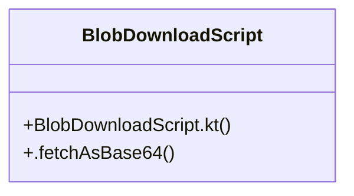

# Community 253

> 3 nodes · cohesion 0.67

## Key Concepts

- [BlobDownloadScript](file:///C:/Users/1/github-pr/agent-meow/web/android/app/src/main/java/io/cubecloud/agentmeow/BlobDownloadScript.kt#L14) (2 connections)
- [.fetchAsBase64()](file:///C:/Users/1/github-pr/agent-meow/web/android/app/src/main/java/io/cubecloud/agentmeow/BlobDownloadScript.kt#L16) (1 connections)
- [BlobDownloadScript.kt](file:///C:/Users/1/github-pr/agent-meow/web/android/app/src/main/java/io/cubecloud/agentmeow/BlobDownloadScript.kt#L1) (1 connections)

## Class Diagram

## Relationships

- No strong cross-community connections detected

## Source Files

- [C:\Users\1\github-pr\agent-meow\web\android\app\src\main\java\io\cubecloud\agentmeow\BlobDownloadScript.kt](file:///C:/Users/1/github-pr/agent-meow/web/android/app/src/main/java/io/cubecloud/agentmeow/BlobDownloadScript.kt)

## Audit Trail

- EXTRACTED: 4 (100%)
- INFERRED: 0 (0%)
- AMBIGUOUS: 0 (0%)

---

*Part of the graphify knowledge wiki. See [[index]] to navigate.*