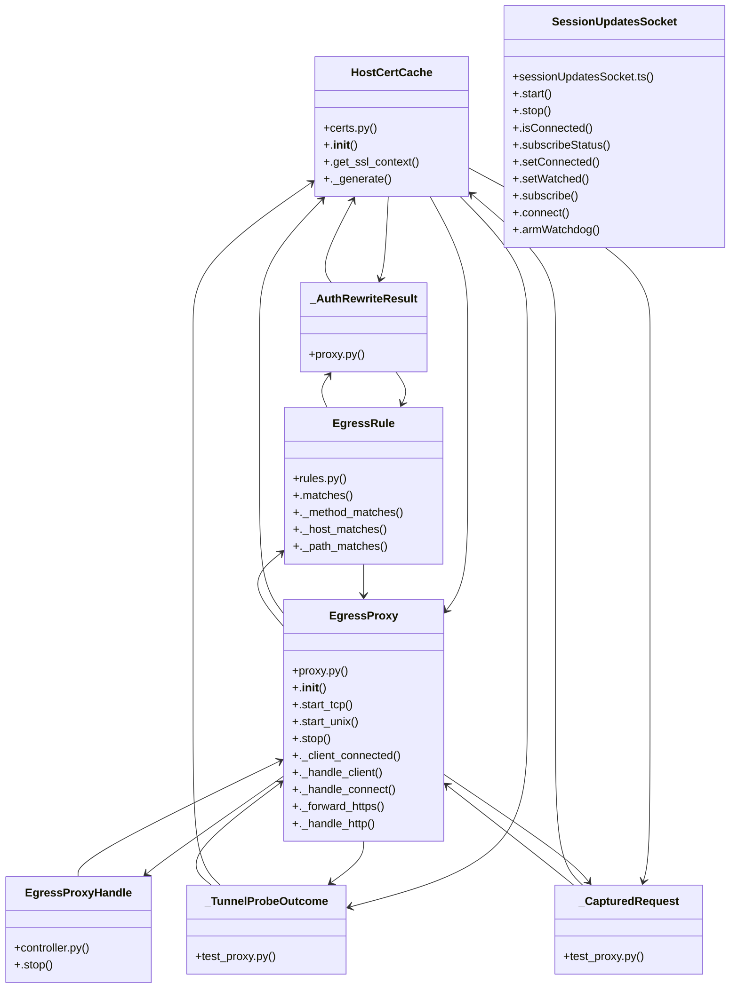

# Community 26

> 285 nodes · cohesion 0.02

## Key Concepts

- [EgressProxy](file:///C:/Users/1/github-pr/agent-meow/agent_meow/inner/egress/proxy.py#L133) (106 connections)
- [HostCertCache](file:///C:/Users/1/github-pr/agent-meow/agent_meow/inner/egress/certs.py#L30) (97 connections)
- [.stop()](file:///C:/Users/1/github-pr/agent-meow/web/src/lib/sessionUpdatesSocket.ts#L93) (59 connections)
- [test_proxy.py](file:///C:/Users/1/github-pr/agent-meow/tests/inner/egress/test_proxy.py#L1) (48 connections)
- [parse_rules()](file:///C:/Users/1/github-pr/agent-meow/agent_meow/inner/egress/rules.py#L175) (40 connections)
- [EgressRule](file:///C:/Users/1/github-pr/agent-meow/agent_meow/inner/egress/rules.py#L69) (38 connections)
- [drain()](file:///C:/Users/1/github-pr/agent-meow/web/src/loadtest/streamRenderBench.ts#L122) (33 connections)
- [._handle_connect()](file:///C:/Users/1/github-pr/agent-meow/agent_meow/inner/egress/proxy.py#L424) (29 connections)
- [.start_tcp()](file:///C:/Users/1/github-pr/agent-meow/agent_meow/inner/egress/proxy.py#L274) (28 connections)
- [ComposerMicButton.tsx](file:///C:/Users/1/github-pr/agent-meow/web/src/components/ComposerMicButton.tsx#L1) (26 connections)
- [.wait_closed()](file:///C:/Users/1/github-pr/agent-meow/tests/inner/test_pi_executor.py#L111) (26 connections)
- [._handle_http()](file:///C:/Users/1/github-pr/agent-meow/agent_meow/inner/egress/proxy.py#L749) (23 connections)
- [._handle_client()](file:///C:/Users/1/github-pr/agent-meow/agent_meow/inner/egress/proxy.py#L354) (18 connections)
- [identity-H4YHIUys.js](file:///C:/Users/1/github-pr/agent-meow/agent_meow/server/static/web-ui/assets/identity-H4YHIUys.js#L1) (17 connections)
- [start_egress_proxy()](file:///C:/Users/1/github-pr/agent-meow/agent_meow/inner/egress/controller.py#L126) (17 connections)
- [._forward_https()](file:///C:/Users/1/github-pr/agent-meow/agent_meow/inner/egress/proxy.py#L647) (17 connections)
- [parse_rule()](file:///C:/Users/1/github-pr/agent-meow/agent_meow/inner/egress/rules.py#L129) (17 connections)
- [proxy.py](file:///C:/Users/1/github-pr/agent-meow/agent_meow/inner/egress/proxy.py#L1) (16 connections)
- [test_rules.py](file:///C:/Users/1/github-pr/agent-meow/tests/inner/egress/test_rules.py#L1) (15 connections)
- [.start_server()](file:///C:/Users/1/github-pr/agent-meow/agent_meow/opencode_http_transport.py#L173) (15 connections)
- [SessionUpdatesSocket](file:///C:/Users/1/github-pr/agent-meow/web/src/lib/sessionUpdatesSocket.ts#L73) (15 connections)
- [test_credential_rewrite_swaps_basic_password()](file:///C:/Users/1/github-pr/agent-meow/tests/inner/egress/test_proxy.py#L1608) (14 connections)
- [matches](file:///C:/Users/1/github-pr/agent-meow/web/src/shell/WorkspacePathField.tsx#L166) (14 connections)
- [._assert_destination_allowed()](file:///C:/Users/1/github-pr/agent-meow/agent_meow/inner/egress/proxy.py#L912) (13 connections)
- [test_forwarded_request_is_single_shot_connection_close()](file:///C:/Users/1/github-pr/agent-meow/tests/inner/egress/test_proxy.py#L1863) (13 connections)
- *... and 260 more nodes in this community*

## Class Diagram

## Relationships

- [[Auth Config]] (5 shared connections)
- [[Community 14]] (3 shared connections)
- [[App Server Goals]] (1 shared connections)
- [[Community 13]] (1 shared connections)

## Source Files

- [C:\Users\1\github-pr\agent-meow\agent_meow\inner\egress\certs.py](file:///C:/Users/1/github-pr/agent-meow/agent_meow/inner/egress/certs.py)
- [C:\Users\1\github-pr\agent-meow\agent_meow\inner\egress\controller.py](file:///C:/Users/1/github-pr/agent-meow/agent_meow/inner/egress/controller.py)
- [C:\Users\1\github-pr\agent-meow\agent_meow\inner\egress\proxy.py](file:///C:/Users/1/github-pr/agent-meow/agent_meow/inner/egress/proxy.py)
- [C:\Users\1\github-pr\agent-meow\agent_meow\inner\egress\rules.py](file:///C:/Users/1/github-pr/agent-meow/agent_meow/inner/egress/rules.py)
- [C:\Users\1\github-pr\agent-meow\agent_meow\opencode_http_transport.py](file:///C:/Users/1/github-pr/agent-meow/agent_meow/opencode_http_transport.py)
- [C:\Users\1\github-pr\agent-meow\agent_meow\server\static\web-ui\assets\identity-H4YHIUys.js](file:///C:/Users/1/github-pr/agent-meow/agent_meow/server/static/web-ui/assets/identity-H4YHIUys.js)
- [C:\Users\1\github-pr\agent-meow\tests\inner\egress\test_certs.py](file:///C:/Users/1/github-pr/agent-meow/tests/inner/egress/test_certs.py)
- [C:\Users\1\github-pr\agent-meow\tests\inner\egress\test_proxy.py](file:///C:/Users/1/github-pr/agent-meow/tests/inner/egress/test_proxy.py)
- [C:\Users\1\github-pr\agent-meow\tests\inner\egress\test_rules.py](file:///C:/Users/1/github-pr/agent-meow/tests/inner/egress/test_rules.py)
- [C:\Users\1\github-pr\agent-meow\tests\inner\test_pi_executor.py](file:///C:/Users/1/github-pr/agent-meow/tests/inner/test_pi_executor.py)
- [C:\Users\1\github-pr\agent-meow\web\electron\src\preload.js](file:///C:/Users/1/github-pr/agent-meow/web/electron/src/preload.js)
- [C:\Users\1\github-pr\agent-meow\web\src\components\ComposerMicButton.tsx](file:///C:/Users/1/github-pr/agent-meow/web/src/components/ComposerMicButton.tsx)
- [C:\Users\1\github-pr\agent-meow\web\src\hooks\useIOSNativeKeyboardInset.ts](file:///C:/Users/1/github-pr/agent-meow/web/src/hooks/useIOSNativeKeyboardInset.ts)
- [C:\Users\1\github-pr\agent-meow\web\src\lib\host.ts](file:///C:/Users/1/github-pr/agent-meow/web/src/lib/host.ts)
- [C:\Users\1\github-pr\agent-meow\web\src\lib\sessionUpdatesSocket.ts](file:///C:/Users/1/github-pr/agent-meow/web/src/lib/sessionUpdatesSocket.ts)
- [C:\Users\1\github-pr\agent-meow\web\src\loadtest\streamRenderBench.ts](file:///C:/Users/1/github-pr/agent-meow/web/src/loadtest/streamRenderBench.ts)
- [C:\Users\1\github-pr\agent-meow\web\src\shell\WorkspacePathField.tsx](file:///C:/Users/1/github-pr/agent-meow/web/src/shell/WorkspacePathField.tsx)

## Audit Trail

- EXTRACTED: 692 (40%)
- INFERRED: 1042 (60%)
- AMBIGUOUS: 0 (0%)

---

*Part of the graphify knowledge wiki. See [[index]] to navigate.*