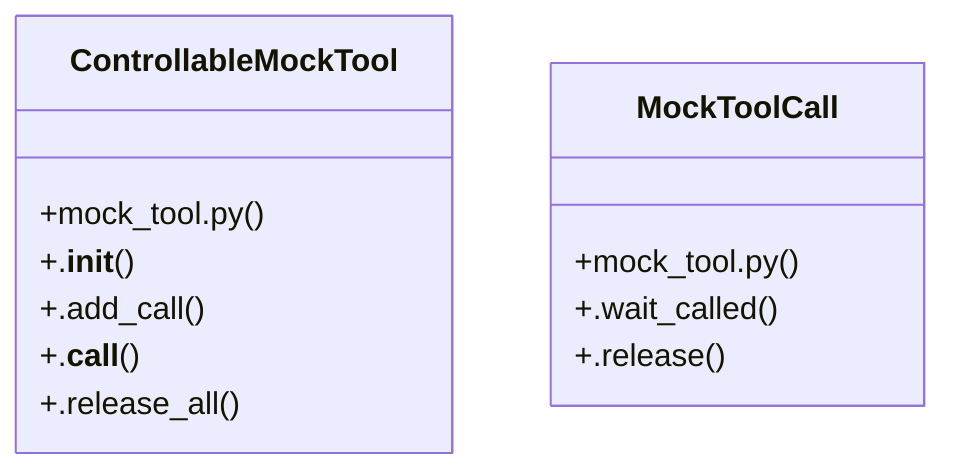

# Community 27

> 159 nodes · cohesion 0.02

## Key Concepts

- [renderItems.test.ts](file:///C:/Users/1/github-pr/agent-meow/web/src/lib/renderItems.test.ts#L1) (64 connections)
- [test_decorator.py](file:///C:/Users/1/github-pr/agent-meow/tests/tools/test_decorator.py#L1) (34 connections)
- [ControllableMockTool](file:///C:/Users/1/github-pr/agent-meow/tests/server/integration/mock_tool.py#L86) (22 connections)
- [MockToolCall](file:///C:/Users/1/github-pr/agent-meow/tests/server/integration/mock_tool.py#L32) (16 connections)
- [tool](file:///C:/Users/1/github-pr/agent-meow/web/src/lib/renderItems.test.ts#L748) (16 connections)
- [get_tool_metadata()](file:///C:/Users/1/github-pr/agent-meow/sdks/python-client/omnigent_client/tools/_decorator.py#L223) (15 connections)
- [.add_call()](file:///C:/Users/1/github-pr/agent-meow/tests/server/integration/mock_tool.py#L117) (11 connections)
- [test_mock_tool.py](file:///C:/Users/1/github-pr/agent-meow/tests/server/integration/test_mock_tool.py#L1) (9 connections)
- [test_blocked_call_does_not_return_until_release()](file:///C:/Users/1/github-pr/agent-meow/tests/server/integration/test_mock_tool.py#L96) (8 connections)
- [test_call_event_fires_before_block_so_test_can_synchronize()](file:///C:/Users/1/github-pr/agent-meow/tests/server/integration/test_mock_tool.py#L118) (7 connections)
- [test_release_all_unblocks_every_pending_call()](file:///C:/Users/1/github-pr/agent-meow/tests/server/integration/test_mock_tool.py#L140) (7 connections)
- [ctx()](file:///C:/Users/1/github-pr/agent-meow/web/src/lib/renderItems.test.ts#L23) (6 connections)
- [test_exception_propagates_from_call_site()](file:///C:/Users/1/github-pr/agent-meow/tests/server/integration/test_mock_tool.py#L80) (6 connections)
- [_validate_decorator_target()](file:///C:/Users/1/github-pr/agent-meow/sdks/python-client/omnigent_client/tools/_decorator.py#L165) (5 connections)
- [.__call__()](file:///C:/Users/1/github-pr/agent-meow/tests/server/integration/mock_tool.py#L147) (5 connections)
- [.wait_called()](file:///C:/Users/1/github-pr/agent-meow/tests/server/integration/mock_tool.py#L63) (5 connections)
- [test_calls_consumed_in_fifo_order()](file:///C:/Users/1/github-pr/agent-meow/tests/server/integration/test_mock_tool.py#L34) (5 connections)
- [test_received_calls_records_invocations_in_order()](file:///C:/Users/1/github-pr/agent-meow/tests/server/integration/test_mock_tool.py#L60) (5 connections)
- [test_decorator_preserves_async_callable()](file:///C:/Users/1/github-pr/agent-meow/tests/tools/test_decorator.py#L246) (4 connections)
- [test_get_tool_metadata_returns_metadata_object()](file:///C:/Users/1/github-pr/agent-meow/tests/tools/test_decorator.py#L270) (4 connections)
- [test_default_mock_call_has_no_block_event()](file:///C:/Users/1/github-pr/agent-meow/tests/server/integration/test_mock_tool.py#L172) (4 connections)
- [test_unscripted_call_uses_default_so_tests_dont_deadlock()](file:///C:/Users/1/github-pr/agent-meow/tests/server/integration/test_mock_tool.py#L49) (4 connections)
- [mock_tool.py](file:///C:/Users/1/github-pr/agent-meow/tests/server/integration/mock_tool.py#L1) (3 connections)
- [toolOf()](file:///C:/Users/1/github-pr/agent-meow/web/src/lib/renderItems.test.ts#L717) (3 connections)
- [test_decorator_accepts_module_level_async_def()](file:///C:/Users/1/github-pr/agent-meow/tests/tools/test_decorator.py#L154) (3 connections)
- *... and 134 more nodes in this community*

## Class Diagram

## Relationships

- No strong cross-community connections detected

## Source Files

- [C:\Users\1\github-pr\agent-meow\sdks\python-client\omnigent_client\tools\_decorator.py](file:///C:/Users/1/github-pr/agent-meow/sdks/python-client/omnigent_client/tools/_decorator.py)
- [C:\Users\1\github-pr\agent-meow\tests\server\integration\mock_tool.py](file:///C:/Users/1/github-pr/agent-meow/tests/server/integration/mock_tool.py)
- [C:\Users\1\github-pr\agent-meow\tests\server\integration\test_mock_tool.py](file:///C:/Users/1/github-pr/agent-meow/tests/server/integration/test_mock_tool.py)
- [C:\Users\1\github-pr\agent-meow\tests\tools\test_decorator.py](file:///C:/Users/1/github-pr/agent-meow/tests/tools/test_decorator.py)
- [C:\Users\1\github-pr\agent-meow\web\src\lib\renderItems.test.ts](file:///C:/Users/1/github-pr/agent-meow/web/src/lib/renderItems.test.ts)

## Audit Trail

- EXTRACTED: 330 (70%)
- INFERRED: 143 (30%)
- AMBIGUOUS: 0 (0%)

---

*Part of the graphify knowledge wiki. See [[index]] to navigate.*