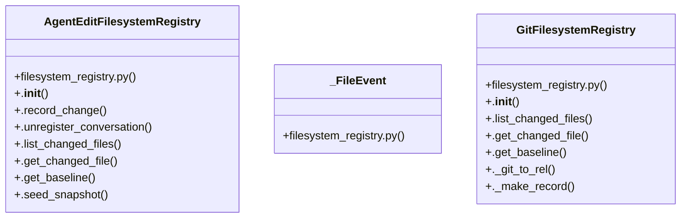

# Community 28

> 121 nodes · cohesion 0.04

## Key Concepts

- [GitFilesystemRegistry](file:///C:/Users/1/github-pr/agent-meow/agent_meow/runtime/filesystem_registry.py#L665) (57 connections)
- [AgentEditFilesystemRegistry](file:///C:/Users/1/github-pr/agent-meow/agent_meow/runtime/filesystem_registry.py#L438) (53 connections)
- [test_filesystem_registry.py](file:///C:/Users/1/github-pr/agent-meow/tests/runtime/test_filesystem_registry.py#L1) (37 connections)
- [.list_changed_files()](file:///C:/Users/1/github-pr/agent-meow/agent_meow/runtime/filesystem_registry.py#L691) (29 connections)
- [filesystem_registry.py](file:///C:/Users/1/github-pr/agent-meow/agent_meow/runtime/filesystem_registry.py#L1) (19 connections)
- [.get_changed_file()](file:///C:/Users/1/github-pr/agent-meow/agent_meow/runtime/filesystem_registry.py#L772) (16 connections)
- [_normalize_path()](file:///C:/Users/1/github-pr/agent-meow/agent_meow/runtime/filesystem_registry.py#L164) (16 connections)
- [.get_baseline()](file:///C:/Users/1/github-pr/agent-meow/agent_meow/runtime/filesystem_registry.py#L852) (13 connections)
- [_git_env()](file:///C:/Users/1/github-pr/agent-meow/tests/runtime/test_filesystem_registry.py#L356) (12 connections)
- [_inject()](file:///C:/Users/1/github-pr/agent-meow/tests/runtime/test_filesystem_registry.py#L31) (12 connections)
- [.seed_snapshot()](file:///C:/Users/1/github-pr/agent-meow/agent_meow/runtime/filesystem_registry.py#L638) (11 connections)
- [create_filesystem_registry()](file:///C:/Users/1/github-pr/agent-meow/agent_meow/runtime/filesystem_registry.py#L923) (10 connections)
- [.list_changed_files()](file:///C:/Users/1/github-pr/agent-meow/agent_meow/runtime/filesystem_registry.py#L534) (9 connections)
- [_parse_git_porcelain_line()](file:///C:/Users/1/github-pr/agent-meow/agent_meow/runtime/filesystem_registry.py#L245) (8 connections)
- [_is_ephemeral()](file:///C:/Users/1/github-pr/agent-meow/agent_meow/runtime/filesystem_registry.py#L93) (7 connections)
- [test_git_changed_files_suppress_ephemeral_files()](file:///C:/Users/1/github-pr/agent-meow/tests/runtime/test_filesystem_registry.py#L477) (7 connections)
- [test_git_list_changed_files_excludes_terminals_dir()](file:///C:/Users/1/github-pr/agent-meow/tests/runtime/test_filesystem_registry.py#L433) (7 connections)
- [test_git_list_changed_files_expands_untracked_nested_dir()](file:///C:/Users/1/github-pr/agent-meow/tests/runtime/test_filesystem_registry.py#L629) (7 connections)
- [._make_record()](file:///C:/Users/1/github-pr/agent-meow/agent_meow/runtime/filesystem_registry.py#L900) (6 connections)
- [test_get_baseline_returns_none_for_new_untracked_file()](file:///C:/Users/1/github-pr/agent-meow/tests/runtime/test_filesystem_registry.py#L403) (6 connections)
- [test_get_baseline_uses_git_show_for_committed_file()](file:///C:/Users/1/github-pr/agent-meow/tests/runtime/test_filesystem_registry.py#L371) (6 connections)
- [test_git_get_changed_file_raises_on_nonzero_exit()](file:///C:/Users/1/github-pr/agent-meow/tests/runtime/test_filesystem_registry.py#L591) (6 connections)
- [test_git_get_changed_file_raises_on_timeout()](file:///C:/Users/1/github-pr/agent-meow/tests/runtime/test_filesystem_registry.py#L571) (6 connections)
- [test_git_get_changed_file_returns_none_when_unchanged()](file:///C:/Users/1/github-pr/agent-meow/tests/runtime/test_filesystem_registry.py#L611) (6 connections)
- [test_git_list_changed_files_raises_on_nonzero_exit()](file:///C:/Users/1/github-pr/agent-meow/tests/runtime/test_filesystem_registry.py#L547) (6 connections)
- *... and 96 more nodes in this community*

## Class Diagram

## Relationships

- No strong cross-community connections detected

## Source Files

- [C:\Users\1\github-pr\agent-meow\agent_meow\runtime\filesystem_registry.py](file:///C:/Users/1/github-pr/agent-meow/agent_meow/runtime/filesystem_registry.py)
- [C:\Users\1\github-pr\agent-meow\tests\runtime\test_filesystem_registry.py](file:///C:/Users/1/github-pr/agent-meow/tests/runtime/test_filesystem_registry.py)

## Audit Trail

- EXTRACTED: 330 (48%)
- INFERRED: 360 (52%)
- AMBIGUOUS: 0 (0%)

---

*Part of the graphify knowledge wiki. See [[index]] to navigate.*