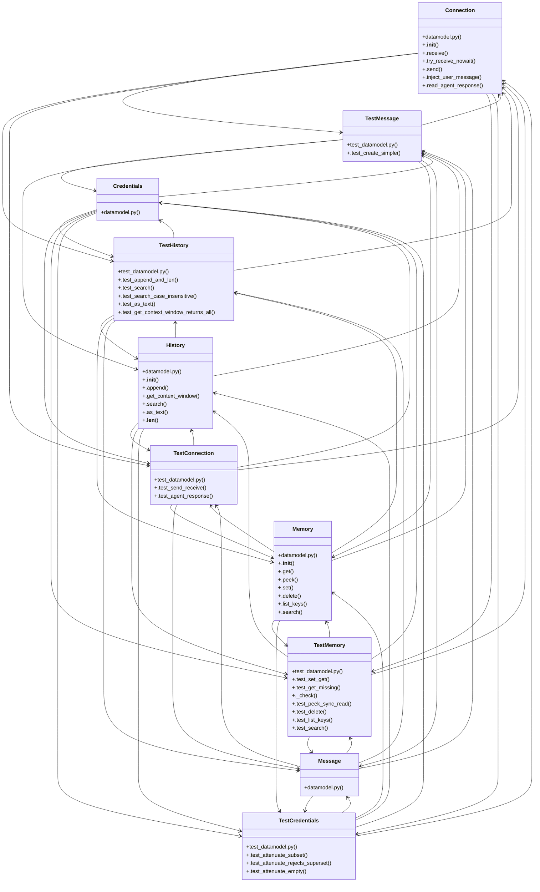

# Community 29

> 81 nodes · cohesion 0.04

## Key Concepts

- [NewChatDialog.flow.test.tsx](file:///C:/Users/1/github-pr/agent-meow/web/src/shell/NewChatDialog.flow.test.tsx#L1) (20 connections)
- [Memory](file:///C:/Users/1/github-pr/agent-meow/agent_meow/inner/datamodel.py#L202) (18 connections)
- [Connection](file:///C:/Users/1/github-pr/agent-meow/agent_meow/inner/datamodel.py#L149) (16 connections)
- [History](file:///C:/Users/1/github-pr/agent-meow/agent_meow/inner/datamodel.py#L101) (16 connections)
- [TestMemory](file:///C:/Users/1/github-pr/agent-meow/tests/inner/test_datamodel.py#L91) (15 connections)
- [Credentials](file:///C:/Users/1/github-pr/agent-meow/agent_meow/inner/datamodel.py#L261) (14 connections)
- [TestHistory](file:///C:/Users/1/github-pr/agent-meow/tests/inner/test_datamodel.py#L36) (13 connections)
- [Message](file:///C:/Users/1/github-pr/agent-meow/agent_meow/inner/datamodel.py#L51) (11 connections)
- [TestCredentials](file:///C:/Users/1/github-pr/agent-meow/tests/inner/test_datamodel.py#L146) (11 connections)
- [_run()](file:///C:/Users/1/github-pr/agent-meow/tests/inner/test_datamodel.py#L21) (10 connections)
- [TestConnection](file:///C:/Users/1/github-pr/agent-meow/tests/inner/test_datamodel.py#L71) (10 connections)
- [TestMessage](file:///C:/Users/1/github-pr/agent-meow/tests/inner/test_datamodel.py#L29) (9 connections)
- [test_datamodel.py](file:///C:/Users/1/github-pr/agent-meow/tests/inner/test_datamodel.py#L1) (8 connections)
- [message](file:///C:/Users/1/github-pr/agent-meow/web/src/components/codex/CodexGoalDialog.tsx#L267) (8 connections)
- [Tests for the agent-meow datamodel module.](file:///C:/Users/1/github-pr/agent-meow/tests/inner/test_datamodel.py#L1) (8 connections)
- [.test_get_context_window_returns_all()](file:///C:/Users/1/github-pr/agent-meow/tests/inner/test_datamodel.py#L63) (7 connections)
- [.attenuate()](file:///C:/Users/1/github-pr/agent-meow/agent_meow/inner/datamodel.py#L279) (6 connections)
- [.as_text()](file:///C:/Users/1/github-pr/agent-meow/agent_meow/inner/datamodel.py#L133) (6 connections)
- [.search()](file:///C:/Users/1/github-pr/agent-meow/agent_meow/inner/datamodel.py#L124) (6 connections)
- [history](file:///C:/Users/1/github-pr/agent-meow/web/src/shell/NewChatDialog.flow.test.tsx#L484) (6 connections)
- [.test_search()](file:///C:/Users/1/github-pr/agent-meow/tests/inner/test_datamodel.py#L43) (6 connections)
- [.test_search_case_insensitive()](file:///C:/Users/1/github-pr/agent-meow/tests/inner/test_datamodel.py#L50) (6 connections)
- [._check()](file:///C:/Users/1/github-pr/agent-meow/tests/inner/test_datamodel.py#L103) (6 connections)
- [.test_append_and_len()](file:///C:/Users/1/github-pr/agent-meow/tests/inner/test_datamodel.py#L37) (5 connections)
- [.test_as_text()](file:///C:/Users/1/github-pr/agent-meow/tests/inner/test_datamodel.py#L55) (5 connections)
- *... and 56 more nodes in this community*

## Class Diagram

## Relationships

- [[Community 14]] (5 shared connections)

## Source Files

- [C:\Users\1\github-pr\agent-meow\agent_meow\inner\datamodel.py](file:///C:/Users/1/github-pr/agent-meow/agent_meow/inner/datamodel.py)
- [C:\Users\1\github-pr\agent-meow\tests\inner\test_datamodel.py](file:///C:/Users/1/github-pr/agent-meow/tests/inner/test_datamodel.py)
- [C:\Users\1\github-pr\agent-meow\web\src\components\UserMessageNav.tsx](file:///C:/Users/1/github-pr/agent-meow/web/src/components/UserMessageNav.tsx)
- [C:\Users\1\github-pr\agent-meow\web\src\components\codex\CodexGoalDialog.tsx](file:///C:/Users/1/github-pr/agent-meow/web/src/components/codex/CodexGoalDialog.tsx)
- [C:\Users\1\github-pr\agent-meow\web\src\shell\NewChatDialog.flow.test.tsx](file:///C:/Users/1/github-pr/agent-meow/web/src/shell/NewChatDialog.flow.test.tsx)

## Audit Trail

- EXTRACTED: 187 (53%)
- INFERRED: 163 (47%)
- AMBIGUOUS: 0 (0%)

---

*Part of the graphify knowledge wiki. See [[index]] to navigate.*