# Community 33

> 54 nodes · cohesion 0.06

## Key Concepts

- [._spec()](file:///C:/Users/1/github-pr/agent-meow/tests/server/test_antigravity_elicitation.py#L421) (22 connections)
- [to_interaction_payload()](file:///C:/Users/1/github-pr/agent-meow/agent_meow/server/routes/_antigravity_elicitation.py#L197) (21 connections)
- [to_tui_selection_keys()](file:///C:/Users/1/github-pr/agent-meow/agent_meow/server/routes/_antigravity_elicitation.py#L341) (13 connections)
- [TestToInteractionPayloadAskQuestion](file:///C:/Users/1/github-pr/agent-meow/tests/server/test_antigravity_elicitation.py#L260) (12 connections)
- [test_antigravity_elicitation.py](file:///C:/Users/1/github-pr/agent-meow/tests/server/test_antigravity_elicitation.py#L1) (11 connections)
- [TestToTuiSelectionKeysAskQuestion](file:///C:/Users/1/github-pr/agent-meow/tests/server/test_antigravity_elicitation.py#L418) (8 connections)
- [TestToInteractionPayloadMultiQuestion](file:///C:/Users/1/github-pr/agent-meow/tests/server/test_antigravity_elicitation.py#L330) (7 connections)
- [TestToInteractionPayloadPermission](file:///C:/Users/1/github-pr/agent-meow/tests/server/test_antigravity_elicitation.py#L367) (7 connections)
- [TestToTuiSelectionKeysPermission](file:///C:/Users/1/github-pr/agent-meow/tests/server/test_antigravity_elicitation.py#L394) (7 connections)
- [.test_multi_select_multiple_ids()](file:///C:/Users/1/github-pr/agent-meow/tests/server/test_antigravity_elicitation.py#L306) (5 connections)
- [.test_single_option_selected()](file:///C:/Users/1/github-pr/agent-meow/tests/server/test_antigravity_elicitation.py#L273) (5 connections)
- [.test_each_question_answered_with_its_own_option()](file:///C:/Users/1/github-pr/agent-meow/tests/server/test_antigravity_elicitation.py#L338) (5 connections)
- [.test_accept_types_selected_option_id_then_enter()](file:///C:/Users/1/github-pr/agent-meow/tests/server/test_antigravity_elicitation.py#L426) (5 connections)
- [.test_decline_types_escape()](file:///C:/Users/1/github-pr/agent-meow/tests/server/test_antigravity_elicitation.py#L438) (5 connections)
- [.test_multi_select_types_all_ids_then_enter()](file:///C:/Users/1/github-pr/agent-meow/tests/server/test_antigravity_elicitation.py#L431) (5 connections)
- [.test_write_in_only_answer_types_escape()](file:///C:/Users/1/github-pr/agent-meow/tests/server/test_antigravity_elicitation.py#L443) (5 connections)
- [.test_accept_types_option_1_then_enter()](file:///C:/Users/1/github-pr/agent-meow/tests/server/test_antigravity_elicitation.py#L402) (5 connections)
- [.test_cancel_types_option_4_then_enter()](file:///C:/Users/1/github-pr/agent-meow/tests/server/test_antigravity_elicitation.py#L412) (5 connections)
- [.test_decline_types_option_4_then_enter()](file:///C:/Users/1/github-pr/agent-meow/tests/server/test_antigravity_elicitation.py#L407) (5 connections)
- [TestUnknownKind](file:///C:/Users/1/github-pr/agent-meow/tests/server/test_antigravity_elicitation.py#L466) (5 connections)
- [.test_answer_keyed_by_question_text_fallback()](file:///C:/Users/1/github-pr/agent-meow/tests/server/test_antigravity_elicitation.py#L290) (4 connections)
- [.test_cancel_returns_empty()](file:///C:/Users/1/github-pr/agent-meow/tests/server/test_antigravity_elicitation.py#L301) (4 connections)
- [.test_decline_returns_empty()](file:///C:/Users/1/github-pr/agent-meow/tests/server/test_antigravity_elicitation.py#L296) (4 connections)
- [.test_selected_id_is_agy_id_not_label()](file:///C:/Users/1/github-pr/agent-meow/tests/server/test_antigravity_elicitation.py#L283) (4 connections)
- [.test_write_in_absent_when_only_predefined()](file:///C:/Users/1/github-pr/agent-meow/tests/server/test_antigravity_elicitation.py#L324) (4 connections)
- *... and 29 more nodes in this community*

## Class Diagram

```mermaid
classDiagram
    class TestToInteractionPayloadAskQuestion {
        +test_antigravity_elicitation.py()
        +._spec()
        +.test_single_option_selected()
        +.test_selected_id_is_agy_id_not_label()
        +.test_answer_keyed_by_question_text_fallback()
        +.test_decline_returns_empty()
        +.test_cancel_returns_empty()
        +.test_multi_select_multiple_ids()
        +.test_write_in_response_included()
        +.test_write_in_absent_when_only_predefined()
    }
    class TestToInteractionPayloadMultiQuestion {
        +test_antigravity_elicitation.py()
        +._spec()
        +.test_each_question_answered_with_its_own_option()
        +.test_no_cross_question_broadcast()
        +.test_decline_returns_empty()
    }
    class TestToInteractionPayloadPermission {
        +test_antigravity_elicitation.py()
        +._spec()
        +.test_accept_returns_allow_true()
        +.test_decline_returns_allow_false()
        +.test_cancel_returns_allow_false()
    }
    class TestToTuiSelectionKeysAskQuestion {
        +test_antigravity_elicitation.py()
        +._spec()
        +.test_accept_types_selected_option_id_then_enter()
        +.test_multi_select_types_all_ids_then_enter()
        +.test_decline_types_escape()
        +.test_write_in_only_answer_types_escape()
    }
    class TestToTuiSelectionKeysPermission {
        +test_antigravity_elicitation.py()
        +._spec()
        +.test_accept_types_option_1_then_enter()
        +.test_decline_types_option_4_then_enter()
        +.test_cancel_types_option_4_then_enter()
    }
    class TestToTuiSelectionKeysUnknownKind {
        +test_antigravity_elicitation.py()
        +.test_unknown_kind_raises()
    }
    class TestUnknownKind {
        +test_antigravity_elicitation.py()
        +.test_to_elicitation_params_unknown_kind_raises()
        +.test_to_interaction_payload_unknown_kind_raises()
    }
```

## Relationships

- [[Community 4]] (2 shared connections)

## Source Files

- [C:\Users\1\github-pr\agent-meow\agent_meow\server\routes\_antigravity_elicitation.py](file:///C:/Users/1/github-pr/agent-meow/agent_meow/server/routes/_antigravity_elicitation.py)
- [C:\Users\1\github-pr\agent-meow\tests\server\test_antigravity_elicitation.py](file:///C:/Users/1/github-pr/agent-meow/tests/server/test_antigravity_elicitation.py)

## Audit Trail

- EXTRACTED: 150 (58%)
- INFERRED: 107 (42%)
- AMBIGUOUS: 0 (0%)

---

*Part of the graphify knowledge wiki. See [[index]] to navigate.*