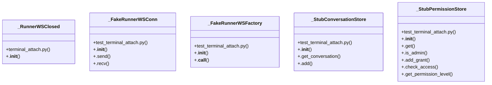

# Community 34

> 52 nodes · cohesion 0.07

## Key Concepts

- [test_terminal_attach.py](file:///C:/Users/1/github-pr/agent-meow/tests/server/routes/test_terminal_attach.py#L1) (21 connections)
- [_StubPermissionStore](file:///C:/Users/1/github-pr/agent-meow/tests/server/routes/test_terminal_attach.py#L49) (15 connections)
- [_FakeRunnerWSConn](file:///C:/Users/1/github-pr/agent-meow/tests/server/routes/test_terminal_attach.py#L229) (14 connections)
- [_FakeRunnerWSFactory](file:///C:/Users/1/github-pr/agent-meow/tests/server/routes/test_terminal_attach.py#L302) (14 connections)
- [_StubConversationStore](file:///C:/Users/1/github-pr/agent-meow/tests/server/routes/test_terminal_attach.py#L94) (12 connections)
- [test_attach_terminal_allows_owner_for_interactive_proxy()](file:///C:/Users/1/github-pr/agent-meow/tests/server/routes/test_terminal_attach.py#L395) (12 connections)
- [set_runner_ws_factory()](file:///C:/Users/1/github-pr/agent-meow/agent_meow/runtime/__init__.py#L341) (11 connections)
- [test_attach_terminal_edit_grant_denied_write_allowed_read_only()](file:///C:/Users/1/github-pr/agent-meow/tests/server/routes/test_terminal_attach.py#L428) (11 connections)
- [test_attach_terminal_read_grant_only_allows_read_only_proxy()](file:///C:/Users/1/github-pr/agent-meow/tests/server/routes/test_terminal_attach.py#L480) (11 connections)
- [test_attach_terminal_rejects_missing_identity_before_runner_proxy()](file:///C:/Users/1/github-pr/agent-meow/tests/server/routes/test_terminal_attach.py#L367) (11 connections)
- [test_attach_terminal_rejects_unauthorized_user_before_runner_proxy()](file:///C:/Users/1/github-pr/agent-meow/tests/server/routes/test_terminal_attach.py#L338) (11 connections)
- [create_terminal_attach_router()](file:///C:/Users/1/github-pr/agent-meow/agent_meow/server/routes/terminal_attach.py#L104) (9 connections)
- [.add()](file:///C:/Users/1/github-pr/agent-meow/tests/server/routes/test_terminal_attach.py#L103) (7 connections)
- [.add_grant()](file:///C:/Users/1/github-pr/agent-meow/tests/server/routes/test_terminal_attach.py#L62) (7 connections)
- [_authorize_terminal_attach()](file:///C:/Users/1/github-pr/agent-meow/agent_meow/server/routes/terminal_attach.py#L278) (6 connections)
- [_RunnerWSClosed](file:///C:/Users/1/github-pr/agent-meow/agent_meow/server/routes/terminal_attach.py#L356) (6 connections)
- [test_attach_terminal_proxy_forwards_browser_bytes_to_runner()](file:///C:/Users/1/github-pr/agent-meow/tests/server/routes/test_terminal_attach.py#L554) (6 connections)
- [terminal_attach.py](file:///C:/Users/1/github-pr/agent-meow/agent_meow/server/routes/terminal_attach.py#L1) (5 connections)
- [runner_client_reset()](file:///C:/Users/1/github-pr/agent-meow/tests/server/routes/test_terminal_attach.py#L173) (5 connections)
- [test_attach_terminal_proxies_to_runner_ws_factory()](file:///C:/Users/1/github-pr/agent-meow/tests/server/routes/test_terminal_attach.py#L524) (5 connections)
- [test_attach_terminal_runner_close_propagates_close_code()](file:///C:/Users/1/github-pr/agent-meow/tests/server/routes/test_terminal_attach.py#L590) (4 connections)
- [WebSocket endpoint exposing an agent's live terminals to the browser.  This mo](file:///C:/Users/1/github-pr/agent-meow/agent_meow/server/routes/terminal_attach.py#L1) (3 connections)
- [Build the router exposing the terminal-attach WebSocket route.      Wired into](file:///C:/Users/1/github-pr/agent-meow/agent_meow/server/routes/terminal_attach.py#L110) (3 connections)
- [Authorize a terminal-attach WebSocket before accepting it.      Interactive at](file:///C:/Users/1/github-pr/agent-meow/agent_meow/server/routes/terminal_attach.py#L287) (3 connections)
- [Carries a runner-side close so the browser side mirrors it.](file:///C:/Users/1/github-pr/agent-meow/agent_meow/server/routes/terminal_attach.py#L357) (3 connections)
- *... and 27 more nodes in this community*

## Class Diagram

## Relationships

- [[Community 4]] (1 shared connections)

## Source Files

- [C:\Users\1\github-pr\agent-meow\agent_meow\runtime\__init__.py](file:///C:/Users/1/github-pr/agent-meow/agent_meow/runtime/__init__.py)
- [C:\Users\1\github-pr\agent-meow\agent_meow\server\routes\terminal_attach.py](file:///C:/Users/1/github-pr/agent-meow/agent_meow/server/routes/terminal_attach.py)
- [C:\Users\1\github-pr\agent-meow\tests\server\routes\test_terminal_attach.py](file:///C:/Users/1/github-pr/agent-meow/tests/server/routes/test_terminal_attach.py)

## Audit Trail

- EXTRACTED: 184 (64%)
- INFERRED: 104 (36%)
- AMBIGUOUS: 0 (0%)

---

*Part of the graphify knowledge wiki. See [[index]] to navigate.*