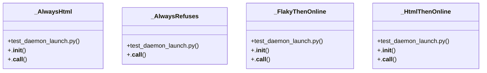

# Community 39

> 43 nodes · cohesion 0.06

## Key Concepts

- [test_daemon_launch.py](file:///C:/Users/1/github-pr/agent-meow/tests/host/test_daemon_launch.py#L1) (16 connections)
- [_FlakyThenOnline](file:///C:/Users/1/github-pr/agent-meow/tests/host/test_daemon_launch.py#L26) (8 connections)
- [_AlwaysHtml](file:///C:/Users/1/github-pr/agent-meow/tests/host/test_daemon_launch.py#L108) (6 connections)
- [_HtmlThenOnline](file:///C:/Users/1/github-pr/agent-meow/tests/host/test_daemon_launch.py#L69) (6 connections)
- [_AlwaysRefuses](file:///C:/Users/1/github-pr/agent-meow/tests/host/test_daemon_launch.py#L56) (5 connections)
- [test_wait_for_host_online_deadline_reports_last_connect_error()](file:///C:/Users/1/github-pr/agent-meow/tests/host/test_daemon_launch.py#L264) (5 connections)
- [test_wait_for_runner_online_deadline_reports_last_connect_error()](file:///C:/Users/1/github-pr/agent-meow/tests/host/test_daemon_launch.py#L223) (5 connections)
- [test_wait_for_runner_online_fails_fast_on_exit_report()](file:///C:/Users/1/github-pr/agent-meow/tests/host/test_daemon_launch.py#L162) (5 connections)
- [test_wait_for_runner_online_html_fallback_fails_with_timeout_not_jsonerror()](file:///C:/Users/1/github-pr/agent-meow/tests/host/test_daemon_launch.py#L300) (5 connections)
- [test_wait_for_runner_online_keeps_polling_without_exit_report()](file:///C:/Users/1/github-pr/agent-meow/tests/host/test_daemon_launch.py#L200) (5 connections)
- [test_runner_is_online_false_on_html_fallback_body()](file:///C:/Users/1/github-pr/agent-meow/tests/host/test_daemon_launch.py#L322) (4 connections)
- [test_wait_for_host_online_polls_through_transient_connect_errors()](file:///C:/Users/1/github-pr/agent-meow/tests/host/test_daemon_launch.py#L246) (4 connections)
- [test_wait_for_host_online_tolerates_html_fallback_then_online()](file:///C:/Users/1/github-pr/agent-meow/tests/host/test_daemon_launch.py#L336) (4 connections)
- [test_wait_for_runner_online_polls_through_transient_connect_errors()](file:///C:/Users/1/github-pr/agent-meow/tests/host/test_daemon_launch.py#L140) (4 connections)
- [test_wait_for_runner_online_tolerates_html_fallback_then_online()](file:///C:/Users/1/github-pr/agent-meow/tests/host/test_daemon_launch.py#L279) (4 connections)
- [.__call__()](file:///C:/Users/1/github-pr/agent-meow/tests/host/test_daemon_launch.py#L114) (3 connections)
- [.__call__()](file:///C:/Users/1/github-pr/agent-meow/tests/host/test_daemon_launch.py#L41) (3 connections)
- [.__call__()](file:///C:/Users/1/github-pr/agent-meow/tests/host/test_daemon_launch.py#L90) (3 connections)
- [.__call__()](file:///C:/Users/1/github-pr/agent-meow/tests/host/test_daemon_launch.py#L59) (2 connections)
- [fast_poll()](file:///C:/Users/1/github-pr/agent-meow/tests/host/test_daemon_launch.py#L130) (2 connections)
- [.__init__()](file:///C:/Users/1/github-pr/agent-meow/tests/host/test_daemon_launch.py#L111) (1 connections)
- [.__init__()](file:///C:/Users/1/github-pr/agent-meow/tests/host/test_daemon_launch.py#L36) (1 connections)
- [.__init__()](file:///C:/Users/1/github-pr/agent-meow/tests/host/test_daemon_launch.py#L85) (1 connections)
- [Tests for the CLI-side daemon-launch polling helpers.  Covers ``agent_meow.hos](file:///C:/Users/1/github-pr/agent-meow/tests/host/test_daemon_launch.py#L1) (1 connections)
- [MockTransport handler that always answers the SPA HTML fallback (200 text/html).](file:///C:/Users/1/github-pr/agent-meow/tests/host/test_daemon_launch.py#L109) (1 connections)
- *... and 18 more nodes in this community*

## Class Diagram

## Relationships

- No strong cross-community connections detected

## Source Files

- [C:\Users\1\github-pr\agent-meow\tests\host\test_daemon_launch.py](file:///C:/Users/1/github-pr/agent-meow/tests/host/test_daemon_launch.py)

## Audit Trail

- EXTRACTED: 104 (85%)
- INFERRED: 18 (15%)
- AMBIGUOUS: 0 (0%)

---

*Part of the graphify knowledge wiki. See [[index]] to navigate.*