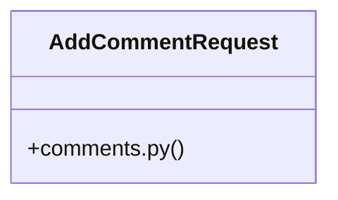

# Community 40

> 42 nodes · cohesion 0.09

## Key Concepts

- [AddCommentRequest](file:///C:/Users/1/github-pr/agent-meow/agent_meow/server/routes/comments.py#L59) (18 connections)
- [_format_message()](file:///C:/Users/1/github-pr/agent-meow/agent_meow/server/routes/comments.py#L29) (15 connections)
- [test_format_message.py](file:///C:/Users/1/github-pr/agent-meow/tests/server/routes/test_format_message.py#L1) (12 connections)
- [_make_comment()](file:///C:/Users/1/github-pr/agent-meow/tests/server/routes/test_format_message.py#L18) (11 connections)
- [_valid_kwargs()](file:///C:/Users/1/github-pr/agent-meow/tests/server/routes/test_add_comment_request.py#L17) (8 connections)
- [comments.py](file:///C:/Users/1/github-pr/agent-meow/agent_meow/server/routes/comments.py#L1) (7 connections)
- [test_add_comment_request.py](file:///C:/Users/1/github-pr/agent-meow/tests/server/routes/test_add_comment_request.py#L1) (7 connections)
- [test_format_message_comments_not_mixed_across_files()](file:///C:/Users/1/github-pr/agent-meow/tests/server/routes/test_format_message.py#L171) (5 connections)
- [test_format_message_multiple_files_sorted_alphabetically()](file:///C:/Users/1/github-pr/agent-meow/tests/server/routes/test_format_message.py#L138) (5 connections)
- [test_format_message_single_file_multiple_comments_sorted_by_start_index()](file:///C:/Users/1/github-pr/agent-meow/tests/server/routes/test_format_message.py#L114) (5 connections)
- [test_add_comment_request_rejects_end_index_before_start_index()](file:///C:/Users/1/github-pr/agent-meow/tests/server/routes/test_add_comment_request.py#L77) (4 connections)
- [test_add_comment_request_rejects_negative_start_index()](file:///C:/Users/1/github-pr/agent-meow/tests/server/routes/test_add_comment_request.py#L65) (4 connections)
- [test_add_comment_request_valid()](file:///C:/Users/1/github-pr/agent-meow/tests/server/routes/test_add_comment_request.py#L36) (4 connections)
- [test_add_comment_request_valid_anchor_content_optional()](file:///C:/Users/1/github-pr/agent-meow/tests/server/routes/test_add_comment_request.py#L52) (4 connections)
- [test_add_comment_request_valid_zero_length_selection()](file:///C:/Users/1/github-pr/agent-meow/tests/server/routes/test_add_comment_request.py#L44) (4 connections)
- [test_format_message_always_starts_with_header()](file:///C:/Users/1/github-pr/agent-meow/tests/server/routes/test_format_message.py#L61) (4 connections)
- [test_format_message_anchor_content_is_stripped()](file:///C:/Users/1/github-pr/agent-meow/tests/server/routes/test_format_message.py#L214) (4 connections)
- [test_format_message_each_file_gets_its_own_section()](file:///C:/Users/1/github-pr/agent-meow/tests/server/routes/test_format_message.py#L158) (4 connections)
- [test_format_message_falls_back_to_offset_when_no_anchor_content()](file:///C:/Users/1/github-pr/agent-meow/tests/server/routes/test_format_message.py#L102) (4 connections)
- [test_format_message_single_comment_includes_path_anchor_and_body()](file:///C:/Users/1/github-pr/agent-meow/tests/server/routes/test_format_message.py#L86) (4 connections)
- [test_format_message_uses_anchor_content_as_bullet_prefix()](file:///C:/Users/1/github-pr/agent-meow/tests/server/routes/test_format_message.py#L197) (4 connections)
- [test_format_message_empty_list_returns_header_only()](file:///C:/Users/1/github-pr/agent-meow/tests/server/routes/test_format_message.py#L74) (3 connections)
- [_validate_range()](file:///C:/Users/1/github-pr/agent-meow/agent_meow/server/routes/comments.py#L80) (2 connections)
- [Tests for :class:`~?agent_meow.server.routes.comments.AddCommentRequest` validat](file:///C:/Users/1/github-pr/agent-meow/tests/server/routes/test_add_comment_request.py#L1) (2 connections)
- [Return a dict of valid ``AddCommentRequest`` kwargs, with optional overrides.](file:///C:/Users/1/github-pr/agent-meow/tests/server/routes/test_add_comment_request.py#L18) (2 connections)
- *... and 17 more nodes in this community*

## Class Diagram

## Relationships

- [[Community 3]] (3 shared connections)

## Source Files

- [C:\Users\1\github-pr\agent-meow\agent_meow\server\routes\comments.py](file:///C:/Users/1/github-pr/agent-meow/agent_meow/server/routes/comments.py)
- [C:\Users\1\github-pr\agent-meow\tests\server\routes\test_add_comment_request.py](file:///C:/Users/1/github-pr/agent-meow/tests/server/routes/test_add_comment_request.py)
- [C:\Users\1\github-pr\agent-meow\tests\server\routes\test_format_message.py](file:///C:/Users/1/github-pr/agent-meow/tests/server/routes/test_format_message.py)

## Audit Trail

- EXTRACTED: 111 (66%)
- INFERRED: 57 (34%)
- AMBIGUOUS: 0 (0%)

---

*Part of the graphify knowledge wiki. See [[index]] to navigate.*