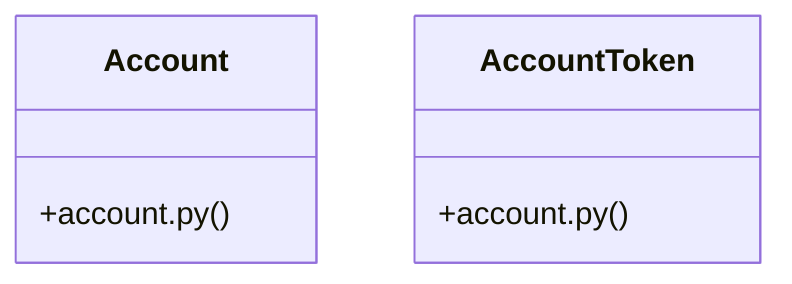

# Community 46

> 37 nodes · cohesion 0.08

## Key Concepts

- [LoginPage.tsx](file:///C:/Users/1/github-pr/agent-meow/web/src/pages/LoginPage.tsx#L1) (17 connections)
- [AccountToken](file:///C:/Users/1/github-pr/agent-meow/agent_meow/entities/account.py#L50) (11 connections)
- [test_account.py](file:///C:/Users/1/github-pr/agent-meow/tests/entities/test_account.py#L1) (9 connections)
- [account](file:///C:/Users/1/github-pr/agent-meow/web/src/pages/LoginPage.tsx#L81) (8 connections)
- [Account](file:///C:/Users/1/github-pr/agent-meow/agent_meow/entities/account.py#L20) (7 connections)
- [onSubmit()](file:///C:/Users/1/github-pr/agent-meow/web/src/pages/LoginPage.tsx#L104) (4 connections)
- [test_account_is_frozen()](file:///C:/Users/1/github-pr/agent-meow/tests/entities/test_account.py#L38) (4 connections)
- [account.py](file:///C:/Users/1/github-pr/agent-meow/agent_meow/entities/account.py#L1) (3 connections)
- [Tests for account entity dataclasses.](file:///C:/Users/1/github-pr/agent-meow/tests/entities/test_account.py#L1) (3 connections)
- [Legacy/header-auth rows have None timestamps.](file:///C:/Users/1/github-pr/agent-meow/tests/entities/test_account.py#L26) (3 connections)
- [Account is a frozen dataclass — mutations raise.](file:///C:/Users/1/github-pr/agent-meow/tests/entities/test_account.py#L39) (3 connections)
- [Frozen dataclasses support value-based equality.](file:///C:/Users/1/github-pr/agent-meow/tests/entities/test_account.py#L55) (3 connections)
- [test_account_equality()](file:///C:/Users/1/github-pr/agent-meow/tests/entities/test_account.py#L54) (3 connections)
- [test_account_nullable_timestamps()](file:///C:/Users/1/github-pr/agent-meow/tests/entities/test_account.py#L25) (3 connections)
- [test_account_token_is_frozen()](file:///C:/Users/1/github-pr/agent-meow/tests/entities/test_account.py#L101) (3 connections)
- [rememberUsername()](file:///C:/Users/1/github-pr/agent-meow/web/src/pages/LoginPage.tsx#L47) (2 connections)
- [resolved](file:///C:/Users/1/github-pr/agent-meow/web/src/pages/LoginPage.tsx#L225) (2 connections)
- [test_account_construction()](file:///C:/Users/1/github-pr/agent-meow/tests/entities/test_account.py#L10) (2 connections)
- [test_account_inequality()](file:///C:/Users/1/github-pr/agent-meow/tests/entities/test_account.py#L61) (2 connections)
- [test_account_token_invite()](file:///C:/Users/1/github-pr/agent-meow/tests/entities/test_account.py#L70) (2 connections)
- [test_account_token_magic()](file:///C:/Users/1/github-pr/agent-meow/tests/entities/test_account.py#L86) (2 connections)
- [Account / user identity entities for the ``accounts`` auth provider.  Plain da](file:///C:/Users/1/github-pr/agent-meow/agent_meow/entities/account.py#L1) (1 connections)
- [A user row, minus the password hash.      Returned by user listing / lookup en](file:///C:/Users/1/github-pr/agent-meow/agent_meow/entities/account.py#L21) (1 connections)
- [An invite or magic-login token row.      The ``id`` is the secret bearer value](file:///C:/Users/1/github-pr/agent-meow/agent_meow/entities/account.py#L51) (1 connections)
- [DEFAULT_RETURN_TO](file:///C:/Users/1/github-pr/agent-meow/web/src/pages/LoginPage.tsx#L35) (1 connections)
- *... and 12 more nodes in this community*

## Class Diagram

## Relationships

- [[Community 14]] (2 shared connections)

## Source Files

- [C:\Users\1\github-pr\agent-meow\agent_meow\entities\account.py](file:///C:/Users/1/github-pr/agent-meow/agent_meow/entities/account.py)
- [C:\Users\1\github-pr\agent-meow\tests\entities\test_account.py](file:///C:/Users/1/github-pr/agent-meow/tests/entities/test_account.py)
- [C:\Users\1\github-pr\agent-meow\web\src\pages\LoginPage.tsx](file:///C:/Users/1/github-pr/agent-meow/web/src/pages/LoginPage.tsx)

## Audit Trail

- EXTRACTED: 70 (62%)
- INFERRED: 42 (38%)
- AMBIGUOUS: 0 (0%)

---

*Part of the graphify knowledge wiki. See [[index]] to navigate.*