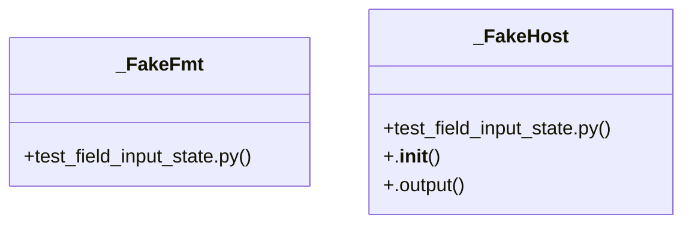

# Community 48

> 36 nodes · cohesion 0.11

## Key Concepts

- [test_field_input_state.py](file:///C:/Users/1/github-pr/agent-meow/tests/repl/test_field_input_state.py#L1) (27 connections)
- [_drive_prompt()](file:///C:/Users/1/github-pr/agent-meow/tests/repl/test_field_input_state.py#L167) (21 connections)
- [_run()](file:///C:/Users/1/github-pr/agent-meow/tests/repl/test_field_input_state.py#L207) (18 connections)
- [_outputs_text()](file:///C:/Users/1/github-pr/agent-meow/tests/repl/test_field_input_state.py#L162) (8 connections)
- [_FakeHost](file:///C:/Users/1/github-pr/agent-meow/tests/repl/test_field_input_state.py#L146) (5 connections)
- [test_begin_clears_aborted()](file:///C:/Users/1/github-pr/agent-meow/tests/repl/test_field_input_state.py#L123) (5 connections)
- [test_begin_creates_pending_future()](file:///C:/Users/1/github-pr/agent-meow/tests/repl/test_field_input_state.py#L21) (5 connections)
- [test_prompt_markup_in_schema_text_is_safe()](file:///C:/Users/1/github-pr/agent-meow/tests/repl/test_field_input_state.py#L285) (5 connections)
- [test_begin_replaces_previous_future()](file:///C:/Users/1/github-pr/agent-meow/tests/repl/test_field_input_state.py#L74) (4 connections)
- [test_cancel_resolves_with_empty_string()](file:///C:/Users/1/github-pr/agent-meow/tests/repl/test_field_input_state.py#L57) (4 connections)
- [test_cancel_sets_aborted()](file:///C:/Users/1/github-pr/agent-meow/tests/repl/test_field_input_state.py#L108) (4 connections)
- [test_prompt_abort_returns_none()](file:///C:/Users/1/github-pr/agent-meow/tests/repl/test_field_input_state.py#L275) (4 connections)
- [test_prompt_enum_rejects_then_accepts()](file:///C:/Users/1/github-pr/agent-meow/tests/repl/test_field_input_state.py#L256) (4 connections)
- [test_prompt_invalid_integer_reprompts()](file:///C:/Users/1/github-pr/agent-meow/tests/repl/test_field_input_state.py#L249) (4 connections)
- [test_prompt_required_empty_reprompts_then_accepts()](file:///C:/Users/1/github-pr/agent-meow/tests/repl/test_field_input_state.py#L242) (4 connections)
- [test_resolve_completes_future()](file:///C:/Users/1/github-pr/agent-meow/tests/repl/test_field_input_state.py#L33) (4 connections)
- [_begin()](file:///C:/Users/1/github-pr/agent-meow/tests/repl/test_field_input_state.py#L94) (3 connections)
- [test_prompt_boolean_parsing()](file:///C:/Users/1/github-pr/agent-meow/tests/repl/test_field_input_state.py#L224) (3 connections)
- [test_prompt_collects_string_and_integer()](file:///C:/Users/1/github-pr/agent-meow/tests/repl/test_field_input_state.py#L215) (3 connections)
- [test_prompt_one_of_const_rejects_then_accepts()](file:///C:/Users/1/github-pr/agent-meow/tests/repl/test_field_input_state.py#L266) (3 connections)
- [test_prompt_returns_none_when_state_unavailable()](file:///C:/Users/1/github-pr/agent-meow/tests/repl/test_field_input_state.py#L301) (3 connections)
- [test_prompt_skips_optional_on_empty()](file:///C:/Users/1/github-pr/agent-meow/tests/repl/test_field_input_state.py#L236) (3 connections)
- [test_prompt_uses_default_on_empty()](file:///C:/Users/1/github-pr/agent-meow/tests/repl/test_field_input_state.py#L230) (3 connections)
- [test_resolve_returns_false_when_no_pending()](file:///C:/Users/1/github-pr/agent-meow/tests/repl/test_field_input_state.py#L52) (3 connections)
- [_FakeFmt](file:///C:/Users/1/github-pr/agent-meow/tests/repl/test_field_input_state.py#L156) (2 connections)
- *... and 11 more nodes in this community*

## Class Diagram

## Relationships

- No strong cross-community connections detected

## Source Files

- [C:\Users\1\github-pr\agent-meow\tests\repl\test_field_input_state.py](file:///C:/Users/1/github-pr/agent-meow/tests/repl/test_field_input_state.py)

## Audit Trail

- EXTRACTED: 136 (82%)
- INFERRED: 30 (18%)
- AMBIGUOUS: 0 (0%)

---

*Part of the graphify knowledge wiki. See [[index]] to navigate.*