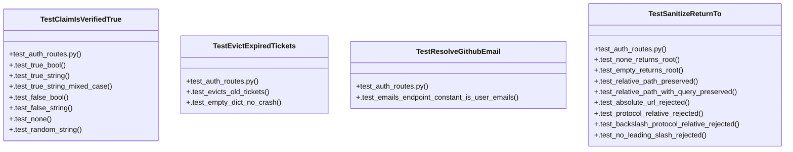

# Community 49

> 36 nodes · cohesion 0.08

## Key Concepts

- [_claim_is_verified_true()](file:///C:/Users/1/github-pr/agent-meow/agent_meow/server/routes/auth.py#L722) (12 connections)
- [_sanitize_return_to()](file:///C:/Users/1/github-pr/agent-meow/agent_meow/server/routes/auth.py#L627) (11 connections)
- [TestSanitizeReturnTo](file:///C:/Users/1/github-pr/agent-meow/tests/server/routes/test_auth_routes.py#L26) (10 connections)
- [test_auth_routes.py](file:///C:/Users/1/github-pr/agent-meow/tests/server/routes/test_auth_routes.py#L1) (9 connections)
- [TestClaimIsVerifiedTrue](file:///C:/Users/1/github-pr/agent-meow/tests/server/routes/test_auth_routes.py#L78) (9 connections)
- [_resolve_github_email()](file:///C:/Users/1/github-pr/agent-meow/agent_meow/server/routes/auth.py#L679) (7 connections)
- [_github_client()](file:///C:/Users/1/github-pr/agent-meow/tests/server/routes/test_auth_routes.py#L107) (5 connections)
- [test_emails_endpoint_unavailable_returns_none()](file:///C:/Users/1/github-pr/agent-meow/tests/server/routes/test_auth_routes.py#L184) (4 connections)
- [test_returns_primary_verified_email()](file:///C:/Users/1/github-pr/agent-meow/tests/server/routes/test_auth_routes.py#L142) (4 connections)
- [test_unverified_profile_email_is_not_trusted()](file:///C:/Users/1/github-pr/agent-meow/tests/server/routes/test_auth_routes.py#L159) (4 connections)
- [TestEvictExpiredTickets](file:///C:/Users/1/github-pr/agent-meow/tests/server/routes/test_auth_routes.py#L57) (4 connections)
- [.test_empty_dict_no_crash()](file:///C:/Users/1/github-pr/agent-meow/tests/server/routes/test_auth_routes.py#L69) (3 connections)
- [TestResolveGithubEmail](file:///C:/Users/1/github-pr/agent-meow/tests/server/routes/test_auth_routes.py#L130) (3 connections)
- [.test_false_bool()](file:///C:/Users/1/github-pr/agent-meow/tests/server/routes/test_auth_routes.py#L91) (2 connections)
- [.test_false_string()](file:///C:/Users/1/github-pr/agent-meow/tests/server/routes/test_auth_routes.py#L94) (2 connections)
- [.test_none()](file:///C:/Users/1/github-pr/agent-meow/tests/server/routes/test_auth_routes.py#L97) (2 connections)
- [.test_random_string()](file:///C:/Users/1/github-pr/agent-meow/tests/server/routes/test_auth_routes.py#L100) (2 connections)
- [.test_true_bool()](file:///C:/Users/1/github-pr/agent-meow/tests/server/routes/test_auth_routes.py#L81) (2 connections)
- [.test_true_string()](file:///C:/Users/1/github-pr/agent-meow/tests/server/routes/test_auth_routes.py#L84) (2 connections)
- [.test_true_string_mixed_case()](file:///C:/Users/1/github-pr/agent-meow/tests/server/routes/test_auth_routes.py#L87) (2 connections)
- [.test_emails_endpoint_constant_is_user_emails()](file:///C:/Users/1/github-pr/agent-meow/tests/server/routes/test_auth_routes.py#L199) (2 connections)
- [.test_absolute_url_rejected()](file:///C:/Users/1/github-pr/agent-meow/tests/server/routes/test_auth_routes.py#L41) (2 connections)
- [.test_backslash_protocol_relative_rejected()](file:///C:/Users/1/github-pr/agent-meow/tests/server/routes/test_auth_routes.py#L47) (2 connections)
- [.test_empty_returns_root()](file:///C:/Users/1/github-pr/agent-meow/tests/server/routes/test_auth_routes.py#L32) (2 connections)
- [.test_no_leading_slash_rejected()](file:///C:/Users/1/github-pr/agent-meow/tests/server/routes/test_auth_routes.py#L50) (2 connections)
- *... and 11 more nodes in this community*

## Class Diagram

## Relationships

- [[Community 4]] (3 shared connections)

## Source Files

- [C:\Users\1\github-pr\agent-meow\agent_meow\server\routes\auth.py](file:///C:/Users/1/github-pr/agent-meow/agent_meow/server/routes/auth.py)
- [C:\Users\1\github-pr\agent-meow\tests\server\routes\test_auth_routes.py](file:///C:/Users/1/github-pr/agent-meow/tests/server/routes/test_auth_routes.py)

## Audit Trail

- EXTRACTED: 78 (63%)
- INFERRED: 46 (37%)
- AMBIGUOUS: 0 (0%)

---

*Part of the graphify knowledge wiki. See [[index]] to navigate.*