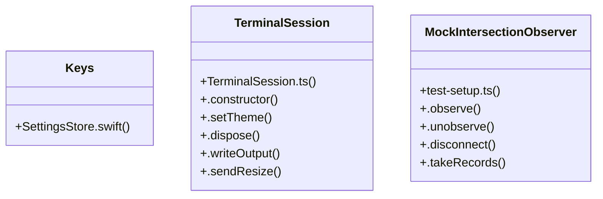

# Community 5

> 5592 nodes · cohesion 0.00

## Key Concepts

- [index-D0w-K1tO.js](file:///C:/Users/1/github-pr/agent-meow/agent_meow/server/static/web-ui/assets/index-D0w-K1tO.js#L1) (5015 connections)
- [push()](file:///C:/Users/1/github-pr/agent-meow/agent_meow/server/static/web-ui/assets/index-D0w-K1tO.js#L43) (425 connections)
- [call](file:///C:/Users/1/github-pr/agent-meow/web/src/shell/Sidebar.delete.test.tsx#L286) (332 connections)
- [constructor()](file:///C:/Users/1/github-pr/agent-meow/agent_meow/server/static/web-ui/assets/index-D0w-K1tO.js#L2) (297 connections)
- [.map()](file:///C:/Users/1/github-pr/agent-meow/agent_meow/server/static/web-ui/assets/index-D0w-K1tO.js#L720) (290 connections)
- [indexOf()](file:///C:/Users/1/github-pr/agent-meow/agent_meow/server/static/web-ui/assets/monacoCodeEditor-BzxvY4cV.js#L384) (285 connections)
- [slice()](file:///C:/Users/1/github-pr/agent-meow/agent_meow/server/static/web-ui/assets/index-D0w-K1tO.js#L58) (283 connections)
- [trim()](file:///C:/Users/1/github-pr/agent-meow/agent_meow/server/static/web-ui/assets/monacoCodeEditor-BzxvY4cV.js#L24) (257 connections)
- [error()](file:///C:/Users/1/github-pr/agent-meow/agent_meow/server/static/web-ui/assets/index-D0w-K1tO.js#L782) (242 connections)
- [get()](file:///C:/Users/1/github-pr/agent-meow/agent_meow/server/static/web-ui/assets/index-D0w-K1tO.js#L2) (219 connections)
- [includes()](file:///C:/Users/1/github-pr/agent-meow/agent_meow/server/static/web-ui/assets/index-D0w-K1tO.js#L1380) (199 connections)
- [Keys](file:///C:/Users/1/github-pr/agent-meow/web/ios/Omnigent/SettingsStore.swift#L54) (189 connections)
- [.filter()](file:///C:/Users/1/github-pr/agent-meow/agent_meow/server/static/web-ui/assets/index-D0w-K1tO.js#L720) (172 connections)
- [.forEach()](file:///C:/Users/1/github-pr/agent-meow/agent_meow/server/static/web-ui/assets/index-D0w-K1tO.js#L720) (172 connections)
- [stringify()](file:///C:/Users/1/github-pr/agent-meow/agent_meow/server/static/web-ui/assets/index-D0w-K1tO.js#L92) (169 connections)
- [set()](file:///C:/Users/1/github-pr/agent-meow/agent_meow/server/static/web-ui/assets/index-D0w-K1tO.js#L42) (163 connections)
- **String** (159 connections)
- [join()](file:///C:/Users/1/github-pr/agent-meow/agent_meow/server/static/web-ui/assets/index-D0w-K1tO.js#L849) (155 connections)
- [some()](file:///C:/Users/1/github-pr/agent-meow/agent_meow/server/static/web-ui/assets/index-D0w-K1tO.js#L703) (154 connections)
- [index()](file:///C:/Users/1/github-pr/agent-meow/agent_meow/server/static/web-ui/assets/index-D0w-K1tO.js#L814) (153 connections)
- [i](file:///C:/Users/1/github-pr/agent-meow/agent_meow/server/static/web-ui/assets/index-D0w-K1tO.js#L2) (152 connections)
- [replace()](file:///C:/Users/1/github-pr/agent-meow/agent_meow/server/static/web-ui/assets/index-D0w-K1tO.js#L43) (135 connections)
- [max()](file:///C:/Users/1/github-pr/agent-meow/agent_meow/server/static/web-ui/assets/index-D0w-K1tO.js#L845) (130 connections)
- [t()](file:///C:/Users/1/github-pr/agent-meow/agent_meow/server/static/web-ui/assets/index-D0w-K1tO.js#L2) (122 connections)
- [has()](file:///C:/Users/1/github-pr/agent-meow/agent_meow/server/static/web-ui/assets/index-D0w-K1tO.js#L579) (120 connections)
- *... and 5567 more nodes in this community*

## Class Diagram

## Relationships

- No strong cross-community connections detected

## Source Files

- [C:\Users\1\github-pr\agent-meow\agent_meow\db\migrations\versions\2a4e0380be0c_add_created_by_to_comments.py](file:///C:/Users/1/github-pr/agent-meow/agent_meow/db/migrations/versions/2a4e0380be0c_add_created_by_to_comments.py)
- [C:\Users\1\github-pr\agent-meow\agent_meow\db\migrations\versions\a2c7e8f19b34_agentic_conversations_schema.py](file:///C:/Users/1/github-pr/agent-meow/agent_meow/db/migrations/versions/a2c7e8f19b34_agentic_conversations_schema.py)
- [C:\Users\1\github-pr\agent-meow\agent_meow\db\migrations\versions\a7b3c9d1e5f2_add_hosts_table_and_host_id.py](file:///C:/Users/1/github-pr/agent-meow/agent_meow/db/migrations/versions/a7b3c9d1e5f2_add_hosts_table_and_host_id.py)
- [C:\Users\1\github-pr\agent-meow\agent_meow\db\migrations\versions\b3d5e7f91a23_add_session_fields_to_conversations.py](file:///C:/Users/1/github-pr/agent-meow/agent_meow/db/migrations/versions/b3d5e7f91a23_add_session_fields_to_conversations.py)
- [C:\Users\1\github-pr\agent-meow\agent_meow\db\migrations\versions\b5e8d2f1a7c3_add_session_id_to_files.py](file:///C:/Users/1/github-pr/agent-meow/agent_meow/db/migrations/versions/b5e8d2f1a7c3_add_session_id_to_files.py)
- [C:\Users\1\github-pr\agent-meow\agent_meow\db\migrations\versions\b8c4f2e7a9d1_add_workspace_to_conversations.py](file:///C:/Users/1/github-pr/agent-meow/agent_meow/db/migrations/versions/b8c4f2e7a9d1_add_workspace_to_conversations.py)
- [C:\Users\1\github-pr\agent-meow\agent_meow\db\migrations\versions\b9c0d1e2f3a4_drop_created_by_from_conversation_items.py](file:///C:/Users/1/github-pr/agent-meow/agent_meow/db/migrations/versions/b9c0d1e2f3a4_drop_created_by_from_conversation_items.py)
- [C:\Users\1\github-pr\agent-meow\agent_meow\db\migrations\versions\b9c1d2e3f4a5_drop_tasks_table.py](file:///C:/Users/1/github-pr/agent-meow/agent_meow/db/migrations/versions/b9c1d2e3f4a5_drop_tasks_table.py)
- [C:\Users\1\github-pr\agent-meow\agent_meow\db\migrations\versions\c1d2e3f4a5b6_add_model_override_to_conversations.py](file:///C:/Users/1/github-pr/agent-meow/agent_meow/db/migrations/versions/c1d2e3f4a5b6_add_model_override_to_conversations.py)
- [C:\Users\1\github-pr\agent-meow\agent_meow\db\migrations\versions\c9d3a1f2e4b5_add_runner_id_to_conversations.py](file:///C:/Users/1/github-pr/agent-meow/agent_meow/db/migrations/versions/c9d3a1f2e4b5_add_runner_id_to_conversations.py)
- [C:\Users\1\github-pr\agent-meow\agent_meow\db\migrations\versions\cad9b3e1f7a2_add_user_daily_cost_table.py](file:///C:/Users/1/github-pr/agent-meow/agent_meow/db/migrations/versions/cad9b3e1f7a2_add_user_daily_cost_table.py)
- [C:\Users\1\github-pr\agent-meow\agent_meow\db\migrations\versions\caf81af91d9e_add_git_branch_to_conversations.py](file:///C:/Users/1/github-pr/agent-meow/agent_meow/db/migrations/versions/caf81af91d9e_add_git_branch_to_conversations.py)
- [C:\Users\1\github-pr\agent-meow\agent_meow\db\migrations\versions\d7e8f9a0b1c2_add_cost_control_mode_override_to_conversations.py](file:///C:/Users/1/github-pr/agent-meow/agent_meow/db/migrations/versions/d7e8f9a0b1c2_add_cost_control_mode_override_to_conversations.py)
- [C:\Users\1\github-pr\agent-meow\agent_meow\db\migrations\versions\e1c4a7b2f309_add_created_by_to_conversation_items.py](file:///C:/Users/1/github-pr/agent-meow/agent_meow/db/migrations/versions/e1c4a7b2f309_add_created_by_to_conversation_items.py)
- [C:\Users\1\github-pr\agent-meow\agent_meow\db\migrations\versions\f1a2b3c4d5e6_add_sub_agent_name_to_conversations.py](file:///C:/Users/1/github-pr/agent-meow/agent_meow/db/migrations/versions/f1a2b3c4d5e6_add_sub_agent_name_to_conversations.py)
- [C:\Users\1\github-pr\agent-meow\agent_meow\db\migrations\versions\f8e1a23d6c47_add_external_session_id_to_conversations.py](file:///C:/Users/1/github-pr/agent-meow/agent_meow/db/migrations/versions/f8e1a23d6c47_add_external_session_id_to_conversations.py)
- [C:\Users\1\github-pr\agent-meow\agent_meow\db\migrations\versions\h1a2b3c4d5e6_policies_nullable_session_id.py](file:///C:/Users/1/github-pr/agent-meow/agent_meow/db/migrations/versions/h1a2b3c4d5e6_policies_nullable_session_id.py)
- [C:\Users\1\github-pr\agent-meow\agent_meow\db\migrations\versions\i1a2b3c4d5e6_readd_created_by_to_conversation_items.py](file:///C:/Users/1/github-pr/agent-meow/agent_meow/db/migrations/versions/i1a2b3c4d5e6_readd_created_by_to_conversation_items.py)
- [C:\Users\1\github-pr\agent-meow\agent_meow\db\migrations\versions\k1a2b3c4d5e6_add_managed_sandbox_columns_to_hosts.py](file:///C:/Users/1/github-pr/agent-meow/agent_meow/db/migrations/versions/k1a2b3c4d5e6_add_managed_sandbox_columns_to_hosts.py)
- [C:\Users\1\github-pr\agent-meow\agent_meow\db\migrations\versions\m1a2b3c4d5e6_add_harness_override_to_conversations.py](file:///C:/Users/1/github-pr/agent-meow/agent_meow/db/migrations/versions/m1a2b3c4d5e6_add_harness_override_to_conversations.py)

## Audit Trail

- EXTRACTED: 40420 (89%)
- INFERRED: 5220 (11%)
- AMBIGUOUS: 0 (0%)

---

*Part of the graphify knowledge wiki. See [[index]] to navigate.*