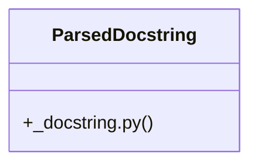

# Community 53

> 34 nodes · cohesion 0.11

## Key Concepts

- [parse_google_docstring()](file:///C:/Users/1/github-pr/agent-meow/sdks/python-client/omnigent_client/tools/_docstring.py#L65) (20 connections)
- [ParsedDocstring](file:///C:/Users/1/github-pr/agent-meow/sdks/python-client/omnigent_client/tools/_docstring.py#L50) (17 connections)
- [test_docstring.py](file:///C:/Users/1/github-pr/agent-meow/tests/tools/test_docstring.py#L1) (13 connections)
- [_parse_args_lines()](file:///C:/Users/1/github-pr/agent-meow/sdks/python-client/omnigent_client/tools/_docstring.py#L123) (7 connections)
- [_docstring.py](file:///C:/Users/1/github-pr/agent-meow/sdks/python-client/omnigent_client/tools/_docstring.py#L1) (5 connections)
- [test_parse_empty_docstring()](file:///C:/Users/1/github-pr/agent-meow/tests/tools/test_docstring.py#L9) (4 connections)
- [test_parse_args_section_with_no_entries()](file:///C:/Users/1/github-pr/agent-meow/tests/tools/test_docstring.py#L137) (3 connections)
- [test_parse_arguments_synonym()](file:///C:/Users/1/github-pr/agent-meow/tests/tools/test_docstring.py#L54) (3 connections)
- [test_parse_description_only()](file:///C:/Users/1/github-pr/agent-meow/tests/tools/test_docstring.py#L22) (3 connections)
- [test_parse_google_args_followed_by_returns_section()](file:///C:/Users/1/github-pr/agent-meow/tests/tools/test_docstring.py#L115) (3 connections)
- [test_parse_google_args_multi_line_descriptions()](file:///C:/Users/1/github-pr/agent-meow/tests/tools/test_docstring.py#L96) (3 connections)
- [test_parse_google_args_section()](file:///C:/Users/1/github-pr/agent-meow/tests/tools/test_docstring.py#L37) (3 connections)
- [test_parse_google_args_with_types_in_parens()](file:///C:/Users/1/github-pr/agent-meow/tests/tools/test_docstring.py#L78) (3 connections)
- [test_parse_none_docstring_via_empty_string()](file:///C:/Users/1/github-pr/agent-meow/tests/tools/test_docstring.py#L15) (3 connections)
- [test_parse_parameters_synonym()](file:///C:/Users/1/github-pr/agent-meow/tests/tools/test_docstring.py#L66) (3 connections)
- [test_parse_recognizes_all_args_headers()](file:///C:/Users/1/github-pr/agent-meow/tests/tools/test_docstring.py#L155) (3 connections)
- [test_parse_skips_malformed_param_lines()](file:///C:/Users/1/github-pr/agent-meow/tests/tools/test_docstring.py#L167) (3 connections)
- [Tests for the Google-style docstring parser used by ``@tool``.](file:///C:/Users/1/github-pr/agent-meow/tests/tools/test_docstring.py#L1) (2 connections)
- [Empty input returns empty description and no params.](file:///C:/Users/1/github-pr/agent-meow/tests/tools/test_docstring.py#L10) (2 connections)
- [Args parsing stops at the next section header.](file:///C:/Users/1/github-pr/agent-meow/tests/tools/test_docstring.py#L116) (2 connections)
- [An empty Args: section produces no param entries.](file:///C:/Users/1/github-pr/agent-meow/tests/tools/test_docstring.py#L138) (2 connections)
- [All three accepted header forms produce the same parsed param.](file:///C:/Users/1/github-pr/agent-meow/tests/tools/test_docstring.py#L156) (2 connections)
- [The parser is documented to treat falsy doc as empty.](file:///C:/Users/1/github-pr/agent-meow/tests/tools/test_docstring.py#L16) (2 connections)
- [Lines without a colon or with non-identifier names are ignored.](file:///C:/Users/1/github-pr/agent-meow/tests/tools/test_docstring.py#L168) (2 connections)
- [A docstring with no Args section returns just the description.](file:///C:/Users/1/github-pr/agent-meow/tests/tools/test_docstring.py#L23) (2 connections)
- *... and 9 more nodes in this community*

## Class Diagram

## Relationships

- No strong cross-community connections detected

## Source Files

- [C:\Users\1\github-pr\agent-meow\sdks\python-client\omnigent_client\tools\_docstring.py](file:///C:/Users/1/github-pr/agent-meow/sdks/python-client/omnigent_client/tools/_docstring.py)
- [C:\Users\1\github-pr\agent-meow\tests\tools\test_docstring.py](file:///C:/Users/1/github-pr/agent-meow/tests/tools/test_docstring.py)

## Audit Trail

- EXTRACTED: 69 (53%)
- INFERRED: 60 (47%)
- AMBIGUOUS: 0 (0%)

---

*Part of the graphify knowledge wiki. See [[index]] to navigate.*