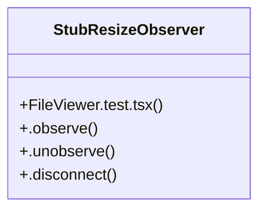

# Community 54

> 34 nodes · cohesion 0.06

## Key Concepts

- [FileViewer.test.tsx](file:///C:/Users/1/github-pr/agent-meow/web/src/shell/FileViewer.test.tsx#L1) (31 connections)
- [StubResizeObserver](file:///C:/Users/1/github-pr/agent-meow/web/src/shell/FileViewer.test.tsx#L249) (4 connections)
- [openModeMenu()](file:///C:/Users/1/github-pr/agent-meow/web/src/shell/FileViewer.test.tsx#L928) (2 connections)
- [renderWithCloseTab()](file:///C:/Users/1/github-pr/agent-meow/web/src/shell/FileViewer.test.tsx#L1256) (2 connections)
- [selectMode()](file:///C:/Users/1/github-pr/agent-meow/web/src/shell/FileViewer.test.tsx#L930) (2 connections)
- [swallow()](file:///C:/Users/1/github-pr/agent-meow/web/src/shell/FileViewer.test.tsx#L1297) (2 connections)
- [viewModeOf()](file:///C:/Users/1/github-pr/agent-meow/web/src/shell/FileViewer.test.tsx#L923) (2 connections)
- [addressed](file:///C:/Users/1/github-pr/agent-meow/web/src/shell/FileViewer.test.tsx#L660) (1 connections)
- [anchor](file:///C:/Users/1/github-pr/agent-meow/web/src/shell/FileViewer.test.tsx#L692) (1 connections)
- [c1](file:///C:/Users/1/github-pr/agent-meow/web/src/shell/FileViewer.test.tsx#L610) (1 connections)
- [c2](file:///C:/Users/1/github-pr/agent-meow/web/src/shell/FileViewer.test.tsx#L611) (1 connections)
- [changedFiles](file:///C:/Users/1/github-pr/agent-meow/web/src/shell/FileViewer.test.tsx#L389) (1 connections)
- [comment](file:///C:/Users/1/github-pr/agent-meow/web/src/shell/FileViewer.test.tsx#L525) (1 connections)
- [fileContent](file:///C:/Users/1/github-pr/agent-meow/web/src/shell/FileViewer.test.tsx#L659) (1 connections)
- [first](file:///C:/Users/1/github-pr/agent-meow/web/src/shell/FileViewer.test.tsx#L873) (1 connections)
- [flagged](file:///C:/Users/1/github-pr/agent-meow/web/src/shell/FileViewer.test.tsx#L797) (1 connections)
- [indexSpan](file:///C:/Users/1/github-pr/agent-meow/web/src/shell/FileViewer.test.tsx#L411) (1 connections)
- [input](file:///C:/Users/1/github-pr/agent-meow/web/src/shell/FileViewer.test.tsx#L1224) (1 connections)
- [multipleFiles](file:///C:/Users/1/github-pr/agent-meow/web/src/shell/FileViewer.test.tsx#L1144) (1 connections)
- [newStart](file:///C:/Users/1/github-pr/agent-meow/web/src/shell/FileViewer.test.tsx#L695) (1 connections)
- [onClose](file:///C:/Users/1/github-pr/agent-meow/web/src/shell/FileViewer.test.tsx#L812) (1 connections)
- [onCloseTab](file:///C:/Users/1/github-pr/agent-meow/web/src/shell/FileViewer.test.tsx#L1275) (1 connections)
- [onNavigateTo](file:///C:/Users/1/github-pr/agent-meow/web/src/shell/FileViewer.test.tsx#L1170) (1 connections)
- [originalStart](file:///C:/Users/1/github-pr/agent-meow/web/src/shell/FileViewer.test.tsx#L693) (1 connections)
- [prev](file:///C:/Users/1/github-pr/agent-meow/web/src/shell/FileViewer.test.tsx#L410) (1 connections)
- *... and 9 more nodes in this community*

## Class Diagram

## Relationships

- No strong cross-community connections detected

## Source Files

- [C:\Users\1\github-pr\agent-meow\web\src\shell\FileViewer.test.tsx](file:///C:/Users/1/github-pr/agent-meow/web/src/shell/FileViewer.test.tsx)

## Audit Trail

- EXTRACTED: 69 (96%)
- INFERRED: 3 (4%)
- AMBIGUOUS: 0 (0%)

---

*Part of the graphify knowledge wiki. See [[index]] to navigate.*