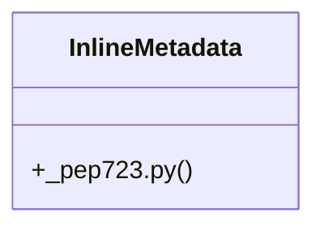

# Community 58

> 30 nodes · cohesion 0.12

## Key Concepts

- [parse_inline_metadata()](file:///C:/Users/1/github-pr/agent-meow/agent_meow/tools/_pep723.py#L49) (18 connections)
- [InlineMetadata](file:///C:/Users/1/github-pr/agent-meow/agent_meow/tools/_pep723.py#L32) (16 connections)
- [test_pep723.py](file:///C:/Users/1/github-pr/agent-meow/tests/tools/test_pep723.py#L1) (11 connections)
- [_extract_block_toml()](file:///C:/Users/1/github-pr/agent-meow/agent_meow/tools/_pep723.py#L78) (7 connections)
- [_pep723.py](file:///C:/Users/1/github-pr/agent-meow/agent_meow/tools/_pep723.py#L1) (4 connections)
- [test_parse_dependencies_after_requires_python()](file:///C:/Users/1/github-pr/agent-meow/tests/tools/test_pep723.py#L82) (4 connections)
- [test_parse_with_dependencies()](file:///C:/Users/1/github-pr/agent-meow/tests/tools/test_pep723.py#L8) (4 connections)
- [test_parse_block_without_dependencies_key()](file:///C:/Users/1/github-pr/agent-meow/tests/tools/test_pep723.py#L69) (3 connections)
- [test_parse_dependencies_with_extras()](file:///C:/Users/1/github-pr/agent-meow/tests/tools/test_pep723.py#L124) (3 connections)
- [test_parse_empty_dependencies()](file:///C:/Users/1/github-pr/agent-meow/tests/tools/test_pep723.py#L42) (3 connections)
- [test_parse_malformed_toml_returns_none()](file:///C:/Users/1/github-pr/agent-meow/tests/tools/test_pep723.py#L160) (3 connections)
- [test_parse_multiline_dependencies_after_requires_python()](file:///C:/Users/1/github-pr/agent-meow/tests/tools/test_pep723.py#L105) (3 connections)
- [test_parse_multiline_dependencies_with_extras()](file:///C:/Users/1/github-pr/agent-meow/tests/tools/test_pep723.py#L140) (3 connections)
- [test_parse_no_metadata_block()](file:///C:/Users/1/github-pr/agent-meow/tests/tools/test_pep723.py#L30) (3 connections)
- [test_parse_single_quotes()](file:///C:/Users/1/github-pr/agent-meow/tests/tools/test_pep723.py#L55) (3 connections)
- [Tests for agent_meow.tools._pep723 (PEP 723 inline metadata parser).](file:///C:/Users/1/github-pr/agent-meow/tests/tools/test_pep723.py#L1) (2 connections)
- [A multi-line ``dependencies`` array that follows ``requires-python``     (the c](file:///C:/Users/1/github-pr/agent-meow/tests/tools/test_pep723.py#L106) (2 connections)
- [Dependency specifiers containing PEP 508 ``[extras]`` (e.g.     ``uvicorn[stand](file:///C:/Users/1/github-pr/agent-meow/tests/tools/test_pep723.py#L125) (2 connections)
- [A multi-line dependency array whose specifiers carry ``[extras]`` is     parsed](file:///C:/Users/1/github-pr/agent-meow/tests/tools/test_pep723.py#L141) (2 connections)
- [A metadata block whose content is not valid TOML degrades gracefully     to ``N](file:///C:/Users/1/github-pr/agent-meow/tests/tools/test_pep723.py#L161) (2 connections)
- [A source file without a ``# /// script`` block returns None.](file:///C:/Users/1/github-pr/agent-meow/tests/tools/test_pep723.py#L31) (2 connections)
- [A metadata block with an empty dependency list returns None     (no deps to ins](file:///C:/Users/1/github-pr/agent-meow/tests/tools/test_pep723.py#L43) (2 connections)
- [Dependencies with single quotes are parsed correctly.](file:///C:/Users/1/github-pr/agent-meow/tests/tools/test_pep723.py#L56) (2 connections)
- [A metadata block that exists but has no ``dependencies``     key returns None.](file:///C:/Users/1/github-pr/agent-meow/tests/tools/test_pep723.py#L70) (2 connections)
- [PEP 723 imposes no field ordering, so ``dependencies`` is parsed     even when](file:///C:/Users/1/github-pr/agent-meow/tests/tools/test_pep723.py#L83) (2 connections)
- *... and 5 more nodes in this community*

## Class Diagram

## Relationships

- No strong cross-community connections detected

## Source Files

- [C:\Users\1\github-pr\agent-meow\agent_meow\tools\_pep723.py](file:///C:/Users/1/github-pr/agent-meow/agent_meow/tools/_pep723.py)
- [C:\Users\1\github-pr\agent-meow\tests\tools\test_pep723.py](file:///C:/Users/1/github-pr/agent-meow/tests/tools/test_pep723.py)

## Audit Trail

- EXTRACTED: 60 (53%)
- INFERRED: 54 (47%)
- AMBIGUOUS: 0 (0%)

---

*Part of the graphify knowledge wiki. See [[index]] to navigate.*