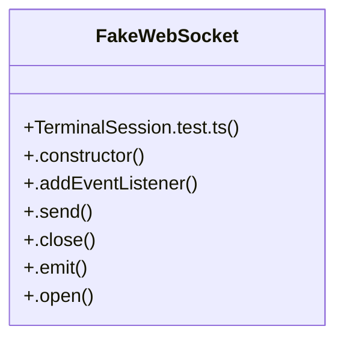

# Community 61

> 28 nodes · cohesion 0.07

## Key Concepts

- [TerminalSession.test.ts](file:///C:/Users/1/github-pr/agent-meow/web/src/components/blocks/TerminalSession.test.ts#L1) (24 connections)
- [FakeWebSocket](file:///C:/Users/1/github-pr/agent-meow/web/src/components/blocks/TerminalSession.test.ts#L228) (7 connections)
- [.emit()](file:///C:/Users/1/github-pr/agent-meow/web/src/components/blocks/TerminalSession.test.ts#L256) (3 connections)
- [copyEvent()](file:///C:/Users/1/github-pr/agent-meow/web/src/components/blocks/TerminalSession.test.ts#L64) (2 connections)
- [.open()](file:///C:/Users/1/github-pr/agent-meow/web/src/components/blocks/TerminalSession.test.ts#L259) (2 connections)
- [.send()](file:///C:/Users/1/github-pr/agent-meow/web/src/components/blocks/TerminalSession.test.ts#L246) (2 connections)
- [before](file:///C:/Users/1/github-pr/agent-meow/web/src/components/blocks/TerminalSession.test.ts#L397) (1 connections)
- [constructor()](file:///C:/Users/1/github-pr/agent-meow/web/src/components/blocks/TerminalSession.test.ts#L291) (1 connections)
- [container](file:///C:/Users/1/github-pr/agent-meow/web/src/components/blocks/TerminalSession.test.ts#L131) (1 connections)
- [{ container, session }](file:///C:/Users/1/github-pr/agent-meow/web/src/components/blocks/TerminalSession.test.ts#L424) (1 connections)
- [data](file:///C:/Users/1/github-pr/agent-meow/web/src/components/blocks/TerminalSession.test.ts#L383) (1 connections)
- [event](file:///C:/Users/1/github-pr/agent-meow/web/src/components/blocks/TerminalSession.test.ts#L34) (1 connections)
- [{ event, setData, preventDefault }](file:///C:/Users/1/github-pr/agent-meow/web/src/components/blocks/TerminalSession.test.ts#L75) (1 connections)
- [.close()](file:///C:/Users/1/github-pr/agent-meow/web/src/components/blocks/TerminalSession.test.ts#L250) (1 connections)
- [.constructor()](file:///C:/Users/1/github-pr/agent-meow/web/src/components/blocks/TerminalSession.test.ts#L238) (1 connections)
- [keyEvent()](file:///C:/Users/1/github-pr/agent-meow/web/src/components/blocks/TerminalSession.test.ts#L170) (1 connections)
- [lastSocket](file:///C:/Users/1/github-pr/agent-meow/web/src/components/blocks/TerminalSession.test.ts#L283) (1 connections)
- [observer](file:///C:/Users/1/github-pr/agent-meow/web/src/components/blocks/TerminalSession.test.ts#L343) (1 connections)
- [onActivity](file:///C:/Users/1/github-pr/agent-meow/web/src/components/blocks/TerminalSession.test.ts#L377) (1 connections)
- [openSpy](file:///C:/Users/1/github-pr/agent-meow/web/src/components/blocks/TerminalSession.test.ts#L33) (1 connections)
- [payload](file:///C:/Users/1/github-pr/agent-meow/web/src/components/blocks/TerminalSession.test.ts#L175) (1 connections)
- [preventSpy](file:///C:/Users/1/github-pr/agent-meow/web/src/components/blocks/TerminalSession.test.ts#L51) (1 connections)
- [resizeFrame](file:///C:/Users/1/github-pr/agent-meow/web/src/components/blocks/TerminalSession.test.ts#L329) (1 connections)
- [resizeFrames](file:///C:/Users/1/github-pr/agent-meow/web/src/components/blocks/TerminalSession.test.ts#L349) (1 connections)
- [{ socket, session }](file:///C:/Users/1/github-pr/agent-meow/web/src/components/blocks/TerminalSession.test.ts#L342) (1 connections)
- *... and 3 more nodes in this community*

## Class Diagram

## Relationships

- No strong cross-community connections detected

## Source Files

- [C:\Users\1\github-pr\agent-meow\web\src\components\blocks\TerminalSession.test.ts](file:///C:/Users/1/github-pr/agent-meow/web/src/components/blocks/TerminalSession.test.ts)

## Audit Trail

- EXTRACTED: 59 (95%)
- INFERRED: 3 (5%)
- AMBIGUOUS: 0 (0%)

---

*Part of the graphify knowledge wiki. See [[index]] to navigate.*