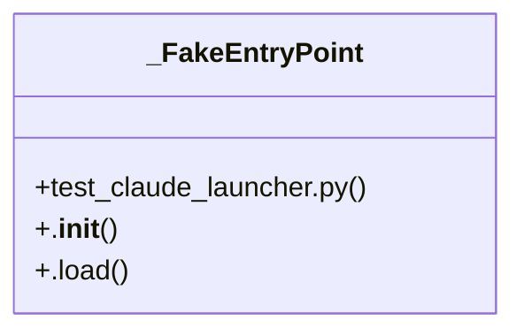

# Community 63

> 27 nodes · cohesion 0.18

## Key Concepts

- [resolve_claude_launch()](file:///C:/Users/1/github-pr/agent-meow/agent_meow/claude_launcher.py#L89) (22 connections)
- [test_claude_launcher.py](file:///C:/Users/1/github-pr/agent-meow/tests/test_claude_launcher.py#L1) (16 connections)
- [_FakeEntryPoint](file:///C:/Users/1/github-pr/agent-meow/tests/test_claude_launcher.py#L17) (14 connections)
- [_register()](file:///C:/Users/1/github-pr/agent-meow/tests/test_claude_launcher.py#L30) (12 connections)
- [_launcher_cls()](file:///C:/Users/1/github-pr/agent-meow/tests/test_claude_launcher.py#L42) (8 connections)
- [claude_launcher.py](file:///C:/Users/1/github-pr/agent-meow/agent_meow/claude_launcher.py#L1) (7 connections)
- [test_malformed_return_falls_back()](file:///C:/Users/1/github-pr/agent-meow/tests/test_claude_launcher.py#L160) (5 connections)
- [test_plugin_raises_falls_back()](file:///C:/Users/1/github-pr/agent-meow/tests/test_claude_launcher.py#L140) (5 connections)
- [test_plugin_receives_default_command_and_args()](file:///C:/Users/1/github-pr/agent-meow/tests/test_claude_launcher.py#L86) (5 connections)
- [test_plugin_selected_by_name_among_several()](file:///C:/Users/1/github-pr/agent-meow/tests/test_claude_launcher.py#L74) (5 connections)
- [test_plugin_wraps_command()](file:///C:/Users/1/github-pr/agent-meow/tests/test_claude_launcher.py#L65) (5 connections)
- [test_unknown_name_falls_back()](file:///C:/Users/1/github-pr/agent-meow/tests/test_claude_launcher.py#L99) (5 connections)
- [test_enumerate_error_falls_back()](file:///C:/Users/1/github-pr/agent-meow/tests/test_claude_launcher.py#L108) (4 connections)
- [test_instantiate_error_falls_back()](file:///C:/Users/1/github-pr/agent-meow/tests/test_claude_launcher.py#L120) (4 connections)
- [test_load_error_falls_back()](file:///C:/Users/1/github-pr/agent-meow/tests/test_claude_launcher.py#L114) (4 connections)
- [test_not_a_claude_launcher_falls_back()](file:///C:/Users/1/github-pr/agent-meow/tests/test_claude_launcher.py#L133) (4 connections)
- [launch()](file:///C:/Users/1/github-pr/agent-meow/agent_meow/claude_launcher.py#L74) (2 connections)
- [.load()](file:///C:/Users/1/github-pr/agent-meow/tests/test_claude_launcher.py#L24) (2 connections)
- [Unit tests for :mod:`~?agent_meow.claude_launcher`.](file:///C:/Users/1/github-pr/agent-meow/tests/test_claude_launcher.py#L1) (2 connections)
- [Minimal stand-in for :class:`importlib.metadata.EntryPoint`.](file:///C:/Users/1/github-pr/agent-meow/tests/test_claude_launcher.py#L18) (2 connections)
- [Make ``importlib.metadata.entry_points(group=...)`` return *entry_points*.](file:///C:/Users/1/github-pr/agent-meow/tests/test_claude_launcher.py#L31) (2 connections)
- [Build a :class:`ClaudeLauncher` subclass whose ``launch`` delegates to *fn*.](file:///C:/Users/1/github-pr/agent-meow/tests/test_claude_launcher.py#L43) (2 connections)
- [test_identity_returns_fresh_list()](file:///C:/Users/1/github-pr/agent-meow/tests/test_claude_launcher.py#L57) (2 connections)
- [test_identity_when_env_unset()](file:///C:/Users/1/github-pr/agent-meow/tests/test_claude_launcher.py#L52) (2 connections)
- [Pluggable launch-command resolution for the native Claude harness.  The native](file:///C:/Users/1/github-pr/agent-meow/agent_meow/claude_launcher.py#L1) (1 connections)
- *... and 2 more nodes in this community*

## Class Diagram

## Relationships

- No strong cross-community connections detected

## Source Files

- [C:\Users\1\github-pr\agent-meow\agent_meow\claude_launcher.py](file:///C:/Users/1/github-pr/agent-meow/agent_meow/claude_launcher.py)
- [C:\Users\1\github-pr\agent-meow\tests\test_claude_launcher.py](file:///C:/Users/1/github-pr/agent-meow/tests/test_claude_launcher.py)

## Audit Trail

- EXTRACTED: 108 (75%)
- INFERRED: 36 (25%)
- AMBIGUOUS: 0 (0%)

---

*Part of the graphify knowledge wiki. See [[index]] to navigate.*