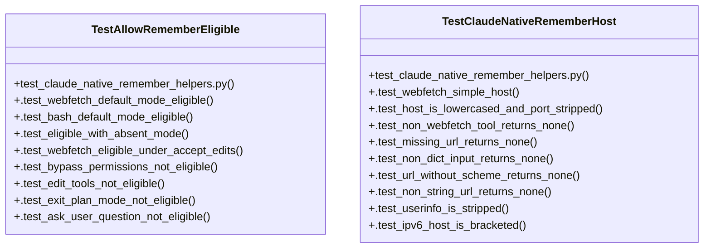

# Community 64

> 27 nodes · cohesion 0.12

## Key Concepts

- [_claude_native_remember_host()](file:///C:/Users/1/github-pr/agent-meow/agent_meow/server/routes/sessions.py#L661) (16 connections)
- [TestClaudeNativeRememberHost](file:///C:/Users/1/github-pr/agent-meow/tests/server/routes/test_claude_native_remember_helpers.py#L61) (13 connections)
- [_allow_remember_eligible()](file:///C:/Users/1/github-pr/agent-meow/agent_meow/server/routes/sessions.py#L624) (10 connections)
- [TestAllowRememberEligible](file:///C:/Users/1/github-pr/agent-meow/tests/server/routes/test_claude_native_remember_helpers.py#L23) (10 connections)
- [test_claude_native_remember_helpers.py](file:///C:/Users/1/github-pr/agent-meow/tests/server/routes/test_claude_native_remember_helpers.py#L1) (3 connections)
- [.test_ask_user_question_not_eligible()](file:///C:/Users/1/github-pr/agent-meow/tests/server/routes/test_claude_native_remember_helpers.py#L56) (2 connections)
- [.test_bash_default_mode_eligible()](file:///C:/Users/1/github-pr/agent-meow/tests/server/routes/test_claude_native_remember_helpers.py#L29) (2 connections)
- [.test_bypass_permissions_not_eligible()](file:///C:/Users/1/github-pr/agent-meow/tests/server/routes/test_claude_native_remember_helpers.py#L42) (2 connections)
- [.test_edit_tools_not_eligible()](file:///C:/Users/1/github-pr/agent-meow/tests/server/routes/test_claude_native_remember_helpers.py#L47) (2 connections)
- [.test_eligible_with_absent_mode()](file:///C:/Users/1/github-pr/agent-meow/tests/server/routes/test_claude_native_remember_helpers.py#L32) (2 connections)
- [.test_exit_plan_mode_not_eligible()](file:///C:/Users/1/github-pr/agent-meow/tests/server/routes/test_claude_native_remember_helpers.py#L52) (2 connections)
- [.test_webfetch_default_mode_eligible()](file:///C:/Users/1/github-pr/agent-meow/tests/server/routes/test_claude_native_remember_helpers.py#L26) (2 connections)
- [.test_webfetch_eligible_under_accept_edits()](file:///C:/Users/1/github-pr/agent-meow/tests/server/routes/test_claude_native_remember_helpers.py#L37) (2 connections)
- [.test_host_is_lowercased_and_port_stripped()](file:///C:/Users/1/github-pr/agent-meow/tests/server/routes/test_claude_native_remember_helpers.py#L70) (2 connections)
- [.test_ipv6_host_is_bracketed()](file:///C:/Users/1/github-pr/agent-meow/tests/server/routes/test_claude_native_remember_helpers.py#L104) (2 connections)
- [.test_ipv6_host_without_port_is_bracketed()](file:///C:/Users/1/github-pr/agent-meow/tests/server/routes/test_claude_native_remember_helpers.py#L114) (2 connections)
- [.test_missing_url_returns_none()](file:///C:/Users/1/github-pr/agent-meow/tests/server/routes/test_claude_native_remember_helpers.py#L81) (2 connections)
- [.test_non_dict_input_returns_none()](file:///C:/Users/1/github-pr/agent-meow/tests/server/routes/test_claude_native_remember_helpers.py#L84) (2 connections)
- [.test_non_http_scheme_returns_none()](file:///C:/Users/1/github-pr/agent-meow/tests/server/routes/test_claude_native_remember_helpers.py#L121) (2 connections)
- [.test_non_string_url_returns_none()](file:///C:/Users/1/github-pr/agent-meow/tests/server/routes/test_claude_native_remember_helpers.py#L92) (2 connections)
- [.test_non_webfetch_tool_returns_none()](file:///C:/Users/1/github-pr/agent-meow/tests/server/routes/test_claude_native_remember_helpers.py#L77) (2 connections)
- [.test_url_without_scheme_returns_none()](file:///C:/Users/1/github-pr/agent-meow/tests/server/routes/test_claude_native_remember_helpers.py#L87) (2 connections)
- [.test_userinfo_is_stripped()](file:///C:/Users/1/github-pr/agent-meow/tests/server/routes/test_claude_native_remember_helpers.py#L95) (2 connections)
- [.test_webfetch_simple_host()](file:///C:/Users/1/github-pr/agent-meow/tests/server/routes/test_claude_native_remember_helpers.py#L64) (2 connections)
- [Tests for the claude-native "don't ask again" pure helpers.  The persistent al](file:///C:/Users/1/github-pr/agent-meow/tests/server/routes/test_claude_native_remember_helpers.py#L1) (1 connections)
- *... and 2 more nodes in this community*

## Class Diagram

## Relationships

- [[Community 4]] (2 shared connections)

## Source Files

- [C:\Users\1\github-pr\agent-meow\agent_meow\server\routes\sessions.py](file:///C:/Users/1/github-pr/agent-meow/agent_meow/server/routes/sessions.py)
- [C:\Users\1\github-pr\agent-meow\tests\server\routes\test_claude_native_remember_helpers.py](file:///C:/Users/1/github-pr/agent-meow/tests/server/routes/test_claude_native_remember_helpers.py)

## Audit Trail

- EXTRACTED: 52 (56%)
- INFERRED: 41 (44%)
- AMBIGUOUS: 0 (0%)

---

*Part of the graphify knowledge wiki. See [[index]] to navigate.*